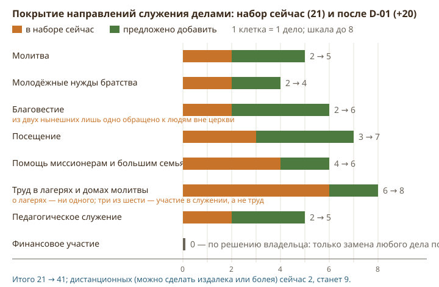
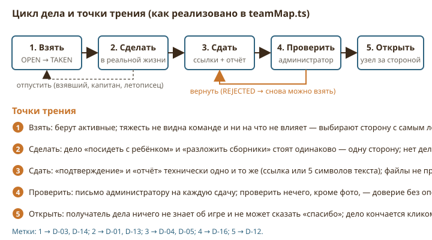
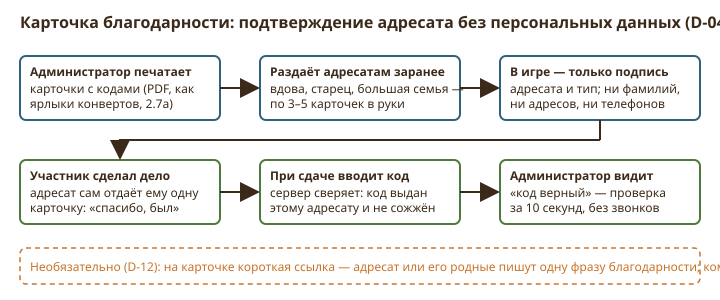
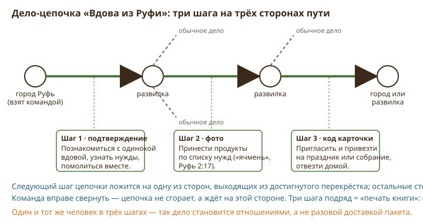
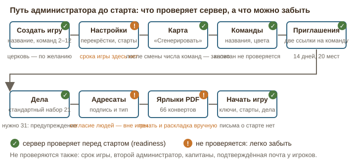
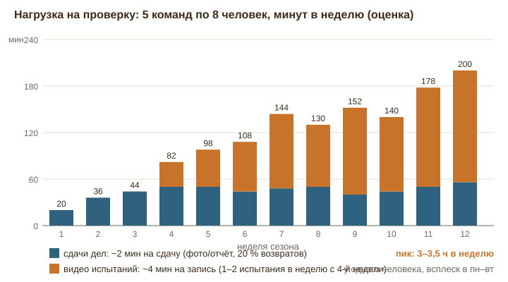
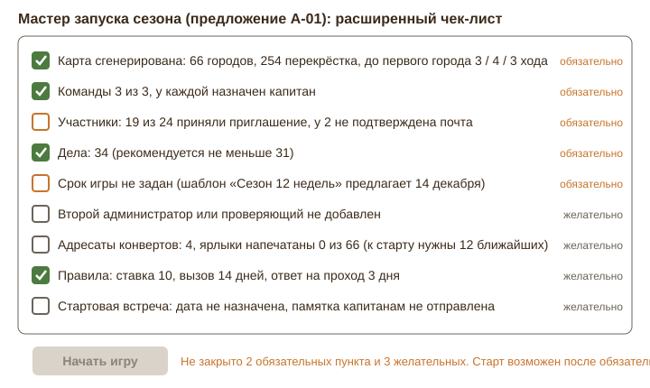
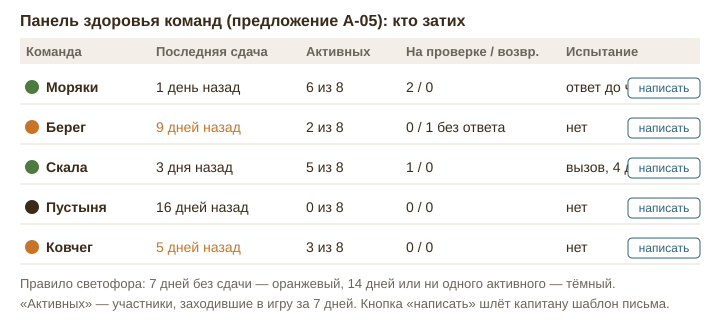
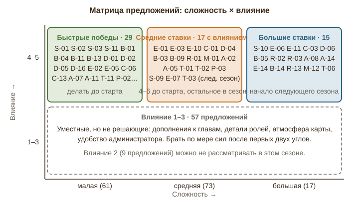
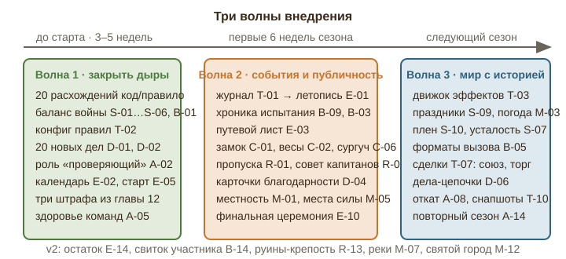

# Земли Слова — экспертное заключение по механикам, стратегии и развитию игры

_Сентябрь 2026. Сводный отчёт экспертного совета: механики как есть, дыры в стратегии, вовлечение, мини-фишки заданий, дела, испытания, дипломатия, карта, администрирование, техническая реализуемость, дорожная карта._

## Оглавление

- Глава 1. Резюме для владельца: главные выводы и как читать отчёт
- Глава 2. Полная карта механик как есть
- Глава 3. Дыры в стратегии и балансе
- Глава 4. Вовлечение, драматургия и ритм
- Глава 5. Мини-фишки для заданий городов
- Глава 6. Дела и реальный мир
- Глава 7. Испытания города стихами
- Глава 8. Дипломатия, роли и командная динамика
- Глава 9. Карта, мир и атмосфера
- Глава 10. Администратор, запуск сезона и удержание
- Глава 11. Техническая реализуемость и архитектурный запас
- Глава 12. Штрафы команды: телефон на собрании
- Глава 13. Дорожная карта: что делать сейчас, что в следующий сезон, что потом
- Приложение. Сводный список предложений (151)

---

# Глава 1. Резюме для владельца: главные выводы и как читать отчёт

_Описание «как есть» и предложения даны по состоянию на дату отчёта. Решения владельца по каждому пункту — в `decisions.md` рядом; действующие правила — в `docs/LANDS_OF_THE_WORD.md`. В частности: разрешение на проход отозвать нельзя (S-14), штраф аннулирует случайный концевой участок пути, включая ведущий в ещё не взятый город (уточнение 19.09)._

## 1. Что это за документ

Это сводное заключение экспертного совета по игре «Земли Слова» на сентябрь 2026 года. Совет работал по десяти направлениям, каждое направление написало свою главу: механики как есть, стратегия и баланс, вовлечение и драматургия, мини-фишки заданий городов, дела в реальном мире, испытания стихами, дипломатия и роли, карта и мир, администрирование и запуск сезона, техническая реализуемость. К ним добавлены две главы владельца: штрафы за телефон на собрании (глава 12) и дорожная карта (глава 13).

Источники у всех глав одни и те же: главный документ проекта (`docs/LANDS_OF_THE_WORD.md`), стандартный набор дел, задания городов и код правил на сервере. Там, где документ и код расходятся, за «как есть» принят код, а расхождение вынесено в список. Там, где эксперт не был уверен, стоит слово «предположительно». Ни одно утверждение о текущем состоянии игры не выдумано: у каждого есть параграф документа или файл кода.

В отчёте 151 предложение. Это больше, чем просили, и это сделано намеренно: часть предложений пересекается (например, календарь сезона встречается и в главе о вовлечении, и в главе о карте), и владельцу проще выбрать из широкого списка, чем достраивать узкий. Дорожная карта в главе 13 сводит пересечения и предлагает порядок.

## 2. Главный вывод

Игра целостна и работает: карта, дела, города, шифры, конверты, испытания стихами, дипломатия, роли, письма, офлайн-конверты, PWA на телефоне. Это редкий уровень завершённости для проекта такого размера. Основные риски не в том, что чего-то нет, а в трёх системных вещах, которые проявятся к третьей-четвёртой неделе сезона.

**Первая — стратегическая.** Война невыгодна. Претендент рискует стихами и временем, а защитник отвечает на свой, уже выученный отрывок и выигрывает ничью. Ставка ограничена только снизу, и большая команда «стеком участников» выучивает 40 стихов за вечер. Закрепление навсегда позволяет выйти из игры, не проиграв. Итог: доминирующая стратегия «черепаха» (не воевать, копить города, закрепить столицу) и ноль конфликтов к середине сезона. Разбор в главе 3, четырнадцать дыр с примерами; исправления S-01…S-04, S-06, S-11 малые по сложности и должны быть сделаны до старта.

**Вторая — драматургическая.** Между делами и городами нет событий. Рядовой участник не видит своего вклада, капитан видит только свою команду, никто не видит битвы. Сезон имеет сильную завязку, плоскую середину и случайную кульминацию. Проверка дел и видео занимает дни, и это «мёртвое» время. Главы 4, 5, 7, 9 предлагают летопись, календарь сезона, публичную хронику испытаний, «путевой лист» участника, замок и весы вместо форм ввода, места силы на карте.

**Третья — операционная.** Один проверяющий на всё: по расчёту главы 10, 60–90 проверок в неделю на 4 команды по 8 человек. Правила зашиты в код константами, и изменить «14 дней» или «+5 стихов» нельзя без релиза. Ошибку администратора нельзя отменить. Нет сводки для руководства церкви. Главы 10 и 11 предлагают роль «проверяющий», пакетную проверку, конфиг правил, журнал событий, снапшоты.

## 3. Расхождения документа и кода, которые надо решить до старта

Ниже собраны находки из глав 2, 3, 7, 8, 10, 11, которые не требуют дизайнерского решения, а требуют выбора: исправить код или переписать правило. Порядок по важности для игры.

1. **Владелец города виден сразу.** Документ (§2.5, §2.11) обещает, что «занят ли город» команда узнаёт только после заданий. Код показывает владельца при открытии перекрёстка: обводка на карте, подпись «Город команды…». Стратегия «потраченного времени» из документа не работает. Предложение I-02.
2. **Момент T противоречив внутри документа.** §2.8 п. 6 считает T до прикрепления последней ссылки, «Учёт стихов» и код — до отправки капитаном, и T растёт после возвратов. Дедлайн ответа в §5.1 считается от завершения атаки, в §2.8 п. 7 и коде — от одобрения администратором; хранители получают письмо, когда таймер уже идёт. Предложения B-01, B-04.
3. **Минимальное T = 60 секунд.** Код допускает «блиц»: команда, заранее выучившая короткую книгу, объявляет вызов и записывает 10 стихов за минуту; защитники должны ответить за ту же минуту. Предложения S-02, B-01.
4. **Возврат записи после дедлайна = мгновенный проигрыш.** Если администратор отклонил видео защиты, а срок уже вышел, город теряется без права пересдачи. Предложение B-04.
5. **Уступить город можно в фазе вызова** до одобрения записей. Это «бесплатная уступка» и способ обойти ставку. Предложение B-11.
6. **Претенденты видят суммы защиты.** Ответ сервера на просмотр испытания отдаёт атакующим суммарные данные защитников. Утечка, закрывается на сервере.
7. **Короткие книги уходят в суммарный режим и закрепляются навсегда.** Книга в 21 стих (например, Авдий) даёт один отрывок на сторону вместо «каждому свой», а после 10 защит город закрыт до конца сезона. Предложение B-13.
8. **Вызов и ставку объявляет любой участник**, не капитан (§2.15 относит это к капитану). То же с вводом ключа конверта. Предложение I-04.
9. **Дела по книге на выходе из взятого города не выдаются.** Стороны создаются при открытии перекрёстка, до взятия, и после взятия не пересчитываются. Работает только подстановка «[Книга]», причём и для чужих городов. Предложение I-03.
10. **Выбывшая команда не остановлена.** Документ (§2.9, §5.2) делит участников по командам; код не проверяет статус, и выбывшая команда продолжает открывать карту и может занять город ключом. Предложение R-15.
11. **Таблица лидеров отдаёт «города на пути»** во время игры. Это разведданные, которые должны стоить хода разведчика.
12. **Нет уведомления об одобрении дела.** Команда узнаёт о зачёте, только открыв карту. Предложение E-04 и A-13.
13. **Пропуск и сделка (§2.14 А, сущность PassageToken) не реализованы**; разрешение прохода бессрочно и переживает смену владельца. Предложения R-01, S-14.
14. **Нет недельного лимита смены ролей**, хотя документ его подразумевает. Предложение R-08.
15. **Тяжесть дела (`difficulty`) нигде не используется**, и все дела стоят одинаково. Предложение D-03.
16. **Тип подтверждения «CONFIRMATION» равен «REPORT»**: подтверждение адресата ничем не подтверждается. Предложение D-04.
17. **Пустой список книг у дела не означает «любая книга».** Такое дело просто не выдаётся. Предложение D-02.
18. **Чек-лист готовности проверяет пять условий** и все они технические. Предложение A-01.
19. **Числовые ответы малы и перебираемы**, попытки ограничены только у выбора. Предложения C-07, C-14.
20. **Ничья по сроку решается номером команды**, а не «суммой уровней защиты» (§2.9). Предложение S-11.

Каждый пункт стоит от часа до дня работы. Вместе они закрывают большинство «дыр», которые опытная команда найдёт за первые две недели.

## 4. Пятнадцать предложений, если делать только их

Если из 151 предложения выбрать пятнадцать, чтобы сезон стал заметно лучше при разумных затратах, совет предлагает такой список. Порядок — по соотношению влияния и сложности.

| № | Предложение | Что даёт | Сложность |
|---|---|---|---|
| S-01 | Ставка и пол, и потолок | Убирает «стек участников», выравнивает большие и малые команды | S |
| B-01 | Коридор времени ответа и тихие часы | Закрывает блиц и ночные вызовы | S |
| S-03 | Закрепление на срок, не для столицы | «Черепаха» перестаёт быть выигрышной | S |
| S-11 | Дела в счёте и честная ничья | Дела начинают влиять на победу | S |
| E-01 | Воскресная «Летопись» | Общий ритм, каждая команда видит всех | M |
| E-03 | «Путевой лист» участника | Рядовой видит свой след | M |
| B-09 | Публичная хроника испытания | Битвы становятся событием для всех | M |
| C-01 | Замок с кольцами для «расставьте по порядку» | Самый сильный момент города получает форму | M |
| D-01 | Расширить набор до 41 дела | Набора хватает на сезон | S |
| D-04 | Карточки благодарности | Подтверждение без персональных данных | M |
| R-01 | Сделка за проход: пропуска | У дипломатии появляется предмет | M |
| A-02 | Роль «проверяющий» | Снимает узкое место проверки | M |
| A-05 | Панель здоровья команд | Администратор видит «мёртвую» команду за неделю до выбывания | M |
| T-02 | Конфиг правил в JSON | Все константы становятся настройками | M |
| P-02 / P-03 | Штраф: стих бодрствования, дело сверх очереди | Штраф, который приносит пользу | S / M |

## 5. Как читать отчёт

- **Одна страница, одна прокрутка.** Слева оглавление по главам (на телефоне оно вверху). Каждое предложение имеет номер вида «буква-число», где буква — глава: I механики, S стратегия, E вовлечение, C задания городов, D дела, B испытания, R дипломатия и роли, M карта, A администрирование, T техника, P штрафы.
- **Плашки под заголовком предложения**: сложность (малая — до 2 дней, средняя — до недели, большая — больше), влияние от 1 до 5, этап (сейчас — до старта или в первые недели сезона; следующий сезон; v2 — после накопления опыта).
- **Каждая глава** построена одинаково: как есть, дыры, предложения, порядок внедрения. Если времени мало, читайте раздел «Дыры» и последнюю сводку каждой главы.
- **Приложение в конце** — таблица всех предложений с переходом по номеру.
- **Отдельно к решению владельца**: глава 12, штрафы. Там десять вариантов и рекомендация выбрать три; ничего из главы 12 не внедряется без согласования.

## 6. Что не вошло

Совет не оценивал визуальный дизайн интерфейса, тексты писем и перевод на английский: это отдельная экспертиза. Не проверялась производительность под нагрузкой более 100 одновременных пользователей (глава 11 даёт оценку, но не измерение). Не предлагались платные сервисы и любые механики, которые требовали бы хранить файлы пользователей или собирать дополнительные персональные данные: это противоречит правилам проекта, и все предложения о фото и подтверждениях построены без хранения файлов.

---

# Глава 2. Полная карта механик как есть

**Префикс предложений:** I- (инвентарь). **Источники:** `docs/LANDS_OF_THE_WORD.md` v0.11 (§1–§5, §13, §15), `content/deeds-default.json`, `content/cities/*.json` (образцы — `rut.json`, `gen.json`), код правил `apps/api/src/routes/{teamMap,cities,battles,diplomacy,teams,games,deeds,recipients,support}.ts` и `apps/api/src/services/{teamMap,cities,battles,recipients,defaultDeeds,game,notify,bible}.ts`, генератор `packages/domain/src/mapgen.ts`.

Задача главы — не предлагать, а точно зафиксировать, как игра устроена сейчас. Правило чтения: если документ и код расходятся, за «как есть» принимается **код** (он и работает на сервере), а расхождение выносится в раздел 5 «Что недосказано или противоречиво». Все числа ниже взяты из констант кода, а не из документа; там, где документ называет иное число, это отмечено.

---

## 1. Как есть

### 1.1 Карта: два острова, порты, туман

**Генерация.** Администратор игры задаёт число перекрёстков `nodeCount` (200–600, по умолчанию 250) и число команд (2–12). Генератор (`mapgen.ts`) строит два поля гексов: Ветхий Завет и Новый Завет, размер пропорционален числу книг (39 : 27), между ними пролив. Гексов ≈ `nodeCount / 2.15` (для 250 — около 116). Городов ровно 66, по одному на книгу; книги раздаются случайно, но внутри своего завета. Между любыми двумя городами не меньше 2 сторон (`minCityGap = 2`). Пятнадцать «морских» книг (`SEA_BOOKS`: Бытие, Исход, 3 Царств, 2 Паралипоменон, Псалтирь, Исаия, Иезекииль, Иона, четыре Евангелия, Деяния, 2 Коринфянам, Откровение) ставятся на береговые перекрёстки в первую очередь; всякий береговой город — порт (`coastal = true`), внутренний город портом не бывает. Точки старта — внутренние перекрёстки Ветхого Завета не дальше 0,85 радиуса от центра; без переключателя «равноудалённые старты» они выбираются случайно с расстоянием ≥ 8 сторон друг от друга, с переключателем — на кольце 0,6 радиуса через равные углы (≥ 6 сторон друг от друга). Ближайший город от старта — не ближе 2 сторон; разница расстояний до первого города между командами ≤ `maxStartDistanceDiff` (0–6, по умолчанию 3). Кнопку «Сгенерировать» можно нажимать сколько угодно, пока игра в черновике; при старте карта фиксируется. Меняются после старта только срок окончания и параметры пожертвования (`PATCH /api/games/:id`).

**Туман и видимость.** Команда «стоит» сразу на всех открытых перекрёстках (`TeamNodeState`); отдельной фишки-позиции нет. Гекс освещён, если хотя бы один из трёх его углов открыт команде; остальные гексы видны силуэтом, с подписью острова. Команда получает: открытые перекрёстки (вид: развилка / город / старт, книга города, порт или нет), стороны, касающиеся открытых перекрёстков, дела на сторонах фронтира, список достигнутых городов с их состоянием и «разведанные» перекрёстки (только вид, без названия). Ходы других команд, их цвета на сторонах и позиции команде не передаются вообще — API `my-map` не содержит ни одного поля о чужих командах, кроме владельца достигнутого города (см. 1.4). Администратор видит всю карту, всех команд, историю ходов с датами (`/progress`: `revealedAt`, `decidedAt`) и ползунок времени; кнопка «глазами команды» показывает ему ровно то, что видит команда, без действий.

**Точка выбора.** Администратор: размер карты, число команд, переключатели «равноудалённые старты», «включать родословия», допуск разницы стартов, сид (можно перегенерировать). У команды на этом этапе выбора нет.

### 1.2 Старт

При старте (`POST /api/games/:id/start`) сервер проверяет готовность: карта есть, стартов столько же, сколько команд, команды созданы и не пусты, список дел не пуст (предупреждение, если дел меньше рекомендованного `max(30, nodeCount/8)`; для 250 перекрёстков это 31). Команда с индексом *i* получает старт *i*; подпись старта — «плен» по номеру команды (Египетский, Вавилонский, Ассирийский, затем иго времён Судей, по кругу). Старт — не город, ничего не даёт; из него, как из любого перекрёстка, три стороны, и на каждую сразу вешается дело. Тогда же каждому городу выдаются ключ конверта (6 знаков, латиница и цифры без 0/O/1/I) и шифр (длина = число заданий города, русские буквы и цифры без похожих знаков); если админ печатал ярлыки раньше, ключи уже есть и не меняются.

### 1.3 Движение и дела на сторонах

**Модель хода.** Сторона от открытого перекрёстка к неоткрытому — «фронтир». Для каждой такой стороны сервер создаёт командное дело (`TeamEdgeTask`) при первом же обращении к карте (`ensureFrontier`, идемпотентно). Ограничений на параллельность нет: все дела фронтира открыты одновременно, любой участник может взять любое. Ходить «назад» нечего: по открытым перекрёсткам движения как такового нет, только новые стороны из них. Из чужого занятого города стороны не создаются, пока владелец не разрешит проход (1.7).

**Подбор дела** (`pickDeed`): сначала, если сторона выходит из города, *взятого этой командой*, — дела, у которых в `bookCodes` есть эта книга; внутри любого пула порядок: (1) дела, которых команда ещё не встречала; (2) допускающие повтор и не встречавшиеся на 30 последних её сторонах; (3) любые допускающие повтор; (4) если и таких нет — любое дело, флаг «можно дублировать» игнорируется. Внутри пула случайный выбор с весами частоты редко : обычно : часто = 1 : 3 : 6. Подстановка `[Книга]` в название и описание берётся по книге перекрёстка, из которого выходит сторона, **независимо от того, взят ли город**; если это не город — «на выбор».

**Статусы и роли.** `OPEN → TAKEN` (взять может любой участник) `→ SUBMITTED` (сдать — взявший, капитан или летописец) `→ APPROVED` (перекрёсток за стороной открывается, у него создаются свои стороны) или `REJECTED` (дело можно сдать заново или взять заново; взявшему уходит письмо с комментарием). Отпустить взятое дело — взявший, капитан, летописец. Для типов «фото» и «видео» обязательна хотя бы одна ссылка (до 10, до 500 знаков); для «отчёт» и «подтверждение» — ссылка или текст от 5 знаков. Файлы не принимаются. **Пожертвование** заменяет любое дело, если в настройках задан минимум: сумма ≥ минимума, ссылка на чек обязательна, админ одобряет как обычную сдачу; задания города пожертвованием заменить нельзя. **Тайное дело** (`secret`): ссылки и текст сдачи видит только взявший и админ в проверке; остальным участникам поля пустые, на карте «глазами команды» у админа тоже скрыто. «Труд в днях» (§2.3: день труда = сторона) в коде отсутствует: типов подтверждения четыре — `REPORT`, `PHOTO_LINK`, `VIDEO_LINK`, `CONFIRMATION`.

**Что видит команда.** Дела на фронтире; дело исчезает с карты, если перекрёсток за ним уже открыт с другой стороны (`visibleTasks`: показываются только одобренные или ведущие в туман). **Что видит админ.** Очередь сдач (до 200, по времени сдачи), кто взял, ссылки, текст, пожертвование; кнопки «одобрить» / «вернуть» с комментарием; письмо на каждую сдачу.

**Точки выбора.** Команда: какие стороны брать и сколько параллельно; кто берёт; заменить ли дело пожертвованием; отпустить дело. Админ: одобрить / вернуть, комментарий; редактировать, добавлять, удалять дела (удалить нельзя, если взято или сдано — 409; свободные стороны получают замену).

### 1.4 Города: районы → задания → шифр → конверт → взятие

**Контент.** 66 файлов `content/cities/<код>.json`, всего 791 район и 871 задание (669 по району, 114 по группе районов, 88 по всей книге; типы: `text` 332, `choice` 236, `number` 160, `order` 143). У Руфи 16 районов и 17 заданий, у Бытия 16 районов и 17 заданий (14 по районам, 2 по группам, 1 по книге). Контент неизменяем для админа игры, читается с диска, ответы на клиент не уходят.

**Шаги** (`routes/cities.ts`):

1. **Достижение.** Город доступен в попапе, как только перекрёсток открыт. Строка статуса сразу сообщает: «Ваш город», «Город команды „Берег“», «Город в руинах» или «Свободный город»; на карте чужой город обведён цветом владельца. Это расходится с §2.5 и таблицей §2.11 (см. раздел 5).
2. **Порядок районов.** Районы приходят перетасованными (детерминированно по секрету игры, команде и городу, поэтому не меняются при перезагрузке), с непрозрачными id. Команда отправляет свой порядок; ответ — число районов не на месте. Попытки не ограничены, паузы нет. При нуле ошибок порядок «застывает», районы окрашиваются, появляются задания.
3. **Задания.** До сборки порядка задания не отдаются вовсе (`tasks: []`). Ответ: число (запятая = точка), текст (регистр, ё/е, пунктуация и пробелы не важны, список допустимых написаний), выбор (варианты перетасованы по секрету игры и команде), порядок (id перетасованы). После любого неверного ответа — пауза 20 с на весь город (`lastWrongAt`), включая неверный ключ конверта. Для `choice` — 2 попытки, затем задание закрыто на 24 ч; после верного ответа счётчик обнуляется. Верный ответ даёт знак шифра по индексу задания — `cityCode[index]`. Вставка из буфера и автозамена в поле ответа отключены на клиенте.
4. **Пророк** (раз в неделю на команду) открывает подсказку к заданию — текст района с тем же индексом, до 60 стихов; для заданий по группе или по книге (индекс ≥ числа районов) сервер отвечает 404 «Район не найден», хотя недельный лимит уже израсходован (`POST /hint` индекс не проверяет).
5. **Адресат.** Когда все задания решены, попап показывает подпись и тип адресата конверта (семья / вдова / старец / другой). Адресаты раздаются городам по кругу, начиная с наименее нагруженного, с детерминированной перетасовкой городов; пары не меняются, пока админ не нажмёт «Перераспределить поровну». При завершении игры список стирается.
6. **Ключ.** Команда вводит ключ из конверта (регистр, пробелы и дефисы игнорируются). Верный ключ при свободном городе → `capturedAt`, первый взятый город команды → столица (`isCapital`, если у команды столицы ещё нет). Если город уже чей-то — 409 «Город уже принадлежит команде …». Взятие удаляет у всех остальных команд свободные (`OPEN`) дела на сторонах из этого города, кроме команд с действующим разрешением прохода.
7. **Руины** берутся кнопкой без ключа при решённых заданиях; уровень испытания у руин сброшен в 0. Решённые задания и порядок сохраняются у команды навсегда, поэтому потерянный или разрушенный город, изученный раньше, забирается сразу.

**Обращение в поддержку.** В задании — кнопка; игрок пишет только текст (5–1000 знаков, не чаще 5 в минуту), сервер подставляет игру, церковь, команду, книгу, номер и текст задания, число попыток и срок блокировки. Уходит письмом на адрес поддержки (настройка суперадмина) и в блок дашборда суперадмина; суперадмин закрывает обращение с ответом и может снять блокировку (снова 2 попытки). Команда получает письмо/push и видит ответ в задании две недели. Администраторы игры не участвуют и обращений не видят.

**Что видит админ игры.** Ключ, шифр, районы, задания **без ответов** (`answersHidden`), варианты выбора в исходном порядке, прогресс каждой команды (порядок собран, попыток порядка, решённые задания, число неверных ответов, взят ли, столица ли). Ответы и тестовые кнопки («Открыть перекрёсток», «Зачесть задания», «Отдать город») — только пользователю, который одновременно администратор игры и администратор платформы.

**Точки выбора.** Команда: в каком порядке решать районы, кто решает, когда тратить подсказку пророка, писать ли в поддержку, идти ли к адресату сейчас. Админ: список адресатов, перераспределение, печать ярлыков (PDF, A4, 4 полосы на страницу).

### 1.5 Столицы, поражение и победа

- Первый взятый город (ключом или в испытании) — столица. Капитан **один раз за игру** переносит столицу на другой свой город, даже во время испытания (`capitalMovedAt`); вторую столицу переносить нельзя (переносится только та, у которой `secondCapital = false`).
- Захваченная столица противника становится второй столицей претендентов (`secondCapital`), а если у них своей ещё не было — первой.
- Потеря столицы → `team.status = defeated`: остальные города команды становятся руинами (`ruined = true`, `defenseLevel = 0`, владелец снят), все её вызовы и ответы отменяются, обеим сторонам письма. Перераспределение участников выбывшей команды по оставшимся (§2.9, §5.2 п. 4а) в коде отсутствует. Выбывшая команда не может объявлять вызовы, но код не запрещает ей брать дела, открывать перекрёстки и занимать свободные города ключом — проверок `status` в `teamMap.ts` и `cities.ts` нет.
- Финиш: (а) в строю осталась одна команда — сразу; (б) наступил срок `endsAt` — побеждает лидер по городам, при равенстве по столицам, затем **по меньшему номеру команды** (документ обещает «по сумме уровней защиты»); (в) админ завершил вручную — победитель лидер или указанная команда. При финише все испытания отменяются, адресаты стираются, письмо всем. Итоги (`/standings`) видят и админы, и участники: города сейчас, столицы, города на пути (все, что брала, включая потерянные), одобренные дела, открытые перекрёстки, испытания взято / отражено / потеряно.

### 1.6 Испытание города стихами

Терминология интерфейса (вызов / ответ / претенденты / хранители) наложена на старые сущности `Battle`, `ATTACK`, `DEFENSE`. Константы в `services/battles.ts`: `MIN_BID = 10`, `ATTACK_LIMIT_MS = 14 дней`, `BURN_PENALTY = 5`, минимальное T = 60 с. Ни одна из них в настройки игры не вынесена.

**Можно ли бросить вызов** (`warOptions`, по порядку проверок): не руины; у города есть владелец; владелец не я; моя команда не выбыла; город не закреплён навсегда; **все задания города решены** (порядок и все `doneTasks`); текст книги загружен; у моей команды нет активного или очередного вызова этому городу. Роль не проверяется: объявить вызов и поднять ставку в очереди может **любой участник**, хотя §2.15 относит объявление к капитану. Минимальная ставка `max(10 + штраф, уровень + 1)`; штраф копится у пары «команда — город» (`attackPenalty`). Ставка от 1 до 100 000; если она ≥ числа стихов книги, город переходит в **суммарный режим** навсегда (`MapNode.sumMode`), и все следующие вызовы ему тоже суммарные.

**Очередь.** На город один активный вызов (`ATTACK`/`DEFENSE`); новые становятся `QUEUED`, и владельцу письмо не уходит (письмо — только при немедленном старте). После итога стартует очередной с наибольшей ставкой (при равной — ранний); если ставка ниже нового минимума, владелец сменился на самого претендента или города больше нет у кого-либо — отмена с письмом. Пока в очереди, ставку можно поднять. Стихи претендентов в очереди не складываются.

**Вызов.** При старте выдаётся случайный последовательный отрывок из `min(N, стихов книги)` стихов; при выключенных родословиях отрывки, задевающие диапазоны родословий, исключаются (если иначе никак — включаются). Дедлайн вызова — 14 дней от старта (а не от объявления, если команда стояла в очереди). Каждый участник отмечает стихи только внутри отрывка, стих у одного участника считается один раз, ссылки 1–20 обязательны. Убрать свою неодобренную запись можно до отправки; чужую — капитан. Админ одобряет или возвращает каждую запись отдельно; на каждую партию отметок и на отправку ему уходит письмо. **Капитан отправляет вызов**, когда сырая сумма по участникам ≥ N: этот момент фиксирует T (`attackDoneAt − startedAt`). После отправки добавлять стихи нельзя. Если админ вернул запись и одобренной суммы не хватает, отправка снимается, команда добирает и отправляет снова — T растёт. Когда все записи одобрены и одобренная сумма ≥ N, начинается ответ: хранителям письмо с числом стихов и дедлайном.

**Ответ.** Дедлайн = момент одобрения + T. Капитан хранителей выбирает любой последовательный отрывок из всей книги (`от глава:стих до глава:стих`), менять можно, пока никто не отметил стихи. Участники отмечают стихи внутри отрывка; капитан отправляет до дедлайна, когда сырая сумма ≥ **одобренной** суммы вызова. Устоял: все записи ответа одобрены, `M ≥ need`, отправка была в срок → `REPELLED`, уровень = M, в суммарном режиме — `lockedForever` (очередь отменяется). Перешёл: дедлайн прошёл без отправки (проверяет `sweep` каждые 60 с и перед чтением), капитан хранителей нажал «Уступить» (доступно и во время вызова, до его одобрения), либо после дедлайна возврат записи опустил сумму ниже нужной → `WON`, уровень = `max(N, одобренная сумма вызова)`. Ничья — за хранителями. Сгоревший вызов (14 дней без отправки) → `EXPIRED`, штраф +5 претендентам; хранителям письмо не уходит. Хранители видят ссылку на отрывок претендентов, но не его текст, и не видят чужих записей; админ видит обе стороны целиком. На карте: у команды волна синяя — она претендент, красная — её город испытывают; у админа — на каждом городе с испытанием.

**Точки выбора.** Участник: сколько стихов взять на себя. Любой участник (по коду): объявить вызов и ставку, поднять ставку в очереди. Капитан: отправить сторону на проверку, выбрать отрывок ответа, уступить город, убрать чужую запись. Админ: одобрить / вернуть каждую запись. Хранители могут одновременно защищаться и брать другие города — ограничений нет.

### 1.7 Дипломатия: проход через чужой город

Чужой занятый город без разрешения — тупик: стороны из него команде не создаются (`blockedCities`), на карте подпись «проход закрыт». Запрос (`POST .../passage`) отправляет **посол**, а без посла — капитан (`canSpeak`); нужно, чтобы город был достигнут, принадлежал другой команде и не было запроса в статусе `PENDING`/`APPROVED`. Сообщение до 500 знаков. У владельца 3 дня (`PASSAGE_TTL_MS`): молчание → `EXPIRED`, письмо просителю «можно запросить снова». Отвечает посол или капитан владельца: разрешить / отказать с текстом. При разрешении стороны из города создаются сразу (дела обычные, не тематические: тематика привязана к городам, взятым самой командой). Отзыв (`revoke`) удаляет только свободные дела из города, взятые и сданные остаются. Разрешение хранится парой «проситель — город» и **не привязано к владельцу**: если город перейдёт другой команде, старое `APPROVED` продолжает открывать проход. «Сделка» с предложением права прохода и «пропуск» (`PassageRequest.offer`, `PassageToken` из §2.14 А и §5.1) в коде отсутствуют: у запроса есть только текст сообщения. Админ видит все запросы в блоке «Дипломатия», вмешаться не может.

### 1.8 Роли внутри команды

| Роль | Кто назначает | Что даёт по коду | Ограничение |
|---|---|---|---|
| Капитан (`role = CAPTAIN`) | администратор игры | отправка вызова/ответа на проверку, отрывок ответа, уступить город, перенос столицы, выбор места высадки, раздача игровых ролей, удаление чужих записей стихов, сдача и отпуск чужих дел | не может иметь игровую роль |
| Разведчик (`SCOUT`) | капитан или админ | «Разведать» перекрёсток за стороной фронтира: вид (город / развилка), без книги | 1 раз в 7 суток **на команду** (`Team.lastPeekAt`) |
| Пророк (`PROPHET`) | капитан или админ | подсказка: текст района задания, до 60 стихов | 1 раз в 7 суток на команду (`Team.lastHintAt`); только после сборки порядка; только для заданий по районам |
| Посол (`AMBASSADOR`) | капитан или админ | единственный, кто отправляет запросы прохода и отвечает на них; без посла — капитан | — |
| Летописец (`CHRONICLER`) | капитан или админ | сдаёт и отпускает чужие дела команды | — |

Каждая роль — один участник (назначение снимает роль с прежнего). Ограничение «менять раз в неделю» (§2.15) в коде не реализовано: `PATCH .../members/:userId` без задержек.

### 1.9 Морские переправы

Как только команда взяла порт, и на другом острове есть хотя бы одна пустая береговая развилка, у порта появляется морское дело (`sea = true`, `toKey = sea:<порт>`), дело подбирается по книге порта. Его берут, сдают и одобряют как обычное, но перекрёсток не открывается: капитан выбирает место высадки из кандидатов — пустые (`EMPTY`) береговые узлы другого острова, ещё не открытые команде; города и старты для высадки не годятся. Узел открывается, из него идут обычные стороны. Из одного порта — один рейс: пока у команды есть морское дело из этого порта (любого статуса), новое не создаётся; если порт потеряли, чужое свободное морское дело удаляется вместе с обычными. Обратно с Нового Завета — из взятого новозаветного порта тем же способом. На карте админа переправа — пунктир цветом команды; в истории ходов отрезок «в море» не рисуется.

### 1.10 Дела по книге, тайные дела, частота, стандартный набор

Стандартный набор — 21 дело, все с флагом «можно дублировать»; частота: редко 5, обычно 11, часто 5; подтверждение: фото 9, подтверждение 6, видео 4, отчёт 2; сложность 1 — 9, 2 — 8, 3 — 4; одно тайное («Сделать доброе дело или сюрприз тайно»); три дела с `[Книга]` и пустым списком книг (проповедь, декламация, стихотворение); направлений семь из восьми — «Финансовое участие» отдельным делом не встречается, только как замена. У каждого дела список тематических книг (`bookCodes`), подобранный по содержанию: например, «Продукты одинокой вдове» — Второзаконие, Руфь, 3–4 Царств, Исаия, Деяния, 1 Тимофею, Иакова.

Тематика «на выходе из взятого города» (§2.7) применяется в `pickDeed` только при **создании** дела на стороне. Стороны из города создаются в момент, когда город открыт (до взятия), поэтому уже существующие дела из только что взятого города не пересчитываются; «пересчёт исходящих рёбер» из §2.7 не выполняется. Тематический подбор реально срабатывает для морского дела (создаётся после взятия порта) и для замен при удалении дела админом. Подстановка `[Книга]` при этом работает всегда — по книге перекрёстка.

Синхронизация набора: при каждом старте сервера и при импорте (`add` / `replace`) — новые дела добавляются в игры, где набор использован, нередактированные обновляются по `sourceHash`, исчезнувшие удаляются, если не выданы; снятые владельцем (`RETIRED_TITLES`) убираются из всех незавершённых игр, если не взяты.

### 1.11 Уведомления

Каналы: письмо на почту учётки (если настроен SMTP) и web push на подписанные устройства, на языке учётки; отдельной ленты уведомлений на сайте нет — «на сайте» означает живое обновление карты и попапов по событиям (`publish`/SSE). Таблица событий по коду:

| Событие | Кому | Канал |
|---|---|---|
| Сдача дела; партия отметок стихов; отправка стороны на проверку | всем админам игры | письмо + push |
| Дело возвращено | взявшему (одному человеку) | письмо + push |
| Корабль готов (морское дело одобрено) | команде | письмо + push |
| Вызов вашему городу (только при немедленном старте, не из очереди) | хранителям | письмо + push |
| Пошло время ответа (вызов одобрен) | хранителям | письмо + push |
| Устоял / перешёл / потерян | обеим сторонам | письмо + push |
| Вызов не завершён (14 дней) | претендентам (хранителям — нет) | письмо + push |
| Вызов из очереди отменён | претендентам | письмо + push |
| Запрос прохода; ответ; отзыв; истечение 3 дней | владельцу / просителю | письмо + push |
| Ответ поддержки | команде | письмо + push |
| Игра завершена | всем командам и админам | письмо + push |

Что **не** уведомляется: одобрение дела (команда узнаёт по обновлению карты), появление новой стороны или города, взятие свободного города соперником, перенос столицы, назначение роли, приближение дедлайна ответа.

---

## 2. Сводная таблица «Точки принятия решений»

| Кто | Когда | Что выбирает | На что влияет |
|---|---|---|---|
| Админ игры | до старта | размер карты, число команд, равноудалённые старты, допуск разницы стартов, родословия, срок, пожертвование; перегенерация карты | форма игры на весь сезон; после старта меняются только срок и пожертвование |
| Админ игры | до старта | состав команд, капитаны, список дел (набор или свой), адресаты конвертов | кто с кем играет; какие дела встретятся; кому нести шифры |
| Админ игры | всегда | одобрить / вернуть сдачу дела, комментарий | открытие перекрёстка; темп команды; T в испытании через возвраты записей |
| Админ игры | в испытании | одобрить / вернуть каждую запись стихов | старт ответа, итог испытания, уровень города |
| Админ игры | всегда | добавить / изменить / удалить дело; перераспределить адресатов; завершить игру | пул дел; ярлыки; победитель |
| Админ платформы | по обращению | ответить, снять блокировку задания; адрес поддержки | доступ команды к заданию `choice` |
| Капитан | всегда | раздача игровых ролей; какие стороны и кому (вне системы) | недельные лимиты разведчика и пророка; параллельность |
| Капитан | после первого города | перенести ли столицу (1 раз) и куда | какой город станет условием поражения |
| Капитан | вызов | момент отправки (фиксирует T); убрать чужую запись | длина ответа противника |
| Капитан | ответ | отрывок ответа (до первой отметки); момент отправки; уступить | итог испытания; при столице — судьба команды |
| Капитан | после морского дела | место высадки на другом острове | вход на второй остров |
| Любой участник (по коду) | у достигнутого чужого города с решёнными заданиями | объявить вызов, ставка N; поднять ставку в очереди | минимум противника, суммарный режим города, риск штрафа +5 |
| Участник | всегда | взять / отпустить дело; пожертвование вместо дела; сдать | открытие перекрёстка; ресурс команды |
| Участник | в испытании | какие стихи выучить, когда прикрепить | сумма стороны; T |
| Команда | в городе | порядок районов (без ограничений), ответы (с паузами и блокировками), когда идти к адресату | знаки шифра, взятие |
| Разведчик | раз в 7 суток | за какую сторону заглянуть | маршрут |
| Пророк | раз в 7 суток | к какому заданию подсказка | скорость изучения книги |
| Посол (или капитан) | у чужого города | запросить проход, текст; разрешить / отказать / отозвать чужой запрос | связность карты для обеих команд |
| Летописец | всегда | сдать / отпустить чужое дело | дисциплина сдач |

---

## 3. Дыры и слабые места

Здесь только то, что видно из инвентаризации; подробный разбор — в тематических главах.

**3.1 Секрет владельца города не работает.** Документ строит на нём стратегию (§2.5: «команда не видит, занят ли город», «минус для команды — потраченное время, и это осознанная часть игры»), а API отдаёт владельца сразу при открытии перекрёстка, и попап пишет «Город команды „Берег“». Пример: «Моряки» открывают Левит, видят, что он у «Берега», и уходят, не потратив ни одного вечера на книгу. Одновременно исчезает и смысл «социальной утечки» (§2.5): скрывать нечего.

**3.2 Дела по книге не появляются там, где обещаны.** Стороны из города создаются при его открытии, тематический подбор — только при создании. В результате «выход из захваченного города — дела по книге» (§2.7) в игре не наступает, кроме морского дела. Команда, взявшая Руфь, увидит на выходах те же дела, что были до взятия; лишь `[Книга]` подставится.

**3.3 Вызов объявляет кто угодно.** Нет проверки капитана в `POST .../war` и `.../bid`. Один участник может от имени команды поставить 40 стихов и запустить 14-дневный таймер со штрафом.

**3.4 Работа, которая исчезает.** Если перекрёсток открыт с другой стороны, взятое или даже сданное дело к нему пропадает с карты команды (`visibleTasks`), хотя в базе живёт и попадёт к админу на проверку. Команда не видит, что сдала; админ одобряет, а эффекта нет.

**3.5 Выбывшая команда не остановлена.** Отсутствуют и перераспределение участников, и запрет брать дела и свободные города. По §2.9 команда «выбыла», по коду она продолжает открывать карту и может занять свободный город ключом; поскольку флаг столицы у неё снят, этот город станет её новой столицей.

**3.6 Правила зашиты в код.** Минимальная ставка, 14 дней, +5, 3 дня, 20 с, 2 попытки, 24 ч, неделя — константы. §2.9 и §6.3 обещают, что админ меняет механику по ходу игры через настройки.

**3.7 Пророк не помогает в заданиях по книге.** Для 202 заданий по группе и по книге подсказка отвечает 404.

**3.8 Разрешение прохода переживает владельца.** Проход, выданный «Берегом», продолжает действовать после того, как город взяли «Моряки».

---

## 4. Предложения

### I-01. Единый реестр параметров правил в настройках игры

**Суть.** Вынести константы (`MIN_BID`, лимит вызова, штраф, срок ответа на проход, пауза 20 с, попытки `choice`, срок блокировки, недельные лимиты ролей, минимальное T) в `Game.settings` с текущими значениями по умолчанию и показать их одной карточкой «Правила» у админа.

**Зачем.** Закрывает 3.6 и делает документ §2.9/§6.3 правдой; администратор «Берега» и «Моряков» видит одни и те же числа, что и игроки на странице «Как играть?».

**Как работает.** `rules` в настройках, чтение через одну функцию `rulesOf(game)`; правки после старта разрешены, но применяются к новым вызовам и запросам, идущие считаются по старым. В интерфейсе: «Минимум ставки 10 · Вызов 14 дней · Штраф +5 · Проход 3 дня · Пауза 20 с · Попытки выбора 2 → 24 ч».

**Риски и ограничения.** Изменение посреди сезона воспринимается как несправедливость — журналировать в «Что нового» игры и письмом командам.
**Сложность:** M · **Влияние:** 3 · **Этап:** сейчас

### I-02. Решить судьбу секрета владельца: скрыть до изучения или переписать §2.5/§2.11

**Суть.** Либо `getTeamMap`/`my-city` отдают `owner` только при `studied` (все задания решены), а до того попап пишет «Город: статус неизвестен», либо документ признаёт, что владелец виден при открытии, и §2.11 исправляется.

**Зачем.** Сейчас документ, инструкция и код говорят разное; команда планирует по одной модели, а играет по другой. Вариант «скрыть» возвращает риск «потраченного времени», заложенный владельцем; вариант «открыть» упрощает дипломатию (запрос прохода без изучения города).
**Как работает (вариант «скрыть»).** Поле `owner` и цветная обводка — после `studied`; кнопка «Запросить проход» тоже после изучения; `blocked` заменяется на нейтральное «дальше не пройти, пока город не изучен». «Моряки», открыв Левит, тратят неделю на 17 заданий и лишь тогда узнают: город у «Берега», уровень 25.

**Риски и ограничения.** Скрытие удлиняет тупики; смягчить разведчиком: его взгляд мог бы показывать «занят / свободен» вместо «город / развилка».
**Сложность:** S · **Влияние:** 4 · **Этап:** сейчас

### I-03. Пересчёт свободных дел на выходах из только что взятого города

**Суть.** В `capture` и `resolveWon` после `onCityOwned` для владельца заново подбирать дела на его `OPEN` сторонах из этого города с `bookCode` города.

**Зачем.** Закрывает 3.2, оживляет §2.7 и делает `bookCodes` набора нужными.

**Как работает.** Для каждой `OPEN` стороны `fromKey = город` у владельца — `pickDeed(gameId, teamId, book)`; взятые и сданные не трогаются; уведомление не нужно, карта обновится по событию. «Берег» взял Руфь — на трёх выходах появляются «Продукты одинокой вдове», «Помощь на поле», «Угостить человека обедом».

**Риски и ограничения.** Команда могла уже договориться о деле, которое не взяла в системе, — предупредить в «Что нового»; пул тематических дел у ряда книг пуст, тогда остаётся общий пул (как сейчас).
**Сложность:** S · **Влияние:** 3 · **Этап:** сейчас

### I-04. Проверка капитана на объявление вызова и ставку

**Суть.** `POST .../war` и `.../bid` — только `role = CAPTAIN` (как `submit`, `surrender`, `defense-passage`).

**Зачем.** Закрывает 3.3; ставка — командное обязательство на 14 дней со штрафом.

**Как работает.** Одна строка проверки, текст ошибки «Вызов бросает капитан»; участникам кнопка показывается неактивной с подписью.

**Риски и ограничения.** Капитан в отъезде — команда ждёт; смягчение: разрешить и послу.
**Сложность:** S · **Влияние:** 2 · **Этап:** сейчас

---

## 5. Что в правилах недосказано или противоречиво

1. **Видимость владельца города** — §2.5 и §2.11 говорят «только после заданий города»; код (`getTeamMap.owner`, `my-city.owner`, обводка цветом на карте) показывает сразу при открытии перекрёстка. Что считать правилом?
2. **Момент фиксации T.** §2.8 п. 6: «до прикрепления последней ссылки»; §2.8 «Учёт стихов» и код: до **отправки капитаном**. Из-за возвратов T может расти уже после первой отправки (§2.8 не описывает).
3. **Отсчёт ответа.** §5.1: `defense_deadline = attack_done_at + T`; §2.8 п. 7 и код: от одобрения админом. Время проверки админом при этом не входит ни в T, ни в ответ — хранители узнают о дедлайне только после одобрения; «второй алерт» приходит, когда таймер уже идёт.
4. **Уровень после перехода.** §2.8 п. 10: `= N`; код: `max(N, одобренная сумма)`. Если претенденты выучили больше ставки, уровень выше.
5. **Кто объявляет вызов.** §2.15 и §4: капитан; код: любой участник (`war`, `bid`). Аналогично: кто вправе занять город ключом — код принимает от любого участника, документ молчит.
6. **Суммарный режим.** §2.8.1 п. 3 и уточнения: «атакующим по-прежнему выдаются случайные отрывки, каждому участнику свой»; код выдаёт один отрывок на сторону длиной `min(N, стихов книги)` — при `N ≥ стихов` это вся книга. Кроме того, §2.8.1 п. 1 говорит «книга исчерпана, когда ставка достигает числа стихов», а код включает `sumMode` в момент объявления такой ставки и делает его необратимым для города.
7. **Дедлайн 14 дней** — §2.8 п. 6а: «с момента объявления войны»; код: с момента **старта** вызова (после очереди). Для очереди §2.8 обещает уведомление и новую ставку; код стартует автоматически со старой ставкой, письма владельцу при постановке в очередь нет.
8. **Штраф +5 и хранители.** §2.8 п. 6а не говорит, узнают ли хранители, что вызов сгорел; код не уведомляет их и не снимает «красную волну» до обновления карты.
9. **Дела по книге на выходе из города** (§2.7, ✅ «программа пересчитывает исходящие рёбра») — не реализовано: пересчёта нет, тематика применяется только при создании стороны. §2.3 «сквозь чужой город тематические дела не даются» — верно в силу того же.
10. **Труд в днях** (§2.3, ✅ «один день труда = одно ребро») — в коде типа дела нет; как засчитывать лагерь — не определено.
11. **Половинная окраска сторон и «чужой цвет на своих векторах»** (§2.4) — команде чужие проходы не передаются вообще; реализована только карта админа.
12. **Рекомендуемый минимум дел.** §2.4 называет и «≈ 60–120», и «не меньше 30, ≈ один вектор из восьми»; код: `max(30, nodeCount/8)` = 31 для 250. Флаг «можно дублировать» при исчерпании пула игнорируется (`weightedPick(deeds)`), у всех 21 дел набора он и так включён.
13. **Дипломатическая сделка и пропуск** (§2.14 А ✅, §5.1 `PassageRequest.offer`, `PassageToken`) — в коде нет; есть только текст. Разрешение не привязано к владельцу и переживает смену хозяина города (§2.14 не оговаривает). Требуется ли изучить город, чтобы просить проход, — документ не говорит; код требует лишь достижения.
14. **Роли «раз в неделю»** (§2.15: менять роли раз в неделю; лимиты разведчика и пророка «раз в неделю») — смена ролей без ограничений; лимиты считаются 7 суток от последнего использования **на команду**, а не на календарную неделю и не на человека. Подсказка пророка недоступна для заданий по группе и по книге (404), а недельный лимит при этом сгорает.
15. **Выбывшая команда.** §2.9: участники делятся поровну между оставшимися; в коде нет ни перераспределения, ни запрета выбывшим брать дела и свободные города; захваченный ими руинный или свободный город снова станет их столицей.
16. **Ничья по сроку.** §2.9: «по числу столиц, затем по сумме уровней защиты»; код: по столицам, затем по номеру команды (созданная первой выигрывает).
17. **Порядок районов** — §2.6 не ограничивает попытки, код тоже: паузы нет, можно перебирать. Задания `order` и `number`/`text` — только пауза 20 с; §2.6 так и говорит, но не объясняет, почему для `choice` строже.
18. **Пауза 20 с и ключ.** Неверный ключ конверта ставит ту же паузу на все задания города и увеличивает `answerAttempts` — в §2.6 не описано.
19. **Уведомления «на сайт»** (§4, §6.1): в коде нет ленты уведомлений, только письмо, push и живое обновление; одобрение дела не уведомляется никак.
20. **Суперадмин и содержимое игр.** §4: «не видит, что происходит внутри игр»; §2.6: ответы видит только администратор платформы; по коду он видит ответы и тестовые кнопки, только будучи также админом игры, а обращения в поддержку (с текстом задания, командой, городом) — всегда.
21. **«Из одного порта — один рейс за взятие»** (§2.3a) — код: один рейс, пока у команды есть морское дело из порта любого статуса; после потери и возврата порта новый рейс появится, только если старое дело было удалено как свободное.
22. **Столица и вызов без города.** Команда без единого города может бросить вызов (нужны лишь решённые задания) и, победив, получить столицей чужой город; §2.9 «первый открытый командой город» этот случай не описывает.
23. **Уступка во время вызова.** Кнопка «Уступить» работает уже в статусе `ATTACK`, до одобрения записей претендентов; уровень тогда равен ставке N без единого выученного стиха. §2.8 п. 10 говорит только об обороне.

Из этого списка для владельца проекта первоочередные пять: 1 (владелец города), 2–3 (момент T и отсчёт ответа), 5 (кто объявляет вызов), 9 (дела по книге), 15 (выбывшая команда).

---

# Глава 3. Дыры в стратегии и балансе

_Описание «как есть» и предложения даны по состоянию на дату отчёта. Решения владельца по каждому пункту — в `decisions.md` рядом; действующие правила — в `docs/LANDS_OF_THE_WORD.md`. В частности: разрешение на проход отозвать нельзя (S-14), штраф аннулирует случайный концевой участок пути, включая ведущий в ещё не взятый город (уточнение 19.09)._

Эта глава смотрит на «Земли Слова» глазами команды, которая хочет выиграть, а не просто «пройти проект». Такая команда обязательно появится: молодёжь быстро находит, где правила дают бесплатное преимущество. Задача главы — найти эти места раньше игроков, показать, во что они выливаются на шести месяцах игры, и предложить закрытие с цифрами. Источники: §2 главного документа (особенно §2.3, §2.6–§2.9, §2.14, §2.15) и код правил в `apps/api/src/services/{battles,teamMap,cities,game}.ts` и `apps/api/src/routes/{battles,cities,teamMap,diplomacy}.ts`. Примеры — на выдуманных командах «Моряки», «Берег» и «Пустыня», по 8 человек, игра 26 недель.

## 1. Как есть

**Экономика хода.** Единица прогресса — дело на стороне гекса; одобренное дело открывает перекрёсток за ней. Команда из 8 человек делает 3–4 дела в неделю (§2.3). Любое дело можно заменить пожертвованием не ниже минимума из настроек (§15.1, `routes/teamMap.ts`, поле `donation`); длительный труд считается по дням, день = сторона (§2.3, по документу). Ограничений на число дел в неделю нет, цены за бездействие нет: механика «поддержания города» отклонена владельцем (§2.7).

**Города.** 66 городов на двух островах, 39 + 27. Свободный город берётся заданиями и ключом из конверта (§2.6); первый взятый город — столица (`routes/cities.ts`, `isCapital: hasCapital === 0`). Изучить чужой город (решить все задания) можно без разрешения владельца, разрешение нужно только для движения дальше через него (`blockedCities` в `services/teamMap.ts`).

**Битвы** (`services/battles.ts`). Константы: `MIN_BID = 10`, `ATTACK_LIMIT_MS = 14 дней`, `BURN_PENALTY = 5`. Минимальная ставка `max(10 + штраф, уровень + 1)`. Атакующим выдаётся случайный последовательный отрывок длиной `min(N, стихов в книге)`; если `N ≥ стихов в книге`, у узла включается `sumMode`. Каждый участник отмечает выученные стихи только внутри выданного отрывка; считается сумма по участникам. Капитан отправляет атаку, когда сумма ≥ N; T = от старта атаки до отправки, но не меньше 60 секунд (`Math.max(60_000, …)`). После одобрения всех записей у защитников ровно T с момента одобрения; капитан защитников выбирает любой последовательный отрывок книги. Важно и не очевидно из §2.8: **защитникам нужно набрать не N, а фактическую одобренную сумму атаки** (`need = sumVerses(entries, "ATTACK", true)`), которая может быть заметно больше N. Ничья за защитниками. Уровень после отражения = M, после захвата = `max(N, сумма атаки)`. Отражение в суммарном режиме ставит `lockedForever`. Сгоревшая атака — `+5` к минимуму этой команды на этот город. Верхняя граница ставки в валидации — 100 000 (`declareBody`).

**Очередь.** Пока идёт битва, новые вызовы становятся в очередь; после завершения стартует вызов с наибольшей ставкой (`orderBy: [{ bid: "desc" }, { declaredAt: "asc" }]`), ставку в очереди можно поднимать; если уровень вырос выше ставки — вызов отменяется с письмом. Уведомления о старте атаки из очереди с просьбой «поставить ставку» (как в §2.8) в коде нет: очередь стартует с уже указанной ставкой.

**Столицы и конец игры** (`routes/diplomacy.ts`, `services/game.ts`). Столицу можно перенести один раз за игру, в том числе во время войны; на закреплённый город переносить не запрещено. Потеря столицы = выбывание: остальные города становятся руинами с уровнем 0, их берёт любая команда, решившая задания (без ключа и битвы); участники делятся поровну между оставшимися (§2.9, по документу). Игра завершается, когда осталась одна команда, или по сроку `settings.endsAt`: побеждает лидер по `cities`, затем `capitals`, затем — **меньший индекс команды** (`standings` в `services/game.ts`). Сумма уровней защиты, упомянутая в §2.9 как третий критерий, в коде не участвует. При завершении все битвы отменяются.

**Дипломатия.** Запрос прохода, 3 дня, молчание = отказ, отзыв в любой момент; в коде запрос содержит только свободный текст `message`/`answer` — формальных «пропусков» (§2.14 А, «сделка») в схеме нет, предположительно они существуют только как договорённость на словах.

## 2. Дыры и слабые места

Ниже каждая дыра разобрана по одной схеме: механизм, сценарий на командах, как часто это произойдёт в реальной игре трёх команд, тяжесть по пятибалльной шкале (5 — ломает игру).

### Д-1. «Черепаха»: не воевать и копить города — доминирующая стратегия

Победа по сроку — по числу городов. Свободный город стоит примерно 2 недели дел и заданий и не несёт риска. Атака на город живой команды стоит N стихов и до 14 дней, а выигрывается редко (см. Д-5). Значит, пока на карте есть достижимые свободные города, атаковать нерационально, а в конце игры — тем более (Д-10). Единственная стоящая атака — на команду, которая не ответит.

*Сценарий.* Неделя 1–12: «Моряки» и «Берег» берут по 5–6 городов, не пересекаясь. Неделя 13: «Берег» дошёл до города «Моряков» (Иона, 48 стихов), изучил его, увидел уровень 0. Капитан считает: ставка 10, восемь человек учат две недели, «Моряки» получат те же две недели, выберут короткие стихи и ответят — вероятность взять город меньше 20 %, а те же две недели вечеров можно вложить в 3 своих свободных города по дороге. Решение: не атаковать. Так рассуждают все трое, и до недели 20 в игре не происходит ни одной битвы.

*Частота:* почти в каждой игре с активными командами. *Тяжесть:* 4 — главная механика (испытание стихами) остаётся невостребованной, игра сводится к гонке дел.

### Д-2. Ставка — пол, а не потолок: «стек участников»

По коду защитники обязаны ответить на одобренную **сумму** атаки, а не на N. Отрывок атаки при N = 10 — это 10 стихов, но отметить их может каждый из 8 участников. Итого атака при ставке 10 может весить 80. Владелец города при объявлении получает письмо «ставка 10 стихов» и узнаёт настоящую цифру только с началом своего таймера.

*Сценарий.* Неделя 14, вторник. «Моряки» объявляют вызов городу «Берега» (Руфь, 85 стихов), ставка 10. Отрывок — Руфь 2:1–10. Все восемь учат одни и те же 10 стихов за вечер, записывают видео, капитан отправляет в 23:00: сумма 80, T = 6 часов. Утром в 9:00 админ одобряет записи. У «Берега» до 15:00 среды: восемь человек на работе и учёбе должны выучить и записать 80 стихов. Город потерян с уровнем 80. Обратная атака требует ставку 81 из 85 — почти вся книга у каждого, и «Моряки» ответят тем же стеком. Город потерян до конца игры.

*Частота:* как только одна команда прочитает правила внимательно — то есть до середины первой игры. *Тяжесть:* 5. Это не «хитрость», это несоответствие уведомления и правила; спор «нам сказали 10, а спросили 80» неизбежен.

### Д-3. Таймер T симметричен по длине, но не по положению

T измеряется от старта атаки до отправки, минимум 60 секунд. Атакующие выбирают и длину, и день недели, и час; защитники получают свой T с момента одобрения админом — ночью, в будни, в неделю экзаменов, на выезде. «Столько же времени» на бумаге не равно «столько же возможностей». Доброжелательный атакующий этого не заметит, расчётливый — использует.

*Сценарий.* «Пустыня» знает, что у «Берега» в конце июня выпускные. Атака объявлена 20 июня, отправлена через 3 дня. Одобрена 24-го — три дня обороны приходятся на 24–27 июня. Формально всё честно.

*Частота:* средняя, растёт с Д-2 (стек делает короткий T осмысленным). *Тяжесть:* 4, для столицы — 5.

### Д-4. Предвыученный блиц на короткие книги

При `N ≥ стихов в книге` отрывок атаки — вся книга, то есть предсказуем заранее. Команда учит Филимона (25 стихов) до объявления, объявляет ставку 25, отправляет через час с суммой 8 × 25 = 200. Защитникам нужно 200 стихов за час. Уровень после захвата — 200, что выше потолка любой команды из 8 человек (8 × 25 = 200, а нужно 201). Город закрыт навсегда без всякого `lockedForever`. То же — для 2 Иоанна (13), 3 Иоанна (15), Иуды (25), Авдия (21) и с натяжкой для книг до ~60 стихов (Аггей, Титу, Наум, Софония, Малахия).

*Сценарий.* Неделя 9: «Моряки» доходят до Авдия у «Пустыни». Две недели вся команда учит 21 стих (это одна глава), объявляют в понедельник в 20:00, отправляют в 21:30, сумма 168, T = 90 минут. Админ одобряет во вторник в 8:00; в 9:30 город переходит. Атака на возврат требует 169 из 21-стиховой книги — по 21 стиху у каждого из 8 человек и ещё 1; невозможно.

*Частота:* высокая — коротких книг 5 на 66, а изучить их проще всего. *Тяжесть:* 5.

### Д-5. Структурное преимущество защитника: свой отрывок, ничья за ним

Атакующим — жребий, защитникам — любой отрывок книги на их выбор, ничья за ними, стек доступен и им. В Псалтири защитник возьмёт Псалом 116 (2 стиха) и соседние короткие; в Паралипоменон — нет, но и там выберет знакомые места. Против команды, которая просто прочитала уведомление и открыла книгу, атака проигрывает. Итог: атаки имеют смысл только против команд, которые не ответят вовсе — «бей молчащего». Эти же команды и так слабейшие: правило усиливает неравенство, а не сглаживает.

*Частота:* всегда. *Тяжесть:* 3 сама по себе, 4 в связке с Д-6.

### Д-6. Снежный ком через выбывание и руины

В обычной фазе положительной обратной связи почти нет: узкое место — люди, а не стороны, у 8 человек 3–4 дела в неделю независимо от числа городов. Ком запускает выбывание: города выбывшей команды становятся руинами с уровнем 0 и достаются тому, кто их **уже изучил** — то есть агрессивному соседу, который дошёл до них и решил задания, готовясь к атаке. Плюс участники выбывшей делятся поровну: команды растут до 10–12 человек, и потолок суммы в битве растёт вместе с ними.

*Сценарий и таймлайн.* Недели 1–15: «Моряки» 8 городов, «Берег» 6, «Пустыня» 5. «Моряки» изучили 4 города «Пустыни», «Берег» — 1. Неделя 15: «Моряки» блицем (Д-2) снимают у «Пустыни» город, который оказывается столицей. Неделя 16: «Пустыня» выбывает; 4 руины уходят «Морякам» без ключа и битвы (`capture` для `ruined` не спрашивает ключ), 1 — «Берегу»; по 2 участника в каждую команду. Счёт 12 : 7. Недели 17–26: «Берегу» нужно 6 успешных атак на команду из 10 человек, где защитник выбирает отрывок. Это невозможно; «Моряки» переходят в «черепаху» (Д-1) и выигрывают по сроку с 16 : 9.

*Частота:* в каждой игре, где кто-то выбыл раньше последнего месяца. *Тяжесть:* 5 — с недели 16 половина сезона проходит без интриги.

### Д-7. Закрепление навсегда как способ выйти из игры

Отражение атаки в суммарном режиме закрепляет город навсегда. Столицу разрешено переносить один раз на любой свой город, включая закреплённый. Отсюда два выхода из «боевой» части игры. Честный: держать столицей город с короткой книгой и ждать, пока кто-то атакует в суммарном режиме и проиграет (ответить 25 стихами на 25 при своём выборе отрывка несложно). Сговорный: попросить дружественную команду атаковать Филимона со ставкой 25 и не стараться — после отражения город закреплён, столица переезжает туда, команду нельзя устранить до конца игры. Дальше — чистая «черепаха».

*Частота:* честный вариант — регулярно; сговор — в играх трёх команд, где две дружат, вероятен. *Тяжесть:* 4. Документ сам признаёт: «закреплённая столица делает вариант (а) недостижимым».

### Д-8. Перенос столицы во время войны обесценивает «блиц на столицу»

Атакующий не знает, столица ли перед ним. Владелец знает и имеет одну «уклонялку» прямо во время осады. Первый удачный удар по столице стоит атакующему только обычный город; вторая столица атакующему неизвестна. С учётом Д-5 победа по столицам в игре трёх активных команд практически недостижима: все игры идут «по сроку». Само по себе это неплохо (владелец так и планировал запасной вариант), плохо, что тогда единственный смысл битвы — украсть города у молчащего (Д-1, Д-6).

*Частота:* всегда. *Тяжесть:* 3.

### Д-9. Эксплуатация очереди: бронь и «дружеская осада»

Очередь стартует с наибольшей ставки; верхний предел 100 000; цена сгорания +5. Команда может встать в очередь со ставкой 5 000, оказаться первой, 14 дней ничего не делать и получить +5 к минимуму. В это время город «в битве» и остальные ждут. Повторять можно бесконечно: +5, +10, +15 к минимуму — для команды, которая и не собиралась учить, это ничего не значит. В игре трёх команд это оружие пары: «Берег» держит столицу «Моряков» под вечной атакой «Пустыни», и «Берег» до неё не доберётся. Очередь также не сообщает команде, что её атака стартовала с заранее указанной ставкой; те, кто ставил «в темноте» (уровень мог вырасти), получают отмену письмом — это работает, но не мешает брони.

*Сценарий.* Недели 10–24: «Пустыня» семь раз подряд объявляет вызов Псалтири «Моряков» со ставкой 1 000 и семь раз сжигает. Штраф 35 — для неё пустой звук. «Берег», стоящий в очереди с честными 40, семь раз получает «битва уже идёт».

*Частота:* при трёх командах — вероятна, при двух — не нужна. *Тяжесть:* 4.

### Д-10. Отсутствие цены за бездействие

Города не тают, дел никто не требует, счёт к сроку не падает. Проигнорировать атаку стоит ровно один город и ничего больше. Битвы, не завершённые к сроку, отменяются: если T обороны переходит за дату конца, защищаться незачем, а атаковать за 14 дней до конца бессмысленно. Значит, последние 2–3 недели — «мёртвая зона», а команда, набравшая отрыв к неделе 20, может честно уйти в отпуск.

*Сценарий.* «Моряки» ведут 14 : 11 : 9 на неделе 22 при сроке на неделе 26. Капитан объявляет команде: «Дела больше не нужны, на вызовы отвечаем только у столицы». Три недели команда-лидер не делает ни одного доброго дела — ровно противоположное цели проекта.

*Частота:* в каждой игре. *Тяжесть:* 4 (для воспитательной цели — 5).

### Д-11. Когда выгодно не защищаться

Есть четыре ситуации, где рациональная команда сдаёт город, и правила это поощряют. (1) Атака стеком (Д-2) на не-столицу: 80 стихов за 6 часов не набрать, лучше не тратить вечер. (2) Дедлайн обороны за датой конца игры: битва всё равно отменится. (3) Лидер с отрывом 5+ городов: вечер обороны дороже, чем один город, — и он сдаёт всё, кроме столицы, продолжая вести. (4) Тонкий случай трёх команд: если атакует слабейшая, ей выгодно уступить город, чтобы она не выбыла и её руины не достались второй команде. Сдача не имеет цены, а отражение не даёт награды, кроме уровня.

*Частота:* (1) и (2) — часто, (3) — у лидера всегда, (4) — редко, но это самый интересный сюжет игры, и он никак не поддержан. *Тяжесть:* 3.

### Д-12. Ничья к сроку решается индексом команды

По коду `leader()` сортирует по городам, столицам, затем по `index` — команда, зарегистрированная первой, выигрывает ничью. Документ обещает сумму уровней защиты. Ни игроки, ни админ не увидят этот критерий до финала. В игре двух команд ничья 9 : 9 при одной столице у каждой — реалистична.

*Частота:* при 2 командах — заметная; при 3 — редкая. *Тяжесть:* 3 (несправедливость финала запоминается больше, чем весь сезон).

### Д-13. Стагнация: свободные города кончаются локально, дела теряют смысл

Всей карты команда не пройдёт (§2.14 Б), но свой «угол» она исчерпает к неделе 12–15: ближайшие 8–10 городов взяты или чужие. Дальше каждое дело открывает пустую развилку на пути к далёкому городу, атаки бессмысленны (Д-1), сезон один и длинный. Мотивация делать дела — а это цель проекта — падает именно на середине, когда «Юность Иисусу» ещё идёт.

*Частота:* в каждой игре, начиная с середины. *Тяжесть:* 4.

### Д-14. Дела слабо связаны с победой; «плата за ход»

Дела не входят ни в счёт, ни в разрешение ничьей. Одобренные дела есть в статистике, но не влияют на результат. Одновременно любое дело заменяется пожертвованием (минимум задаёт админ), а день труда даёт сторону: участник, уехавший на три недели на стройку, приносит 21 сторону — это 5–7 недель работы всей команды. Это не «дыра в честности» (жертва и труд — тоже служение), но это дыра в балансе: две команды с одинаковым усердием получают разные результаты из-за одного члена с отпуском или одной семьи с доходом. В коде ограничений на долю пожертвований нет.

*Частота:* труд — почти в каждой команде летом; пожертвование — по обстоятельствам. *Тяжесть:* 3.

### Д-15. Проход через чужой город и пропуска

Проход без разрешения закрыт, молчание 3 дня = отказ, отзыв мгновенный, взятые дела остаются. Сделки «пропуск за пропуск» в схеме не формализованы — договорённость на словах. Стратегические последствия невелики: у каждого перекрёстка три стороны, обход почти всегда есть. Реальные точки давления — порты: чужой порт закрывает не проход, а корабль. Слабое место — не сила блокады, а отсутствие содержания: запрос «разреши пройти» без цены — это не дипломатия, а формальность, и владелец рационально молчит (отказ бесплатен, разрешение чуть помогает сопернику).

*Частота:* запросы будут редкими, отказы — частыми. *Тяжесть:* 2.

### Д-16. Малое число команд

Целевая конфигурация — 3 команды по 8 (§3). При **2 командах** одна удачная атака на столицу заканчивает игру целиком (`checkLastTeam`), возможно на втором месяце; руин нет; очереди и дипломатии нет; ничья решается индексом. При **3 командах** возникает пара против одного (Д-7, Д-9), а выбывание одного превращает игру в двухкомандную с комом (Д-6). При **4–5** большинство дыр смягчаются: коалиции меняются, выбывание одного не решает игру, очередь оживает. Правила написаны как будто для 4–6 команд, а играть будут втроём.

*Частота:* конфигурация 3 команды — базовая. *Тяжесть:* 4.

### Сводка

| Дыра | Частота | Тяжесть | Закрывают |
|---|---|---|---|
| Д-1 «Черепаха» | всегда | 4 | S-07, S-09, S-11 |
| Д-2 Стек участников | быстро | 5 | S-01, S-15 |
| Д-3 Положение T | средняя | 4–5 | S-02 |
| Д-4 Предвыученный блиц | высокая | 5 | S-01, S-02, S-03 |
| Д-5 Преимущество защитника | всегда | 3–4 | S-05 |
| Д-6 Снежный ком | часто | 5 | S-08, S-10 |
| Д-7 Закрепление = выход | регулярно | 4 | S-03, S-04 |
| Д-8 Перенос во время войны | всегда | 3 | S-04 |
| Д-9 Бронь очереди | при 3 командах | 4 | S-06 |
| Д-10 Цена бездействия | всегда | 4 | S-07, S-09 |
| Д-11 Выгодно не защищаться | часто | 3 | S-01, S-02, S-11 |
| Д-12 Ничья по индексу | при 2 командах | 3 | S-11 |
| Д-13 Стагнация | всегда | 4 | S-09, S-11 |
| Д-14 Дела и победа, плата за ход | часто | 3 | S-11, S-12 |
| Д-15 Проход и пропуска | редко | 2 | S-14 |
| Д-16 2–3 команды | базовая | 4 | S-10, S-13 |

## 3. Предложения

### S-01. Ставка — и пол, и потолок

**Суть.** Засчитываемая сумма стороны ограничена сверху: атака — не более N, оборона — не более N (ничья остаётся за защитниками). Требование к защитникам = N, а не фактическая сумма.

**Зачем.** Закрывает Д-2 и половину Д-4: уведомление «ставка 10» становится правдой; стек участников больше не превращает 10 в 80. Д-11 (1) исчезает: 10 стихов за T ответить можно всегда.

**Как работает.** В `sumVerses` результат обрезается `Math.min(sum, bid)` для атаки; `need` в `submitDefense`/`maybeRepel` = `b.bid`; уровень после захвата = N, после отражения = N (а не M). Лишние отмеченные стихи не вредят, просто не считаются. «Моряки» ставят 10 на Руфь: восемь человек могут учить одни и те же 10 стихов, но защитникам нужно ровно 10. Хотите, чтобы им было нужно 80, — ставьте 80 и учите 80.

**Риски и ограничения.** Уровень после отражения перестаёт расти «сам»; это компенсирует S-05 (защитник может объявить встречную ставку M > N и тогда уровень = M). Суммарный режим не меняется: там N уже больше книги и потолок работает так же.
**Сложность:** S · **Влияние:** 5 · **Этап:** сейчас

### S-02. Окно ответа: не меньше 3 дней и не в ночь

**Суть.** Время защитников `T_def = clamp(T, 72 ч, 10 дней)`, и отсчёт начинается в 09:00 следующего дня по часовому поясу игры после одобрения атаки.

**Зачем.** Закрывает Д-3 и Д-4: блиц «за час» больше не оставляет защитников без шанса; удар «в ночь перед экзаменом» теряет остроту. Оставляет смысл быстрой атаке: T = 1 день даёт защитникам 3 дня, T = 12 дней — 10.

**Как работает.** В `maybeStartDefense` вместо `now + T` считать `startOfNextDay(now, tz) + clamp(T)`. Часовой пояс — настройка игры. «Пустыня» отправила атаку в понедельник в 21:30 (T = 90 минут); админ одобрил во вторник в 8:00; оборона «Берега» идёт со среды 9:00 до субботы 9:00. Дополнительно: атака, отправленная за 14 дней до конца игры, всё равно доиграется, потому что срок обороны известен заранее (см. S-09).

**Риски и ограничения.** Если админ одобряет с задержкой в неделю, защитники ждут; это уже так. Верхняя граница 10 дней режет только атаки, тянувшиеся 11–14 дней, — потери нет.
**Сложность:** S · **Влияние:** 5 · **Этап:** сейчас

### S-03. Закрепление на срок, а не навсегда, и не для столицы

**Суть.** Отражение в суммарном режиме закрепляет город на 8 недель (или до следующего праздника из S-09), после чего уровень остаётся, но вызов снова возможен; столица закрепляться не может.

**Зачем.** Закрывает Д-7: «бессмертие» через короткую книгу и разовый переезд исчезает; победа по столицам остаётся достижимой, как задумано.

**Как работает.** `lockedForever: true` заменяется на `lockedUntil = now + 56 дней`; в `warOptions` проверка `lockedUntil > now`. Для узла с `isCapital` у владельца закрепление не ставится. «Моряки» отразили атаку на Филимона на неделе 9 — до недели 17 город неприкосновенен, потом снова открыт с уровнем 25 в суммарной метрике.

**Риски и ограничения.** В книге из 13 стихов бесконечная эскалация сумм упирается в число людей — это и есть естественный потолок, «навсегда» не нужно. Уже закреплённые города в идущих играх переводить по дате закрепления.
**Сложность:** S · **Влияние:** 4 · **Этап:** сейчас

### S-04. Перенос столицы — заранее, с объявлением

**Суть.** Перенос столицы вступает в силу через 7 дней после решения капитана и невозможен, пока на текущую столицу идёт вызов или оборона; на закреплённый город переносить нельзя.

**Зачем.** Закрывает Д-8 и часть Д-7: «уклонялка» во время осады исчезает, но право переезда (например, из первого попавшегося города вглубь своих земель) остаётся — как осознанное стратегическое решение, а не аварийная кнопка.

**Как работает.** В `make-capital` — проверка активных битв на столице и `lockedUntil` цели; поле `capitalMoveAt`; фактический перенос — в `sweep` при наступлении даты. «Берег» решает на неделе 6 перенести столицу с Авдия на 1 Царств; неделя 7 — перенос состоялся; вызов, объявленный Авдию на неделе 6, бьёт по столице.

**Риски и ограничения.** Команда, которую застали врасплох на первом же городе, может пострадать; смягчение — переезд разрешён без задержки в первые 3 недели игры.
**Сложность:** S · **Влияние:** 3 · **Этап:** сейчас

### S-05. Два жребия атакующим и встречная ставка защитников

**Суть.** Атакующим при объявлении показываются два случайных отрывка, капитан выбирает один в течение суток. Защитники могут объявить встречную ставку M > N: если отвечают M — уровень становится M; если только N — отражено, уровень N.

**Зачем.** Смягчает Д-5: у атакующих появляется выбор, но не свобода; у защитников — способ «закалить» город, вложив больше, а не автоматом. Отражение получает смысл вклада, не только удержания.

**Как работает.** `startAttack` создаёт две пары `passageStart/End`, `POST /battles/:id/choose-passage` фиксирует одну; без выбора за 24 часа берётся первая. Встречная ставка — поле `defenseBid` до первой отметки. «Моряки» получают Руфь 1:1–10 и Руфь 3:6–15, выбирают первую. «Берег» объявляет встречные 20, отвечает 20 — уровень 20; следующая атака ≥ 21.

**Риски и ограничения.** Два жребия чуть увеличивают шанс на «удобный» отрывок; это и цель. Проверяющему админу — те же записи.
**Сложность:** M · **Влияние:** 3 · **Этап:** следующий сезон

### S-06. Очередь без брони

**Суть.** Три правила: ставка в очереди не выше `2 × уровень + 30`; вызов сгорает через 7 дней без единой записи (не 14 без отправки); штраф за сгорание = `max(5, ставка / 4)` и запрет вызова этому городу на 14 дней.

**Зачем.** Закрывает Д-9: «дружеская осада» становится дорогой (ставка 1 000 — штраф 250, то есть команда больше никогда не атакует этот город), а бронь без записей рассыпается за неделю.

**Как работает.** В `declareBody`/`bid` проверка потолка; в `sweep` — второе условие `entries.length === 0 && startedAt < now − 7 дней`; в `teamCityState` — поле `attackCooldownUntil`. «Пустыня» ставит 1 000 на Псалтирь (уровень 40): отказ, максимум 110. Ставит 110, неделю молчит: сгорело, штраф 28, две недели без вызова этому городу. «Берег» из очереди стартует.

**Риски и ограничения.** Честная команда, поставившая много и заболевшая, теряет больше; смягчение — админ может «простить» сгорание кнопкой (уже есть подобные ручные действия).
**Сложность:** M · **Влияние:** 4 · **Этап:** сейчас

### S-07. «Усталость» города: уровень защиты тает без дел

**Суть.** Если из города владельца 28 дней подряд не одобрено ни одного дела на исходящих сторонах, уровень защиты города уменьшается вдвое каждые следующие 14 дней (до 0). Город не теряется — просто становится легче испытать.

**Зачем.** Даёт цену бездействию (Д-10, Д-1), не возвращая отклонённое «поддержание заданиями»: делать ничего не обязательно, но «дом на песке» (Матфея 7:26) со временем слабеет. Лидер, ушедший в отпуск на неделе 20, к неделе 26 держит города с уровнем 0–5 — и их можно взять со ставкой 10.

**Как работает.** В `sweep` для каждого взятого города считать `lastDeedApprovedAt` по `teamEdgeTask` с `fromKey = город`; при `now − last > 28 дней` — `defenseLevel = floor(level / 2)` раз в 14 дней. Столица тает так же. Города, у которых все стороны уже пройдены, считаются «сытыми» (нечего делать — нет и усталости).

**Риски и ограничения.** Не должно наказывать команду, у которой просто нет свободных сторон из города — потому исключение выше. Уровень 0 не означает потерю: чтобы взять, всё равно нужны 10 стихов и оборона в 3 дня (S-02).
**Сложность:** M · **Влияние:** 4 · **Этап:** следующий сезон

### S-08. Милость к меньшему: догоняющая механика

**Суть.** Три правила в пользу команды, у которой городов меньше: (1) минимальная ставка при атаке на команду с меньшим числом городов = `10 + 3 × Δ`, где Δ — разница в городах; (2) окно ответа отстающей команды +2 дня; (3) руины выбывшей команды первые 14 дней доступны только командам не-лидерам.

**Зачем.** Закрывает Д-6 и Д-5 в части «бей слабого»: лидеру дорого добивать отстающего, а выбывание не сваливается целиком в руки сильнейшего. Это библейски уместно: «не обирай дочиста» (Левит 19:9–10) — оставляй край поля.

**Как работает.** `minBidFor(level, penalty, deltaCities)`; в `maybeStartDefense` добавка к окну; в `capture` для `ruined` — проверка, что команда не лидер по городам в первые 14 дней после `ruinedAt`. «Моряки» (12 городов) атакуют «Пустыню» (5): минимум 10 + 21 = 31 стих вместо 10. «Берег» (7) атакует «Пустыню» — минимум 16. Руины «Пустыни» две недели открыты только «Берегу».

**Риски и ограничения.** Δ считать по текущим городам, публично, в попапе города — чтобы не было ощущения «скрытой руки». Лидер не наказан, ему просто нужно быть настолько же сильнее в стихах, насколько он сильнее в городах.
**Сложность:** M · **Влияние:** 4 · **Этап:** следующий сезон

### S-09. Три праздника: сезоны внутри игры

**Суть.** Сезон 26 недель делится тремя счётными днями — праздниками (например, «Пасха», «Пятидесятница», «Кущи», по Второзаконию 16:16). В каждый праздник фиксируется число городов и начисляются очки 3 / 2 / 1 (при 3 командах). Победа по сроку — по сумме очков праздников плюс удвоенные очки финального счёта; при равенстве — финальный счёт городов. Неделя после праздника — «субботняя»: новые вызовы не объявляются, идущие обороны продлеваются на 7 дней.

**Зачем.** Закрывает Д-10, Д-13, ослабляет Д-1: сидеть на отрыве нельзя, потому что каждый праздник счёт снимается заново, и лидерство в начале не решает всё; середина сезона получает три финиша вместо одного; «субботняя» неделя даёт защитникам передышку и предсказуемый ритм (сессии, лагеря можно планировать).

**Как работает.** Настройка игры: даты праздников (по умолчанию недели 8, 16 и 24 от старта). `sweep` в дату праздника вызывает `standings()` и пишет `seasonPoints` в `Team`. Пример: «Моряки» 3 + 3 + 2 + финал 2×2 = 12; «Берег» 2 + 2 + 3 + 2×3 = 13 — «Берег» побеждает, хотя «Моряки» вели две трети игры. Именно этого не хватает: догоняющий имеет реальный шанс.

**Риски и ограничения.** Немного усложняет объяснение правил; смягчение — показывать в боковом меню «до праздника N дней, сейчас вы вторые». Праздничная неделя должна быть видна на карте, чтобы никто не «ждал» в неведении.
**Сложность:** M · **Влияние:** 5 · **Этап:** следующий сезон

### S-10. «Плен» вместо выбывания при 2–3 командах

**Суть.** Потеря столицы при числе команд ≤ 3 — не выбывание, а плен на 14 дней: команда не может объявлять вызовы, её города испытываются со ставкой от 10 независимо от уровня, победитель забирает столицу как вторую и **один** любой город пленной команды по своему выбору. Через 14 дней команда возвращается: столицей становится её город с наибольшим уровнем защиты. Руины и делёж участников — только при 4+ командах или по настройке.

**Зачем.** Закрывает Д-6 и Д-16: игра трёх команд не превращается в двухкомандную на 16-й неделе; поражение болезненно (две недели без атак, открытые города, минус 2 города), но не смертельно — как вавилонский плен, из которого возвращаются (Иеремия 29:10). При 2 командах игра не заканчивается одной удачей в месяц 2.

**Как работает.** `Team.status = "captive"`, `captiveUntil`; в `warOptions` — запрет вызова у пленных и `minBid = 10` для их городов; в `resolveWon` при `wasCapital` — ветка по числу команд. Победа (а) для ≤ 3 команд: команда, взявшая столицы всех остальных **дважды** за игру или удерживающая все столицы на момент праздника (S-09).

**Риски и ограничения.** Меняет утверждённое правило §2.9; предлагается как настройка игры со значением по умолчанию «плен» при ≤ 3 командах и «выбывание» при 4+. Возвращённая команда должна получить письмо с новой столицей.
**Сложность:** L · **Влияние:** 5 · **Этап:** следующий сезон

### S-11. Дела в счёте и честная ничья

**Суть.** Порядок при равенстве городов: столицы → одобренные дела → отражённые атаки → сумма уровней защиты (индекс команды — никогда). Дополнительно «хлеб городу»: каждые 5 одобренных дел команды дают +1 к уровню защиты одного её города по выбору капитана (не больше +10 на город).

**Зачем.** Закрывает Д-12, связывает дела с победой (Д-14, Д-13): дело в середине игры укрепляет город, а не только открывает пустую развилку; ничья решается тем, что команда сделала, а не порядком регистрации.

**Как работает.** В `standings()` добавить `deedsApproved` и `battlesRepelled` в сортировку; сумму уровней взять из `mapNode.defenseLevel` по городам команды. «Хлеб»: счётчик `breadPoints` на команде, кнопка в попапе своего города. «Моряки» и «Берег» финишируют 9 : 9 с одной столицей у каждого; у «Берега» 61 одобренное дело против 48 — «Берег» побеждает, и это видно всем заранее в таблице.

**Риски и ограничения.** Дела не должны становиться самоцелью с накруткой: «хлеб» ограничен +10 на город, и все дела проверяет админ, как и сейчас.
**Сложность:** S · **Влияние:** 4 · **Этап:** сейчас

### S-12. Пределы для пожертвований и дней труда

**Суть.** Пожертвование заменяет не более 1 дела из каждых 4 одобренных у команды за 30 дней; дни труда одного участника дают не больше 5 сторон за месяц и не больше 10 за игру.

**Зачем.** Закрывает Д-14: жертва и труд остаются служением, но не становятся «покупкой карты»; две одинаково усердные команды идут вровень.

**Как работает.** В `submit` при `donation: true` — проверка доли по `teamEdgeTask` за 30 дней (сообщение: «пожертвованием можно заменить каждое четвёртое дело; сейчас доступно через N одобренных дел»). Труд — отдельный тип сдачи с полем «дней», сервер режет по лимитам. Участник «Берега» вернулся с трёхнедельной стройки: 5 сторон сразу, ещё 5 — в следующем месяце, остальное — благодарность в летописи команды.

**Риски и ограничения.** Пожертвования — деликатная тема; лимит формулировать как «дела — основа, жертва — дополнение», без слова «запрет». Лимиты — настройки игры.
**Сложность:** S · **Влияние:** 3 · **Этап:** сейчас

### S-13. Пресеты правил по числу команд

**Суть.** При создании игры настройки подставляются по числу команд: 2 — «плен» (S-10), праздники каждые 6 недель, ничья по делам; 3 — «плен», праздники каждые 8 недель, очередь без брони (S-06), милость к меньшему (S-08); 4–5 — выбывание с руинами, делёж участников, праздники каждые 8 недель; 6+ — как 4–5, срок сезона 30+ недель.

**Зачем.** Закрывает Д-16: правила перестают быть «одними на всех» там, где число команд меняет саму природу игры (см. матрицу). Админ церкви не обязан быть гейм-дизайнером — ему дают проверенную настройку.

**Как работает.** Поле `settings.preset`, таблица значений в `services/game.ts`, экран создания игры показывает «что включено и почему» одной фразой на пункт. Все параметры остаются редактируемыми (§2.9: «параметры правил лежат в настройках, а не в коде»).

**Риски и ограничения.** Нужно поддерживать таблицу при каждом новом правиле; зато исчезает сценарий «двум командам достались правила для шести».
**Сложность:** M · **Влияние:** 4 · **Этап:** следующий сезон

### S-14. Проход с содержанием: пропуск как сущность и срок отзыва

**Суть.** Запрос прохода несёт формальное предложение (ничего / пропуск через конкретный город / через любой мой город / «хлеб» — 5 одобренных дел в уровень вашего города); принятый пропуск хранится как запись и применяется автоматически; отзыв разрешения вступает через 48 часов с уведомлением; молчание 3 дня — по-прежнему отказ, но повторный запрос доступен раз в 7 дней.

**Зачем.** Закрывает Д-15: дипломатия получает цену и предмет торга; отзыв перестаёт быть ловушкой; спам запросов ограничен. Даёт третьей команде рычаг против пары (Д-9): проход можно обменять на неатаку до праздника.

**Как работает.** `PassageRequest.offer` (enum) и `Pass` (владелец, получатель, город или `any`, `usedAt`); `blockedCities` учитывает пропуски; `revoke` ставит `revokeAt = now + 48 ч`. «Пустыня» просит проход через Иону у «Моряков» и предлагает пропуск через любой свой город; «Моряки» соглашаются — через месяц используют его, чтобы выйти к порту.

**Риски и ограничения.** Документ описывает сделку как реализованную; если она есть только на словах, это расхождение стоит закрыть в любом случае. Пакт о ненападении в код не вносить — пусть остаётся честным словом.
**Сложность:** M · **Влияние:** 2 · **Этап:** следующий сезон

### S-15. Прозрачность ставок и летопись битв

**Суть.** В уведомлении о вызове — «ставка N; максимум, что могут засчитать — N» (после S-01) и число участников атакующей команды; в игре — открытая летопись всех завершённых битв (кто, какой город, N, M, итог) для всех команд.

**Зачем.** Закрывает информационную часть Д-2 и Д-9: команды видят, кто кого атакует и как часто сжигает вызовы; «дружеская осада» становится видна всем, а значит, социально дорогой. Летопись — это ещё и материал для итогового вечера.

**Как работает.** Расширить текст `notifyTeam` в `routes/battles.ts`; `GET /api/games/:id/chronicle` из `Battle` со статусами `WON/REPELLED/EXPIRED`, без отрывков и ссылок на видео. Ограничение §2.11 не нарушается: летопись не раскрывает ни карту, ни столицы, только результаты уже завершённых испытаний.

**Риски и ограничения.** Раскрытие «кто чей город атаковал» подсказывает, где чьи города; это приемлемо после завершения битвы (к тому моменту атакующий уже дошёл до города и знает владельца).
**Сложность:** S · **Влияние:** 3 · **Этап:** сейчас

## 4. Что делать в первую очередь

Пять правок уровня S закрывают самые тяжёлые дыры ещё до старта первой игры: **S-01** (ставка как потолок) и **S-02** (окно ответа 3–10 дней с утра) убирают блиц и стек — без них первая же хитрая команда сломает игру на второй месяц; **S-03** и **S-04** убирают «бессмертие»; **S-11** чинит ничью и привязывает дела к результату. Дальше, на следующий сезон, — структурные вещи: **S-09** (праздники) против стагнации и бездействия, **S-10** (плен) против снежного кома при трёх командах, **S-06** против брони очереди, **S-08** как догоняющая механика и **S-13**, чтобы всё это включалось по числу команд без ручной настройки. Оценивать эффект стоит по трём числам за сезон: доля недель, в которые у каждой команды было хотя бы одно одобренное дело (цель — больше 85 %); число завершённых битв на команду (цель — 4–8); разница городов между первым и последним местом к финалу (цель — не больше 4).

---

# Глава 4. Вовлечение, драматургия и ритм

Автор главы — дизайнер вовлечения и нарративный дизайнер (сезонные игры, ARG, квесты, школьные и молодёжные программы). Предмет главы — не правила и не контент, а то, **почему участник открывает игру во вторник вечером и почему перестаёт открывать её в ноябре**. Источники: `docs/LANDS_OF_THE_WORD.md` (§1, §2, §3, §13, Приложение Б), `content/deeds-default.json`, `apps/web/src/pages/HowToPlayPage.tsx`, `apps/web/src/content/changelog.ts`, а также код положения команд (`apps/api/src/services/game.ts`, `apps/web/src/pages/TeamPage.tsx`) и уведомлений (`apps/api/src/services/notify.ts`, `apps/api/src/routes/teamMap.ts`). Всё, что ниже названо «как есть», взято оттуда; где я не уверен — стоит «предположительно».

Расчётная модель для всей главы (из §3 и §2.3): 3 команды по 8 человек, сезон ≈ 180 дней ≈ 26 недель, команда делает 3–4 дела в неделю, 66 городов и ≈ 250 перекрёстков, стандартный набор — 21 дело.

---

## 1. Как есть

### 1.1 Петля участника, команды и сезона

**Участник.** Его единственный игровой цикл — дело: открыл карту → увидел 2–3 стороны с делами → «Взять дело» → сделал в жизни (посещение, уборка, пост, помощь на поле) → «Сдать» со ссылкой → ждёт проверки администратора → сторона окрасилась, открылся перекрёсток. Кроме дел участник может решать задания районов города (автопроверка, 2 попытки у выбора, пауза 20 секунд) и учить стихи в испытании (галочки по стихам, ссылка на видео). Уведомления участнику лично приходят только о возврате дела на доработку (`notifyUser` в `teamMap.ts`); **об одобрении обычного дела уведомления нет** — участник узнаёт об этом, открыв карту (исключение — морское дело). Команде целиком приходят: вызов на её город, старт ответа с дедлайном, итог испытания, запрос и ответ по проходу, потеря столицы, письмо о завершении игры. Есть веб-push (переключатель в меню команды).

**Команда.** Цикл в 2–4 недели: 3–4 дела в неделю → перекрёсток за перекрёстком → город → порядок районов → задания районов (у Руфи 16, у больших книг больше) → шифр → адресат конверта (офлайн) → ключ → город наш. Первый город — столица, автоматически. Затем либо новые дела по книге города (тематические), либо испытание чужого города: ставка ≥ 10 стихов, 14 дней на вызов, у хранителей ровно T на ответ, ничья за хранителями.

**Сезон.** Одна дата — срок окончания (`endsAt`), показывается фразой «Игра идёт до …» в меню команды. Между стартом и финалом никаких промежуточных вех, глав, недель, событий в игре нет. Единственный недельный ритм — кулдауны ролей: разведчик и пророк раз в неделю, смена ролей раз в неделю. Кулдаун отсчитывается от момента использования, а не от общего для всех дня недели (предположительно, судя по описанию «раз в неделю»).

**Финал.** Игра завершается сама (последняя столица или срок), либо вручную администратором. Всем уходит одно письмо; в меню команды появляется победитель и «Положение команд» со статистикой: города сейчас и столицы, города на пути (включая потерянные), одобренные дела, открытые перекрёстки, испытания выиграно/устояли/потеряли.

### 1.2 Что рядовой участник видит о себе и о других

О себе — ничего отдельного. Все числа в «Положении команд» командные: `deedsApproved`, `nodesRevealed`, `battlesWon` считаются по команде (`standings()` в `game.ts`). Личной страницы, личного счётчика, истории «мои дела» как раздела нет; свои дела участник видит в списке «наши дела» вперемешку с делами товарищей.

О других командах — **больше, чем задумано документом.** Экран «Положение команд» доступен участникам и в идущей игре: для каждой команды видны число городов, дел, перекрёстков, итоги испытаний и — что важно — **список названий городов на пути** (`citiesOnPath` уходит на клиент без фильтра по статусу игры, `TeamPage.tsx` выводит «Города: Руфь, Иона (потерян)»). Это расходится с §2.5 («команда не видит, занят ли город другой командой; выясняется только после работы над городом») и с таблицей §2.11. Для вовлечения это парадокс: игра раскрывает **стратегическую** информацию (какие города у кого), но не даёт **эмоциональной** — кто, когда, как; никакой ленты «на этой неделе „Берег“ устоял в испытании». Карту, позиции и туман других команд участник по-прежнему не видит.

### 1.3 Ритуалы и ведущий

Ритуалов в игре нет. Есть страница «Как играть?» (инструкция со скриншотами) и раздел «Что нового» — это журнал изменений разработчика, датированный по дням деплоя, а не игровой календарь. Общего старта как события нет: администратор нажимает «Стартовать», команды получают приглашения и карту. Еженедельных итогов нет.

Администратор по документу — контролёр: проверяет сдачи и видео, следит за положением команд, назначает города при необходимости, завершает игру. У него есть два инструмента «режиссёра», недоступные командам: ползунок времени по ходам (реплей всей игры) и «Чьими глазами». Инструмента *голоса* — объявления, обращения ко всем командам, запланированного события — у администратора нет; всё живое общение вынесено за пределы игры (чат молодёжи, собрание).

### 1.4 Что уже работает на драматургию

Честно отметим сильное. Туман и неизвестность («город или пустая развилка») — это правильная механика любопытства: каждое одобренное дело — маленькое открытие. Неизвестность занятости города — риск, который команда осознанно берёт. Потеря столицы = выбывание, руины, закрепление навсегда в суммарном режиме — это настоящие драматические ставки, редкие в церковных программах. Два острова и переправа — готовая «вторая глава» сезона. Испытание с ровным T и ничьёй за хранителями — хороший источник напряжения. Тайные дела и сюрпризы — готовый материал для тёплых историй. Всё это есть, но **не рассказано**: события происходят, а игра о них молчит.

---

## 2. Дыры и слабые места

### 2.1 Мёртвые периоды: три вида ожидания

**Ожидание проверки.** Каждая сдача дела, каждое видео испытания требует ручного одобрения администратором. Администратор получает письмо на каждую сдачу, но сроков проверки нет. Пример: участник «Моряков» в субботу помог на поле, вечером сдал фото; администратор проверяет в понедельник вечером. Двое суток участник открывает карту и видит то же самое: сторона серая, значок «на проверке». Три таких эпизода подряд — и он перестаёт открывать карту, ждёт, пока «скажут в чате». Уведомления об одобрении нет, значит, награда (новый перекрёсток) приходит без сигнала — самый дорогой момент петли пропадает.

**Ожидание в испытании.** Претенденты имеют до 14 дней на вызов; хранители — ровно T. При T = 9 дней команда «Берег» две недели живёт в режиме «мы учим стихи», а остальные семь человек «Моряков», не участвующие в видео, две недели не имеют игровых событий вообще. Хуже: в ожидании ответа претенденты ничего не могут сделать с этим городом, а результат приходит одним письмом.

**Отсутствие событий.** Если команда не у города и не в испытании, единственное, что происходит, — чьё-то дело одобрено. При 3–4 делах в неделю на 8 человек **каждый участник лично получает событие раз в 2–3 недели**. Между ними игра для него статична. Это главная дыра: 26 недель сезона, из них ощутимых «своих» моментов у рядового участника — 10–13.

### 2.2 Почему открывает и почему перестаёт

Открывает: (а) взял дело и хочет сдать; (б) капитан сказал в чате; (в) пришло письмо о вызове. Перестаёт: (а) его дело одобрили без сигнала, и «ничего не изменилось»; (б) три недели подряд дела берут другие — чувство «я тут лишний»; (в) команда отстала, «Положение команд» показывает 1 город против 4; (г) экзамены или лагерь — вернулся через месяц, а в игре не понять, что произошло, «Что нового» рассказывает про парусники, а не про то, что «Берег» потерял столицу.

Оценка кривой удержания для 24 человек без изменений: неделя 1–2 — открывают 20+ (новизна, туман, первые дела); неделя 4–5 — первый город, всплеск до 18; неделя 6–12 — 8–12 (в основном капитаны, летописцы и «делатели»); после первой потери столицы (если случится) — команда из 8 выбывает и делится по другим, 3–4 из них реально доходят; финал по сроку — открывают 6–10. Итог: **половина молодёжи выпадает из игры к середине**, хотя продолжает участвовать в проекте «Юность Иисусу».

### 2.3 Драматургия сезона: сильная завязка, плоская середина, случайная кульминация

Завязка есть: «неуютное место» (Египетский плен, Вавилонский плен), туман, три стороны. Но её никто не разыгрывает — команды получают ссылку и карту.

Середина плоская по конструкции: механик, которые «случаются» с командой извне, нет. Погода, сезон, праздник, общая беда — ничего. Даже переправа на Новый Завет — событие, но оно приходит без объявления и его видит только сама команда.

Кульминация не гарантирована: потеря столицы может случиться на 6-й неделе (и тогда 20 недель две команды) или никогда (и тогда финал — подсчёт городов по таймеру). В обоих случаях драматургия сезона зависит от случая, а не от дизайна. Финал — письмо и таблица. Для полугодового труда 24 подростков это ощущается как выключенный свет.

### 2.4 Ощущение прогресса у рядового участника

Капитан видит стратегию: маршрут, города, испытания. Пророк и разведчик раз в неделю нажимают «свою» кнопку. Летописец сдаёт. Остальные четыре человека из восьми — это «руки»: сделал дело, сдал, забыл. У них нет счётчика «моих» дел, нет истории «я был у вдовы в сентябре и у больного в октябре», нет вех, нет ничего, что они могли бы показать родителям или пастору в конце сезона. Между тем именно у этих четырёх — самая ценная для церкви часть игры: реальные дела. Игра фиксирует их только как «+1 к `deedsApproved` команды».

### 2.5 Эмоции победы и поражения

Победа в испытании — уведомление «Ответ одобрен: 24 стихов против 20». Никакого следа на карте, никакого «памятника». Потеря столицы — «команда выбывает из игры»: восемь подростков, которые полгода делали добрые дела, за один дедлайн получают статус «выбыла» и предписание «разделиться поровну между оставшимися». Механически это чисто, драматургически — жёстко: выбывшая команда не имеет **ни ритуала прощания, ни новой роли, ни памяти**. Победитель по сроку узнаёт об этом из письма — победа без сцены.

### 2.6 Слабые команды

При трёх командах разрыв возникает быстро: одна команда пришла к городу на 3-й неделе, другая — к 6-й (разница в 2–3 стороны по генератору плюс разная активность). К 10-й неделе счёт 3 : 1 : 1 виден всем в «Положении команд». Догоняющей механики нет; сильная команда естественно выбирает для испытания самую слабую столицу (уровень защиты меньше). Для слабой команды единственный сценарий — сдаться в ожидании вызова. У неё нет ни «манны», ни задачи, в которой она могла бы быть лучшей.

### 2.7 Публичность и реакции

Команды не видят друг друга и не могут друг другу ничего сказать внутри игры. Единственное взаимодействие — запрос прохода (текст сообщения) и испытание. Радость «Берега» за то, что «Моряки» переправились, не имеет канала. При этом текущий экран положения команд, как показано в 1.2, раскрывает список чужих городов — то есть игра одновременно и слишком закрыта (нет тёплой публичности), и слишком открыта (утечка стратегической информации).

### 2.8 Ведущий без микрофона

Полугодовую игру для подростков нельзя вести без ведущего. Сейчас всё «ведение» — вне игры. Это значит: правила и настроение сезона живут в чате и в голове администратора, новичок (или вернувшийся после лагеря) не может их восстановить, а сам администратор воспринимает себя как проверяющего, а не как рассказчика. Между тем у него уже есть всё для роли ведущего: полная карта, реплей, «чьими глазами». Не хватает трёх вещей: **голоса** (объявление всем), **календаря** (запланированное событие) и **сводки** (что было за неделю, собранное автоматически).

---

## 3. Предложения

Порядок — по приоритету для владельца: сначала то, что закрывает недельный ритм и личный прогресс (дёшево и сразу), затем события и коллективные цели, затем финал и v2.

### E-01. Воскресная «Летопись»

**Суть.** Раз в неделю, в воскресенье в фиксированный час, игра сама собирает сводку за неделю и показывает её всем участникам всех команд одним экраном; администратор добавляет к ней 2–3 строки «слова ведущего».

**Зачем.** Закрывает главную дыру — отсутствие событий и общего ритма (2.1, 2.3, 2.7). Даёт участнику причину открыть игру каждое воскресенье, даже если его дело не одобрено, и даёт вернувшемуся после лагеря способ понять, что случилось.

**Как работает.** Сводка строится из уже существующих данных: одобренные дела за неделю по командам и по направлениям (без описаний тайных дел), взятые города (только факт и книга — без раскрытия маршрута), переправы, испытания (вызов брошен / устояли / город перешёл), новые вехи участников (E-03), прогресс общего дела (E-07). Всё, что и так уходит уведомлениями команде, становится общим; **чужие маршруты, список чужих городов и уровни защиты в Летопись не попадают** — наоборот, из «Положения команд» в идущей игре надо убрать `citiesOnPath` (это чинит утечку из 1.2). Летопись хранится по неделям: «Неделя 7 из 26», листается назад. Уведомление одно на всех: «Летопись недели 7 готова». Администратор до 20:00 воскресенья заполняет поле «Слово ведущего» (до 300 знаков) и, при желании, отмечает «Событие недели» (E-06). Если он ничего не написал — Летопись выходит без слова, но выходит.
Сценарий: неделя 7. «Моряки» за неделю сдали 4 дела (два посещения, уборка, пост), взяли Иону; «Берег» устояли в испытании 24 стиха против 20. В 20:00 всем 24 участникам приходит «Летопись недели 7»: три строки фактов, «Положение» без названий городов, слово ведущего: «На этой неделе — Праздник кущей, дела Посещения открывают две стороны». Участник «Берега», который не учил стихи, впервые за две недели видит, что его команда — не «отстающая», а «устоявшая».

**Риски и ограничения.** Летопись может стать ещё одним экраном, который не читают: спасает единый час выхода и уведомление. Опасность утечки: строгий белый список полей. Администратор забывает писать — сводка выходит автоматически.
**Сложность:** M · **Влияние:** 5 · **Этап:** сейчас

### E-02. Календарь сезона и общие таймеры

**Суть.** Сезон делится на пронумерованные недели с общим днём начала (понедельник) и видимым обратным счётом; все дедлайны игры привязаны к календарю и показаны одним экраном.

**Зачем.** Сейчас у команды одна дата — конец игры. Недели ролей отсчитываются от случайного момента. Ощущение времени («мы в середине», «осталось три недели») отсутствует, а без него нет ни планирования, ни напряжения к финалу (2.3).

**Как работает.** При старте администратор задаёт день и час недельной смены (по умолчанию воскресенье 20:00 — момент выхода Летописи). От него считаются: номер недели (1…26), кулдауны ролей (разведчик, пророк, смена ролей сбрасываются одновременно у всех в этот час, а не «через 7 дней после нажатия»), недельное событие (E-06). Экран «Календарь» в меню команды показывает: текущая неделя и сколько осталось; таймеры своих испытаний (вызов — до какого дня, ответ — до какого часа); дедлайны запросов прохода (3 дня); срок окончания игры; ближайшая Летопись. На карте — небольшая полоска «Неделя 7 · до Летописи 2 дня».
Сценарий: «Моряки» бросили вызов в среду 4-й недели; в календаре у них появляется «Вызов на Иону: до среды 6-й недели», у «Берега» после одобрения — «Ответ: до пятницы 21:00». Капитан «Берега» в воскресенье видит, что кулдаун пророка сброшен, и в понедельник открывает подсказку к самому трудному району.

**Риски и ограничения.** Синхронный сброс кулдаунов даёт по одному «бесплатному» использованию в первую неделю — незначительно. Часовой пояс — один на игру, задаёт администратор.
**Сложность:** S · **Влияние:** 4 · **Этап:** сейчас

### E-03. «Путевой лист» участника

**Суть.** Личная страница участника: его дела, районы, стихи, переправы — с вехами и историей по неделям. Видит только он сам и администратор.

**Зачем.** Закрывает 2.4: рядовой участник получает свой прогресс, независимый от капитана и от счёта команды. Это то, что он покажет в конце сезона родителям, и то, за чем он открывает игру, когда ничего командного не происходит.

**Как работает.** Счётчики: дел одобрено (по направлениям Приложения Б), районов решено, стихов рассказано (сумма по испытаниям), дней труда, переправ, в которых он делал морское дело. История: лента «неделя 3 — Продукты одинокой вдове; неделя 5 — район „Вооз на гумне“…» (тайные дела показываются как «тайное дело» без деталей). Вехи (без баллов и валюты, только памятные знаки): «Первое дело», «Первый конверт» (участник ходил к адресату), «Пять посещений», «Десять стихов», «Первая переправа», «Все семь направлений» (сделал хотя бы одно дело каждого направления), «Устоял» (участвовал в успешном ответе). Всего 12–15 вех на сезон, чтобы средний участник получал новую каждые 2–3 недели. Веха недели попадает в Летопись строкой «3 участника получили „Пять посещений“» — без никнеймов, если участник не разрешил.
Сценарий: участник «Моряков» за 7 недель сделал 5 дел (3 посещения, помощь на поле, уборка), решил 9 районов Руфи и Ионы, рассказал 12 стихов. В воскресенье получает веху «Первый конверт» — именно он ходил к адресату с шифром. В понедельник открывает игру просто посмотреть свой лист. К концу сезона у него 13 дел, 28 районов, 40 стихов и 9 вех — это его личный итог проекта «Юность Иисусу».

**Риски и ограничения.** Соревнование внутри команды «у кого больше дел» — смягчаем тем, что лист приватен, а в Летописи только агрегаты. Не вводить общий рейтинг участников.
**Сложность:** M · **Влияние:** 5 · **Этап:** сейчас

### E-04. Лента «Что случилось» и уведомление об одобрении

**Суть.** В меню команды — лента событий своей команды по времени; участнику приходит уведомление, когда его дело одобрено; уведомление о взятом городе — всей команде.

**Зачем.** Закрывает «награду без сигнала» (2.1): самый ценный момент петли — открытие перекрёстка — сейчас происходит молча. Лента даёт вернувшемуся участнику контекст без чтения чата.

**Как работает.** События уже публикуются через SSE (`services/events.ts`) для обновления карты; их же можно писать в таблицу событий команды: дело взято / сдано / одобрено / возвращено (с никнеймом), перекрёсток открыт (город или развилка), район решён, город взят, столица назначена или перенесена, вызов / ответ / итог, переправа, проход запрошен / разрешён. Лента — последние 50 событий, группировка по дням. Уведомления добавить два: «Ваше дело „…“ одобрено — открылся перекрёсток» (лично, тот же канал, что и возврат) и «Город … наш» (команде).
Сценарий: участник «Берега» сдал в субботу фото с уборки дома молитвы. В понедельник в 19:40 — push «Дело одобрено: открылся перекрёсток». Он открывает карту в ту же минуту и видит новую развилку и три новые стороны. В ленте команды: «Пн 19:40 — участник открыл перекрёсток за „Уборкой в доме молитвы“».

**Риски и ограничения.** Шум: лента только своей команды, уведомления только о личных и городских событиях. Тайные дела в ленте — «тайное дело сдано / одобрено», без адресата.
**Сложность:** M · **Влияние:** 4 · **Этап:** сейчас

### E-05. Ритуал общего старта: «Исход» — первые 72 часа

**Суть.** Старт игры оформляется как общее событие с единым моментом открытия карты и стартовой задачей на трое суток для всех команд.

**Зачем.** Завязка сейчас есть на карте, но не в жизни (2.3). Общий старт задаёт норму «мы играем вместе» и гарантирует, что каждый участник сделает первое действие в первые дни, а не «когда-нибудь».

**Как работает.** Администратор назначает час старта (обычно после молодёжного собрания). До этого часа команды видят только свою стартовую точку с названием плена и текстом-легендой (2–3 предложения на каждый плен: «Вы — в Вавилоне. Семьдесят лет прошло…»), стороны закрыты. В назначенный час карта открывается у всех одновременно (уведомление всем). Стартовая задача «Исход»: за 72 часа каждый участник команды берёт хотя бы одно дело (не обязательно сдать). Команда, у которой все 8 взяли дела, получает в Летописи 1-й недели строку «Вышли полным составом» и памятное место на старте (E-13). Никаких игровых преимуществ — только запись и ощущение «все вышли». Администратор в это же собрание проводит «слово ведущего» вживую: показывает карту на экране в общем виде (без тумана других команд не бывает — показывает свой обзор без подписей команд).
Сценарий: старт — воскресенье 19:00. У «Моряков» к среде дела взяли все 8, у «Берега» — 6 из 8: капитан в четверг лично звонит двоим. В Летописи 1-й недели: «„Моряки“ вышли полным составом; в игре взято 19 дел, сдано 7».

**Риски и ограничения.** Кто-то физически не может в первые 3 дня — засчитывается взятие, а не сдача. Не превращать в штраф для не успевших.
**Сложность:** S · **Влияние:** 4 · **Этап:** сейчас

### E-06. События карты: ветер, засуха, праздник

**Суть.** Раз в 3–4 недели администратор объявляет недельное событие из фиксированного набора; событие на одну неделю меняет одно правило для всех команд одинаково.

**Зачем.** Единственный способ сделать середину сезона живой без нового контента: правила «дышат», команды строят план недели вокруг события (2.3, 2.1).

**Как работает.** Набор из 6 событий, все — общие для всех команд, ни одно не отнимает и не наказывает:
1. **Попутный ветер** — морские дела и корабли: переправа в эту неделю открывает не один, а два береговых узла на выбор капитана.
2. **Праздник кущей** — дела направления «Посещение» в эту неделю открывают сторону и дают команде одну дополнительную попытку в задании с выбором (снимается одна суточная блокировка).
3. **Засуха** — не наказание, а вызов: в эту неделю дела сложности 3 (стройка, посещение тружеников в других городах, приведённый друг) считаются за две стороны — вторую капитан выбирает из уже видимых.
4. **Юбилейный год** — одна неделя, когда команда может один раз попросить проход через чужой город без сделки: владелец всё равно отвечает, но молчание считается согласием, а не отказом.
5. **Сбор урожая** — дела «Помощь на поле» и «Помочь на стройке» доступны всем участникам параллельно на одной стороне (сторона открывается по первой сдаче, остальные сдачи идут в путевой лист и в общее дело).
6. **Субботний покой** — неделя без новых вызовов: испытания нельзя объявлять, идущие продолжаются. Ставится перед экзаменами или лагерем.
Администратор выбирает событие в воскресенье до Летописи; правило действует с понедельника по воскресенье 20:00 и снимается само. Рекомендуемый календарь: недели 3, 7, 11, 15, 19, 23; «Субботний покой» — под экзамены.
Сценарий (неделя 7, Праздник кущей): «Моряки» переносят два посещения с 9-й недели на 7-ю и снимают блокировку с района, где дважды ошиблись; «Берег», у которых нет активного города, делают три посещения и открывают три перекрёстка — лучшая их неделя за сезон.

**Риски и ограничения.** Каждое событие — параметр правил; §2.9 уже допускает изменение параметров по ходу. Чтобы не плодить исключений в коде битв, события 1–3 и 5 касаются только дел и городов, 6 — только объявления вызова. Не более одного события в неделю.
**Сложность:** L · **Влияние:** 4 · **Этап:** следующий сезон

### E-07. Общее дело всех команд

**Суть.** На весь сезон объявляется одна коллективная цель для всех команд вместе (например, 300 посещений), с общим прогрессом в Летописи; достижение отмечается общим праздником, а не наградой одной команде.

**Зачем.** Соревнование трёх команд неизбежно рождает разрыв (2.6); общая цель даёт слабой команде вклад, который считается наравне, и напоминает, ради чего игра существует (§1: дела, а не «прохождение проекта»).

**Как работает.** Администратор при старте выбирает цель из шаблонов или задаёт свою: N дел направления (по умолчанию — Посещение, 300 за сезон при 3 командах по 8: это ≈ 12 посещений на человека, или одно в две недели), либо N дней труда, либо N стихов, рассказанных в испытаниях всеми командами. Прогресс общий, без разбивки по командам в публичной части (вклад команды видит только сама команда и администратор — иначе снова рейтинг). Промежуточные отметки: 25 %, 50 %, 75 % — каждая отмечается в Летописи и на карте (E-13). Достижение цели — общее событие: администратор объявляет «Праздник» (E-06, п. 2) на ближайшую неделю для всех и вживую отмечает на собрании.
Сценарий: неделя 7, 148 из 300. «Берег» отстают по городам (1 против 2), но по посещениям сделали 61 из 148 — в своей команде они видят «мы принесли 41 % общего дела». На 19-й неделе цель закрыта; Летопись выходит с общим списком направлений, где участники были, и администратор объявляет Праздник кущей на 20-ю неделю.

**Риски и ограничения.** Цель должна быть достижима на 70–80 % активности, иначе демотивирует: лучше 240 и перевыполнение, чем 400 и провал. Нельзя заменять пожертвованием (уже правило для районов — распространить на общее дело).
**Сложность:** M · **Влияние:** 5 · **Этап:** следующий сезон

### E-08. «Ночь перед испытанием»

**Суть.** Дедлайн ответа хранителей округляется до ближайшей пятницы 21:00 (не раньше расчётного T), а последние 24 часа перед ним оформляются как событие для обеих команд.

**Зачем.** Испытание — самая напряжённая механика игры, но сейчас оно растворено в календаре: дедлайн случайный, семь человек из восьми не вовлечены (2.1, 2.5). Общий час превращает оборону в событие, к которому готовятся, и о котором знают все.

**Как работает.** Правило T не меняется: срок ответа = момент одобрения вызова + T, затем сдвиг вперёд до ближайшей пятницы 21:00 (хранители никогда не получают меньше T; в среднем получают на 2–3 дня больше — это осознанная цена ритуала). За 24 часа до срока обеим командам приходит «Ночь перед испытанием: до ответа сутки». В эти сутки: у хранителей экран испытания показывает набранную сумму крупно («18 из 20»); участники команды, не учащие стихи, могут отправить «слово ободрения» (E-09) своим; претенденты видят только «хранители отвечают», без чисел. В 21:00 итог приходит одновременно всем участникам обеих команд и попадает в Летопись в воскресенье. Администратор проверяет видео в субботу — окно проверки в календаре (E-02).
Сценарий: «Моряки» бросили вызов Ионе «Берега» на 20 стихов, T = 6 дней, срок — четверг 15:10, сдвигается на пятницу 21:00. В четверг вечером у «Берега» 14 из 20; двое, кто не учил, записывают по 3 стиха в пятницу днём. 20:30 — 24 из 20 отправлено. 21:00 — все 16 человек получают «Хранители устояли: 24 против 20».

**Риски и ограничения.** Сдвиг дедлайна вперёд слегка выгоден хранителям — допустимо, ничья и так за ними. Пятница может быть неудобна для конкретной церкви — день и час задаёт администратор.
**Сложность:** M · **Влияние:** 4 · **Этап:** следующий сезон

### E-09. Реакции команд друг на друга: «благословения»

**Суть.** Единственный канал общения между командами — набор готовых доброжелательных реплик и стихов, без свободного текста; отправляется команде по событию.

**Зачем.** Радость за других и поддержка соперника — то, чему игра для церковной молодёжи должна учить; сейчас канала нет (2.7). Свободный чат между командами — риск подколов и утечек маршрутов; фиксированный набор решает обе проблемы.

**Как работает.** Когда в Летописи или ленте появляется чужое событие (город взят, устояли, переправа, вехи), любой участник может нажать «Благословить» и выбрать одну из 8–10 реплик: «Радуемся с вами», «Крепко стояли!», «Доброго пути на Новый Завет», стих (Синодальный, из фиксированного списка: например, «Радуйтесь с радующимися» — Рим. 12:15; «Носите бремена друг друга» — Гал. 6:2). Получатель видит: «„Берег“ благословили вас: 5 участников — „Радуемся с вами“». Никаких ответов, никакого свободного текста, никаких реакций на потерю города, кроме одной реплики — «Мы с вами» (вторая половина Рим. 12:15: «плачьте с плачущими»). Счётчик отправленных благословений — веха в путевом листе («Доброжелатель»: 10 благословений за сезон).
Сценарий: неделя 9, «Моряки» переправились на Новый Завет. В понедельник 6 участников «Берега» нажимают «Доброго пути». В ленте «Моряков»: «„Берег“ пожелали вам доброго пути (6)». В 14-й неделе «Берег» теряют город — из «Моряков» четверо отправляют «Мы с вами».

**Риски и ограничения.** Формальность («нажали и забыли») — допустимо, это всё равно лучше молчания. Список реплик утверждает служитель-советник.
**Сложность:** S · **Влияние:** 3 · **Этап:** следующий сезон

### E-10. Финальная церемония и «Книга сезона»

**Суть.** Завершение игры — двухчастное: «последняя неделя» с обратным счётом и объявленной программой, затем итоговая страница «Книга сезона» для показа на общем собрании.

**Зачем.** Сейчас финал — письмо и таблица (2.3, 2.5). Полугодовой сезон заслуживает сцены, и она же — лучшая реклама следующего сезона.

**Как работает.** За 7 дней до срока игра переключается в «последнюю неделю»: новые вызовы не объявляются (как «Субботний покой»), идущие завершаются по своим срокам, дела принимаются до последнего дня; всем приходит «Последняя неделя: закрываем пути». В день окончания игра, как и сейчас, определяет победителя, но вместо одного письма формирует «Книгу сезона» — страницу для проектора: итог по командам (города, столицы, испытания); общее дело (E-07) целиком; **сводка дел по направлениям на всю игру** («вместе: 212 посещений, 48 дней труда, 31 приведённый друг, 1 340 стихов наизусть») — это главная цифра для церкви; реплей карты (ползунок из панели администратора) в режиме «вся карта без тумана» — впервые команды видят чужие маршруты; памятные места (E-13); список вех участников без никнеймов, если не разрешили. Администратор ведёт церемонию по этой странице; участники после неё получают доступ к своему путевому листу «навсегда» (экспорт в PDF).
Сценарий: срок — воскресенье 26-й недели. В понедельник 25-й недели всем: «Последняя неделя». «Моряки» лидируют 9 : 7 : 5 городов; «Берег» тратят неделю на два района и берут восьмой город в субботу. На собрании ведущий открывает реплей: 26 недель за 3 минуты, зал видит, как три цвета расползаются по островам и где пересеклись. Затем — сводка дел, и последним — победитель.

**Риски и ограничения.** Реплей без тумана после финала — это раскрытие всего; допустимо, потому что следующая игра генерируется заново. Церемонию не подменять экраном: экран — материал для ведущего.
**Сложность:** M · **Влияние:** 5 · **Этап:** сейчас

### E-11. «Манна» для отстающих

**Суть.** Догоняющая механика без подарков: команде, отстающей от лидера на 3 и более города в течение двух Летописей подряд, игра открывает дополнительную возможность, которую надо отработать делами.

**Зачем.** Слабая команда без перспективы перестаёт играть, и игра для трёх команд превращается в игру для двух (2.6). Догонять надо делами, а не скидками — иначе несправедливо к лидеру.

**Как работает.** Условие проверяется в воскресенье при сборке Летописи. Если выполнено, команде на следующую неделю даётся один из вариантов (капитан выбирает): (а) **«Манна»** — один раз в неделю дело сложности 1 открывает две стороны из перекрёстка (вторую — капитан выбирает); (б) **«Столп облачный»** — разведчик может заглянуть за три стороны вместо одной; (в) **«Тень крыла»** — в течение недели её столицу нельзя испытывать (защита слабейшей столицы от «добивания»). Механика действует, пока отставание ≥ 3; снимается сама. Публично не объявляется (в Летописи нет), чтобы не клеймить; команда видит у себя «Неделя манны». Максимум 6 недель за сезон на команду.
Сценарий: неделя 10, счёт 4 : 3 : 1. «Берег» получают «Манну»: в понедельник капитан раздаёт три дела сложности 1 (молитвенный час, посетить больного, разложить сборники) — открываются 4 стороны за неделю вместо 2; к 12-й неделе они у второго города, отставание 2 — манна снята.

**Риски и ограничения.** Стратегическое «отставание нарочно» — не выгодно: 3 города отставания стоят дороже двух лишних сторон в неделю. Прозрачность правила — описать в «Как играть?». Вариант (в) применять только к столице, не ко всем городам.
**Сложность:** L · **Влияние:** 4 · **Этап:** следующий сезон

### E-12. Дневник капитана

**Суть.** Раз в неделю капитану приходит три вопроса; ответы — короткая запись в дневнике команды, которую видит команда (и администратор), а строка «план на неделю» попадает в ленту.

**Зачем.** Капитан — единственный носитель стратегии; команда часто не знает, «куда мы идём и зачем это дело». Дневник делает план видимым и даёт капитану ритуал лидерства, а администратору — ранний сигнал, что команда затухает (2.4, 2.8).

**Как работает.** В воскресенье после Летописи капитан получает форму из трёх полей (каждое до 200 знаков): «Куда идём на этой неделе» (выбор перекрёстка/города на карте + текст), «Кому что поручаю» (список участников — галочки; те, кто не отмечен три недели подряд, подсвечиваются капитану как «давно без дела»), «За что благодарим» (свободный текст: пример «за бабушку, которая накормила нас, когда мы принесли ей продукты»). Первое поле уходит в ленту команды как «План недели». Если капитан не заполнил дневник две недели подряд, администратор видит это в обзоре как признак «команда без руля» и связывается с ним вживую.
Сценарий: неделя 5. Капитан «Моряков» пишет: «Идём к городу на северо-востоке, два дела на путь и все — на районы Ионы; поручаю посещение двоим, кто ещё не делал; благодарим за первый конверт». В понедельник восемь человек видят план и знают, зачем именно это дело.

**Риски и ограничения.** Нагрузка на капитана — 5 минут в неделю; поля необязательны. Не публиковать дневник другим командам.
**Сложность:** S · **Влияние:** 3 · **Этап:** следующий сезон

### E-13. Памятные места на карте

**Суть.** Значимые события команды оставляют на её карте постоянные метки — «жертвенники», как Авраам и Иаков ставили памятники на месте встречи с Богом (Быт. 12:7; 28:18).

**Зачем.** Победы и переломы сейчас не оставляют следа (2.5). Метки делают карту историей команды, а не только сеткой, и дают повод открыть игру «просто посмотреть».

**Как работает.** Метки ставит игра автоматически: «Исход» на старте (если вышли полным составом, E-05), «Первый город», «Столица» (и «Перенос столицы»), «Устояли» на городе после отражённого испытания (с числом стихов), «Переправа» на месте высадки, «Отметка общего дела» — 25/50/75/100 % (появляется у всех команд на их стартах), «Здесь пересеклись» — на стороне, окрашенной двумя цветами (команда её и так видит). Нажатие на метку открывает короткий текст: дата, неделя, кто участвовал (никнеймы своих), стих-надпись (капитан выбирает из 5 предложенных к событию, например для «Устояли» — «Господь — твердыня моя и прибежище мое», Пс. 17:3). Метки видны только своей команде; после финала — всем в «Книге сезона» (E-10). Никаких игровых эффектов.
Сценарий: у «Берега» к 12-й неделе на карте пять меток: Исход, Первый город (Руфь), Столица, Устояли (24 против 20), Переправа. Участник, вернувшийся из лагеря, за минуту читает историю команды по меткам.

**Риски и ограничения.** Захламление карты при 15+ метках — группировать при отдалении. Для потерянного города метка «Устояли» остаётся в истории, но с карты снимается.
**Сложность:** M · **Влияние:** 3 · **Этап:** v2

### E-14. «Остаток»: второе дыхание после потери столицы

**Суть.** Выбывшая команда не распускается механически, а на две недели становится «Остатком» с собственной задачей, после чего участники входят в другие команды с сохранённым путевым листом и записью в Летописи.

**Зачем.** Правило «поделиться поровну» — верное, но восемь подростков заслуживают прощания и роли (2.5). Правильно оформленное поражение удерживает их в игре; необработанное — теряет половину.

**Как работает.** Правила §2.9 не меняются: столица потеряна, города — руины, команда выбыла. Добавляется двухнедельная фаза «Остаток»: команда сохраняет доступ к карте (только просмотр), ей открывается одна коллективная задача — «Плач и восстановление»: за 14 дней сделать вместе N дел (по умолчанию 8 — по одному на человека) любого направления; дела идут в общее дело (E-07) и в путевые листы, стороны не открывают. Если задача выполнена — в Летописи строка «„Берег“ прошли путь Остатка: 8 дел за 14 дней» и памятная метка на их старте (видна всем в Книге сезона). Затем распределение по командам, как в правилах, но с двумя добавлениями: участник берёт с собой путевой лист (счётчики и вехи не обнуляются), а принимающая команда видит в ленте «К нам присоединились двое из „Берега“». Администратор в момент потери столицы получает подсказку-чеклист: «поговорить с капитаном сегодня; объявить Остаток; на собрании — слово о команде».
Сценарий: неделя 14, «Берег» не успели ответить на 30 стихов, столица потеряна. В тот же вечер капитан получает письмо не «команда выбывает», а «Столица потеряна. У вас 14 дней Остатка». Команда делает 9 дел; в Летописи 16-й недели — их строка и стих, выбранный капитаном (Плач 3:22–23). С 17-й недели по четверо входят в «Моряки» и в третью команду с вехами и счётчиками.

**Риски и ограничения.** Продлевает присутствие «мёртвой» команды на 2 недели — но она не влияет на карту. Не давать ей преимуществ при вступлении в новые команды.
**Сложность:** L · **Влияние:** 4 · **Этап:** v2

### E-15. Администратор как ведущий: «Слово ведущего» и недельный чеклист

**Суть.** Администратору даётся голос (объявление всем командам), календарь событий и недельный чеклист ведущего в обзоре игры.

**Зачем.** Все остальные предложения главы держатся на человеке, который ведёт сезон; сейчас у него нет ни инструмента, ни рамки (2.8). Это самое дешёвое из предложений и условие для E-01, E-05, E-06, E-10.

**Как работает.** В «Обзоре» появляется карточка «Ведущий»: (1) «Объявление» — текст до 500 знаков, уходит всем участникам уведомлением и в ленту каждой команды, хранится в Летописи; не чаще одного в день; (2) «Слово ведущего» для ближайшей Летописи (E-01); (3) «Событие недели» — выбор из набора E-06 с превью правила; (4) чеклист недели с флажками: «Проверка сдач — среда и суббота» (в обзоре: сколько сдач ждут и сколько часов самой старой; цель — не дольше 48 часов), «Слово ведущего написано», «Событие выбрано», «Дневники капитанов прочитаны» (E-12), «Команда без дел 7+ дней» (подсветка команды, где за неделю ни одной сдачи, — повод позвонить капитану). Чеклист сбрасывается в воскресенье вместе с Летописью. Отдельно — «Речь на старте» и «Речь на финале» как черновики с автоподстановкой цифр из игры.
Сценарий: среда 7-й недели. Администратор открывает обзор: 6 сдач ждут, самая старая — 31 час; проверяет за 20 минут. Пишет объявление: «В субботу — общая уборка дома молитвы, дело „Уборка“ засчитывается всем, кто придёт» (по правилу события «Сбор урожая», E-06). В воскресенье вечером — три строки слова ведущего, событие «Праздник кущей» на следующую неделю, флажки закрыты.

**Риски и ограничения.** Объявления не должны подменять правила: они — голос, а не механика; изменения правил только через события и настройки. Второй и третий администраторы получают тот же инструмент — согласовывать «слово» между ними вне игры.
**Сложность:** S · **Влияние:** 4 · **Этап:** сейчас

---

## 4. Сводка и порядок внедрения

| ID | Название | Сложность | Влияние | Этап |
|---|---|---|---|---|
| E-01 | Воскресная «Летопись» | M | 5 | сейчас |
| E-02 | Календарь сезона и общие таймеры | S | 4 | сейчас |
| E-03 | «Путевой лист» участника | M | 5 | сейчас |
| E-04 | Лента «Что случилось» и уведомление об одобрении | M | 4 | сейчас |
| E-05 | Ритуал общего старта «Исход» | S | 4 | сейчас |
| E-06 | События карты: ветер, засуха, праздник | L | 4 | следующий сезон |
| E-07 | Общее дело всех команд | M | 5 | следующий сезон |
| E-08 | «Ночь перед испытанием» | M | 4 | следующий сезон |
| E-09 | Реакции команд: «благословения» | S | 3 | следующий сезон |
| E-10 | Финальная церемония и «Книга сезона» | M | 5 | сейчас |
| E-11 | «Манна» для отстающих | L | 4 | следующий сезон |
| E-12 | Дневник капитана | S | 3 | следующий сезон |
| E-13 | Памятные места на карте | M | 3 | v2 |
| E-14 | «Остаток» после потери столицы | L | 4 | v2 |
| E-15 | Администратор как ведущий | S | 4 | сейчас |

Минимальный пакет на текущий сезон — E-15 → E-02 → E-04 → E-01 → E-03 → E-05 → E-10: он не трогает правила битв и городов, строится на уже существующих данных (события SSE, `standings`, уведомления) и превращает 26 недель «тихой» игры в 26 воскресений с общим событием. Ожидаемый эффект по модели из 2.2: удержание к середине сезона с 8–12 активных до 16–18 из 24, и у каждого участника — личный итог, который он унесёт из игры. Одновременно закрывается утечка списка чужих городов из «Положения команд» в идущей игре (1.2) — это правка в одну строку фильтра `citiesOnPath` по статусу игры.

Что не предлагается сознательно: очки, валюта, ежедневные «стрики», рейтинги участников, свободный чат между командами, любые наказания за неактивность. Всё это работает в коммерческих играх и всё это противоречит цели §1 — чтобы молодёжь делала настоящие дела с интересом, а не «фармила» игру.

---

# Глава 5. Мини-фишки для заданий городов

Автор главы — дизайнер головоломок и интерактивных механик (escape-rooms, квесты, обучающие игры). Предмет — **форма подачи** заданий в попапе города: как те же 871 задание в 66 книгах могут ощущаться как взлом замка, взвешивание, сборка печати, а не как анкета. Содержание заданий, типы ответов и серверная проверка не меняются: все предложения — слой представления поверх существующего API, плюс несколько маленьких серверных дополнений, каждое из которых отдельно оговорено.

## 1. Как есть

**Контент.** 66 файлов `content/cities/<книга>.json`, суммарно 871 задание. По типам: `text` — 332, `choice` — 236, `order` — 143, `number` — 160. По охвату: `district` — 669, `group` — 114, `book` — 88. Районов у книги 5–30 (у Руфи, Бытия и Псалтири — по 16), заданий на книгу 6–19. Ответы (`answers`, `answer`, `correct`, порядок `items`) лежат только в файле; сервер читает файл с диска и кэширует (`apps/api/src/services/cities.ts`).

**Что уходит на клиент.** `GET /api/games/:id/my-city/:nodeKey` отдаёт районы, задания без ответов и состояние команды. Защита от чтения ответа из ответа сервера устроена так:

- id районов и пунктов `order` — HMAC от секрета игры, ключа команды-города и индекса (`opaqueId`), первые 10 символов base64url; по id восстановить позицию нельзя;
- порядок районов и пунктов перетасован детерминированно (`seededShuffle`) — стабилен при перезагрузке, но у каждой команды свой;
- варианты `choice` перетасованы по `choicePermutation(secret, scopeKey, index)`, на сервер уходит **показанная** позиция, сервер сам переводит её в исходную;
- задания вообще не отдаются, пока не собран порядок районов (`tasks: solved ? … : []`);
- знаки шифра (`fragments`) приходят только за решённые задания; шифр (`cityCode`) и ключ конверта (`cityKey`) хранятся в `MapNode` и генерируются на игру.

**Проверка.** `POST …/order` возвращает `wrong` — число районов не на месте (это единственное «градуированное» сообщение об ошибке в системе). `POST …/tasks/:index/answer` возвращает только `correct: true/false`, знак шифра при верном ответе, `retryAt` при неверном. `number` сравнивается как число, `text` — через `normalizeAnswer` (регистр, ё/е, пунктуация не важны), `choice` — через перестановку, `order` — по совпадению массива id.

**Ограничения попыток.** После любого неверного ответа команда ждёт 20 секунд (`WRONG_COOLDOWN_MS`, поле `lastWrongAt` общее на город, а не на задание). Для `choice` — две попытки (`CHOICE_ATTEMPTS`), после второй задание закрывается на сутки (`TeamTaskLock.lockedUntil`). Снять блокировку может только суперадмин по обращению в поддержку; обращение хранит снимок состояния без ответов (`SupportRequest.context`).

**Подсказка пророка.** `POST …/hint` — раз в неделю на команду (`team.lastHintAt`), только после сборки порядка; открывает текст стихов района (не более 60 стихов, `HINT_MAX`), и только для заданий, у которых есть район с диапазоном.

**Экран.** `CityPopup.tsx`: шапка с иллюстрацией города, индикатор «1 Порядок · 2 Районы · 3 Конверт», тело шага. Шаг 1 — `SortableList` (ручка для перетаскивания + стрелки), кнопка «Проверить порядок», строка «Не на месте: N · попытка K». Шаг 2 — список районов с номером, названием, стихами, пересказом и галочкой; ниже отдельный список «Задания по всей книге»; блок «Шифр города» — ряд ячеек, заполненных по мере решения. Задание — отдельный экран `TaskView`: заголовок «Район 3 · Клятва Руфи · 1:15–18», охват, текст (без выделения и копирования), счётчик «Попытка 1 из 2» для `choice`, поле ответа (число / текст / радио-список / `SortableList`), кнопка «Ответить», «Написать в поддержку», «Подсказка пророка · раз в неделю». Шаг 3 — адресат, поле «Ключ из конверта» (до 12 знаков, верхний регистр), «Взять город»; для руин — «Занять руины» без ключа. Уведомления — тосты («Верно. Знак шифра: Р», «Неверно. Перечитайте это место в книге»).

**Дизайн-канон** (`docs/design/DESIGN.md`): без эмодзи и глифов, только компонент `Icon`; тап-цель не меньше 44 px; словарь: задание/район, шифр → ключ, адресат, «взять город»; один интерфейс на телефон и компьютер.

## 2. Дыры и слабые места

**2.1. Три типа ответа выглядят одинаково — как форма.** Число, слово и выбор — это одно и то же поле с одной и той же кнопкой «Ответить». Единственная «игровая» механика на экране — `SortableList`, но она визуально такая же, как список районов. Пример: команда «Моряки» за вечер решает семь районов Руфи, и все семь ощущаются как тест. Мотивация читать книгу «вдоль и поперёк» (§2.6) держится на содержании, а форма её не поддерживает. Для подростков это критично: escape-room с теми же загадками, но без замков и ящиков, — это викторина.

**2.2. Обратная связь плоская.** На верный ответ — тост с буквой, на неверный — тост «перечитайте». Знак шифра — главный трофей задания — показывается в уведомлении на 3 секунды и в ряду ячеек внизу. Нет ни момента «щёлк», ни ощущения, что город поддаётся. При этом сервер уже отдаёт всё нужное для сцены: `fragment`, `attemptsLeft`, `lockedUntil`, `retryAt`, `wrong`.

**2.3. Штрафы читаются как наказание, а не как правило мира.** «Задание закрыто на сутки после двух неверных ответов» — честно, но сухо; подросток видит стену. Та же механика, поданная как «две отмычки, вторая сломалась, замок заклинило до утра — можно позвать мастера (поддержку)», принимается спокойнее и объясняет, зачем это.

**2.4. Числовые ответы малы и перебираемы.** Из 160 заданий `number` большинство ответов — единицы и десятки (у Руфи: 1 ефа, 6 мер). Пауза 20 секунд означает, что числа 1–12 перебираются за четыре минуты без книги. Любая «подсказка по числу» (тепло/холодно) в такой ситуации только ускорит перебор, поэтому её нельзя вводить без изменения ритма попыток. Это дыра существующей механики, и она задаёт границу для C-07.

**2.5. Задания «по всей книге» подаются как второй список.** Поиск стиха по цитате (`book`, 88 штук) стоит отдельной строкой под районами. Он доступен сразу после сборки порядка, а именно его проще всего решить поиском по интернету, не открывая книгу. Между тем это самый «квестовый» контент: его естественно спрятать.

**2.6. Порядок районов — самый сильный момент города — не отпразднован.** Документ обещает: «районы окрашиваются, застывают». В коде — уведомление и смена шага. Момент, когда шестнадцать серых карточек встают по порядку, — готовая сцена открытия ворот.

**2.7. Работа команды не видна команде.** Пять человек могут открыть один город; каждый видит только галочки. Кто над чем сидит, кто решил третий район, — неизвестно; два участника легко тратят по две попытки на одно и то же `choice` и вместе получают блокировку на сутки (лок — на команду, `TeamTaskLock` без `userId`). События `publish(id, {type: "cities"})` уже есть, экран их использует только для перезагрузки.

**2.8. Подсказка пророка спрятана в задании.** Право «раз в неделю» — редкий ресурс, а его нет ни на карте, ни на списке районов; о нём вспоминают, когда уже заклинило.

**2.9. Ни звука, ни вибрации, ни движения.** Для телефона это заметно: escape-механика без «щелчка» — половина механики.

**2.10. Два разных «порядка» отвечают по-разному.** Порядок районов (`POST …/order`) возвращает число «не на месте», а задание `order` внутри района (`POST …/answer`) — только «да/нет». Для игрока это одна и та же механика «расставь», и разница в отклике выглядит как ошибка. При этом сделать наоборот нельзя: у районного `order` 4–10 пунктов, и число совпадений позволило бы собрать порядок перестановками за 5–8 попыток, а у порядка районов 16 пунктов и штраф — только время. Формы обязаны показывать эту разницу честно: у ворот города штифты «садятся» по одному, у замка района — подскакивают все разом.

## 3. Принципы системы «форм»

Все предложения ниже подчиняются четырём правилам.

1. **Форма — свойство клиента.** Форма выбирается по паре (`type`, `scope`) и, при необходимости, по необязательному полю контента `form` (`"lock" | "scales" | "scroll" | "map" | "witnesses" | …`). Поле — метаданные, не содержание; валидатор проверяет, что форма совместима с типом. Сервер поле игнорирует при проверке.
2. **Провод не меняется.** Каждая форма в итоге вызывает тот же `POST …/answer` с тем же телом (`number | string | string[]`) или `POST …/order`. Ничего нового о правильном ответе в `my-city` не появляется. Там, где форма требует новых данных с сервера (C-13, C-16), это отдельно выписано и обосновано, что данные не приближают к ответу.
3. **Ошибочный отклик не градуирован сильнее, чем сейчас.** Единственное число «не на месте» остаётся у порядка районов; для заданий `order` внутри района — по-прежнему только «да/нет». Формы это уважают: замок «подскакивает всеми штифтами», а не показывает, какой сел.
4. **Простой вид всегда рядом.** Каждая форма имеет переключатель на нынешний список/поле (C-18): для читалок экрана, слабых телефонов и тех, кому анимация мешает.

## 4. Предложения

### C-01. Замок с кольцами для «расставьте по порядку»

**Суть.** Задание `order` и шаг «Порядок районов» подаются как замок: столько колец, сколько позиций; кольцо листается стрелками или свайпом, пока на нём не окажется нужный пункт; кнопка «Провернуть замок» отправляет порядок.

**Зачем.** Закрывает 2.1 и 2.6: 143 задания `order` и 66 «ворот города» получают физическую метафору, а само действие «крутить, пока не сложится» — это и есть чтение отрывка с телефоном в руке.

**Как работает.** Кольцо *k* показывает выбранный пункт крупно, соседние — полупрозрачно сверху и снизу (как барабан кодового замка). Пункт, уже стоящий на другом кольце, на остальных кольцах тускнеет, но выбрать его можно — тогда он снимается с прежнего кольца (кольца не могут повторять пункт, иначе `checkAnswer` вернёт «нет» из-за длины/дубля). Для порядка районов (до 30 колец) кольца сгруппированы по 8 с прокруткой, и рядом с каждым — «штифт»: после `POST …/order` сервер отвечает `wrong`, форма показывает «не село: N штифтов» **без указания, какие** (сервер этого и не отдаёт). Для `order` внутри района сервер отвечает `correct: false` — все штифты подскакивают разом, начинается 20-секундная пауза «отмычка остывает». При верном ответе дужка открывается, из корпуса выпадает знак шифра (C-05). Сценарий: «Берег» в районе «Совет Ноемини» (Руфь 3:1–5) крутит шесть колец, спорит про «умойся» и «помажься», читает стих 3 и с первой попытки слышит щелчок.

**Риски и ограничения.** На 10 кольцах (родословие Руфь 4:18–22) кольцевая навигация медленнее списка с перетаскиванием — оставить «Простой вид» и запомнить выбор. Не показывать «севшие штифты» для районных `order`: это сделало бы задачу решаемой перестановками за несколько минут.
**Сложность:** M · **Влияние:** 5 · **Этап:** сейчас

### C-02. Весы для выбора ответа

**Суть.** Задание `choice` подаётся как весы: слева запечатанная гиря «вопрос», справа чаша; варианты — камни; тап кладёт камень, «Взвесить» отправляет ответ.

**Зачем.** 236 заданий с выбором — самые «тестовые» и единственные с блокировкой; весы делают две попытки понятными («два взвешивания») и дают сцену успеха.

**Как работает.** До взвешивания коромысло всегда наклонено одинаково (декор, не зависит от выбранного камня — иначе была бы утечка). После `POST …/answer` с индексом показанной позиции: верно — коромысло выравнивается, гиря раскрывается, внутри знак шифра; неверно — чаша проваливается, камень трескается, счётчик «отмычек» уменьшается (C-14). После второго промаха весы накрываются тканью с таймером (`lockedUntil`). Камень с текстом длиннее 60 знаков разворачивается по тапу-удержанию. Порядок камней — тот, что пришёл с сервера (уже перетасован на команду).

**Риски и ограничения.** Не анимировать «дрожание» коромысла при выборе камня — любая реакция до отправки читается как подсказка. В v2 те же весы годятся для типа «сопоставить пары» из таблицы §13.2 (сопоставление двух мест книги), которого пока нет среди типов: две чаши на пару, проверка пар на сервере.
**Сложность:** M · **Влияние:** 4 · **Этап:** сейчас

### C-03. Карта города-книги: районы как кварталы

**Суть.** Шаг «Районы» вместо списка — схематичная карта города: кварталы вдоль улицы-змейки в порядке книги; решённый квартал зажигает окна, закрытый показывает таймер на фасаде, выбранный подсвечен.

**Зачем.** Закрывает 2.1 и 2.6: город наконец выглядит городом, прогресс виден целиком, а «книга как город» — центральная метафора игры — впервые появляется в интерфейсе, а не только в названии.

**Как работает.** Раскладка вычисляется по числу районов: 4 квартала в ряд на телефоне, 6 на компьютере, улица змейкой; для 30 районов — 8 рядов с прокруткой. Никаких рисунков под каждую книгу: одна схема на все 66, цвет и иллюстрация — из типа города (`cityType`), как в шапке. Карта появляется только после сборки порядка (индексы районов до этого не публичны — `index: null`), поэтому нумерация ничего не выдаёт. Задания `group` рисуются мостиком между вовлечёнными кварталами (`groupDistricts` уже уходят на клиент); задания `book` — тайник под городом (C-13). Тап по кварталу открывает `TaskView`; удержание — пересказ района. Сценарий: у «Моряков» в Бытии горят кварталы 1–7, на 10-м «заклинило до 9:40», на 11-м свет в окне (подсказка пророка) — капитан с одного взгляда решает, кого куда посадить.

**Риски и ограничения.** На телефоне 320 px квартал 56×40 — на грани; названия районов внутри не помещаются, поэтому номер плюс название — в подписи под картой при выборе. Сохранить список как «Простой вид».
**Сложность:** L · **Влияние:** 5 · **Этап:** сейчас

### C-04. Свиток, который разворачивается

**Суть.** Второй вид шага «Районы»: книга как свиток; развёрнутая часть — решённые районы подряд от начала, свёрнутая — остальные; каждая полоска хранит знак, попытки и кто решил.

**Зачем.** Даёт линейное чувство «прочитано столько-то», подходит книгам без сюжета (Псалтирь, Притчи) лучше, чем город, и после взятия остаётся летописью для повторения содержания.

**Как работает.** Развёрнуто = длиннейший префикс решённых районов плюс текущий; районы, решённые вразнобой, лежат под валиком отдельными полосками. Полоса внизу «Знаков печати: 5 из 17» — те же `fragments`. Переключатель «Карта · Свиток · Список» запоминается в `localStorage` (это удобство, а не состояние). После взятия города свиток дополняется грамотой (C-06) и остаётся доступен из попапа — «Летопись города».

**Риски и ограничения.** Свиток — чисто CSS-композиция, но при 30 районах требует виртуализации или сворачивания решённых в одну полоску «1–12». Не дублировать карту: свиток — вид, а не отдельный шаг.
**Сложность:** S · **Влияние:** 3 · **Этап:** сейчас

### C-05. Печать из фрагментов шифра

**Суть.** Ряд ячеек «Шифр города» становится круглой печатью: секторов столько, сколько заданий; каждый верный ответ вырезает на печати свой знак с анимацией «удар резца».

**Зачем.** Фрагмент шифра — трофей, а не строка внизу; печать физически объясняет, почему шифр нужен целиком (§13.2, «сборка»).

**Как работает.** Печать рисуется в шапке шага 2 и на каждом экране задания в углу (маленькая). При ответе `correct: true` знак `fragment` «выбивается» в сектор `index`; звук резца (C-17). Знаки по кругу читаются по часовой стрелке в порядке заданий — так же, как `codeRule`. Когда секторов не осталось, печать «остывает» и переносится на сургуч конверта (C-06). Порядок и число секторов известны с самого начала (`tasks.length`), это уже публично.

**Риски и ограничения.** Знаки шифра сервер отдаёт по одному за решённое задание — ничего нового. При 19 секторах (Псалтирь) буквы мелкие: показывать печать в два кольца (районные внутри, «по книге» снаружи).
**Сложность:** S · **Влияние:** 3 · **Этап:** сейчас

### C-06. Конверт с сургучом

**Суть.** Шаг «Конверт» — сцена: конверт с сургучной печатью (оттиск из C-05), шифр для адресата, шесть ячеек ключа, кнопка «Сломать печать»; верный ключ трескает сургуч и вынимает грамоту «Город ваш».

**Зачем.** Взятие первого города — главное событие команды за недели, и сейчас это тост. Финальная сцена запоминается и подталкивает к следующему городу.

**Как работает.** Ячейки — оформление одного поля `key` (вставка отключена, как сейчас); `POST …/capture` без изменений. Успех: сургуч трескается, клапан откидывается, выезжает грамота с флагом команды, для первого города — корона «Столица», для второй столицы — две короны. Неверный ключ: печать царапается, 20-секундная пауза (`lastWrongAt`). Руины: печать «сухая», ломается кнопкой без ключа. Грамота (дата, кто ввёл ключ) сохраняется в свитке (C-04). Адресат по-прежнему виден только при `allDone`.

**Риски и ограничения.** Не показывать анимацию раньше ответа сервера (город может оказаться занят — 409). Сцену «город занят другой командой» тоже сделать: печать «уже сломана», грамота с чужим флагом — это честное объяснение §2.5.
**Сложность:** S · **Влияние:** 4 · **Этап:** сейчас

### C-07. Тепло/холодно для числовых ответов — только с растущей паузой

**Суть.** Для `number` после неверного ответа сервер может вернуть грубую подсказку «холодно / прохладно / тепло», но лишь для больших ответов и только вместе с растущей паузой между попытками.

**Зачем.** Даёт числовым заданиям обратную связь, не превращая их в перебор; заодно закрывает дыру 2.4 (перебор малых чисел).

**Как работает.** Правило на сервере, в `checkAnswer`-обёртке: если `task.answer < 20` — никакой градации (ответ «нет»); иначе относительная ошибка: > 100 % — «холодно», 25–100 % — «прохладно», < 25 % — «тепло». Пауза для `number` растёт: 20, 60, 180, 600 секунд (сброс при верном ответе). Форма — компас: стрелка дрожит и «мёрзнет» инеем или «греется» охрой. Перебор ответа 120 (например, лет) при таком режиме занимает больше часа, а с книгой — минуту. Порог 20 и уровни — константы сервера, клиент их не знает.

**Риски и ограничения.** Подсказка всё же сужает интервал; поэтому не выдавать её на первой попытке (первая — просто «нет»). Растущая пауза без подсказки — самостоятельное улучшение, его стоит ввести даже если тепло/холодно отклонят. Пауза на город общая (`lastWrongAt`), при переходе на растущую нужно поле на задание.
**Сложность:** S · **Влияние:** 2 · **Этап:** следующий сезон

### C-08. Испорченный текст: восстановить стих

**Суть.** Задание `text` с пропуском («…» в `prompt`) рендерится как стих на обгоревшем свитке: пропуск — дыра, в которую вписывают слово; задание `order` с цитатой — разорванные полоски, которые складывают в замок C-01.

**Зачем.** 332 задания `text` — половина из них «какое слово пропущено». Сейчас это поле «Ответ» под абзацем; форма с дырой в тексте прямо показывает, что нужно восстановить.

**Как работает.** Клиент находит в `prompt` цитату в «…» и многоточие; цитата выводится шрифтом «рукопись» на подложке, на месте многоточия — инлайновое поле шириной, не зависящей от длины ответа (фиксированная, 8 символов; это важно — иначе длина слова утечёт). Ввод «проявляет чернила». Проверка — тот же `POST …/answer` со строкой. Если многоточия нет (вопрос «Каким именем просила называть себя Ноеминь?»), форма не применяется, остаётся простой вид.

**Риски и ограничения.** Эвристика по «…» может ошибиться — тогда просто простое поле. Инлайновое поле на iOS сдвигает страницу при появлении клавиатуры; тестировать на реальных телефонах. Автозамену и подсказки клавиатуры оставить выключенными.
**Сложность:** S · **Влияние:** 3 · **Этап:** сейчас

### C-09. Кроссворд по книге — только после взятия города

**Суть.** Кроссворд из ответов `text` этой книги, доступный команде после взятия города как закрепление, без шифра и без влияния на игру.

**Зачем.** Владелец хочет, чтобы подростки помнили содержание книг; кроссворд — классическая форма повторения. Но до взятия города он несовместим с секретностью.

**Как работает.** Почему не раньше: сетка кроссворда выдаёт длину каждого слова и пересечения — для «мара / милость / крылами» это сильная утечка, снижающая перебор до десятков вариантов. После взятия города ответы команде уже известны (она их ввела), и `my-city` может отдать канонические слова для решённых `text`-заданий. Клиент строит сетку из 6–10 слов (алгоритм укладки — простой жадный), клетки заполняются по памяти, проверка локальная. Заполненный кроссворд — рамка в летописи (C-04). Игровой ценности не даёт намеренно.

**Риски и ограничения.** Требует канонической формы ответа в контенте (первый элемент `answers` уже играет эту роль — у Руфи «мара», «крылами»). Не давать за кроссворд ничего, что влияет на карту, иначе появится стимул делить решённые слова между командами.
**Сложность:** M · **Влияние:** 2 · **Этап:** v2

### C-10. Лента времени книги и мостики групп

**Суть.** Под картой кварталов — горизонтальная лента районов с диапазонами стихов; задания `group` показаны дугами между районами, задания `book` — скобкой над всей лентой.

**Зачем.** 114 заданий `group` и 88 `book` сейчас не видны как «связи»: подросток не понимает, почему в задании 17 нужно держать в голове районы 6 и 10. Лента объясняет структуру книги.

**Как работает.** Данные уже есть: `districts[].verses`, `groupDistricts`, `index`. Лента прокручивается горизонтально, текущий район центрируется; тап по дуге открывает задание группы с подсветкой обоих районов на карте. Для Псалтири лента — «полки» псалмов по пяти книгам Псалтири (границы 40, 71, 88, 105 — константа клиента). Сценарий: «Берег» в Бытии видит дугу 6 ↔ 10 «Дважды Господь говорит: пойди» и читает оба района подряд.

**Риски и ограничения.** Дуги на 30 районах перегружают ленту — показывать дуги только текущего района. Не показывать длину диапазонов как «вес» задания.
**Сложность:** S · **Влияние:** 3 · **Этап:** сейчас

### C-11. Свидетели у ворот: кто сказал

**Суть.** Форма для `choice`-заданий вида «кто сказал / чьи слова»: варианты — фигуры свидетелей у городских ворот (как десять старейшин в Руфь 4:2); тап «вызывает» свидетеля, он «произносит» цитату из вопроса.

**Зачем.** Часть заданий с выбором — про говорящего; фигуры делают вопрос сценой и подходят детям, читающим медленнее.

**Как работает.** Включается полем контента `form: "witnesses"` (метаданные, не ответ), иначе по эвристике «Кто сказал» / «Чьи слова» / «Кто произнёс» в `prompt`. Фигуры — четыре одинаковых силуэта без атрибутики (никаких портретов, чтобы не подсказывать), подписаны текстом варианта. Проверка — обычная `choice` с двумя попытками: вызванный свидетель «отворачивается» при ошибке. Порядок фигур — серверная перетасовка.

**Риски и ограничения.** Без силуэтов-подсказок форма — по сути весы C-02 в другой декорации; делать после C-02 и только если контент-помощник готов расставить `form`. Не изображать библейских лиц узнаваемо.
**Сложность:** S · **Влияние:** 2 · **Этап:** следующий сезон

### C-12. Поиск по карте Палестины

**Суть.** Для `text`-заданий, где ответ — географическое название, вместо поля ввода — карта библейских земель с 60–80 подписанными точками; тап по точке отправляет её название как текст.

**Зачем.** «Маршрут» из таблицы §13.2 (из какой земли и в какой город вернулась Ноеминь) — задания, которые на карте учат географии, а в поле ввода — орфографии.

**Как работает.** Одна векторная карта на всю платформу (Дан — Вирсавия, Моав, Едом, Египет, Месопотамия крупными областями; города Синодального написания). Список точек — заведомо избыточный: ответом может быть любая из 60–80, поэтому карта не сужает поиск сильнее, чем тип «слово». Включается полем `form: "map"`; клиент отправляет строку названия точки в `POST …/answer`, сервер сравнивает через `normalizeAnswer` с `answers`. Значит, в `answers` должно быть написание, совпадающее с подписью на карте — это правило для валидатора. Масштаб: пинч, стартовый охват — Ханаан. Сценарий: «Моряки» в Руфи ищут «поля Моавитские» — на карте Моав к востоку от Мёртвого моря.

**Риски и ограничения.** Нужна карта в стиле §12.3 и сверка названий с Синодальным текстом (Вифлеем, а не Бейт-Лехем). Если ответ — область, а не точка, точка ставится на область. Годится, оценочно, для 30–50 заданий из 332; остальным остаётся поле.
**Сложность:** L · **Влияние:** 3 · **Этап:** следующий сезон

### C-13. Тайники: задания «по всей книге» открываются после половины кварталов

**Суть.** Задания `book` (и `group`, если они после районов) подаются как тайники под городом; тайник открывается, когда решена половина районов (округление вверх). Требует одной серверной проверки.

**Зачем.** Закрывает 2.5: поиск стиха по цитате — самое «гуглимое» задание — перестаёт быть первым, что делает команда, и становится наградой за чтение; на карте тайник — интрига.

**Как работает.** Сервер: в `POST …/tasks/:index/answer` для `task.scope !== "district"` — проверка `doneTasks.filter(i < districts.length).length >= ceil(districts.length / 2)`, иначе 409 «Тайник ещё не найден». В `my-city` — поле `stashOpenAt: number` (сколько районов нужно), текст задания тайника не отдаётся до открытия (`prompt` заменяется на пустую строку) — это единственное содержательное изменение выдачи, и оно только скрывает. Клиент: сундук под картой с надписью «откроется после 8 кварталов», при открытии — анимация и звук. У Руфи: тайник 17 «найдите стих клятвы» открывается после 8 районов.

**Риски и ограничения.** Команда, идущая по книге «сначала лёгкие», дойдёт до тайника позже — это и цель. Для книг с 5–6 районами порог 3. Правило описать на странице «Как играть».
**Сложность:** S · **Влияние:** 4 · **Этап:** сейчас

### C-14. Сломанные отмычки: попытки и блокировки как правило мира

**Суть.** Две попытки `choice` — две отмычки; неверный ответ ломает одну; вторая сломанная — «замок заклинило до …»; 20-секундная пауза — «отмычка остывает»; поддержка — «позвать мастера».

**Зачем.** Закрывает 2.3: тот же лимит, но объяснённый образом, а не запретом. Снижает число обращений «почему закрыто».

**Как работает.** Только тексты, иконки и анимации поверх существующих полей `attemptsLeft`, `lockedUntil`, `retryAt`, `support`. В шапке задания — две отмычки (целая/сломанная), у таймера — наковальня и «мастер ответит уведомлением». После ответа поддержки с `unlocked: true` отмычки «перекованы» — обе целые (сервер уже сбрасывает `wrong: 0`). На карте (C-03) заклинивший квартал показывает таймер на фасаде. Формулировки обязательно мягкие: «заклинило», а не «вы провалили».

**Риски и ограничения.** Метафора не должна прятать точное время: «до 9:40 завтра» остаётся рядом. Для `number/text/order`, где блокировки нет, отмычки не показывать, только «остывает».
**Сложность:** S · **Влияние:** 3 · **Этап:** сейчас

### C-15. Свет в окне: подсказка пророка на карте

**Суть.** Право пророка — свеча в шапке города («горит» = доступна, «огарок» = недельный таймер); открытая подсказка — светящееся окно в квартале; текст подсказки подаётся как письмо от пророка.

**Зачем.** Закрывает 2.8: ресурс виден заранее, командa планирует, где его потратить, а не вспоминает после блокировки.

**Как работает.** Данные есть: `hintTasks`, роль `PROPHET`, ошибка 429 с датой. Добавить в `my-city` поле `hintAvailableAt` (из `team.lastHintAt + WEEK_MS`) — оно не про ответы. Пророк тапает свечу, затем квартал — «Осветить этот район?» с подтверждением (право одно в неделю). Окно загорается у всех участников команды (событие `cities` уже рассылается). Подсказка — те же стихи района (`HINT_MAX` 60) в виде письма с подписью «пророк команды».

**Риски и ограничения.** Не давать подсветку «где ответ» внутри стихов — это утечка; письмо содержит только текст района, как сейчас. Для заданий `book` без района подсказки нет — свеча гаснет над тайником с пояснением.
**Сложность:** S · **Влияние:** 3 · **Этап:** сейчас

### C-16. Вся команда решает вместе: каждый район — свой участник

**Суть.** Участник «занимает» квартал («Беру этот район»), его метка появляется на карте у всей команды; решённый район хранит, кто решил; заклинивший — кто сломал отмычки.

**Зачем.** Закрывает 2.7: команда видит распределение, не садится вдвоём на одно `choice`, а капитан раздаёт районы как дела.

**Как работает.** Сервер: таблица `TeamTaskClaim (teamId, nodeKey, taskIndex, userId, claimedAt)`, `POST …/tasks/:index/claim` и `DELETE`; при верном ответе в `TeamCityState` — `solvedBy: Json` (индекс → userId). Правило мягкое: занятый район может решать любой, метка — договорённость, а не запрет (жёсткий запрет порождает споры, когда участник ушёл спать). Второй участник, открывающий занятый район, видит «здесь участник 3 · 12 мин» и кнопку «Помогать» (совместный просмотр без второй метки). Всё это — состояние команды, не ответы. Отдельный вид «Летопись города»: «район 5 — участник 2, 1 попытка». Сценарий: у «Моряков» пятеро: капитан раздаёт 1–4, 5–8, 9–12, 13–16 и тайник; через час карта показывает три зелёных полосы и одну «заклинило» — капитан пересаживает людей.

**Риски и ограничения.** Блокировка `choice` остаётся на команду: предупреждать в занятом районе «у команды одна отмычка на этот замок». Не показывать личные счётчики попыток публично — только «решил», чтобы не стыдить. Летописец (§2.15) видит летопись полностью.
**Сложность:** M · **Влияние:** 4 · **Этап:** сейчас

### C-17. Звук, вибрация и движение

**Суть.** Набор из 8–10 коротких звуков (щелчок кольца, штифт, треск камня, удар резца, треск сургуча, шелест свитка, фанфара города) и вибрация на телефоне (`navigator.vibrate`), с настройкой в аккаунте и уважением `prefers-reduced-motion`.

**Зачем.** Закрывает 2.9: escape-механика без «щелчка» — половина механики; звук — самый дешёвый способ сделать верный ответ событием.

**Как работает.** Звуки — короткие (до 600 мс) ogg/mp3 в бандле, до 200 КБ суммарно; воспроизведение только после жеста (ограничение браузеров). Три положения настройки: «звук и вибрация / только вибрация / выключено», по умолчанию — вибрация, звук выключен (собрания, автобусы). Вибрация: верно — 30 мс, неверно — 2×60 мс, город взят — 3 короткие. Анимации — CSS, все под `prefers-reduced-motion: reduce` заменяются мгновенным состоянием.

**Риски и ограничения.** iOS не поддерживает `vibrate` — молча пропускать. Звуки не должны выдавать ответ до отклика сервера (никаких «предварительных» звуков при выборе варианта).
**Сложность:** S · **Влияние:** 3 · **Этап:** сейчас

### C-18. Простой вид и доступность как обязательная часть каждой формы

**Суть.** У каждой формы — переключатель «Простой вид» (нынешние список, радио, поле), доступный с любого экрана и запоминаемый; все формы проходят проверку читалкой экрана и клавиатурой.

**Зачем.** Формы — надстройка; без гарантированного отката они станут барьером для части подростков (слабое зрение, старые телефоны, моторика) и источником обращений в поддержку.

**Как работает.** Каждая форма реализует один интерфейс `TaskForm { value, onChange, canSend }` и отдаёт то же значение, что и простой вид; проверка `filled` и отправка общие. Переключатель — в шапке задания, значение в `localStorage` (удобство, не состояние). Тап-цели 44 px, контраст по DESIGN.md, `aria-live` для «не село: N». Критерий приёмки: задание любого типа решается без мыши и без зрения.

**Риски и ограничения.** Переключатель добавляет строку в и без того плотный экран — вынести в меню-«три точки» задания. Формы не должны различаться данными, только рендерингом; это проверяется одним тестом на каждый тип.
**Сложность:** S · **Влияние:** 3 · **Этап:** сейчас

## 5. Порядок внедрения и сводка

Рекомендуемая очередь по соотношению влияния и объёма: **C-17 + C-14 + C-05** (день-два, сразу меняют ощущение), затем **C-01** и **C-02** (две главные формы, покрывают 379 заданий), затем **C-03** с **C-13** и **C-15** (карта города с тайником и светом в окне — одна композиция), **C-06** (финальная сцена), **C-16** (командная работа, единственное заметное серверное дополнение), **C-04, C-08, C-10, C-18** параллельно. На следующий сезон — C-07, C-11, C-12; в v2 — C-09.

Проверка на утечки для каждой формы — один и тот же чек-лист: 1) на клиент не приходит ничего сверх нынешнего `my-city`, кроме полей, перечисленных в C-13, C-15, C-16, и ни одно из них не зависит от ответа; 2) ни одна анимация не запускается до ответа сервера; 3) ошибочный отклик не градуирован сильнее нынешнего `wrong`; 4) длина и форма поля ввода не зависят от ответа; 5) простой вид даёт тот же результат.

| ID | Название | Типы | Сложность | Влияние | Этап |
|---|---|---|---|---|---|
| C-01 | Замок с кольцами | order, порядок районов | M | 5 | сейчас |
| C-02 | Весы | choice | M | 4 | сейчас |
| C-03 | Карта города-книги | все (навигация) | L | 5 | сейчас |
| C-04 | Свиток прогресса | все (навигация) | S | 3 | сейчас |
| C-05 | Печать из фрагментов | все | S | 3 | сейчас |
| C-06 | Конверт с сургучом | конверт | S | 4 | сейчас |
| C-07 | Тепло/холодно + растущая пауза | number | S | 2 | следующий сезон |
| C-08 | Испорченный текст | text, order | S | 3 | сейчас |
| C-09 | Кроссворд после взятия | text | M | 2 | v2 |
| C-10 | Лента времени и мостики | group, book | S | 3 | сейчас |
| C-11 | Свидетели у ворот | choice | S | 2 | следующий сезон |
| C-12 | Карта Палестины | text (география) | L | 3 | следующий сезон |
| C-13 | Тайники | book, group | S | 4 | сейчас |
| C-14 | Сломанные отмычки | choice (+пауза) | S | 3 | сейчас |
| C-15 | Свет в окне | подсказка пророка | S | 3 | сейчас |
| C-16 | Команда решает вместе | все | M | 4 | сейчас |
| C-17 | Звук, вибрация, движение | все | S | 3 | сейчас |
| C-18 | Простой вид и доступность | все | S | 3 | сейчас |

## 6. Что нужно от контента и от сервера

Большинство форм — только клиент. Ниже — полный список того, что выходит за его пределы, чтобы владелец мог оценить объём и решить по каждому пункту отдельно.

**Контент (`content/cities/*.json`, валидатор `scripts/validate-city.py`).**

- Необязательное поле задания `form` со значениями `lock`, `scales`, `gap`, `witnesses`, `map`. Отсутствие поля означает форму по умолчанию для типа (`order` → замок, `choice` → весы, `text` с «…» → испорченный текст, иначе простой вид). Валидатор проверяет совместимость: `map` только для `text`, `witnesses` только для `choice`.
- Для `form: "map"` — первый элемент `answers` должен совпадать с подписью точки на карте Палестины (список точек — файл `content/places.json`, один на платформу).
- Для кроссворда (C-09, v2) — первый элемент `answers` считается канонической формой; сегодня это уже так у Руфи и Бытия, но правило стоит записать в §13.2.

**Сервер (`apps/api`).**

- C-07: пауза на задание вместо паузы на город — поле `lastWrongAt` в `TeamTaskLock` (таблица уже есть) и лестница 20/60/180/600 с; отклик «холодно/прохладно/тепло» — три строки в обработчике `number`, порог 20 — константа.
- C-13: одна проверка в `POST …/tasks/:index/answer` для `scope !== "district"` и скрытие `prompt` в `my-city` до порога; поле `stashOpenAt`.
- C-15: поле `hintAvailableAt` в `my-city` (вычисляется из `team.lastHintAt`).
- C-16: таблица `TeamTaskClaim`, два маршрута (занять/освободить район), поле `solvedBy` в `TeamCityState`, рассылка через существующий `publish(id, {type: "cities"})`.
- C-06: без изменений; сцена «город уже занят» использует существующий 409 с названием команды.

Ни одно из этих дополнений не добавляет в выдачу данных, зависящих от правильного ответа; C-13 выдачу только сокращает. Общая оценка: клиентские формы этапа «сейчас» — 4–6 недель одного разработчика интерфейса при готовых иконках; серверные дополнения — 3–4 дня; звуки и анимации — неделя вместе с настройкой в аккаунте. Самый дорогой пункт — карта города (C-03), но она же и самый заметный: без неё C-13, C-15 и C-16 теряют «место», где их видно, поэтому делать её раньше свитка и ленты.

---

# Глава 6. Дела и реальный мир

Дела — единственное место, где игра выходит из браузера в жизнь церкви. Всё остальное (шифры, битвы стихами, дипломатия) можно сделать, не вставая со стула; дело нельзя. Поэтому именно по делам будет видно через полгода, изменила ли игра молодёжь или только заняла её. Эта глава разбирает, как дела устроены сейчас, где механика тянет в сторону «галочки», и что добавить, чтобы дела оставались делами. Все примеры — с выдуманными командами «Моряки» и «Берег».

## 1. Как есть

### 1.1 Механика (по коду `apps/api/src/services/teamMap.ts` и `routes/teamMap.ts`)

- **Дело висит на стороне гекса.** Команда «стоит» на всех открытых перекрёстках сразу; каждая сторона из открытого перекрёстка в туман получает своё дело (`ensureFrontier`). Одобрение сдачи открывает перекрёсток за стороной. Из взятого порта дополнительно висит одно «морское» дело (2.3a).
- **Выбор дела для стороны** (`pickDeed`): если сторона выходит из города, взятого командой, сначала берутся дела, у которых в `bookCodes` есть книга этого города; если таких нет — общий пул. Внутри пула порядок: сначала дела, которые команде **ещё ни разу не выдавались**, затем повторяемые, не встречавшиеся на 30 последних её сторонах, затем любые повторяемые. Внутри ступени — случайный выбор с весами частоты 1 : 3 : 6 (редко / обычно / часто).
- **`[Книга]`** в названии и описании подставляется названием книги города, из которого выходит сторона; если это не город — «на выбор».
- **Статусы:** `OPEN → TAKEN → SUBMITTED → APPROVED | REJECTED`. Взять может любой участник; отпустить и сдать чужое — взявший, капитан, летописец. Сдача — до 10 ссылок и текст до 2000 знаков; **файлы не принимаются**. Для `PHOTO_LINK` и `VIDEO_LINK` обязательна хотя бы одна ссылка; для `REPORT` и `CONFIRMATION` — ссылка **или** текст от 5 символов. Иного различия между «отчётом» и «подтверждением» в коде нет.
- **Пожертвование вместо дела:** любое дело заменяется пожертвованием не меньше минимума из настроек игры, чек — ссылкой; администратор одобряет как обычную сдачу. Задания города пожертвованием заменить нельзя.
- **Тайное дело:** ссылки и текст сдачи видит только взявший и администратор; команда — нет.
- **Проверка:** очередь сдач для администратора (`GET /submissions`, старые сверху, до 200), решение «принять / вернуть с комментарием до 1000 знаков». **На каждую сдачу администраторам уходит письмо.** При возврате письмо получает взявший; дело снова становится доступным для взятия.
- **Тяжесть (`difficulty` 1–3)** хранится, показывается в каталоге администратора («сложность 2»), но **нигде не используется**: ни в подборе, ни в стоимости, ни в карточке дела у команды (в `TeamMap.tsx` поле не выводится).
- **Синхронизация набора:** новые дела `content/deeds-default.json` сами попадают в идущие игры после деплоя; правленные администратором не трогаются; снятые владельцем — убираются (`RETIRED_TITLES`).
- **Рекомендуемый минимум дел:** `max(30, узлов / 8)`, для карты в 250 узлов — 31.

### 1.2 Стандартный набор: 21 дело в цифрах

| Разрез | Распределение |
|---|---|
| Направления | Труд в лагерях и домах молитвы — 6 · Помощь миссионерам и большим семьям — 4 · Посещение — 3 · Молитва — 2 · Благовестие — 2 · Педагогическое — 2 · Молодёжные нужды братства — 2 · Финансовое — 0 (по решению владельца) |
| Тип сдачи | фото — 9 · подтверждение — 6 · видео — 4 · отчёт — 2 |
| Тяжесть | лёгкие — 9 · средние — 8 · трудные — 4 |
| Частота | часто — 5 · обычно — 11 · редко — 5 |
| Книги | 17 книг не привязаны ни к одному делу (Левит, Иисус Навин, Песнь Песней, Иеремия, Плач, Иезекииль, Осия, Авдий, Михей, Наум, Аввакум, Софония, Галатам, Филимону, 2 Петра, 2 Иоанна, Иуды); 13 книг — к одному. Три дела с `[Книга]` имеют пустой список книг |

Суммарный вес частот — 68: пять «частых» дел дают 30/68 = 44 % выпадений на свежей ступени, одиннадцать «обычных» — 49 %, пять «редких» — 7 %. Самое частое и одновременно самое лёгкое сочетание — «Прийти на молитвенный час» (тяжесть 1, частота 3), «Угостить обедом» (1, 3), «Посетить больного» (1, 3).

## 2. Дыры и слабые места

### 2.1 Набора не хватает уже к третьей неделе

Документ (2.4) говорит: уникальных дел нужно «порядка 60–120», и рекомендуемый минимум 31. В наборе 21. Но настоящая беда не в числе, а в том, как `pickDeed` считает «использованное»: `usedIds` включает **все** стороны команды, в том числе `OPEN` — ещё никем не взятые. Команда стоит на всех открытых перекрёстках, у каждого 2–3 стороны в туман, поэтому после пяти-шести одобрений фронтир — это 10–14 сторон, и все 21 дела уже «встречались». Дальше работает третья ступень — «любое повторяемое» — где нет защиты от соседства: одно и то же дело может висеть на двух сторонах одного перекрёстка. Окно «30 последних сторон» при 21 деле не сработает никогда: в нём всегда все дела.

Сценарий. «Моряки» открыли восемь перекрёстков; у них 13 свободных сторон, на четырёх — «Угостить обедом», на трёх — «Прийти на молитвенный час». Капитан «Моряков» честно говорит команде: «Идём туда, где обеды». За месяц команда прошла девять сторон — шесть из них обедами. Направление «Посещение» в отчётности выглядит прекрасно, а к вдове никто не съездил.

### 2.2 Покрытие направлений

- **Лагеря** — ни одного дела, хотя направление называется «Труд в лагерях и домах молитвы». Три из шести дел этого направления (пение, стихотворение, декламация) — участие в богослужении, не труд.
- **Благовестие** — два дела, и лишь «Привести друга» обращено к людям вне церкви; экспозиционная проповедь в собрании — назидание, а не благовестие. Для проекта, где благовестие — третье направление из семи, это самое тонкое место.
- **Молитва** — два дела, оба про присутствие или воздержание (молитвенный час, пост); нет молитвы *с человеком* и *за людей по списку*.
- **Педагогическое** — «Сольфеджио» требует умения петь с нот, которого у большинства подростков нет; на практике его сделают два-три человека на всю игру.
- **Дистанционных** дел (можно сделать, уехав на сессию или лёжа с температурой) — два: пост и «Предложить тему». Всё остальное требует ног.

### 2.3 Тяжесть мертва, и цена всех дел одинакова

Любое дело открывает ровно одну сторону. «Разложить сборники по полкам» (пять минут) и «Полдня на стройке» стоят одинаково. Поскольку команда видит дела на всех сторонах фронтира и сама выбирает маршрут, выбор маршрута превращается в выбор самого дешёвого дела. Поле `difficulty` могло бы это уравновесить — но оно не влияет ни на что и команде не показывается. Рационально играющая команда пройдёт игру на девяти лёгких делах; «Посетить тружеников в других городах» (тяжесть 3, частота 1) выпадет ей раз за игру и будет обойдено.

### 2.4 «Подтверждение» — не подтверждение

Шесть дел сдаются «подтверждением»: посидеть с ребёнком, привести друга, молитвенный час, сольфеджио, угостить, пост. В коде это тот же `REPORT`: пять символов текста — и сдача ушла администратору. Администратору проверить нечего: он либо знает лично, что участник был на молитвенном часе, либо нет. Это не обвинение молодёжи в нечестности — это отсутствие опоры для честности. Подросток, написавший «был» про молитвенный час, с которого ушёл через десять минут, не солгал в собственных глазах, и никто не поможет ему провести черту. Система должна давать эту черту сама, но без слежки: не «докажи», а «пусть тот, кому ты помог, скажет спасибо».

### 2.5 Фото людей

Девять дел требуют фото. «Продукты одинокой вдове», «Посетить тружеников», «Мероприятие с детьми» — во всех случаях естественное фото — с людьми. Фотографировать вдову с пакетом продуктов ради игры — унизительно для неё; фото детей на детском служении без согласия родителей — недопустимо; фото в больничной палате — тем более. В описаниях дел нет ни слова о том, *что* снимать. Ссылки на фото (в облаке) остаются в базе игры до её конца, а адресаты об этом не знают.

### 2.6 Нагрузка на проверяющего

Считаем на организацию из документа: 3 команды, путь 60–120 сторон за 180 дней. Возьмём 90: 270 сдач дел плюс возвраты (~15 %) и записи битв — около 320 проверок за игру, 1,8 в день в среднем. Пик — воскресный вечер после общения: 10–15 сдач разом, и на каждую — отдельное письмо. Проверка одной сдачи по ссылке на облако с телефона — 1–3 минуты; двадцать минут воскресного вечера в течение полугода одному человеку. Терпимо, но хрупко: неделя отпуска администратора — и три команды стоят. Вторые и третьи администраторы предусмотрены, но дежурство никак не оформлено, и письма получают все.

### 2.7 Тихие участники

Команда из восьми: двое-трое активных берут всё, что висит. Ничто не мешает одному участнику сделать подряд десять дел. По полю `takenById` можно посчитать личный вклад, но нигде он не показывается — ни команде, ни капитану. Тихий участник видит: «дела разбирают без меня», и через месяц перестаёт открывать сайт. Между тем половина набора (письмо, звонок, молитвенный список, наглядное пособие) — как раз для тех, кто не будет проповедовать со сцены.

### 2.8 Далеко, болеет, экзамены

Документ сам предполагает, что «половина просядет» на экзаменах. Уехавший на сессию участник два месяца не может ничего; болеющий — тем более. Пожертвование как замена дела — единственный выход, и он формирует неправильный рефлекс: «нет времени — заплати».

### 2.9 Дела всей командой

Командных дел одно — «Рассказать командой отрывок». «Уборка в доме молитвы» допускает «группой», но зачисляется одному взявшему. Нет понятия «участвовали пятеро» — а именно совместный труд склеивает команду.

### 2.10 Сезонность

В наборе нет ни дат, ни сезонов. «Помощь на поле» зимой невыполнима; Рождество, Пасха, Жатва, летний лагерь, посевная — самые естественные моменты для дел — никак не отражены. Администратор может добавить дело вручную, но оно повиснет и в феврале.

### 2.11 Связь с книгой города

- **Списки книг слишком широкие.** «Угостить обедом» подходит к 15 книгам, «Пост» — к 15. Из любого взятого города выйдет одно и то же — тематичность размывается. Второзаконие даёт «продукты вдове», Руфь даёт «продукты вдове», Исаия — «продукты вдове».
- **Пустой список ≠ «любая книга».** Комментарий в схеме (`bookCodes … пусто — любая`) и текст 2.8 обещают, что пустой список значит «любая». Код же: `deeds.filter((d) => d.bookCodes.includes(bookCode))` — пустой список **никогда** не проходит тематический фильтр. Следствие: три дела с `[Книга]` (проповедь, стихотворение, декламация) из взятого города практически не выдаются, потому что для любой книги с хотя бы одним повторяемым тематическим делом `choose(themed)` вернёт результат. Они выпадают только из развилок — и читаются «проповедь по книге на выбор». Задуманная в 2.7 «экспозиционная проповедь по району этой книги» сейчас недостижима.
- **17 книг без дел** — из этих городов выходят обычные дела, и игрок не почувствует разницы между Иеремией и развилкой.

### 2.12 Разбор формулировок 21 дела

| Дело | Что поправить |
|---|---|
| Продукты одинокой вдове | Расширить адресата: «вдове, одинокому старцу или пожилому человеку». Указать, что снимать: «фото пакета или чека, не человека». Тяжесть 2 верна |
| Посидеть с ребёнком в большой семье | «От часа» слишком мало для тяжести 2 — «не менее двух часов». Уточнить, кто подтверждает: «родители» (см. D-04) |
| Помочь на стройке дома | «Полдня» → «не менее четырёх часов». Добавить «командой засчитывается всем участникам» (D-07) |
| Привести друга на молодёжное общение | Уточнить «друга» — «человека не из церкви или давно не бывавшего». Подтверждает руководитель молодёжи. Оставить тяжесть 3 |
| Прийти на молитвенный час | Самое частое и самое лёгкое дело набора: снизить частоту до 2, добавить «помолиться вслух хотя бы раз» |
| Подготовить пение | Нормально; добавить «группой — засчитывается всем» |
| Сольфеджио | Слишком узко. Переименовать: «Урок пения или музыки» — «научить брата или сестру петь по нотам, играть на инструменте или вести партию в хоре; не менее часа» |
| Посетить больного | Добавить «или пожилого, который не может ходить в собрание»; «не менее получаса, почитать Писание, помолиться» |
| Уборка в доме молитвы | Нормально; «группой — засчитывается всем» |
| Помощь на поле | Сезонное. Переименовать «Помощь по хозяйству» — «огород, дрова, снег, ремонт забора — не менее двух часов»: работает круглый год |
| Угостить завтраком, обедом или ужином | Главный кандидат в «галочку». Добавить: «не участника этой игры», «того, для кого это будет поддержкой: одинокого, нового, гостя, бездомного» |
| Экспозиционная проповедь по книге [Книга] | Формулировка хороша, но дело не выдаётся из города (2.11). После починки — тяжесть 3, частота 1 верны |
| Стихотворение на собрании | Не в каждой церкви разрешено снимать в собрании — допустить «видео или подтверждение служителя» |
| Мероприятие с детьми | Тяжесть 2 занижена — это подготовка и проведение целой встречи; поставить 3. Фото — «общий план без лиц детей или только материалы» |
| Декламация командой | Хорошее командное дело; «не менее четырёх участников» |
| Тайное доброе дело | Добавить ограничение по деньгам: «не дороже [сумма из настроек]», чтобы сюрпризы не стали соревнованием кошельков. Фото — самого сюрприза, не адресата |
| Предложить тему | Хорошо; добавить «на две-три фразы — как бы ты сам её раскрыл» — чтобы не было «тема: любовь» |
| Разложить сборники | Пятиминутное дело за целую сторону. Объединить с «Подготовить кабинет» или усложнить: «пересмотреть все сборники, подклеить порванные, списать негодные» |
| Посетить тружеников в других городах | Отличное; добавить «командой или частью команды, засчитывается всем поехавшим» |
| Подготовить кабинет | Нормально; частота 2 |
| Пост | Тяжесть 1 занижена — пост труднее уборки; поставить 2. Добавить: «если позволяет здоровье; младшим — с ведома родителей» |

## 3. Предложения

### D-01. Расширить набор до 41 дела: двадцать новых с покрытием пустых направлений

**Суть.** Добавить в `content/deeds-default.json` двадцать дел (готовый JSON — `deeds-proposed.json` рядом с этой главой), закрывающих благовестие, лагеря, молитву с людьми, семьи и дистанционные дела.

**Зачем.** 21 дело меньше рекомендуемого минимума; благовестие, лагеря и дистанционные дела почти пусты (2.1, 2.2, 2.8).

**Как работает.** Новые дела по направлениям: Посещение +4 (письмо одинокому, звонок отпавшему, десять стихов при посещении, помощь пожилому с телефоном), Благовестие +4 (приглашения, пение в парке, свидетельство неверующему, Евангелие с закладкой), Молитва +3 (неделя ранней молитвы, молитвенный список на месяц, помолиться с человеком), Педагогическое +3 (уроки ребёнку, наглядное пособие, семейное чтение книги), Помощь семьям +2 (еда семье, посылка миссионерам), Труд +2 (день в лагере, починка), Молодёжные нужды +2 (встретить гостей, вечер с новым). Семь из двадцати помечены в описании «можно сделать издалека». В каждом описании сказано, *что* снимать и *чего не писать* (без фамилий). Книги подобраны по содержанию: звонок отпавшему — Иезекииль 34, Луки 15, Иуды; починка — 4 Царств 12 (Иоас чинит храм), Аггей; помощь пожилому — Левит 19:32. Пример: «Берег» взял Иезекииля — на выходе теперь «Позвонить тому, кого давно не было» вместо очередного обеда.

**Риски и ограничения.** Синхронизация набора добавит дела во все идущие игры автоматически — администраторам этих игр нужно предупреждение в «Что нового». Два дела с `[Книга]` и пустым списком книг заработают только после D-02.
**Сложность:** S · **Влияние:** 5 · **Этап:** сейчас

### D-02. Пустой список книг = любая книга; тематическая ступень для `[Книга]`-дел

**Суть.** Привести код в соответствие с документом: дело с пустым `bookCodes` считается тематическим для любой книги, а дела с `[Книга]` в тексте получают приоритет на выходе из города.

**Зачем.** Сейчас проповедь, стихотворение, декламация из города не выдаются (2.11); задуманная в 2.7 «проповедь по району этой книги» не работает.

**Как работает.** В `pickDeed` тематический фильтр становится `d.bookCodes.length === 0 || d.bookCodes.includes(bookCode)`. Чтобы «любые» дела не вытесняли точечные, внутри тематического пула — две ступени: сначала дела, у которых книга названа явно, затем «любые». Дополнительно: если у дела в тексте есть `[Книга]`, а сторона выходит из города, — вес умножается на 2 (частота 1 → вес 2). Пример: «Моряки» взяли Руфь. Три стороны: «Продукты вдове» (явно rut), «Помощь по хозяйству» (явно rut), «Экспозиционная проповедь по книге Руфь» (`[Книга]`, вес 2). Хотя бы одна из трёх сторон ведёт к настоящей проповеди по Руфи.

**Риски и ограничения.** Изменение подбора не затрагивает уже созданные стороны. Проповедь остаётся тяжестью 3 и частотой 1 — рядом должны быть более лёгкие тематические дела, иначе команда встанет.
**Сложность:** S · **Влияние:** 4 · **Этап:** сейчас

### D-03. Ритм тяжести: тяжесть дела влияет на подбор и видна команде

**Суть.** Показать тяжесть в карточке дела у команды и заставить генератор чередовать тяжести на пути, чтобы обойти все трудные дела было нельзя.

**Зачем.** Тяжесть — мёртвое поле; при равной цене команда идёт по лёгким (2.3).

**Как работает.** (1) В карточке дела у команды — три точки тяжести и подпись «лёгкое / среднее / трудное». (2) Правило генератора при создании новых сторон: смотрим на последние пять одобренных дел команды. Если среди них нет ни одного трудного (3), новые стороны фронтира получают дела тяжести ≥ 2; если три и больше лёгких (1) — лёгкие исключаются. Так фронтир постепенно «твердеет», пока команда не сделает трудное. (3) Трудное дело даёт малый бонус: после одобрения — одна бесплатная разведка (как у разведчика, 2.15), без недельного ожидания. Пример: «Берег» прошёл четыре стороны обедами и молитвенным часом. Пятая сторона генерируется — из пула ушли лёгкие; висят «Еда семье», «Раздать приглашения», «День труда в лагере». Команда делает «Еда семье»; после одобрения — снова свободно. Сделали «День труда» — получили разведку и увидели, что за следующей стороной город.

**Риски и ограничения.** Малые команды в сессию могут упереться в «твёрдый» фронтир — предусмотреть, что лёгкие исключаются не полностью, а до одного на фронтире. Капитан должен понимать правило (страница «Как играть»).
**Сложность:** M · **Влияние:** 4 · **Этап:** сейчас

### D-04. Карточки благодарности: подтверждение адресата без персональных данных

**Суть.** Для дел с типом «подтверждение» — бумажная карточка с кодом, которую адресат сам отдаёт участнику; код вводится при сдаче.

**Зачем.** «Подтверждение» сейчас пустое (2.4); нужна опора для честности, не слежка.

**Как работает.** Механика повторяет уже сделанные адресаты и ярлыки конвертов (2.7a). Администратор в блоке адресатов нажимает «Карточки благодарности (PDF)»: на каждого адресата 5 карточек с шестизначными кодами, на карточке — «Спасибо, что пришли. Отдайте эту карточку тому, кто вам помог». Коды хранятся хешем, привязаны к адресату, одноразовые. Карточки раздаются вдовам, старцам, большим семьям, руководителю молодёжи (для «Привести друга», «Молитвенный час») заранее, вместе с конвертами. При сдаче дела с `proofType: CONFIRMATION` появляется поле «Код с карточки» (необязательное). Сервер сверяет: код существует, не сожжён, — и администратор в очереди видит зелёную метку «карточка: вдова №3». Без кода сдача тоже возможна, но с пометкой «без карточки» — администратор решает сам. Пример: участник «Моряков» посидел с детьми в большой семье; мама на прощание даёт карточку; вечером он вводит код — администратор одобряет за десять секунд, не звоня никому.

**Риски и ограничения.** Карточки могут кончиться у популярного адресата — печатать «ещё пять» кнопкой. Персональных данных не прибавляется: подпись и тип адресата уже есть. Карточки нельзя «обменять» между командами — код одноразовый, а кому выдан, видит только администратор.
**Сложность:** M · **Влияние:** 5 · **Этап:** сейчас

### D-05. Отчёт как свидетельство: три вопроса вместо «сделано»

**Суть.** Для всех типов сдачи, кроме видео, поле «Отчёт» превращается в три коротких вопроса; фото становится необязательным дополнением, а не единственным доказательством.

**Зачем.** Фото людей — этическая проблема (2.5); пятисимвольный отчёт — пустой (2.4). Рассказ о деле воспитывает больше, чем снимок.

**Как работает.** Форма сдачи: «Что сделал?» (2–3 предложения), «Кому и как это помогло?» (без фамилий — подсказка прямо в поле), «Что Бог показал тебе через это дело?» (можно одним словом). Минимум — 120 знаков суммарно вместо 5. Для `PHOTO_LINK` фото остаётся обязательным, но текст описания дела говорит, что снимать (предмет, место, результат), и в форме — напоминание «без лиц людей, которым помогли». Администратор, читая, оценивает не фото, а рассказ; поддельный рассказ написать труднее, чем прислать чужое фото. По окончании игры отчёты (обезличенные) — материал для вечера свидетельств: «Берег» зачитывает три лучших рассказа команды.

**Риски и ограничения.** Подростки не любят писать — три вопроса с плейсхолдерами и примером; голосовой ввод в телефоне решает половину проблемы. Летописец команды может редактировать отчёт перед сдачей (роль уже есть).
**Сложность:** S · **Влияние:** 4 · **Этап:** сейчас

### D-06. Дела-цепочки: один человек, три шага

**Суть.** Новый вид дела — цепочка из 2–3 шагов, каждый шаг открывает свою сторону, но адресат один и тот же.

**Зачем.** Разовое посещение — доставка пакета. Три встречи — отношения. Это то, чего проект «Юность Иисусу» хочет на самом деле.

**Как работает.** В схеме дела — поле `chain: [{title, description, proofType}]`. Первый шаг ложится на сторону как обычно. После одобрения следующий шаг ложится на **одну** из сторон, выходящих из достигнутого перекрёстка (остальные получают обычные дела); команда может свернуть — цепочка не сгорает, а ждёт на своей стороне. Пример цепочки «Вдова» (тематически Руфь, Второзаконие, Иакова): шаг 1 — познакомиться, узнать нужды, помолиться (подтверждение); шаг 2 — привезти продукты по её списку (фото пакета); шаг 3 — пригласить и привезти на праздник или собрание (код карточки). Другие цепочки: «Друг» (позвать на прогулку → на молодёжное → подарить Евангелие), «Миссионеры» (письмо → посылка → визит), «Ребёнок» (посидеть → помочь с уроками → провести детскую встречу). Завершённая цепочка даёт «печать книги» — одну бесплатную разведку и запись в летописи команды. Пример: «Моряки» из Руфи прошли все три шага за месяц — вдова приехала на Жатву, команда получила печать.

**Риски и ограничения.** Один адресат три раза — договориться с адресатом заранее (служитель-советник знает, кому можно). Цепочка занимает три стороны — это нормально, это три хода. В коде: у `TeamEdgeTask` — ссылка на шаг (`chainStep`), у генератора — проверка «есть ли у команды незавершённая цепочка из этого перекрёстка».
**Сложность:** L · **Влияние:** 5 · **Этап:** следующий сезон

### D-07. Дела всей командой: минимум участников и зачёт каждому

**Суть.** У дела — поле `minParticipants` (обычно 1; для командных 3–4). При сдаче взявший отмечает участников; дело засчитывается всем в личный след.

**Зачем.** Командные дела склеивают команду и вытягивают тихих (2.7, 2.9).

**Как работает.** Командные дела в наборе: декламация (4), пение группой (3), уборка (3), стройка (3), день в лагере (3), посылка миссионерам (3), пение в парке (4), посещение тружеников (3). Форма сдачи: список участников команды с галочками, не меньше минимума; фото — общий план команды за работой (свои лица — по общему согласию команды). Командное дело открывает **ту же одну** сторону, что и обычное, — иначе команды будут только «убираться толпой». Награда другая: каждому отмеченному — плюс в личный след (D-14), а капитану — право раз в месяц назначить командное дело на выбранную сторону вместо выпавшего (замена, как с пожертвованием). Пример: у «Берега» на фронтире три лёгких дела, а в субботу вся команда всё равно едет на стройку — капитан меняет одно дело на «Стройку», едут восемь, сторона открыта, у всех восьми плюс.

**Риски и ограничения.** Отметка участников — на честность команды; при карточках благодарности (D-04) ответственный за стройку может выдать карточку «на всех». Не давать за командное дело больше одной стороны.
**Сложность:** M · **Влияние:** 4 · **Этап:** следующий сезон

### D-08. Парное дело с другой командой

**Суть.** Раз в игру администратор может объявить парное дело: две команды делают одно дело вместе (лагерь, уборка территории, посещение тружеников), и у каждой открывается по стороне.

**Зачем.** Три команды из одной молодёжи; игра не должна расколоть её. Владелец отклонил *посольства и парные задания городов* (2.14 Б) — это другое: не механика книг, а общий труд.

**Как работает.** Администратор создаёт «общее дело» с датой и минимумом участников от каждой команды (например, 3). Капитаны видят предложение в дипломатии, принимают или нет (3 дня, молчание = отказ, как с проходом). Принявшие команды после одобрения общей сдачи получают по одной открытой стороне на выбор капитана (из фронтира). Пример: администратор ставит «Субботник в лагере, 14 мая, от 3 человек». «Моряки» и «Берег» приняли, третья команда — нет. Поехали 4 + 3, одна сдача с общим отчётом; обе команды открыли по стороне.

**Риски и ограничения.** Не более одного парного дела в месяц, иначе размывается соревнование. Не делать обязательным. Простой вариант без кода: администратор открывает стороны вручную (`/reveal` уже есть у суперадмина — расширить на администратора игры для этого случая).
**Сложность:** M · **Влияние:** 3 · **Этап:** следующий сезон

### D-09. «Дело недели» на всю игру

**Суть.** Администратор каждую неделю назначает одно дело недели; любая команда может заменить им дело на одной своей стороне.

**Зачем.** Даёт администратору руль: подтянуть проваленное направление, привязать дела к жизни церкви (на этой неделе — посещение больных, потому что их много), не ломая генератор.

**Как работает.** Технически — как замена пожертвованием: в форме сдачи кнопка «Сдать как дело недели» для одной стороны в неделю на команду. Дело недели показывается на карте команды баннером с текстом и сроком. Администратор выбирает из каталога дел или пишет новое; частота — раз в неделю, в понедельник; пропустить неделю можно. Пример: в неделю перед Жатвой дело недели — «Пригласить соседа на праздник Жатвы»; «Моряки» заменили им «Разложить сборники» и привели двух соседей.

**Риски и ограничения.** Замена — только одной стороны в неделю, иначе генератор теряет смысл. Если администратор забыл — ничего не ломается.
**Сложность:** S · **Влияние:** 4 · **Этап:** сейчас

### D-10. Дела-испытания: серии на выносливость с дневником

**Суть.** Дела, растянутые на дни: неделя ранней молитвы, трёхдневный пост, тридцать дней по главе, месяц молитвенного списка. Сдача — дневник: по строке на день, отмечаемой в самой игре.

**Зачем.** Единственный пост в наборе — полдня. Подростку нужна планка, которую страшно, но возможно взять. Это тот «азарт в хорошем смысле», который воспитывает.

**Как работает.** У дела — поле `days` (7, 3, 30). После взятия в карточке дела появляется дневник: кнопка «Сегодня сделано» и строка текста, не более одной отметки в сутки (сервер проверяет дату). Пропуск дня — серия сбрасывается, но ничего не сгорает: продолжаешь заново. Сдача становится доступной, когда отмечены все дни; отчёт — сам дневник. Летописец команды видит серии участников и может подбодрить. Здоровье: в описании — «пост — если позволяет здоровье; младшим с ведома родителей», для поста дольше суток — обязательное согласие родителей (галочка при взятии). Пример: участник «Берега» взял «Неделю ранней молитвы», на четвёртый день проспал — серия с нуля; закончил через одиннадцать дней; отчёт из семи строк администратор читал дольше, чем любое фото.

**Риски и ограничения.** Соревнование в посте недопустимо — серии не показываются другим командам и не дают дополнительных сторон, только одну. Отметка — на честность; дневниковая строка сама по себе фильтр: пустые строки видно.
**Сложность:** M · **Влияние:** 4 · **Этап:** следующий сезон

### D-11. Семейные дела: с родителями, братьями и сёстрами

**Суть.** Категория дел, которые делаются вместе с семьёй участника, и приглашение семье участвовать в подтверждении.

**Зачем.** Родители — главные союзники молодёжного служения и обычно единственные, кто не знает, что происходит в игре. Семейное дело возвращает им место.

**Как работает.** В набор входят «Семейное чтение книги [Книга]» (D-01), «Семейное посещение» (поехать к вдове с родителями), «Ужин для новой семьи церкви у нас дома», «Семейная молитва за молодёжь — неделя». Подтверждение — карточка благодарности, выданная родителям (администратор отдаёт родителям по три карточки в начале игры вместе с коротким письмом «что такое игра и почему ваш сын или дочь будут просить продукты для вдовы»). Пример: «Моряки» вышли из Второзакония (гл. 6: «внушай их детям твоим»); на стороне — «Семейное чтение»; участник читает главу с младшими, отец подтверждает карточкой.

**Риски и ограничения.** Не у всех верующие или полные семьи — семейные дела должны быть с частотой 1 и не единственными на фронтире (правило генератора: не более одного семейного дела на фронтире). Формулировки — «с семьёй или с теми, с кем живёшь».
**Сложность:** S · **Влияние:** 3 · **Этап:** следующий сезон

### D-12. Благодарности от получателей

**Суть.** На карточке благодарности (D-04) — короткая ссылка, по которой адресат или его родные могут написать одну фразу; команда видит её после одобрения.

**Зачем.** Сейчас дело заканчивается кликом администратора; получатель ничего не знает и не может ответить. Фраза «спасибо, что приехали, я весь вечер пела» — сильнее любого бонуса.

**Как работает.** Страница `/thanks/<код>` без входа: одно поле «Что хотите передать?» и кнопка. Сохраняется вместе с сдачей, показывается взявшему, команде (если дело не тайное) и в конце игры — в общей ленте благодарностей (обезличенной: «вдова, город Руфь»). Никаких имён не запрашивается; администратор может скрыть неуместное. Для адресатов без интернета фразу записывает участник со слов — это не подтверждение, а память.

**Риски и ограничения.** Мало кто напишет — и это нормально; десять благодарностей за игру уже меняют её тон. Ссылка одноразовая, привязана к коду карточки, не раскрывает ничего об игре.
**Сложность:** S · **Влияние:** 3 · **Этап:** следующий сезон

### D-13. Дела издалека и «замена по уважительной причине»

**Суть.** Флаг `remote` у дела и правило генератора: на фронтире всегда есть хотя бы одно дистанционное дело; капитан раз в месяц может попросить у администратора заменить дело на дистанционное для болеющего или уехавшего.

**Зачем.** Уехавший на сессию или болеющий выпадает на месяцы (2.8); единственная замена сейчас — деньги.

**Как работает.** Дистанционные дела из D-01: письмо, звонок, молитвенный список, наглядное пособие, семейное чтение, свидетельство, Евангелие с закладкой; плюс «Перевести или набрать текст для служения», «Записать чтение главы для слабовидящих». Генератор при создании сторон проверяет: если на фронтире нет ни одного `remote`, следующая сторона получает дистанционное. Капитан в карточке стороны — кнопка «Попросить замену: участник далеко/болеет» → администратор одним нажатием меняет дело на случайное дистанционное. Пример: у «Берега» двое на сессии в другом городе; они берут «Молитвенный список» и «Письмо одинокому» — команда идёт, а не ждёт.

**Риски и ограничения.** Дистанционные дела легче подделать — они почти все с отчётом-свидетельством (D-05). Не давать больше одной замены в месяц.
**Сложность:** S · **Влияние:** 4 · **Этап:** сейчас

### D-14. Личный след и «правило второго»

**Суть.** Показывать внутри команды, сколько дел одобрено у каждого участника, и мягко ограничивать: взять новое дело может тот, у кого одобренных дел не больше, чем у самого тихого плюс три.

**Зачем.** Тихие участники (2.7). Капитан не видит перекоса, пока не поздно.

**Как работает.** На странице команды — столбик «след» по участникам (только внутри команды; администратор видит все команды). При попытке взять дело сверх «минимум + 3» — не запрет, а окно: «У тебя 7 дел, у троих в команде — 1. Возьми кого-то в пару (D-07) или уступи». Капитан может снять ограничение на неделю (например, в сессию). Летописцу — подсказка раз в неделю: «Трое участников без дел больше двух недель». Пример: в «Моряках» двое сделали по восемь дел, четверо — ни одного; после включения правила активные берут тихих в пару на уборку и стройку; через месяц у всех не меньше двух.

**Риски и ограничения.** Нельзя стыдить публично — след виден только своей команде, и никаких «худших». Правило мягкое (окно, не 403), иначе в сессию команда встанет.
**Сложность:** M · **Влияние:** 4 · **Этап:** сейчас

### D-15. Сезонные дела и календарь церкви

**Суть.** У дела — необязательные поля `availableFrom` / `availableTo` (месяц-день); администратор при создании игры отмечает даты праздников церкви, лагеря и посевной, и набор содержит сезонные пакеты.

**Зачем.** «Помощь на поле» в январе, отсутствие рождественских и пасхальных дел (2.10).

**Как работает.** Генератор не выдаёт дело вне его окна; при наступлении окна сезонные дела получают удвоенный вес на две недели. Пакеты: Рождество (колядование у домов одиноких, подарки детям миссионеров), Пасха (пасхальные открытки соседям, приглашение на Пасху), Жатва (собрать корзину для вдовы, пригласить соседа), лагерь (день труда, вожатый на смену — тяжесть 3), посевная/уборочная (помощь по хозяйству), учебный год (помочь с уроками). Даты праздников — в настройках игры, три поля. Пример: за две недели до Пасхи у «Берега» и «Моряков» на фронтире — «Пасхальные открытки соседям»; после Пасхи они исчезают, ничего не сгорает.

**Риски и ограничения.** Сезонные дела не должны быть единственными на фронтире. Праздники разных церквей — разные даты, потому в настройках, а не в наборе.
**Сложность:** M · **Влияние:** 3 · **Этап:** следующий сезон

### D-16. Разгрузить проверяющего: дежурство, дайджест, чек-лист

**Суть.** Дежурный администратор по неделям, одно письмо-дайджест вместо письма на каждую сдачу, чек-лист проверки и напоминание о зависших сдачах.

**Зачем.** 320 проверок за игру с воскресными пиками одному человеку (2.6); уход администратора останавливает игру.

**Как работает.** (1) В блоке администраторов — «дежурный на неделе», по кругу; письма о сдачах — только ему; остальные — в дайджесте. (2) Письмо-дайджест раз в день в 20:00: «12 сдач ждут, самая старая — 3 дня». (3) В очереди у каждой сдачи чек-лист из трёх галочек: «отчёт по существу», «подтверждение/фото на месте», «без лиц и фамилий» — и кнопки быстрого возврата с шаблонами («добавьте отчёт», «уберите фото людей»). (4) Сдача старше 5 дней подсвечивается; команде видно «ожидает проверки N дней», чтобы она понимала, что стоит не по своей вине. (5) Летописцу — обязанность: перед сдачей просмотреть; администратор возвращает без разбора, если нет отчёта (D-05).

**Риски и ограничения.** Автоодобрение по сроку не предлагается: оно обесценивает проверку. Дежурство требует хотя бы двух администраторов — в маленькой церкви это служитель-советник.
**Сложность:** S · **Влияние:** 4 · **Этап:** сейчас

### D-17. Кодекс дела: правила против «галочки» и вечер свидетельств

**Суть.** Пять правил игры о делах, показанных при первом взятии и в «Как играть», плюс ежемесячный вечер, где команды рассказывают о делах вслух.

**Зачем.** Самая надёжная защита от «галочки» — не проверка, а общая договорённость и публичный рассказ (2.3, 2.4).

**Как работает.** Правила: (1) дело делается для человека, а не для стороны — если человеку не нужно, дело не засчитывается; (2) участник игры не может быть адресатом дела, кроме тайного сюрприза; (3) одно и то же дело один участник повторяет не чаще раза в 30 дней (сервер проверяет по `takenById` и одобренным); (4) фото — без лиц тех, кому помогли, отчёт — без фамилий; (5) сомневаешься, считается ли, — спроси служителя до, а не после. Раз в месяц на молодёжном — «вечер дел»: каждая команда рассказывает одно дело (не тайное); администратор выбирает по отчётам. Пример: «Моряки» рассказывают, как вдова из Руфи приехала на Жатву; никакой награды в игре — только запись в летописи, и этого хватает.

**Риски и ограничения.** Правило 3 в коде — простое; правило 1 — на совести. Вечер дел не должен становиться отчётностью — только рассказы, без счёта.
**Сложность:** S · **Влияние:** 4 · **Этап:** сейчас

### D-18. Обновить формулировки 21 дела

**Суть.** Внести правки из таблицы 2.12 в `content/deeds-default.json` через поле `replaces` для переименованных («Сольфеджио» → «Урок пения или музыки», «Помощь на поле» → «Помощь по хозяйству»).

**Зачем.** Три дела — пятиминутные за целую сторону; в девяти нет указания, что снимать; в двух занижена тяжесть.

**Как работает.** Правки по таблице: тяжести («Мероприятие с детьми» → 3, «Пост» → 2), частота («Молитвенный час» → 2), формулировки («Угостить» — не участника игры; «Сборники» — объединить с «Кабинетом»), добавка «командой — засчитывается всем» к пяти делам, ограничение по деньгам в тайном деле, оговорки о здоровье в посте. Механизм `replaces` обновит дела на месте в идущих играх вместе с выданными сторонами; правленные администраторами не тронутся. Пример: у «Берега» на стороне висел «Сольфеджио» — после деплоя там «Урок пения или музыки», и его наконец кто-то берёт.

**Риски и ограничения.** Изменение текста уже взятого дела — уведомить команду («условия уточнены»); сданные не трогать.
**Сложность:** S · **Влияние:** 3 · **Этап:** сейчас

## 4. Порядок внедрения

Сначала то, что не требует изменений схемы и правит очевидное: D-01, D-02, D-18, D-05, D-16, D-17, D-09, D-13 — это две недели работы разработчика и одна встреча со служителем-советником по формулировкам. Затем D-03 и D-14 — они меняют поведение команд, и их лучше включать со следующего месяца игры, объявив заранее. D-04 и D-12 — вместе, когда будут печататься следующие конверты. Цепочки, командные, парные, серии, семейные и сезонные дела (D-06, D-07, D-08, D-10, D-11, D-15) — следующий сезон: они требуют полей в схеме и обкатки на одной игре.

Главный критерий успеха главы — не число дел в наборе, а то, что через полгода в церкви появятся люди, которые скажут: «ко мне приезжали». Всё остальное — способ этого добиться.

---

# Глава 7. Испытания города стихами

Экспертное заключение по механике «испытание города» (в документе и коде — битва, `Battle`). Источники: `docs/LANDS_OF_THE_WORD.md` §2.8, §2.8.1, §2.9, §13.3; `apps/api/src/services/battles.ts`; `apps/api/src/routes/battles.ts`; `apps/web/src/pages/BattlePanel.tsx`; данные книг `content/bible/*.json`. Термины интерфейса: **испытание**, **претенденты** (атакующие), **хранители** (защитники), **вызов** (атака), **ответ** (оборона), **уровень испытания** (уровень защиты).

## 1. Как есть

**Кто и когда может бросить вызов.** Команда, решившая все задания районов чужого города и дошедшая до него, вводит одно число — ставку N. Минимум: `max(10 + штраф, уровень + 1)` (`minBidFor`). Штраф копится по паре «команда — город» по +5 за каждый сгоревший вызов. Претенденты видят уровень испытания и число стихов в книге до объявления. На один город одновременно идёт одно испытание; остальные вызовы становятся в очередь. Очередь после завершения запускается по убыванию ставки, при равенстве — кто раньше; пока вызов в очереди, ставку можно поднять; если за время ожидания уровень вырос выше ставки, вызов отменяется письмом. Из кода: первый объявивший начинает сразу, а «побеждает большая ставка» относится только к очереди за ним.

**Вызов.** Игра выдаёт претендентам **один случайный последовательный отрывок** длиной `min(N, стихов в книге)` (`randomPassage`), с обходом родословий, если это выключено в настройках игры. Каждый участник видит текст отрывка, отмечает выученные стихи и прикрепляет ссылку на внешнее видео (файлы игра не хранит). Считается **сумма стихов по участникам**: один и тот же стих могут выучить восемь человек, и это восемь стихов; внутри одного участника стих считается один раз. Когда сумма ≥ N, капитан отправляет вызов на проверку; этот момент фиксирует T = отправка − старт. Лимит 14 дней; сгоревший вызов даёт +5 к штрафу. Администратор принимает или возвращает **каждую запись** отдельно с комментарием; при возврате после отправки, если суммы не хватает, отправка снимается, команда добирает, T растёт. Критериев проверки в интерфейсе нет; в документе есть одна фраза: «стих наизусть, глаза закрыты».

**Ответ.** Когда все записи вызова приняты, у хранителей ровно T (в коде — `max(60 секунд, T)`) от момента одобрения. Капитан хранителей открывает **всю книгу** и выбирает любой последовательный отрывок; после первой отметки участника отрывок менять нельзя. Нужна сумма M ≥ одобренной суммы вызова, отправка до дедлайна. Ничья — за хранителями. Если запись хранителей возвращена **после** дедлайна и суммы не хватает — город переходит сразу (`afterReject` → `resolveWon`). Капитан хранителей может уступить город в любой момент, включая фазу вызова, когда претенденты ещё ничего не выучили; уровень тогда = ставке.

**Результат.** Устояли — уровень испытания = M; следующий вызов ≥ M + 1. Перешёл — уровень = `max(N, принятая сумма)`, владелец меняется, для бывшего владельца это была столица → команда выбывает, остальные её города становятся руинами (уровень 0, берутся заданиями без испытания), все её испытания отменяются, а взятая столица становится второй столицей претендентов. Проигравшие могут вернуть город по тем же правилам. Ставка ≥ числа стихов в книге включает **суммарный режим** для города навсегда; устоявший в суммарном режиме город **закрепляется навсегда** и вызовам больше не подлежит.

**Что видит игрок** (`BattlePanel.tsx`). В попапе города: уровень испытания, число стихов в книге, поле ставки с минимумом, свёрнутая справка «Как проходит испытание», карточки идущих испытаний и три последних строки прошлых (дата, кто на кого, ставка, статус). В карточке: ставка, «осталось …», прогресс «выучено a из b · принято c», чек-лист стихов с текстом, форма ссылок, список **своих** записей со статусами. Хранители во время вызова видят ставку, 14-дневный отсчёт претендентов и фразу «Претенденты учат отрывок» — но не ход (сколько уже выучено). Третьи команды, дошедшие до города, видят только число вызовов в очереди. Предположительно недосмотр: ответ `view` отдаёт суммы обеих сторон обеим командам, хотя интерфейс чужую сумму не показывает. Статистика команды в финале: взято / отражено / потеряно.

**Что видит администратор.** Блок «Испытания»: все битвы, обе стороны, кнопки «Принять» / «Вернуть» с комментарием, суммы «выучено · принято · нужно». Аналитика суперадмина считает среднюю ставку и среднее время вызова.

**Распределение книг.** Книги раздаются городам полностью случайно внутри своего острова (Ветхий Завет — 39, Новый — 27); все старты на ветхозаветном острове. Первый открытый командой город — её столица, перенос один раз. Значит, какая книга станет чьей столицей и какие книги команда будет хранить — вопрос географии и жребия, а не выбора.

## 2. Дыры и слабые места

### 2.1 «Ровно T» несправедливо по построению

T — это время претендентов между стартом и отправкой. Оно измеряет не сложность задачи, а их **занятость и тактику**. Претенденты выбирают момент старта (пятница вечером перед свободными выходными), темп (по два стиха на восьмерых за один вечер) и даже пользуются тем, что случайный отрывок из знакомой книги уже наполовину известен. Хранители получают то же число часов, но **начинающихся в момент, когда администратор нажал «Принять»**: это может быть 23:40 воскресенья или утро понедельника сессии. Внутри их T — ночи и будни, которых они не выбирали.

Сценарий. «Моряки» (8 человек) в субботу в 10:00 бросают вызов городу Иона (48 стихов) со ставкой 16. Отрывок — Иона 2:1–3:6. Капитан раздаёт по два стиха, к 14:00 все восемь ссылок приложены, вызов отправлен: T = 4 часа. Администратор смотрит видео вечером и одобряет в 22:30. У «Берега» — до 02:30 ночи. Даже если капитан «Берега» не спит и выбирает отрывок, шесть человек из восьми узнают о вызове утром, когда всё уже потеряно. В коде нижняя граница T — 60 секунд; в документе её нет вовсе. Столица «Берега» может быть потеряна за одну ночь, и команда выбывает из игры.

Обратная несправедливость тоже есть: «Моряки» тянут 13 дней (экзамены), T = 13 дней, и «Берег» получает две недели на 16 стихов — вызов, который стоил претендентам двух недель, отбивается за один вечер. «Ровно T» одновременно и слишком коротко, и слишком длинно; симметрия здесь мнимая.

### 2.2 Асимметрия отрывков: случайный против своего

Претенденты получают отрывок жребием: с равной вероятностью Руфь 1:16 или Левит 13:47–59 (закон о проказе на одежде). Хранители выбирают из всей книги — и, что важнее, **могут выучить свой отрывок заранее**, ещё до всякого вызова, потому что книга известна с момента взятия города. Плюс ничья в их пользу. Плюс уровень после ответа = M, который хранители могут сознательно завысить: на вызов 10 ответить 40 (8 × 5), и следующий вызов будет стоить 41. Это «стена»: три-четыре удачных ответа — и город практически недоступен, потому что 60–80 стихов за 14 дней командой из восьми человек (по 8–10 на каждого) — уже серьёзный барьер, особенно если половина команды «просела».

С педагогической стороны это ещё и обедняет: хранители выучат Псалом 22 или 1 Коринфянам 13 — самое известное — и будут отвечать им каждый раз. Код не запрещает **один и тот же отрывок ответа во всех испытаниях** и не проверяет **повторное использование ссылок на видео**: ответ, записанный в октябре, можно приложить в декабре.

### 2.3 Проверка видео: один человек, без критериев

Администратор — одновременно разработчик и организатор. Испытание со ставкой 30 против ответа 32 — это 16 записей, каждая с одной-несколькими ссылками, 1–3 минуты видео на запись, то есть 30–45 минут только просмотра, не считая сверки со словами Синодального текста. Три команды, у каждой по два-три испытания в разных фазах, — и проверка становится узким местом. Ожидание проверки не входит в T претендентов, но **для хранителей задержка смертельна**: подали за 3 часа до дедлайна, администратор посмотрел через 5 часов, вернул одну запись из-за пропущенного полустиха — город потерян без права переснять.

Критериев нет. Что считать ошибкой: перестановку слов, «Господь» вместо «Бог», пропуск «и», подсказку из-за кадра, взгляд в телефон, склейку видео? «Глаза закрыты» есть в документе, но не в интерфейсе, и игроки его не видят. При ничьей в пользу хранителей исход часто решает **одна возвращённая запись**, а её судьбу решает настроение одного проверяющего в 23:00. Это плохо и для администратора: любое решение можно оспорить, и оспорят.

### 2.4 Мотивация слабых

Сумма по участникам — правильный ход: численность и включённость становятся силой. Но интерфейс и правила не делают ничего, чтобы **новичок захотел** выучить хотя бы два стиха. Видео «наизусть с закрытыми глазами» во внешнем сервисе — барьер для стеснительных, для тех, кто не хочет выкладывать своё лицо в интернет, для тех, у кого слабая память. Капитан рационально раздаст стихи трём сильным, и пять человек останутся зрителями — а зрелища как раз и нет (см. 2.6). Ни один стих не остаётся «за человеком»: нет личного свитка, нет повторения, нет признания. Выучил, записал, забыл.

### 2.5 Суммарный режим на коротких книгах

Пять книг короче 26 стихов: 2 Иоанна (13), 3 Иоанна (15), Авдий (21), Иуды (25), Филимону (25); ещё четыре — до 50. Минимальная ставка 10, но во 2 Иоанна первая же ставка 13 ≥ 13 включает суммарный режим **с первого вызова**. Первый ответ хранителей — и город закреплён навсегда. Восемь хранителей, каждый рассказывает 13 стихов, сумма 104 против 13 — задача на два вечера. То есть для коротких книг механика испытаний вырождается в одноразовое событие, а если такая книга — столица, победа «все столицы у одной команды» становится недостижимой уже в первый месяц. Хуже: команда, чья ближайшая к старту книга оказалась Авдием, получает несокрушимую столицу даром, а команда с Бытием (1533 стиха) — никогда. И заметьте: код выдаёт претендентам один отрывок на всех, а не «каждому свой случайный», как написано в §2.8.1 — расхождение документа и кода.

### 2.6 Никто не видит битвы

Испытание — самый драматичный момент игры, и он полностью невидим. Третьи команды не знают, что оно идёт. Хранители во время вызова видят ставку и строку «Претенденты учат отрывок» — но не ход: сколько уже выучено, близко ли отправка. После завершения — одна строка: дата, ставка, статус. Ни отрывков, ни имён, ни «кто сколько», ни слова из книги. Нет повода собраться, нет истории, которую расскажут в молодёжи через год. Соревнования по памяти Писания живут именно публичностью: зал, который слушает Псалом 118 целиком, — вот что запоминают.

### 2.7 Нет «ничьей с честью» и нет жестов

Претенденты, выучившие 20 стихов, против ответа 20 — проиграли, и уровень вырос. Единственный след их труда — строка «город устоял». В церковной молодёжи проигрыш должен быть плодотворным: «Моряки» выучили Руфь 1 — это уже победа. Механика этого не признаёт. Нет ни поздравления, ни благословения, ни какого-либо канала между командами по итогам испытания, кроме дипломатии проходов.

### 2.8 Блокировка, спам, бесплатная уступка

Одно испытание на город и штраф только +5 порождают дешёвые злоупотребления. **Блокирующий вызов:** «Моряки» объявляют вызов городу «Берега», ничего не учат, и на 14 дней город недоступен третьей команде (она в очереди). Цена — +5 к минимуму «Моряков» на этот город, для остальных городов ничего. **Спам по фронтам:** три вызова трём городам «Берега» одновременно по минимальной ставке; «Берег» обязан ответить на всех фронтах, администратор — проверить всё. **Бесплатная уступка:** капитан хранителей может уступить город в фазе вызова, до единой выученной строчки; город переходит с уровнем = ставке. Две дружественные команды могут так «передавать» города без стихов.

### 2.9 Что происходит с выученным

Ничего. Стихи записаны в `BattleEntry` и больше нигде не всплывают: нет личной истории, нет повторения, нет учёта «сколько стихов книги команда уже знает». Через месяц все двадцать стихов Ионы забыты, а игра, вся суть которой — «дом на камне», не сделала ни одного шага к тому, чтобы Слово осталось.

### 2.10 Книги между командами

Полностью случайное распределение книг по островам плюс географическая близость означают: одна команда хранит Псалтирь (2526 стихов, уровень может расти бесконечно), другая — Иуды и Аггея. Первая никогда не закрепится, вторая закрепится после первого ответа. Случайный отрывок из Иеремии и случайный отрывок из Евангелия от Марка — разные по трудности задачи при одинаковом счёте стихов. Никаких коэффициентов, никаких поправок: стих есть стих.

Ниже — предложения. Они не отменяют принятый регламент (сумма по участникам, случайный отрывок претендентам, свой у хранителей, ничья за хранителями), а достраивают его.

## 3. Предложения

### B-01. Коридор времени ответа и тихие часы

**Суть.** Время ответа = `clamp(T, 72 ч, 14 дней)`, дедлайн не может попадать на ночь, а старт часов — не раньше 09:00 по часовому поясу игры.

**Зачем.** Закрывает блиц (2.1): нельзя выбить столицу за ночь; и закрывает обратный перекос: 13-дневный вызов не даёт хранителям больше двух недель.

**Как работает.** В настройках игры три числа: `defenseMinHours` (72), `defenseMaxDays` (14), `quietHours` (22:00–09:00). Часы ответа стартуют при одобрении, но если одобрение попало в тихие часы — с 09:00. Дедлайн, попавший в тихие часы, сдвигается на 09:00 следующего утра; дедлайн, попавший на воскресенье до 14:00, — на 14:00 (собрание). Уведомление хранителям приходит сразу, но с честной строкой «часы пойдут с 09:00». Сценарий: «Моряки» отправили вызов Ионе за 4 часа; администратор одобрил в 22:30; «Берег» получает письмо вечером, часы идут с 09:00 понедельника до 09:00 четверга — 72 часа на 16 стихов на восьмерых. Если бы «Моряки» учили 10 дней, «Берег» получил бы ровно 10 дней.

**Риски и ограничения.** Претенденты теряют тактику блица — и это цель. Минимум 72 часа делает «ровно T» реальным только в диапазоне 3–14 дней; это честно, потому что ниже 3 дней T измеряет не труд, а расписание. Тихие часы должны учитывать часовой пояс игры (одно поле в настройках).
**Сложность:** S · **Влияние:** 5 · **Этап:** сейчас

### B-02. Медианное T вместо «ровно T»

**Суть.** Время ответа = `max(T, медиана T всех одобренных вызовов текущей игры)`, в пределах коридора B-01.

**Зачем.** «Ровно T» предполагает, что T — мера задачи. Медиана по игре — мера того, сколько на самом деле уходит у этих людей на такие объёмы. Хранители перестают зависеть от расписания конкретных претендентов.

**Как работает.** До третьего завершённого вызова медиана берётся из настройки `defaultAnswerDays` (5 суток). Далее пересчитывается после каждого одобренного вызова, нормируясь на объём: медиана хранится как «часов на стих на участника» и умножается на `need / активных хранителей` (участников, приложивших хоть одну ссылку в игре за последние 30 дней). Пример: в игре завершено пять вызовов, медиана — 9 часов на стих на человека. «Моряки» одобрены на 24 стиха за 2 суток. У «Берега» 6 активных участников: норма = 9 × 24 / 6 = 36 часов; T = 48 часов больше нормы, но меньше пола 72 часа, итог — 72 часа. Если бы у «Берега» было 3 активных участника, норма = 72 часа — совпало бы с полом. В карточке испытания показывать формулу словами: «Время ответа: 3 дня (не меньше вашего труда по норме игры)».

**Риски и ограничения.** Понятие «активный участник» можно накрутить (все приложили по стиху) — но это ровно то, чего мы хотим. Формула сложнее для объяснения; в справке «Как проходит испытание» нужен один абзац. Если владелец не хочет двух правил, B-01 достаточно; B-02 — уточнение для следующего сезона.
**Сложность:** M · **Влияние:** 3 · **Этап:** следующий сезон

### B-03. Регламент проверки и код испытания

**Суть.** Опубликованные критерии приёма записи, чек-лист в интерфейсе администратора и произносимый вслух «код испытания» против повторного использования видео.

**Зачем.** Закрывает 2.3: одинаковые правила для обеих сторон, меньше споров, меньше времени на проверку; закрывает переиспользование ссылок из 2.2.

**Как работает.** Регламент (страница «Как играть», раздел «Испытания»): (1) текст — Синодальный, наизусть, без листа и экрана; глаза закрыты или взгляд в камеру; (2) допускается до 1 оговорки на 5 стихов с самоисправлением; подсказка со стороны, пропуск полустиха, замена слова без исправления — возврат; (3) ссылка на стих произносится перед стихом; (4) одно видео без склеек, не длиннее 6 минут; лицо и голос участника в кадре; (5) в начале видео участник называет **код испытания** — четыре буквы, которые игра показывает в карточке (`battle.code`, например «РУФЬ-К7»); видео без кода не принимается. Администратор видит чек-лист из пяти пунктов и отмечает, какой не выполнен, — комментарий возврата формируется сам. Целевое время решения — 24 часа (SLA показывается администратору как счётчик). Вторая линия: роль «проверяющий испытаний» для служителя-советника или члена совета, не входящего ни в одну команду; он может принимать и возвращать записи, администратор видит, кто решил. Сценарий: участник «Берега» приложил ссылку на октябрьское видео Псалма 22; кода нового испытания в нём нет — возврат за 30 секунд, без просмотра.

**Риски и ограничения.** Проверяющий из совета должен быть вне команд, иначе конфликт интересов; ролью назначает создатель игры. Слишком строгий регламент отпугнёт новичков — поэтому «1 оговорка на 5 стихов», а не «ноль ошибок».
**Сложность:** M · **Влияние:** 5 · **Этап:** сейчас

### B-04. Стоп-часы для хранителей

**Суть.** Возврат записи хранителям после дедлайна не означает мгновенной потери города: даётся один сеанс исправления длиной 24 часа, если ответ был подан не позже чем за 24 часа до дедлайна.

**Зачем.** Убирает точку 5 таймлайна: сейчас задержка проверки играет только против хранителей.

**Как работает.** `defenseDoneAt ≤ defenseDeadline − 24 ч` → флаг «подано с запасом». При возврате после дедлайна и нехватке суммы: `defenseDeadline := decidedAt + 24 ч`, `defenseDoneAt := null`, одно исправление на испытание (`graceUsed`). Подано без запаса — правило прежнее. В карточке хранителей это видно заранее: «Подайте до 14 октября 21:00, чтобы иметь право на исправление». Сценарий: «Берег» подал за 30 часов до дедлайна; администратор вернул одну запись из шести через 40 часов (участник пропустил полустих). «Берег» получает 24 часа, участник переснимает два стиха, город устоял. Если бы «Берег» подал за 3 часа до дедлайна — город перешёл бы, как сейчас.

**Риски и ограничения.** Претенденты ждут дольше на 24 часа; это компенсируется тем, что при подаче с запасом они и так ждут проверки. Не более одного исправления, иначе появится «подача вслепую».
**Сложность:** S · **Влияние:** 4 · **Этап:** сейчас

### B-05. Дерево форматов вызова с коэффициентами

**Суть.** Помимо «наизусть на видео», участник может сдать стихи в четырёх других форматах с коэффициентом зачёта; зачёт стороны = сумма стихов × коэффициент.

**Зачем.** Даёт вход слабым и стеснительным (2.4), возвращает в игру собрание (2.6), делает разбор отрывка частью соревнования, не размывая ядро — заучивание.

**Как работает.** Форматы записи (`entry.format`): **наизусть на видео** (×1,0, как сейчас); **декламация в собрании** (×1,2) — живьём на молодёжном или общем собрании, без видео, подтверждает свидетель из совета отметкой в игре, до 2 раз в месяц на команду; **парный стих** (×1,0) — двое читают по очереди на одном видео, каждый получает свои стихи, если один из пары в этой игре сдаёт впервые — +1 стих команде; **пересказ с ключевым стихом** (×0,6) — участник рассказывает отрывок своими словами и один стих наизусть; **чтение с пониманием** (×0,5) — пять вопросов по отрывку (готовит администратор или проверяющий, шаблон в `content/cities/*.json`), письменный ответ, зачёт при 4 из 5. Форматы ниже 1,0 дают не больше 40 % зачёта стороны. Сценарий: «Моряки», ставка 25, отрывок Руфь 1:1–25. Четверо сдают по 3 стиха наизусть (12), двое читают по 4 в собрании (9,6), двое новичков пересказывают по 5 стихов с ключевым (6): 27,6 ≥ 25, при этом «лёгкие» форматы дали 6 из 27,6 — меньше 40 %. Все восемь участвовали.

**Риски и ограничения.** Больше типов проверки — больше нагрузки на администратора; поэтому вопросы для «чтения с пониманием» готовятся один раз на книгу, а декламацию подтверждает не он. Коэффициенты — в настройках игры, чтобы владелец мог выставить «только наизусть» (все прочие = 0).
**Сложность:** L · **Влияние:** 5 · **Этап:** следующий сезон

### B-06. Ответ на вызов с выбором формата хранителями

**Суть.** Хранители, отвечая, видят взвешенный зачёт вызова и сами решают, каким сочетанием форматов и какого отрывка его перекрыть; претенденты видят только итог.

**Зачем.** Сохраняет право хранителей на свой отрывок, но превращает «стену» из численного давления в тактику: чем сложнее и «дороже» их ответ, тем выше уровень, но тем больше труда.

**Как работает.** В карточке ответа: «Нужно перекрыть 27,6 очков». Капитан задаёт отрывок и «план»: кто в каком формате; план необязателен, но при заполненном плане участники видят свою долю. Уровень испытания после ответа = взвешенный зачёт ответа, округлённый вверх. Сценарий: «Берег» отвечает на 27,6 очков: 5 человек по 4 стиха наизусть (20) + декламация в собрании 7 стихов (8,4) = 28,4 — устояли; уровень становится 29, не 40, потому что завышать ответ теперь дорого: каждый лишний стих в собрании — это реальные люди в реальный вечер.

**Риски и ограничения.** Зависит от B-05. Дробные очки нужно показывать с одним знаком после запятой и объяснять в справке.
**Сложность:** M · **Влияние:** 3 · **Этап:** следующий сезон

### B-07. Уровни сложности отрывков с коэффициентами

**Суть.** Каждая глава каждой книги получает уровень сложности 1–5 с коэффициентом 1,0 / 1,1 / 1,2 / 1,3 / 1,5; стихи вызова и ответа считаются в очках = стихи × коэффициент.

**Зачем.** Закрывает асимметрию 2.2 и разброс 2.10: случайный Левит 13 перестаёт стоить столько же, сколько выбранный Псалом 22; хранители сохраняют выбор, но «лёгкий» отрывок требует больше стихов.

**Как работает.** В `content/bible/<книга>.json` появляется массив `difficulty` по главам (заполняется один раз владельцем с помощью советника, разметка: повествование 1, поучение 2, поэзия и пророчество 3, закон и уставы 4, списки и родословия 5). Очки стороны = Σ по записям стихи × коэффициент главы (стих на стыке глав — по своей главе). Минимальная ставка и уровень испытания — в очках, отображение «очков (≈ стихов)». Сценарий: «Моряки» бросают вызов Левиту, ставка 13 очков; жребий даёт Левит 13:47–56 — 10 стихов × 1,3 = 13. «Берег» выбирает Левит 19:9–18 (уровень 2): 10 × 1,1 = 11 — мало; берёт 19:9–20, 12 × 1,1 = 13,2 — устояли, уровень 14. Пусть выбрали бы Левит 26 (уровень 3, но не легче) — 11 стихов хватило бы. Уровень 5 действует только при включённых родословиях.

**Риски и ограничения.** Разметка субъективна — но грубая пятибалльная шкала по главам лучше, чем её отсутствие; спор о «поэзия или поучение» стоит 0,1. Претендентам стоит показывать распределение уровней книги до ставки: «В Левите 27 глав: 4 повествовательных, 20 уставных…».
**Сложность:** M · **Влияние:** 4 · **Этап:** следующий сезон

### B-08. Щит города из уже выученных стихов

**Суть.** Хранители могут в любое время, вне испытаний, сдавать стихи книги своего города в «щит»; при ответе щит покрывает до 50 % нужной суммы, остальное учится в T.

**Зачем.** Награждает учение заранее (сейчас его никто не видит), снимает панику блица, делает владение городом осмысленным: город — это книга, которую команда знает. Закрывает часть 2.9.

**Как работает.** В попапе своего города — раздел «Щит»: участник отмечает стихи книги (любые, не обязательно подряд) и прикладывает видео по регламенту B-03; принятые стихи ложатся в щит с датой. Щит города = сумма принятых стихов по участникам, которые ещё в команде; стих старше 60 дней «тускнеет» и в щите не считается, пока не повторён (см. B-14). При ответе: `need_fresh = max(need − min(shield, need/2), 0)`; отрывок ответа по-прежнему один последовательный, а стихи щита, попавшие в него, считаются автоматически. Щит виден претендентам как число до ставки: «Уровень 22 · щит 12». Сценарий: «Берег» держит Руфь и за месяц собрал щит 18 (шестеро по три стиха из Руфи 1–2). «Моряки» одобрены на 24. Щит покрывает 12, «Берегу» нужно 12 новых стихов за T — по два на шестерых. При отрывке Руфь 2:1–22 девять стихов щита лежат внутри него — они зачтены сразу.

**Риски и ограничения.** Щит усиливает хранителей ещё больше — потому ограничен половиной и 60 днями и виден претендентам заранее, чтобы ставка была осознанной. Администратору прибавляется проверок вне испытаний — но они не срочные и без дедлайна, их может брать проверяющий из B-03.
**Сложность:** M · **Влияние:** 4 · **Этап:** следующий сезон

### B-09. Публичная хроника испытания

**Суть.** Каждое испытание получает страницу-хронику, видимую всем командам: ход в живую (без текста отрывков), а после завершения — полная картина с «Словом испытания».

**Зачем.** Закрывает 2.6: зрелищность, история, повод для разговора и для честности (публичное — честнее).

**Как работает.** Живой режим: у всех команд в боковом меню «Идут испытания: Руфь — Моряки против Берега, вызов 14 из 20, 3 д 2 ч». Ставка, суммы, фазы и таймеры открыты; отрывки и ссылки — только своей стороне и администратору (иначе хранители подсмотрят, легко ли претендентам). После завершения: обе колонки (ставка, отрывки ссылкой, T, кто сколько стихов — по никнеймам без ссылок на видео), итог, новый уровень, жесты (B-10). Победившая сторона выбирает **Слово испытания** — один стих из своего отрывка, он выводится на карте у города на 7 дней и в ленте «Что нового». Хроники собираются в «Летопись игры» — страницу, которую можно показать на итоговом вечере. Сценарий: «Моряки» проиграли Руфь 20 против 22; в летописи видно, что новичок «Моряков» сдал 4 стиха — и капитан «Берега» написал ему поздравление (B-10).

**Риски и ограничения.** Публичные числа могут смущать слабых — поэтому в живом режиме показываются только суммы сторон, поимённо — после завершения, и участник может скрыть свой никнейм в хронике (настройка аккаунта). Никаких видео в хронике никогда.
**Сложность:** M · **Влияние:** 5 · **Этап:** сейчас

### B-10. Ничья с честью и взаимные жесты

**Суть.** Претенденты, чья принятая сумма не ниже 90 % ответа хранителей, получают «ничью с честью»: город остаётся, но уровень не растёт и ворота открыты; по итогам любого испытания капитаны обмениваются жестами.

**Зачем.** Закрывает 2.7: проигрыш перестаёт быть пустым, а «стена» перестаёт расти после каждого близкого боя.

**Как работает.** После отражения: если `attackApproved ≥ 0.9 × M`, уровень испытания = `max(старый уровень, N)`, а не M; претенденты получают постоянное разрешение прохода через этот город на 30 дней (механика 2.14 без запроса); в хронике — знак «с честью». Жесты: в течение 48 часов после итога капитан проигравшей стороны может отправить «поздравление» (один стих из своей книги), капитан победившей — «благословение» (стих из отрывка). Оба жеста видны в хронике и на карте; команда, сделавшая жест во всех своих испытаниях сезона, получает звание «Мирный народ» — оно используется как последний критерий при равенстве в финале (после городов, столиц и суммы уровней). Сценарий: «Моряки» 20, «Берег» 22 — 20 ≥ 19,8, ничья с честью: Руфь остаётся у «Берега» на уровне 20, «Моряки» ходят через Руфь месяц, следующий вызов им обойдётся в 21, а не 23. Капитан «Моряков» посылает Руфь 2:12, капитан «Берега» отвечает Руфь 1:16.

**Риски и ограничения.** Порог 90 % подстроить нельзя: M претендентам в интерфейсе не показывается до итога (утечку суммы через API из раздела 1 при этом нужно закрыть). Жесты не должны быть обязательными и не должны иметь «стоимости»; звание — символическое, без городов.
**Сложность:** S · **Влияние:** 4 · **Этап:** сейчас

### B-11. Лимиты одновременных испытаний, защита от блокировки и «бесплатной» уступки

**Суть.** Команда ведёт не больше двух вызовов одновременно; вызов без единой записи за 72 часа отменяется досрочно; уступить город можно только после того, как вызов отправлен на проверку.

**Зачем.** Закрывает 2.8 целиком: блокирующие вызовы, спам по фронтам, передача городов без стихов; попутно снижает пиковую нагрузку на проверку.

**Как работает.** `maxActiveAttacks = 2` (настройка) — третий вызов не принимается с понятным сообщением. «Пустой вызов»: если через 72 часа после старта у претендентов нет ни одной записи, вызов отменяется как «не начат» со штрафом +2 (не +5), очередь двигается. Уступка: кнопка «Уступить город» активна только при `attackDoneAt != null`; при уступке уровень = принятая сумма претендентов (не ставка). Сценарий: «Моряки» объявили три вызова «Берегу» по 10 стихов, чтобы задавить. Третий не принят. По первому за трое суток никто ничего не приложил — отмена, +2, а третья команда из очереди начинает свой вызов. Второй вызов реальный — «Берег» отвечает на один фронт, а не на три.

**Риски и ограничения.** Лимит два — для трёх команд по восемь человек; в игре с 6–8 командами можно поднять до трёх. Досрочная отмена не должна срабатывать, если команда получила отрывок в тихие часы или воскресенье — 72 часа считать от первого рабочего утра по B-01.
**Сложность:** S · **Влияние:** 4 · **Этап:** сейчас

### B-12. Перемирие

**Суть.** Команда может объявить перемирие на 7–14 дней (экзамены, лагерь, стройка): её города нельзя испытывать, она не может бросать вызов; идущие испытания замораживаются.

**Зачем.** Сейчас «просевшая» команда теряет столицу в самое неудобное время, и это не соревнование, а календарь. Перемирие делает паузу честной и заявленной.

**Как работает.** Капитан объявляет перемирие за 3 дня до начала; не больше двух за игру, суммарно не больше 21 дня; все команды видят его в ленте. Во время перемирия таймеры испытаний с участием этой команды стоят (`pausedAt`, при возобновлении дедлайны сдвигаются на длительность паузы); новые вызовы к её городам ставятся в очередь и стартуют по окончании; сама она вызовов не бросает. Администратор может объявить общее перемирие на праздники для всех. Сценарий: у «Берега» сессия с 10 по 24 января; капитан объявляет перемирие 7 января. «Моряки», начавшие вызов Руфи 5 января, видят: «Испытание приостановлено до 24 января, осталось у вас 9 д 3 ч». 24 января часы идут дальше.

**Риски и ограничения.** Перемирие можно использовать тактически (объявить, когда чувствуешь угрозу) — отсюда 3 дня предупреждения и лимит на игру. Пауза продлевает и 14-дневный лимит претендентов — это правильно, иначе перемирие хранителей сжигало бы чужие вызовы.
**Сложность:** M · **Влияние:** 3 · **Этап:** следующий сезон

### B-13. Короткие книги: порог закрепления и незакрепляемая столица

**Суть.** В суммарном режиме город закрепляется навсегда только если ответ хранителей ≥ 75 % от «полного знания» (число участников × стихов в книге); столица не закрепляется никогда; для книг короче 30 стихов первая ставка = вся книга.

**Зачем.** Закрывает 2.5: одноразовые испытания на коротких книгах, несокрушимая столица-Авдий, недостижимая победа «все столицы».

**Как работает.** `fullKnowledge = members × total` (участники команды на момент ответа, минимум 4). Закрепление при `M ≥ 0.75 × fullKnowledge`; иначе уровень = M, суммарный режим продолжается. Столица (`isCapital` или `secondCapital`) закрепляться не может: устоявшая столица в суммарном режиме получает уровень M и остаётся открытой. Для книг ≤ 30 стихов минимальная первая ставка — `total` (претенденты учат всю книгу, суммарный режим сразу и честно). Сценарий: «Берег» хранит Иуды (25 стихов), 8 человек, полное знание 200, порог 150. «Моряки» ставят 25 — вся книга. «Берег» отвечает 5 × 25 = 125 — устояли, уровень 125, но не закрепились; следующий вызов от 126: «Морякам» нужно, чтобы шестеро знали Иуды наизусть целиком — и это лучший исход для обеих команд. Ответ 6 × 25 = 150 закрепил бы город: шестеро из восьми знают послание.

**Риски и ограничения.** Расхождение документа и кода про «каждому свой случайный отрывок» надо решить явно: предлагаю оставить как в коде (один отрывок = вся книга), и это записать в §2.8.1. Число участников команды меняется — брать на момент начала ответа.
**Сложность:** S · **Влияние:** 4 · **Этап:** сейчас

### B-14. Свиток участника, повторение и «стих недели»

**Суть.** Все принятые стихи ложатся в личный «свиток» участника; через 30 и 90 дней игра просит повторить их; повторённые стихи дают бонус команде и питают щит; раз в неделю всем командам выдаётся общий «стих недели».

**Зачем.** Закрывает 2.9 и часть 2.4: выученное перестаёт исчезать, у слабых появляется личный видимый рост, а у всех команд — общий текст, о котором можно говорить в собрании.

**Как работает.** Свиток — страница участника: стихи, даты, статус «свежий / потускневший / повторённый». Повторение: короткое видео с кодом (B-03), принимается администратором или проверяющим без спешки; повторённый стих через 30 дней даёт команде +0,5 к щиту книги (если она хранит этот город) и помечается в свитке; через 90 дней — «укоренённый», считается в щите полностью и не тускнеет полгода. Итог игры: «Хранители Слова» — команда с наибольшим числом укоренённых стихов на участника; показывается в финальной статистике рядом с городами. «Стих недели»: администратор (или очередь из книг, за которые идут испытания) назначает один стих; каждый участник любой команды может сдать его до воскресенья; команда, где сдали ≥ 75 % участников, получает +1 стих щита любого своего города по выбору капитана. Сценарий: новичок «Моряков» сдал 4 стиха Руфи в октябре, повторил в ноябре и феврале — в свитке четыре укоренённых стиха, а «Моряки», взявшие Руфь в декабре, получили от него 4 в щит. Стих недели «Руфь 1:16» сдали 7 из 8 «Моряков» — +1 к щиту.

**Риски и ограничения.** Повторения увеличивают поток проверок — но это несрочные проверки, их можно принимать пакетом раз в неделю и отдать проверяющему. Напоминания не должны быть навязчивыми: одно письмо в 30 дней.
**Сложность:** L · **Влияние:** 4 · **Этап:** v2

### B-15. Финальный турнир столиц

**Суть.** В последнюю неделю игры проводится общее испытание всех команд по одному отрывку, живьём на собрании; его результат — старший критерий при равенстве и отдельное звание.

**Зачем.** Даёт игре кульминацию, которую видят все (2.6), и уравнивает команды, которым не повезло с книгами (2.10): один текст, одни условия.

**Как работает.** За 14 дней до `endsAt` администратор публикует отрывок 20–40 стихов (например, Псалом 118:1–24 или Матфея 5:1–16). На финальном вечере команды по очереди читают его наизусть «по кругу»: каждый участник — подряд столько стихов, сколько взял; судят три человека из совета по регламенту B-03 (без видео). Очки команды = принятые стихи × коэффициент (B-07) с бонусом +10 % при участии всех членов. Результат турнира — критерий после «число городов» и «число столиц», но до «сумма уровней»; команда-победитель турнира получает звание «Голос собрания». Если игра завершается досрочно (все столицы у одной команды), турнир всё равно проводится как праздник. Сценарий: по городам «Моряки» и «Берег» равны — 9 и 9, столиц по одной. В турнире «Берег» читает 24 стиха всеми восемью (24 × 1,2 × 1,1 = 31,7), «Моряки» — 24 стиха шестью (28,8). Победа «Берега» решается в зале, а не в таблице.

**Риски и ограничения.** Живой вечер требует организации; но это единственная механика главы, для которой нужен не код, а зал. В коде — только поле результата и его место в критериях.
**Сложность:** S · **Влияние:** 3 · **Этап:** следующий сезон

## 4. Что внедрять первым

Если делать только четыре вещи в этом сезоне: **B-01** (пол 72 часа и тихие часы — одна функция и три настройки), **B-03** (регламент и код испытания — страница текста и одно поле), **B-11** (лимиты и запрет пустой уступки — три проверки в маршрутах) и **B-09** (хроника — новая страница на уже существующих данных). Они не меняют утверждённый регламент, но убирают самые болезненные точки: ночной блиц, споры о проверке, блокирующие вызовы и невидимость. **B-10** и **B-13** — по одному условию в `maybeRepel` каждое, стоит сделать вместе с ними. Форматы (B-05/B-06), сложность (B-07), щит (B-08) и повторение (B-14) — это следующий сезон: они требуют разметки контента и новых типов проверок, и их лучше вводить после того, как первый сезон покажет реальные T, реальную частоту возвратов и реальную нагрузку на проверяющего.

---

# Глава 8. Дипломатия, роли и командная динамика

_Описание «как есть» и предложения даны по состоянию на дату отчёта. Решения владельца по каждому пункту — в `decisions.md` рядом; действующие правила — в `docs/LANDS_OF_THE_WORD.md`. В частности: разрешение на проход отозвать нельзя (S-14), штраф аннулирует случайный концевой участок пути, включая ведущий в ещё не взятый город (уточнение 19.09)._

*Аудит «Земель Слова», сентябрь 2026. Префикс предложений — R-. Источники: `docs/LANDS_OF_THE_WORD.md` (§2.3, §2.9, §2.11, §2.14, §2.15, §3, §4, §5.1), `apps/api/src/routes/diplomacy.ts`, `apps/api/src/routes/teams.ts`, `apps/api/src/routes/teamMap.ts`, `apps/api/src/routes/battles.ts`, `apps/api/src/services/battles.ts`, `apps/api/prisma/schema.prisma`, `apps/web/src/pages/Diplomacy.tsx`, `apps/web/src/pages/TeamPage.tsx`.*

Игра задумана как командная стратегия для трёх команд примерно по восемь человек на полгода. В такой игре половина удовольствия — не в карте и не в шифрах, а в том, что происходит между людьми: кто с кем договорился, кто кого подвёл, кто оказался надёжным. Эта глава смотрит на игру именно с этой стороны: как сейчас устроены отношения между командами и внутри команды, где эти отношения не работают, и что можно добавить, чтобы полгода люди не просто «сдавали дела», а жили жизнью своего «государства».

---

## 1. Как есть

### 1.1 Дипломатия между командами

Единственное реализованное дипломатическое действие — **запрос прохода через чужой город** (§2.14 А, `diplomacy.ts`). Механика такая:

- Команда, дошедшая до чужого захваченного города, отправляет запрос из попапа города. Запрос может содержать текст до 500 символов. Отправляет посол; если посла нет — капитан (функция `canSpeak`). Рядовой участник видит только подсказку «Запрос отправляет посол команды, а если посла нет — капитан».
- Владельцу города уходит письмо и запрос появляется в боковом меню «Проходы». Ответить может тоже только посол или капитан: «Разрешить» / «Отказать», с необязательным ответом до 500 символов.
- Срок ответа — **3 дня** (`PASSAGE_TTL_MS`), молчание = отказ (`expirePassages`, статус `EXPIRED`), запросившей команде уходит письмо «Владелец три дня не отвечал».
- Разрешение **бессрочно**, но владелец может **в любой момент отозвать** его (`revoke`): свободные дела за городом убираются, взятые остаются, команду назад не откатывает.
- Повторные запросы после отказа не ограничены ни числом, ни паузой: единственная проверка — «нет ли уже висящего или одобренного запроса на этот город».
- Администратор видит все запросы игры в блоке «Проходы» (только чтение).

**Важное расхождение документа и кода.** В §2.14 стоит ✅ у «условий за проход»: запрос якобы содержит предложение (`ничего` / `право прохода через город X` / `право прохода через любой мой город`), а принятое право хранится как «пропуск». В §5.1 описаны сущности `PassageRequest` с полем «предложение взамен» и `PassageToken`. **В коде этого нет:** модель `PassageRequest` в `schema.prisma` содержит только `message`, `answer`, `status` и сроки; модели `PassageToken` не существует; в `diplomacy.ts` и `Diplomacy.tsx` нет ни поля предложения, ни списка пропусков. То есть реальная дипломатия сегодня — это «попросить словами, получить да или нет». Всё, что могло бы быть торгом, живёт в свободном текстовом поле и в личных договорённостях вне игры, которые игра не фиксирует и не исполняет.

Посольство (§2.14 Б) — парные задания между книгами — владельцем **отменено**. В §4.1 сводка метрик всё ещё упоминает «посольств», в §5.1 осталась сущность `Embassy`; в коде её нет. Это просто хвосты в документе.

Никакого другого канала между командами в игре нет: ни сообщений, ни общей доски, ни «совета капитанов». Команды не видят друг друга на карте (§2.11), не знают, сколько у кого городов (сводная таблица — только у администратора и в финале), не могут ничего передать друг другу. Единственное «окно» — 500 символов в запросе прохода и 500 символов в ответе.

### 1.2 Роли внутри команды

Реализованы (§2.15, `teams.ts`, `Membership.gameRole`): **капитан** (роль доступа `CAPTAIN`, назначает только администратор игры) и четыре игровые роли — **разведчик**, **пророк**, **посол**, **летописец**. Правила из кода:

- Одна игровая роль — один человек (при назначении роль снимается с предыдущего носителя). Капитан игровую роль иметь не может (409 «У капитана уже есть роль»).
- Роли раздаёт капитан или администратор. В документе написано «менять можно раз в неделю», **в коде такого ограничения нет**: поля вроде `roleChangedAt` в схеме отсутствуют, `PATCH members/:userId` принимает любое число смен.
- **Разведчик**: раз в неделю «заглянуть» за одну сторону с делом (`peek`): узнаёт вид узла (город или развилка). Кулдаун хранится на команде (`Team.lastPeekAt`), а не на человеке.
- **Пророк**: раз в неделю открыть подсказку к заданию района — до 60 стихов текста района (`hint`). Кулдаун тоже на команде (`Team.lastHintAt`). Работает только после того, как районы расставлены по порядку.
- **Посол**: единственный говорит с другими командами (запрос, ответ, отзыв прохода). Никакого другого содержания у роли нет.
- **Летописец**: может сдать и отпустить чужое дело команды (`teamMap.ts`, `release`, `submit`). Это же может капитан.
- **Капитан**: бросает вызов, выбирает отрывок ответа, отправляет на проверку, убирает чужую запись стиха, уступает город (`battles.ts`), переносит столицу, выбирает место высадки с корабля (`land`), назначает роли. Доска «Состав» (`Roster` в `TeamPage.tsx`) — единственное место управления командой: список людей, выпадающий список ролей у капитана, подсказка «что даёт роль» по нажатию.
- **Рядовой участник**: берёт свободное дело, сдаёт своё, отпускает своё, отмечает выученные стихи в битве. Никаких обязанностей, никаких напоминаний, никакой нормы.

Кулдауны разведчика и пророка привязаны к команде, поэтому смена носителя не «обнуляет» неделю — это правильно.

### 1.3 Команды и организация

По §3 — три команды примерно по восемь человек; участников распределяют организаторы «по силам». Игра допускает от 2 до 12 команд (`teamCount`), размер команды не ограничен ничем. Приглашение в команду выдаёт администратор (ссылка, ≤ 100 использований, ≤ 60 дней). Выйти из команды участник сам не может — нет такого маршрута; убрать может только администратор игры. При поражении команды (`services/battles.ts`) она получает статус `defeated`, её города становятся руинами, битвы отменяются, но **участники никуда не переносятся**: §2.9 обещает «делятся поровну между оставшимися», §5.1 — «админ подтверждает распределение», в коде этого нет. Предположительно администратор делает это вручную через приглашения.

Конфликты внутри команды игра не различает: кто взял дело и не сделал — видно только по статусу «в работе» и имени взявшего в списке дел; никакого срока, никакого автоматического возврата дела, никакого сигнала капитану.

---

## 2. Дыры и слабые места

### 2.1 Дипломатия сводится к «да/нет», потому что предмета торга нет

У «Берега» город на перешейке, «Морякам» через него — три стороны, в обход — восемь. Посол «Моряков» пишет: «Пустите, пожалуйста, мы вам тоже когда-нибудь пустим». Капитан «Берега» смотрит на запрос и думает: а зачем? Если пустить — «Моряки» дойдут до свободных городов быстрее нас. Если отказать — ничего не теряем. Рациональный ответ — отказ, а самый частый — молчание (три дня, и вопрос закрылся сам).

Это не проблема воспитания, это проблема дизайна: у отвечающей стороны нет ни выгоды от «да», ни цены за «нет», а обещание «мы тоже пустим» игра не фиксирует. Даже описанный в §2.14 обмен пропусками — единственная реальная валюта — не реализован. При таком устройстве за полгода дипломатия сведётся к двум-трём просьбам в первые недели и молчанию потом.

### 2.2 Разрешение бессрочно, отзыв мгновенен — доверять нечему

Владелец может отозвать проход в любой момент без причины и без последствий. «Берег» пустил «Моряков», те начали строить маршрут через город, а через неделю «Берег» передумал: свободные дела за городом пропали. Формально это по правилам, но для «Моряков» это ощущается как обман, и следующие полгода они не будут ни просить, ни давать. Игра не предлагает ни срока разрешения (например, «две недели гарантированно»), ни репутационной отметки, ни хотя бы обязательного объяснения.

### 2.3 Команды не общаются вообще

Нет ни одного канала «команда — команда», кроме 500 символов при запросе прохода. Союз, предупреждение («не трогайте наш город, мы вас не тронем»), просьба о помощи, поздравление — всё это возможно только в мессенджере вне игры. Это значит, что игра **не видит** договорённостей и не может ни исполнить их, ни защитить от их нарушения. Для подростковой группы это плохо вдвойне: договорённости в чатах забываются, толкуются по-разному и порождают обиды, которые организаторы разбирают уже «вживую».

### 2.4 Капитан — узкое горлышко

Из `battles.ts`, `diplomacy.ts`, `teamMap.ts`: только капитан выбирает отрывок обороны, отправляет атаку и оборону на проверку, уступает город, переносит столицу, выбирает высадку, назначает роли; без посла — ещё и вся дипломатия. Оборона по времени T (§2.8): если атакующие уложились в четыре дня, у защитников ровно четыре дня, и первый из них — пока капитан выберет отрывок. Капитан уехал на сессию на неделю — команда не может ответить на вызов, не может назначить посла вместо себя (только капитан и админ), не может даже «отпустить» дело человека, который пропал, если нет летописца. Одно выбытие — и команда парализована в самом важном.

При этом капитана назначает только администратор. Внутри команды нет ни «заместителя», ни временной передачи полномочий.

### 2.5 «Пустые» и «бумажные» роли

**Посол** — это одна кнопка «Запросить проход», нажимаемая, по оценке, 2–4 раза за игру. Название обещает дипломатическую жизнь, реальность — почти ничего. Роль без содержания хуже, чем отсутствие роли: человек её получил, ждёт значимости и не получает.

**Летописец** — «сдаёт чужие дела». Это техническая подстраховка, а не роль: летопись он не ведёт, история команды нигде не пишется, участники не видят, что команда прошла за месяц.

**Разведчик** и **пророк** — по одному нажатию в неделю. Это неплохо как ритуал (раз в неделю у двух человек есть свой ход), но ритуал ничем не подкреплён: игра не напоминает, что ход доступен, а капитан не видит, использован ли он.

### 2.6 Нет ротации и нет входа для новичков

Роль выдана в сентябре — и, скорее всего, останется до марта. Игра не подталкивает менять роли, а обещанная документом недельная пауза между сменами в коде отсутствует: порядка нет ни в ту, ни в другую сторону. Новичок, пришедший в ноябре, получает «без роли» и не понимает, что ему делать: список дел и всё.

### 2.7 У рядовых нет обязанностей

Взять дело может любой, но никто не обязан. В команде из восьми человек трое делают всё, пятеро «в игре» формально. Игра этого не видит: нет нормы «одно дело в две недели», нет статуса «давно не заходил», нет дежурства. Капитан узнаёт, что человек выпал, только когда его дело провисело «в работе» месяц.

### 2.8 Нет коллективных решений

Вызов на 40 стихов — решение капитана, а учить будут все восемь. Уступить столицу — капитан один. В подростковой группе это верный путь к «он всё решил, а мы виноваты». Притчи 15:22: «Без совета предприятия расстроятся, а при множестве советников они состоятся». Игра могла бы дать капитану простой инструмент — спросить команду — и защитить его этим от обвинений.

### 2.9 Нет репутации

Команда, ответившая на все запросы в срок, и команда, которая всегда молчит, для игры одинаковы. Нет ни счётчика, ни отметки, ни выгоды от честности. А ведь именно репутация — тот механизм, который в настольной дипломатии делает обещания ценными.

### 2.10 Размер команды: 4 и 12

Правила сбалансированы под восемь. При **четырёх** (весенний «просад» до половины, который §3 прямо допускает) капитан плюс три роли из четырёх — и всё, один человек «лишний», а дел по-прежнему 3–4 параллельно; каждый выбывший — четверть команды. При **двенадцати** (если весной действительно будет прибавление) капитан общается с одиннадцатью, роли есть у четырёх, у семи — ничего; параллельно берётся 5–6 дел, и без «звеньев» капитан теряет картину. Игра одинаково молчит в обоих случаях.

### 2.11 Конфликты «взял и не сделал»

Дело «в работе» без срока. Отпустить его может взявший, капитан или летописец — то есть капитан должен лично пойти и «отобрать» дело у человека, что социально неприятно. Нет нейтрального механизма: «дело возвращается в общий список само через N дней, если не сдано», который снимал бы с капитана роль надзирателя.

### 2.12 Выбывание и поражение

Участник ушёл — только администратор может его убрать; сам он выйти не может, капитан тоже. Команда проиграла — участники по документу «делятся поровну», по коду остаются в мёртвой команде. Для молодёжи выбытие команды в декабре с оставшимися тремя месяцами игры — это выбытие людей из общения, если их не подхватить сразу.

---

## 3. Предложения

### R-01. Сделка за проход: пропуска

**Суть.** Реализовать то, что §2.14 уже описывает как сделанное: запрос прохода содержит предложение, принятое предложение становится «пропуском» у получателя; плюс встречное условие от владельца.

**Зачем.** Даёт владельцу выгоду от «да» и превращает единственное дипломатическое действие из просьбы в обмен.

**Как работает.** В запросе — выбор из четырёх предложений: `ничего`, `пропуск через наш город X` (из списка своих городов), `пропуск через любой наш город`, `дар` (см. R-12). Владелец видит предложение и может: принять; отказать; **выдвинуть встречное условие** (один раз; запросивший принимает или отказывается; на каждый шаг — 3 дня, всего не больше двух раундов, чтобы переговоры не длились месяц). Принятая сделка создаёт запись `PassageToken` (кто выдал, кому, город или «любой», срок, использован/нет). Пропуск используется одним нажатием в попапе города и открывает проход **без запроса** — это его ценность. Пропуск «через любой город» действует на любой город выдавшей команды на момент использования (как в документе). Срок пропуска — до конца игры. Разрешение, полученное за пропуск, **нельзя отозвать первые 21 день** (см. R-11). Сценарий: «Моряки» просят проход через «Руфь» у «Берега» и предлагают «пропуск через любой наш город». «Берег» выдвигает встречное: «пропуск через ваш порт „Иона“» (там корабль). «Моряки» соглашаются: обе стороны получили конкретное, игра это помнит и исполнит.

**Риски и ограничения.** Команда с одним городом не может предложить ничего, кроме «любой город в будущем» — это нормально, будущее обещание тоже валюта. Нужно ограничить число висящих сделок: не более трёх исходящих запросов на команду одновременно.
**Сложность:** M · **Влияние:** 5 · **Этап:** сейчас

### R-02. Торг ресурсами: разведка, подсказка, стих

**Суть.** Расширить предмет сделки: кроме пропусков — недельные ходы разведчика и пророка и «стихи-дары».

**Зачем.** У команды появляется три вида «монет», и дипломатия перестаёт зависеть от того, есть ли у тебя города.

**Как работает.** Курс фиксированный, без рынка: **1 разведка = 1 подсказка = 1 пропуск через один город**. Команда может передать другой команде свой неиспользованный недельный ход (разведка или подсказка) — у получателя он становится разовым «жетоном», действующим 14 дней, применяет его носитель соответствующей роли. За игру у команды таких ходов ~26 каждого вида; передать можно не больше одного в неделю, чтобы сильная команда не «скупала» слабую. Третья монета — стих-дар (R-12), который засчитывается в ближайшей битве получателя как один выученный стих сверх суммы (не более 3 даров на битву, чтобы битва оставалась битвой). Сценарий: «Берег» застрял в «Иезекииле» на третьем районе. «Моряки», у которых свой город уже открыт, отдают «Берегу» подсказку этой недели в обмен на пропуск через «Иезекииль», когда тот будет взят. Обе команды идут быстрее, и обе помнят, кто помог.

**Риски и ограничения.** Слабая команда может раздать всё и остаться ни с чем — лимит «один ход в неделю» и предупреждение в интерфейсе. Дары стихов не должны решать битвы — потолок 3 на битву.
**Сложность:** L · **Влияние:** 4 · **Этап:** следующий сезон

### R-03. Союз на срок с общей целью

**Суть.** Две команды объявляют союз на 2–4 недели с одной общей целью, заданной игрой; выполнение даёт бонус обеим.

**Зачем.** Даёт командам повод общаться не только «у чужого города», и учит держать слово на коротком горизонте.

**Как работает.** Посол предлагает союз (3 дня на ответ). Условия союза стандартные, чтобы не спорить: (1) взаимный бессрочный проход через все города друг друга на время союза; (2) запрет вызова друг другу; (3) общая цель на выбор из трёх, которые предлагает игра: «вместе 20 одобренных дел за 14 дней», «обе команды берут по новому городу за 21 день», «совместное морское дело: по одному участнику от каждой команды на одном деле». Выполнили — обе получают один пропуск «через любой город» любой третьей команды (администратор выдаёт как одобрение) или один дополнительный ход пророка. Союз заканчивается сам; продлить можно один раз. Досрочный разрыв — только по обоюдному согласию либо автоматически, если одна сторона бросила вызов другой (тогда нарушитель получает −2 к репутации, R-11). В игре на три команды союз двоих против третьей — очевидная угроза, поэтому: **у команды не более одного союза одновременно, и после союза 14 дней «холостых»**, чтобы за полгода пары успели поменяться. Сценарий: «Моряки» и «Берег» в ноябре берут цель «обе по новому городу за 21 день»; посол «Берега» пишет разведчику «Моряков» (через канал R-05): «у вас за „Даниилом“ развилка, мы там были». Цель выполнена, обе команды получают пропуск и, главное, три недели нормального разговора.

**Риски и ограничения.** Сговор двух против третьей: лимит один союз, пауза 14 дней, и администратор видит союзы. Цель «20 дел» может стимулировать формальные дела — цели формулируются в «одобренных» делах, проверку делает админ как обычно.
**Сложность:** L · **Влияние:** 4 · **Этап:** следующий сезон

### R-04. Посольство: участник на неделю

**Суть.** Команды обмениваются одним участником на 7 дней: он берёт и сдаёт дела в чужой команде, а его дела там засчитываются его родной команде как одно «посольское дело».

**Зачем.** Даёт роли посла живое содержание; знакомит людей между командами; закрывает то, что владелец справедливо отверг в форме «парных заданий» (контентно дорого), но оставляет саму идею — узнать другую сторону.

**Как работает.** Это не «посольство» §2.14 Б: никакого парного контента не нужно. Посол «Моряков» предлагает «Берегу» обмен на неделю; «Берег» соглашается и называет своего человека. На 7 дней у каждого из двоих в интерфейсе появляется вторая команда (доступ «гость»: видит дела и карту принимающей команды, не видит её переписку по проходам и не участвует в битвах). Гость берёт одно дело у принимающих; когда оно одобрено, принимающая команда получает свою сторону, а родная команда гостя — **одно «посольское дело»** (открытие любой одной свободной стороны без дела, по выбору капитана). Не более одного обмена в месяц на команду; гость не может быть капитаном. Секретность (§2.11) не ломается: гость видит только фрагмент карты вокруг доступных дел, а через неделю доступ закрывается автоматически. Сценарий: участница «Моряков» неделю помогает «Берегу» с делом «продукты одинокой вдове» — вместе с их летописцем; «Берег» открыл сторону, «Моряки» получили посольское дело, а между двумя командами появились двое людей, которые знают друг друга по имени.

**Риски и ограничения.** Утечка информации о маршруте — ограничить видимость гостя тремя сторонами вокруг его дела и не показывать общую карту. Организаторам стоит одобрять обмен (одна кнопка у админа), чтобы не отправлять человека туда, где ему не рады.
**Сложность:** M · **Влияние:** 3 · **Этап:** следующий сезон

### R-05. Совет капитанов и доска переговоров

**Суть.** Раз в две недели — короткая встреча капитанов (вживую или созвон) плюс в игре простой канал «команда — команда»: лента коротких сообщений между послами/капитанами с фиксацией договорённостей.

**Зачем.** Закрывает «команды не общаются» и переводит договорённости из мессенджеров туда, где игра их видит.

**Как работает.** В игре: у каждой пары команд — лента сообщений (≤ 500 символов, только посол и капитан с каждой стороны, администратор читает всё). К сообщению можно прикрепить **«договорённость»** — структурированную запись из R-01/R-03 (пропуск, союз, дар), которую вторая сторона подтверждает одной кнопкой; неподтверждённые записи через 3 дня исчезают. Совет капитанов — организационное правило, не код: раз в две недели 20 минут, ведёт организатор, повестка из трёх пунктов: висящие запросы, союзы, «кому нужна помощь». Игра помогает: за сутки до совета капитанам приходит письмо со списком открытых запросов и сделок. Сценарий: на совете капитан «Берега» говорит, что молчал на запрос «Моряков», потому что не заметил; договариваются, что «Берег» пустит, если «Моряки» не будут вызывать «Руфь» до Рождества. Посол «Берега» оформляет это как договорённость в ленте, посол «Моряков» подтверждает — игра её видит.

**Риски и ограничения.** Лента может стать местом ссор — только двое с каждой стороны, администратор читает, при обращении в поддержку переписка прикладывается. Совет не должен раскрывать карты: обсуждаются только запросы и сделки, а не маршруты.
**Сложность:** M · **Влияние:** 4 · **Этап:** сейчас

### R-06. Голосование команды по вызову и уступке

**Суть.** Вызов (объявление испытания), ответ на вызов (выбор отрывка), уступка города и перенос столицы требуют подтверждения команды простым большинством.

**Зачем.** Снимает с капитана единоличную ответственность за решения, которые исполняют все; учит команду решать вместе.

**Как работает.** Капитан формирует решение как сейчас (например, «вызов на „Есфирь“, 24 стиха»), но вместо немедленного действия оно уходит в команду как голосование: у каждого в приложении и в письме — «за / против / воздержался», срок **48 часов**, порог — **больше половины активных участников** (активный = заходил за последние 14 дней; так молчуны не блокируют). Капитан голосует как все, при равенстве его голос решающий. Уступка города и вызов в сумме — то же; для **ответа на вызов** (там дедлайн T) срок голосования — 24 часа или половина T, что меньше, а при истечении без кворума решение капитана проходит автоматически (обороне нельзя дать сорваться из-за процедуры). Для команды из 4 порог — 3, из 8 — 5, из 12 — 7. Сценарий: капитан «Моряков» предлагает вызов «Берегу» на 40 стихов; голосование 3 «за», 4 «против» — команда честно говорит, что декабрь с экзаменами не потянет; капитан предлагает 25 — проходит 6:1. Вызов объявлен, и через две недели никто не скажет «нас не спросили».

**Риски и ограничения.** Голосование замедляет: при быстрой тактике 48 часов — много; капитан может включить «срочно» (24 часа) не чаще раза в неделю. Администратор игры может отключить голосование в настройках для маленьких или очень доверяющих команд.
**Сложность:** M · **Влияние:** 4 · **Этап:** сейчас

### R-07. Новые роли: кормчий, казначей, хранитель летописи

**Суть.** Добавить три роли с реальным содержанием, привязанные к уже существующим механикам: морские переходы, пожертвования, история команды.

**Зачем.** В команде из 8 роли есть у 5; из 12 — у 5. Новые роли дают дело ещё троим и разгружают капитана.

**Как работает.** **Кормчий** — берёт морские дела (корабль в порту), выбирает место высадки (сейчас `land` — только капитан; кормчий получает это право), раз в две недели может «посмотреть на берег»: увидеть, есть ли на другом острове береговые узлы в радиусе трёх сторон от одной точки (видит только «берег / не берег», не города). **Казначей** — единственный, кто оформляет замену дела пожертвованием (§2.4) и видит сводку «сколько команда пожертвовала за игру»; получает от игры ежемесячное напоминание «можно закрыть одну сторону пожертвованием». Это не азартная механика: сумма минимальная, задаётся администратором, а роль лишь делает финансовое участие прозрачным и осмысленным (2 Коринфянам 9:7 — «доброхотно дающего любит Бог»). **Хранитель летописи** (переименованный и наполненный летописец): помимо сдачи чужих дел, ведёт **летопись команды** — автоматическую ленту событий (дело одобрено, город взят, испытание выдержано) с возможностью дописать одну строку от себя к каждому событию; летопись видна всей команде и попадает в итоговую страницу игры. Раз в неделю хранитель получает подсказку: «на этой неделе команда открыла 3 стороны и взяла 1 город — напишите строку». Для команды из 4 роли парные (см. рисунок). Сценарий: кормчий «Моряков» после взятия порта «Иона» выбирает высадку у берега Нового Завета, казначей «Берега» закрывает трудную сторону пожертвованием в декабре, а хранитель летописи «Моряков» пишет: «9 ноября: устояли в испытании „Руфи“, 27 стихов на пятерых».

**Риски и ограничения.** Больше ролей — сложнее объяснить новичку: страница «Как играть?» должна показывать роли одной таблицей. Казначей не должен превращаться в «сборщика денег» — интерфейс говорит только о собственном пожертвовании участника, никакого сбора с других.
**Сложность:** M · **Влияние:** 3 · **Этап:** следующий сезон

### R-08. Ротация ролей раз в две недели и «стажёр роли»

**Суть.** Роли меняются по расписанию: каждые 14 дней игра предлагает капитану передать одну–две роли; у каждой роли может быть стажёр, который видит всё, что видит носитель, но не действует.

**Зачем.** Полгода одной роли — скучно носителю и закрыто для остальных; ротация даёт каждому попробовать 2–3 роли за сезон и готовит замену на случай выбытия.

**Как работает.** Ввести в коде обещанную документом паузу: смена одной роли не чаще раза в 7 дней (поле `roleChangedAt` у `Membership`), **кроме** случая, когда носитель не заходил 10 дней — тогда без паузы. Каждые 14 дней капитану приходит подсказка: «Пора ротации: разведчик и пророк на месте 4 недели; предложить смену?» с одной кнопкой «назначить стажёров носителями». Стажёр — второе поле `understudyRole`; у разведчика-стажёра видна та же кнопка «Разведать», но неактивная, с подписью «через 2 недели — ваш ход». В команде из 4 ротация выключена (ролей на всех), из 12 — обязательна (иначе семь человек без роли весь сезон). Сценарий: в «Береге» пророк за месяц открыл две подсказки и устал; стажёр — новичок, пришедший в октябре, — становится пророком в ноябре, бывший пророк идёт стажёром к послу. За полгода в «Береге» каждый побывал минимум в двух ролях.

**Риски и ограничения.** Ротация посреди сделки — пропуска и союзы принадлежат команде, а не носителю роли, поэтому ничего не теряется. Капитан может проигнорировать подсказку — это его право, игра только напоминает.
**Сложность:** S · **Влияние:** 3 · **Этап:** сейчас

### R-09. Обязанности рядовых: норма и дежурный по делам

**Суть.** У каждого участника — мягкая норма «одно дело в 14 дней» и очередь дежурства: дежурный по делам на неделе отвечает за то, чтобы все взятые дела были сданы или отпущены.

**Зачем.** Закрывает «трое тянут, пятеро смотрят»; даёт рядовым место в команде, как у Неемии, где каждый строил свой участок стены (Неемия 3).

**Как работает.** Норма не карательная: в профиле участника — «дел за 14 дней: 0/1» и тёплая строка «команда ждёт вашей стороны». Капитан видит доску: кто сколько за две недели. Игра **не наказывает** за 0, но команда, где **все активные** сделали по делу за 14 дней, получает «полный экипаж»: одну дополнительную разведку на следующей неделе. Дежурный по делам — очередь по составу (кроме капитана), неделя каждый; у дежурного на неделе: письмо в понедельник со списком дел «в работе» дольше 7 дней, право написать взявшему напоминание одной кнопкой (шаблон, без свободного текста — чтобы напоминание было нейтральным, а не личным) и право отпустить дело, висящее больше 10 дней. Так «отобрать дело» делает не капитан, а дежурный по правилу. Сценарий: в «Моряках» участник взял «спеть песню в парке вчетвером» и три недели молчит. Дежурная недели нажимает «напомнить» (участнику приходит: «Дело „…“ у вас 21 день; сдайте или отпустите до пятницы»), в пятницу отпускает — дело снова в общем списке, никто ни с кем не ругался.

**Риски и ограничения.** Норма может давить на тех, у кого трудный период — формулировки мягкие, а капитан может отметить человека «в отпуске» (R-15), и он выпадает из нормы и очереди. Бонус «полный экипаж» невелик специально: мотивация — быть вместе, а не разведка.
**Сложность:** M · **Влияние:** 4 · **Этап:** сейчас

### R-10. Наставник из другой команды

**Суть.** Каждому новичку, пришедшему после старта, на 4 недели назначается наставник — опытный участник **другой** команды.

**Зачем.** Удерживает новичков (главный риск весеннего прибавления) и строит связи между командами не через конкуренцию.

**Как работает.** Администратор при принятии новичка выбирает наставника из списка «готовы наставлять» (участники отмечают это сами в профиле). Наставник видит только страницу «Как играть?» глазами новичка и список его дел (не карту чужой команды). Обязанность — час в неделю: помочь взять первое дело, объяснить роли, посмотреть первую сдачу до отправки. Через 4 недели связь закрывается; если новичок сдал ≥ 2 дел за это время, **обе** команды получают +1 к репутации (R-11) — так наставничество выгодно всем. Сценарий: в «Берег» в феврале пришли двое; наставники — из «Моряков»; через месяц у новичков по три дела, «Моряки» получили +1, а на совете капитанов «Берег» сказал «спасибо».

**Риски и ограничения.** Наставник может «переманивать» — состав меняет только администратор, а информация о карте наставнику недоступна. Если наставник сам пропал — администратор переназначает.
**Сложность:** M · **Влияние:** 3 · **Этап:** следующий сезон

### R-11. Репутация честной команды

**Суть.** У каждой команды — открытый всем командам «индекс доверия» от 0 до 10, который растёт за ответы в срок, исполненные сделки и дары и падает за молчание, отзыв прохода и разрыв союза.

**Зачем.** Делает обещания ценными и даёт «мягкое» наказание за молчание вместо запретов. Матфея 5:37: «да будет слово ваше: „да, да“; „нет, нет“».

**Как работает.** Старт — 5. **+1**: ответ на запрос прохода в течение 3 дней (любой ответ, включая отказ — честный отказ лучше молчания); исполненная сделка (пропуск использован получателем); выполненная цель союза; дар; успешное наставничество. **−1**: молчание на запрос (`EXPIRED`); отзыв прохода раньше 21 дня; **−2**: вызов союзнику во время союза. Диапазон 0–10, значения видны всем командам рядом с названием (единственное, что команды видят друг о друге, кроме названия и цвета — §2.11 не нарушается). Практическое следствие: команде с индексом ≥ 7 срок ответа на её запросы — 3 дня, как всем, но напоминание владельцу приходит дважды; команде с индексом ≤ 3 её собственные запросы ограничены одним в неделю. Никаких «унижающих» ярлыков: только число и подпись «доверие». Сценарий: «Берег» трижды промолчал — индекс 2, «Моряки» видят это и предлагают сделку не «Берегу», а третьей команде; «Берег» на совете капитанов понимает, почему с ним не хотят иметь дела, и за месяц ответов в срок возвращает 5.

**Риски и ограничения.** Подростки могут воспринимать число болезненно — шкала узкая (0–10), старт в середине, нет «позора», только «доверие», и восстановить легко. Администратор может обнулить изменение по обращению в поддержку (если молчание — из-за болезни).
**Сложность:** M · **Влияние:** 3 · **Этап:** следующий сезон

### R-12. Дары между командами: свиток со стихом

**Суть.** Любая команда может послать другой «свиток» — один стих Синодального текста с короткой подписью (≤ 140 символов). Получатель видит свиток, может ответить свитком.

**Зачем.** Самый дешёвый способ дать командам говорить по-доброму, без торга; создаёт традицию (Рождество, дни рождения команд).

**Как работает.** Кнопка «Послать свиток» у посла и капитана; выбор книги, главы, стиха из встроенного текста (`content/bible`), подпись. Не чаще одного свитка в неделю на пару команд. Свиток даёт +1 к репутации отправителю (не больше +2 в месяц за свитки, чтобы не спамить) и может быть приложен к запросу прохода как предложение «дар» (R-01) — тогда владелец, приняв, получает стих-дар для ближайшей битвы (R-02). Все свитки хранятся в летописи обеих команд. Сценарий: «Берег» потерял город в испытании; «Моряки», которые его взяли, посылают свиток — Римлянам 12:10 «в почтительности друг друга предупреждайте» — с подписью «спасибо за честный ответ, 31 стих на четверых — сильно». «Берег» отвечает Притчами 27:17. Это и есть азарт в хорошем смысле.

**Риски и ограничения.** Свиток с колкостью — администратор видит все свитки, а подпись ограничена и проходит фильтр слов; за жалобу — отключение свитков команде на месяц.
**Сложность:** S · **Влияние:** 2 · **Этап:** сейчас

### R-13. Общий противник: руины-крепость

**Суть.** Часть руин (города выбывшей команды) и, отдельно, 2–3 заранее назначенных «крепости» на карте нельзя взять в одиночку: нужны две команды.

**Зачем.** Создаёт причину для союза, которая не направлена против третьей команды; даёт игре «общего врага» вместо только взаимной борьбы.

**Как работает.** Администратор при генерации отмечает 2–3 города как крепости (например, «Иерихон» — условно, книга остаётся книгой). Чтобы взять крепость, две команды в союзе (R-03) вместе решают её районы: районы делятся между командами поровну (нечётный — тому, кто первым пришёл), каждая сдаёт свои. После взятия крепость принадлежит **обеим**: проход свободен обеим, тематические дела на выходе получают обе, а в зачёт городов идёт по 0,5 каждой (при равенстве в финале — округление в пользу той, что сдала больше районов). Испытать крепость может только команда, не входившая в союз; защищаются обе, сумма стихов защиты складывается. Руины выбывшей команды (§2.9) — обычные, но если в игре осталось две команды, одни руины по выбору администратора становятся крепостью, чтобы у двух оставшихся был повод сотрудничать, а не только воевать до финала. Сценарий: «Моряки» и «Берег» в союзе берут крепость «Псалтирь»: 8 районов пополам, за две недели готово; третья команда видит крепость с уровнем защиты, равным сумме двух команд, и понимает, что выгоднее договариваться.

**Риски и ограничения.** Совместное владение усложняет подсчёт победы — правило 0,5 явное и показывается в сводке. Крепости не могут быть столицами.
**Сложность:** L · **Влияние:** 4 · **Этап:** v2

### R-14. Советы капитану от игры

**Суть.** Раз в неделю капитан получает «сводку кормчего»: что произошло, что висит, что игра советует сделать.

**Зачем.** Капитан-подросток не обязан быть менеджером; игра может видеть то, что он пропускает: просроченные дела, неиспользованные ходы, молчащих участников, висящие запросы.

**Как работает.** Письмо и панель в понедельник: (1) дела «в работе» дольше 7 дней — с именами; (2) участники без входа 10+ дней; (3) неиспользованные ходы разведчика/пророка на этой неделе; (4) входящие запросы прохода с оставшимся сроком (плюс напоминание за 24 часа до истечения — прямо в R-03/R-11 это снижает «молчание по забывчивости»); (5) ротация ролей (R-08); (6) одна подсказка по правилам, которых команда ещё не использовала («вы ещё ни разу не предлагали пропуск — вот как»). Всё это данные, которые уже есть в базе; никаких новых механик. Сценарий: капитан «Моряков» в понедельник видит: два дела висят 12 дней, посол не ответил «Берегу» — осталось 20 часов, разведчик не использовал ход. За пять минут он пишет дежурному, посол отвечает, разведчик разведывает. Без сводки всё это всплыло бы в конце месяца.

**Риски и ограничения.** Письмо превратится в шум — не больше шести пунктов, пустые пропускаются, если нечего сказать — не отправляется.
**Сложность:** M · **Влияние:** 4 · **Этап:** сейчас

### R-15. Выбывание, отпуск и переход участников

**Суть.** Ввести статусы «в отпуске» и «выбыл», автоматический возврат дел, право участника выйти из команды и реализацию распределения участников проигравшей команды.

**Зачем.** Закрывает три пробела кода: нет выхода, нет переноса при поражении, нет реакции на пропавшего. Полгода — долго, люди будут уходить и возвращаться.

**Как работает.** **Отпуск**: капитан или сам участник ставит «в отпуске до даты» (≤ 30 дней); его взятые дела возвращаются в список, он исключается из нормы (R-09), кворума (R-06) и очереди дежурств; роль переходит стажёру (R-08) или снимается. **Выбыл**: участник нажимает «выйти из команды» (подтверждение, письмо администратору и капитану); его дела возвращаются; вернуться можно только по новому приглашению. **Автовозврат**: дело «в работе» 21 день без сдачи возвращается в список автоматически с письмом участнику — нейтральное правило, не решение капитана. **Поражение**: реализовать §2.9 — при `defeated` администратор видит экран «распределить участников»: список людей и оставшиеся команды, кнопка «поровну» (по алфавиту никнеймов, чтобы без обид), можно поправить вручную; участники получают письма «вы теперь в команде „…“», сохраняя историю дел в статистике игры. Их бывший капитан приходит рядовым — с записью в летописи новой команды. Сценарий: «Берег» в январе потерял столицу; трое его участников переходят к «Морякам», трое — к третьей команде; через неделю бывший посол «Берега» уже стажёр посла у «Моряков» (R-08) и приносит опыт неудачной дипломатии.

**Риски и ограничения.** Переход людей в команду-победительницу усиливает лидера — распределение поровну и по алфавиту, а не по выбору. Автовозврат 21 день — не меньше, чтобы не забирать дела у тех, кто делает «дело в днях» (лагерь, стройка).
**Сложность:** M · **Влияние:** 4 · **Этап:** сейчас

---

## 4. Порядок внедрения и как это складывается вместе

Если делать всё, дипломатия перегрузит игру. Разумная последовательность на три шага.

**Сейчас (до старта или в первый месяц):** R-01 (сделка — это долг перед документом), R-05 (доска переговоров и совет капитанов — организационно почти бесплатно), R-06 (голосование — защита капитана), R-08 (ротация и пауза смены роли, которую документ обещает), R-09 (норма и дежурный), R-12 (свитки — дёшево и по-доброму), R-14 (сводка капитану — только чтение уже имеющихся данных), R-15 (отпуск, выход, автовозврат, распределение при поражении — три реальных пробела кода). Это восемь пунктов, но пять из них — S/M и работают с существующими таблицами.

**Следующий сезон:** R-02 (торг ходами), R-03 (союзы), R-04 (обмен участниками), R-07 (три роли), R-10 (наставники), R-11 (репутация). Репутацию стоит включать только вместе со сделками и союзами: без предмета торга ей нечего измерять.

**v2:** R-13 (крепости) — требует изменений в подсчёте победы и в контенте.

Общая картина после внедрения: у команды из восьми **у семи есть роль или стажёрство**, у восьмого — дежурство; капитан решает вызовы вместе с командой и получает в понедельник сводку; посол ведёт три-четыре сделки и один союз за сезон; между командами за полгода проходит 10–15 запросов прохода (вместо 2–4), 4–6 союзов, десятки свитков. Ни одна механика не даёт случайной выгоды, не унижает и не поощряет сговор — она поощряет держать слово, помогать и говорить друг с другом. Екклесиаст 4:9: «Двоим лучше, нежели одному; потому что у них есть доброе вознаграждение в труде их».

### Сводная таблица

| ID | Название | Сложность | Влияние | Этап |
|---|---|---|---|---|
| R-01 | Сделка за проход: пропуска | M | 5 | сейчас |
| R-02 | Торг ресурсами: разведка, подсказка, стих | L | 4 | следующий сезон |
| R-03 | Союз на срок с общей целью | L | 4 | следующий сезон |
| R-04 | Посольство: участник на неделю | M | 3 | следующий сезон |
| R-05 | Совет капитанов и доска переговоров | M | 4 | сейчас |
| R-06 | Голосование команды по вызову и уступке | M | 4 | сейчас |
| R-07 | Новые роли: кормчий, казначей, хранитель летописи | M | 3 | следующий сезон |
| R-08 | Ротация ролей и стажёр роли | S | 3 | сейчас |
| R-09 | Обязанности рядовых: норма и дежурный | M | 4 | сейчас |
| R-10 | Наставник из другой команды | M | 3 | следующий сезон |
| R-11 | Репутация честной команды | M | 3 | следующий сезон |
| R-12 | Дары между командами: свиток со стихом | S | 2 | сейчас |
| R-13 | Общий противник: руины-крепость | L | 4 | v2 |
| R-14 | Советы капитану от игры | M | 4 | сейчас |
| R-15 | Выбывание, отпуск и переход участников | M | 4 | сейчас |

### Что поправить в документе независимо от предложений

1. §2.14 А: снять ✅ с «условий за проход» и пропусков — в коде не реализовано (или реализовать по R-01).
2. §2.15: «менять можно раз в неделю» — в коде нет; либо реализовать (R-08), либо убрать.
3. §2.9 и §5.1 п. 4а: «участники делятся поровну» — в коде нет (R-15).
4. §4.1, §5.1: убрать «посольств» из метрик и сущность `Embassy` — идея отменена.

---

# Глава 9. Карта, мир и атмосфера

Префикс предложений: **M-**. Источники: `docs/LANDS_OF_THE_WORD.md` (§2.1–§2.3a, §2.12, §5.3, §12), `docs/proposals/water.md`, код `packages/domain/src/mapgen.ts`, `apps/api/src/services/teamMap.ts`, `apps/web/src/pages/{TeamMap,AdminMap,MapLayers,Fauna,Islets,Lakes,SeaGL}.tsx`.

## 1. Как есть

**Поле.** Два острова гексов — Ветхий Завет (39 городов, все старты команд) и Новый Завет (27 городов), между ними пролив шириной 3 гекса; Новый Завет ставится справа от Ветхого со случайным сдвигом по вертикали от −2 до +2 гексов (`mapgen.ts`, `STRAIT`, `ntCenter`). Ходят по сторонам гексов, узлы — перекрёстки; всего около 250 перекрёстков на ~115 гексов (в коде `hexCount = nodeCount / 2.15`). Города — ровно 66, между любыми двумя не меньше одной пустой развилки. Старты — внутренние перекрёстки Ветхого Завета, не ближе 8 сторон друг от друга (в режиме «равноудалённые» — по кольцу 0,6 радиуса), разница расстояний до первого города не больше 3 сторон.

**Местность.** Шесть типов: пустыня, холмы, луг, горы, оазис и вода. Тип выбирается по расстоянию от центра острова: в середине (до 0,35 радиуса) луг 60 % / холмы 25 % / оазис 15 %; в среднем поясе луг, холмы, пустыня, горы; у края пустыня 50 % / холмы 30 % / горы 15 % / оазис 5 %. Пять процентов любых гексов независимо от места становятся водой (озёра). Текстура каждого гекса повёрнута случайно. В коде это прямо названо декорацией: «Гекс — только местность (декорация и туман)» (`MapHexTile`). Местность **ни на что не влияет**: ни на дела, ни на видимость, ни на движение; `pickDeed` в `teamMap.ts` выбирает дело для стороны по свежести, флагу повтора и книге города, из которого выходит сторона, а поле `difficulty` (1–3) у дел есть, но при раздаче на стороны не используется.

**Порты и корабли.** Береговой узел — тот, у которого хотя бы один из трёх гексов вокруг отсутствует (море). Все береговые города — порты (картинка `port`), «морские» книги (Бытие, Исход, Иона, Евангелия, Деяния и т. д. — 15 книг) ставятся на берег в первую очередь. Взятый порт даёт одно морское дело; после одобрения капитан выбирает высадку на любом пустом береговом узле другого острова, ещё не открытом команде. Один рейс на порт за взятие. Внутри острова по морю не плавают. Остальные типы городов (селение, крепость, город с храмом, стан, город на холме, руины) назначаются внутренним городам случайно и тоже ничего не значат: «руины» как картинка и «руины» как состояние города после поражения команды — разные вещи.

**Туман.** Команда видит силуэт обоих островов и пролив сразу; гекс «освещён», если открыт хотя бы один из его углов-перекрёстков (`lit` в `teamMap.ts`). Неосвещённый гекс приходит клиенту без типа местности — команда действительно не знает, что под туманом. Туман рисуется облаками из шума с дрейфом. Разведка — только роль разведчика: раз в неделю «заглянуть» за одну сторону (город или пустота), на карте значок замка или подзорной трубы. Островки не имеют узлов.

**Атмосфера.** Здесь сделано много и качественно: море на WebGL с цветом по глубине, единое направление ветра, живые озёра, песчаный берег с отмелью, девять декоративных островков, живность — два кита, две косатки, две стаи дельфинов, пять чаек, клин птиц, пять парусников трёх видов с кильватерным следом и физикой разворота. Всё это — клиентская анимация, не связанная с состоянием игры: киты плывут одинаково в первую и последнюю неделю, парусники не знают, что в порту стоит корабль команды. Стартовые точки подписаны как плен (8 названий) с шестью картинками по индексу команды; предположительно при 7–8 командах название и картинка расходятся.

**Что видит администратор.** Всю карту, движение всех команд, стороны цветами команд (половинками, если прошли двое), ползунок времени с шагом в один ход, переключатель «глазами команды». У команды пройденная сторона красится только её цветом (`TeamMap.tsx`); чужого цвета на своей карте команда в коде не получает.

**Что задумано, но не сделано.** §12.2 (LOD) обещает на близком масштабе «декор (колодцы, деревья, следы)» — не реализовано. §2.12 держит колодец и кузницу в v2. `water.md` предлагает четыре именованных моря с ролями (ветер, рыба, соль, переход) — не реализовано, при этом «Великое море» по факту уже стало проливом с портами, так что часть предложения (порт) сделана иначе.

## 2. Дыры и слабые места

**2.1. Карта красива, но стратегически плоская.** Всё, что команда решает на карте, — «в какую из трёх сторон пойти». Сторона отличается от стороны только делом, а дело подбирается случайно. Значит, любой маршрут равноценен любому, и «стратегия маршрута», заявленная в §2.1, сводится к угадыванию, где города. Пример: «Моряки» стоят на развилке между горами и лугом; выбирают луг, потому что картинка приятнее. Ничего не происходит. «Колонизаторы», на которые ссылается документ, держатся ровно на том, что гекс что-то даёт; здесь гекс не даёт ничего.

**2.2. Туман — это «пустота», а не «неизвестность».** В хорошей стратегии туман обещает: там может быть что-то полезное или опасное. Здесь за туманом — либо город, либо развилка, и узнаётся это только за дело. Единственный промежуточный сигнал — разведка на одну сторону в неделю: «Берег» за месяц заглянет за четыре стороны из пятисот. Ощущение «мы исследуем мир» не возникает; возникает «мы кликаем в серое».

**2.3. Статичность.** Карта фиксируется на старте, и за полгода на ней не меняется ничего, кроме цветов сторон и владельцев городов. Нет недели, которая отличалась бы от другой. Именно поэтому через месяц-полтора команда открывает карту только чтобы взять следующее дело: смотреть там не на что. В проекте на 180 дней это главный риск удержания. Даже фоновая живность, при всей её проработке, не реагирует на игру, и через две недели её перестают замечать.

**2.4. Нет событий и погоды.** Единственное «событие» — война. Погода, сезоны, засуха, ветер — всё это в Библии постоянные действующие лица (голод в дни судей открывает Руфь; ветер разделяет море; буря в Деяниях 27), а на карте небо всегда одно и то же. Единый ветер в шейдере моря уже есть (`WIND_X, WIND_Y` в `Fauna.tsx`, ветер в `SeaGL`), но он константа — самая дешёвая возможность сделать мир изменчивым не используется.

**2.5. Реки, горы, пустыни не играют.** Горы не задерживают, пустыня не требует воды, оазис не даёт отдыха. Реки отсутствуют как класс, хотя Иордан — самая «картографическая» библейская линия: его переходят (Нав. 3), у него крестят (Мф. 3), он делит уделы. `water.md` честно оговаривает, что река «не вписывается в гексы»; на самом деле вписывается — как речная сторона (см. M-07).

**2.6. Нет «мест силы».** Между 66 городами — 180 безымянных развилок. Ни одна из них не «Вефиль», не «Синай», не «Иордан». Библейская география — это не только книги, но и места; сейчас карта рассказывает о Библии ровно 66 словами (названиями книг) плюс два названия островов и восемь названий стартов.

**2.7. Нет следов истории.** Команда «Моряки» выиграла тяжёлую битву за Псалтирь — через неделю на карте об этом ничего не напоминает. Взятые и потерянные города видны только в статистике. Пройденные стороны красятся, но «прошли» и «прошли трижды, здесь наша главная дорога» выглядят одинаково. Админский ползунок времени — хороший инструмент, но он для админа; команде свою историю никто не показывает.

**2.8. Генератор случайный, а не «мирообразующий».** Местность разбросана по гексам независимо; рядом с горой может стоять оазис, посреди пустыни — луг. Нет гор как хребта, пустыни как полосы, и любые правила по местности слабее: если горы всюду вперемешку, их всегда легко обойти. Каждое новое ограничение увеличивает число перегенераций, поэтому у предложений ниже отдельно сказано, как они ложатся на генератор.

**2.9. Второй остров — «второе поле», а не «другой мир».** Новый Завет отличается от Ветхого только набором книг: `terrainFor` раздаёт местность по одному закону для обоих островов. Переправа — единственное событие, и оно происходит один раз на порт.

## 3. Предложения

### M-01. Местность стороны определяет сложность дела

**Суть.** Сторона наследует местность двух соседних гексов; по ней генератор выдаёт дело нужной сложности (поле `difficulty` уже есть у дел). Горы — тяжёлые дела, которые открывают больше; луг — лёгкие.

**Зачем.** Закрывает 2.1: маршрут становится выбором с ценой. Использует уже существующие данные (местность гекса, сложность дела) — новых сущностей нет.

**Как работает.** Сложность стороны = максимум сложностей двух её гексов: луг 1, холмы 1–2 (случайно при генерации), пустыня 2, горы 3, оазис и озеро — «любая» (сложность не ограничивается). Море за краем острова считается лугом. `pickDeed` получает третий параметр — требуемую сложность — и фильтрует пул по ней (при нехватке дел этой сложности — ближайшая). Награда за горы: одобренная горная сторона открывает не только свой конец, но и **одну случайную соседнюю развилку** от него (не город). Пустынная сторона добавляет к делу обязательный пункт «пост или час молитвы» (направление «Молитва» из Приложения Б) — это не усложнение, а тематическая приправа. Оазис и озеро: дело любой сложности, а команда, стоящая на перекрёстке у оазиса, может раз в неделю **сменить одно взятое дело** на другое из пула (Исх. 15:27 — Елим, «двенадцать источников воды»). Значок местности показывается на метке дела заранее.
*Сценарий.* «Моряки» видят две стороны: горная («Полдня работы на стройке», сложность 3, откроет два узла) и луговая («Прийти на молитвенный час», сложность 1). У них четверо свободных на выходных — берут горы. У «Берега» сессия — идёт лугом и тратит две недели там, где «Моряки» прошли за одну.

**Риски и ограничения.** Пул дел должен иметь дела всех трёх сложностей в достаточном числе: при настройке игры показывать не одно рекомендуемое число, а три (по сложностям). Команде со стартом в горах тяжелее — генератор уравнивает старты дополнительно по «стоимости пути» до первого города (сумма сложностей вместо числа сторон), проверка та же, что для расстояний. Пустынный пост не должен быть обязательным для здоровья — формулировать как «пост или час молитвы».
**Сложность:** M · **Влияние:** 5 · **Этап:** сейчас

### M-02. Биомы вместо россыпи: генератор рисует области с именами

**Суть.** Местность генерируется не по-гексово, а областями по 4–9 гексов (хребет гор, полоса пустыни, долина лугов), и каждая область получает библейское имя: «Пустыня Син», «Галилея», «Горы Ефремовы», «Долина Изреельская».

**Зачем.** Без этого M-01 слаб (горы легко обойти). Имена областей — первый слой «карта рассказывает историю», не требующий никакой механики.

**Как работает.** В `terrainFor` вместо независимого броска — «семена» биомов: генератор ставит на остров 5–7 центров (по одному на тип, горы — ближе к краю, луга — к центру, как сейчас), каждый гекс получает тип ближайшего центра с шумом на границах. Озёра — 2–3 группы по 1–3 гекса, именованные (Галилейское, Мёртвое, как в `water.md`), а не 5 % случайных. Каждая область получает имя из списка по типу: горы — Ефремовы, Галаад, Кармил, Синай, Хорив; пустыни — Син, Фаран, Иудейская, Негев; луга — Сарон, Изреель, Галилея; холмы — Иудея, Вениамин. Имя показывается при среднем масштабе поверх области (как подписи островов, но мельче) и только над освещёнными гексами: открыв два гекса из семи, команда видит «…Ефремовы» частично — это само тянет открыть остальное. На Новом Завете список свой: Галилея, Самария, Декаполис, Асия, Македония, Ахаия — остров становится другим миром без правки картинок.
*Сценарий.* «Берег» открыл гекс, подпись «Пустыня Фаран». Капитан говорит: «Значит, справа ещё три-четыре пустынных гекса — идём вдоль, к лугу». Это первое стратегическое решение по карте, сделанное по имени, а не по делу.

**Риски и ограничения.** Проверка стартов (M-01) становится обязательной: старт внутри горной области — 3–4 тяжёлых дела подряд. Правило: старт не ставится в область типа «горы» и «пустыня». Число перегенераций вырастет; ограничить попытки 60 → 120, время генерации всё равно доли секунды.
**Сложность:** M · **Влияние:** 3 · **Этап:** сейчас

### M-03. Календарь сезона: четыре времени и погода недели

**Суть.** Игра на 24 недели делится на четыре времени по 6 недель (Сев, Жатва, Ветра, Праздники), у каждого — своё постоянное правило; сверху раз в неделю — не больше одного погодного события, известного заранее.

**Зачем.** Закрывает 2.3 и 2.4: каждая неделя отличается от предыдущей, есть повод открыть карту в понедельник.

**Как работает.** Календарь строится сервером от даты старта до `endsAt` (если срок не задан — 24 недели) и виден всем командам в боковом меню и на карте (полоска над картой: «Неделя 9 · Жатва · Дождь»). Времена: **Сев** — стороны у луга получают −1 к сложности (не ниже 1); **Жатва** — дела направления «Помощь миссионерам и большим семьям» открывают два узла (Руфь 2 — время, когда собирают колосья); **Ветра** — морское дело переправы одобряется по упрощённой проверке (летописец подтверждает без администратора, если у дела есть фотоотчёт), а корабли на карте идут заметно быстрее; **Праздники** — открыто паломничество (M-11) и памятные камни (M-09) дают двойной срок. Погода недели (случайно, с вероятностью 50 % «ясно»): **Дождь** — пустыня на неделю считается лугом (Ис. 35:1); **Засуха** — колодцы (M-06) закрыты, зато дело «пост и молитва» открывает любую сторону независимо от сложности (3 Цар. 17); **Попутный ветер** — переправа за один рейс открывает не один, а два береговых узла на выбор; **Шторм** — см. M-04. Погода объявляется в понедельник 9:00, шторм — за 2 дня. Последовательность считается от `seed` игры: администратор видит весь календарь заранее и может поправить вручную.
*Сценарий.* Неделя 8, Жатва, объявлен Дождь. «Моряки» сидят у края пустыни и планировали обходить её три недели. В понедельник видят: пустыня цветёт — берут две пустынные стороны сразу, обе с делами «помощь семье» (двойное открытие по Жатве). За неделю проходят то, что стоило бы четырёх.

**Риски и ограничения.** Календарь не должен наказывать: все события — либо бонус, либо «закрыто на неделю» с альтернативой. Засуха вместе со штормом в одну неделю запрещены (не больше одного события). Для игр короче 12 недель времена сжимаются пропорционально. Настройка «без погоды» в правилах игры — для консервативных администраторов.
**Сложность:** M · **Влияние:** 4 · **Этап:** следующий сезон

### M-04. Шторм закрывает переправу, ветер её ускоряет

**Суть.** Погодные события M-03, касающиеся моря: шторм на неделю останавливает рейсы, попутный ветер даёт выбор из двух высадок. Парусники и волны на карте показывают погоду.

**Зачем.** Переправа сейчас — одноразовое событие; погода делает пролив живым и создаёт «окна», которые нужно ловить.

**Как работает.** Шторм (не чаще 2 раз за игру, объявляется за 2 дня): кнопка высадки неактивна, морское дело можно брать и сдавать, но одобрение откладывается до понедельника; на карте шейдер моря усиливает зыбь (`SeaGL` уже параметризован амплитудой), парусники уходят в порты (в `Fauna.tsx` — новый режим маршрута «к ближайшему порту и стоять»), чайки не летают. Попутный ветер: одобренный рейс показывает два узла-кандидата, капитан выбирает один, второй остаётся «открытым, но не высаженным» — виден как развилка (город или пустота), туда можно высадиться следующим рейсом без дела. Направление ветра в шейдере и у птиц поворачивается на неделю: ветер «с Ветхого на Новый» — быстрее туда, обратный — быстрее обратно (обратный рейс с Нового Завета получает те же два кандидата).
*Сценарий.* Неделя 14, объявлен шторм с четверга. У «Берега» морское дело на проверке — летописец в среду вечером дожимает администратора, успевают высадиться. «Моряки» опоздали на день и ждут до понедельника, но за это время берут ещё один город на своём острове — шторм не отнял, а перераспределил.

**Риски и ограничения.** Шторм не должен попадать на последнюю неделю игры. Не вводить «смытые дела» (отклонённый вариант 6 из `water.md`) — только задержка одобрения. Визуальный шторм — не тяжелее текущего шейдера: меняются коэффициенты, не число проходов.
**Сложность:** S · **Влияние:** 3 · **Этап:** следующий сезон

### M-05. Места силы: именованные развилки с одним правилом

**Суть.** 4–6 пустых развилок на каждом острове получают библейские имена и по одному правилу, действующему один раз на команду при первом прибытии.

**Зачем.** Закрывает 2.6: карта начинает говорить о местах, а не только о книгах; между городами появляется зачем идти.

**Как работает.** Список мест Ветхого Завета: **Иордан** (только узел у озера или у берега) — разведчик на этой неделе смотрит за три стороны вместо одной; **Синай** (у гор) — пророк получает две подсказки на неделе вместо одной; **Вифлеем** (у луга) — ближайший свободный город для команды «на один район короче» (сервер помечает один район решённым при входе); **Силом** — команда может один раз перенести срок ответа на запрос прохода с 3 дней на 1 (Нав. 18:1 — там делили землю); **Кармил** — при следующей обороне защитники получают +1 день к сроку T (3 Цар. 18); **Вефиль** — открывает все три стороны вокруг узла как «пустота/город» (Быт. 28: «истинно Господь присутствует на месте сем»). На Новом Завете: **Галилейское озеро**, **Гефсимания**, **Дамасская дорога**, **Патмос** (островок с узлом — единственный островок, у которого появляется перекрёсток и куда можно высадиться). Место видно как обычная развилка до открытия; после открытия — с именем, значком и текстом стиха. Правило срабатывает при первом одобрении дела, ведущего в это место. Никаких повторных бонусов, никакого владения: место общее.
*Сценарий.* «Берег» открывает развилку — это Вифлеем; ближайший свободный город — Руфь, один из 10 районов зачтён, экономия 3–4 дня. «Моряки» открыли Синай перед Левитом и получили две подсказки пророка — там, где книга тяжелее всего.
**Генератор.** После расстановки городов выбираются кандидаты: пустые развилки на расстоянии 2–3 сторон от ближайшего города и не ближе 4 сторон от стартов; тип места фильтрует по местности соседних гексов (для этого удобно иметь M-02). Проверка: от каждого старта до ближайшего места ≤ 5 сторон, иначе перегенерация. Одно место на 12–15 развилок.

**Риски и ограничения.** Бонусы намеренно мелкие (одна разведка, один район, один день): место силы — приправа, не оружие. Не делать мест, дающих стихи для битвы или ключ города. Название и стих — в `content/places.json`, чтобы церкви могли править.
**Сложность:** M · **Влияние:** 4 · **Этап:** сейчас

### M-06. Колодцы (из §2.12), с цифрами

**Суть.** Реализация отложенной идеи: колодец — находка на пустой развилке, снимает один район в городе; чужая команда может засыпать, любая — выкопать заново добрым делом.

**Зачем.** Единственная «вещь» на карте, которую можно найти, потерять и восстановить; даёт карте ресурсную глубину без новой валюты.

**Как работает.** Генератор ставит 1 колодец на 20 развилок (около 8–9 на карту), только на гексах пустыни и холмов, не ближе 2 сторон к городу. Колодец не виден в тумане; открывшая узел команда видит его и получает жетон «вода» (не больше 2 на команду одновременно). Жетон тратится в задании города: один район засчитывается (кроме последнего района и кроме городов с битвой). После взятия жетона колодец «вычерпан» на 14 дней для всех. **Засыпать** (Быт. 26:15): команда, стоящая на узле колодца, может засыпать его — тогда 30 дней никто не берёт воду; действие видно администратору и записывается в летопись узла (M-09). **Выкопать** (Быт. 26:18): любая команда на узле сдаёт дело направления «Посещение» или «Помощь», и колодец снова работает; выкопавшая получает жетон сразу. Засуха (M-03) закрывает все колодцы на неделю.
*Сценарий.* «Моряки» нашли колодец у пустыни Син, взяли воду, ушли к городу Числа — один район из девяти зачтён. «Берег» приходит через неделю: колодец вычерпан, ждать 8 дней; капитан засыпает его, чтобы «Моряки» не вернулись. Через две недели третья команда выкапывает колодец, сдав дело «продукты вдове», и получает воду первой.

**Риски и ограничения.** Засыпание — единственное недоброе действие в игре; ограничить: не больше одного засыпанного колодца на команду одновременно, и выкапывание всегда возможно. Жетон не работает на столицах и на городах, где идёт битва — иначе это обход защиты. Отдельная сущность «жетон команды» нужна и для `water.md` (рыба), делать одной моделью `TeamToken { kind, count }`.
**Сложность:** M · **Влияние:** 3 · **Этап:** следующий сезон

### M-07. Реки как речные стороны и броды

**Суть.** Одна река на каждом острове — цепочка сторон гексов от озера или гор к морю; речную сторону нельзя пройти, кроме бродов, где дело двойное.

**Зачем.** Закрывает 2.5: реки делят карту на «уделы», создают узкие места и точки, за которые стоит бороться, — и это Иордан, самая понятная библейская география.

**Как работает.** Генератор строит реку как путь по рёбрам графа: от истока (озеро или горный гекс) к ближайшему берегу, длиной 6–12 сторон, без самопересечений и без прохода через города. Все рёбра реки помечаются `river: true` и **исключаются из движения** (дел на них нет), кроме 2–3 **бродов** через каждые 3–4 стороны: брод — обычная сторона, но дело на нём открывает узел только при сложности ≥ 2, и оно всегда тематическое (Нав. 3, Быт. 32:22 — Иавок). На карте река — синяя лента по стороне (граница гекса в `HexTiles`, шире и цветом воды), видна в тумане как силуэт: команда с самого начала знает, где искать брод. Разведчик на броде видит оба берега на 2 стороны. Города у реки получают картинку `walled_city` — река всегда была защитой.
*Сценарий.* «Берег» стартует на западе, все ближние города — за рекой. Из старта три выхода; два упираются в реку без брода. Команда сразу видит это в силуэте и идёт третьим, зная, что «Моряки» с востока в эту долину попадут только через дальний брод. Долина на месяц её.
**Генератор.** Проверка после реки: каждый старт по-прежнему достигает всех городов своего острова (граф связен без речных рёбер) и разница расстояний до первого города ≤ 3 с учётом бродов; иначе перегенерация. При `nodeCount` < 150 река не строится.

**Риски и ограничения.** Самая дорогая правка: модель ребра, генератор, клиент. Река не должна отрезать порт от остальной суши. Не делать реку через пролив — это уже море. Сначала одна река на Ветхом Завете (Иордан), Новый Завет — после первой игры.
**Сложность:** L · **Влияние:** 3 · **Этап:** v2

### M-08. Тропа становится дорогой

**Суть.** Сторона, пройденная двумя командами, становится дорогой (дело на ней легче), тремя и более — «царской дорогой», видной всем командам даже в тумане и проходимой без дела раз в неделю.

**Зачем.** Закрывает 2.7 и 2.3: карта помнит, кто по ней ходил, и меняется от действий команд, а не только от времени. Опоздавшие команды получают честное подспорье — они идут по протоптанному.

**Как работает.** Сервер считает для каждой стороны число разных команд, прошедших её (это уже есть в `traversed` у администратора). Состояния: **тропа** (1 команда) — только рисунок; **дорога** (2) — сложность дела −1 (не ниже 1), дело всё равно нужно; **царская дорога** (3+; Чис. 20:17) — рисуется на карте всех команд, в том числе сквозь туман (как тонкая линия без узлов и без цветов), и каждая команда раз в неделю может пройти одну сторону царской дороги без дела. Цветов чужих команд команда не видит по-прежнему — только состояние стороны. Визуально: тропа — пунктир цвета команды (как сейчас), дорога — сплошная охра, царская дорога — тёмная кайма с охрой (как римская дорога на старых картах). Притч. 4:18: «стезя праведных — как светило лучезарное» — тропа светлеет с каждым прошедшим.
*Сценарий.* Три команды за месяц прошли одну и ту же сторону между Судьями и Руфью. «Берег» отстал на две недели; в понедельник видит в тумане линию царской дороги из своей долины к центру и проходит по ней одну сторону в неделю бесплатно. Через три недели он догоняет по открытым узлам, но не по городам — дорога даёт путь, не города.

**Риски и ограничения.** Царская дорога в тумане слегка раскрывает, где толпа, — это намеренно: «где были многие» подсказывает, что там что-то есть, но не что именно. При двух командах дорога третьей ступени не появится — порог ступеней задаётся от числа команд (при 2 командах: 1 / 2 / 2 с двухкратным проходом). Генератор не меняется.
**Сложность:** M · **Влияние:** 4 · **Этап:** сейчас

### M-09. Памятные камни и летопись узла

**Суть.** На месте важного события (взятие города, отражённая атака, переправа, первая столица) на карте ставится памятный камень с надписью и датой; у каждого узла есть «летопись» — список событий, видимых тем, кто на нём стоял.

**Зачем.** Закрывает 2.7: карта хранит следы истории. К концу сезона она становится картой похода команды, которую хочется показать.

**Как работает.** Камень (Нав. 4:6 — «что значат у вас сии камни?») ставится автоматически при: взятии города (у города), победе в обороне (у города, с числом стихов), переправе (у порта и у места высадки), переносе столицы. Команда ставит камень и вручную — «Авен-Езер», 1 Цар. 7:12 — раз в месяц на любом своём узле с подписью до 60 знаков (модерация администратором как у дел). Камень виден своей команде всегда; другим — когда они открыли узел, без названия команды (секретность §2.11 не нарушается). Летопись узла — попап с событиями: «14.10 взят город», «02.11 отражена атака (37 стихов)», «21.11 засыпан колодец»; администратор видит всё с именами команд. На близком масштабе камень — маленькая картинка у узла (§12.2 обещает «декор» именно здесь). По итогам игры сервер собирает «карту похода» команды — PNG с её камнями и дорогами (M-08) — в блок «Игра завершена».
*Сценарий.* «Моряки» отбили атаку на Псалтирь, сдав 42 стиха. У города встаёт камень «Отражена атака · 42 стиха · 2 ноября». Через месяц «Берег» доходит до Псалтири, открывает узел и видит камень: «здесь отбили атаку, 42 стиха». Капитан «Берега» понимает, что защита сильная, и передумывает нападать — камень сработал как история и как информация.

**Риски и ограничения.** Текст камней — воспитательный, не насмешливый: шаблоны фиксированы, ручные подписи модерируются. Не показывать на камне чужой команды число стихов? Наоборот: это часть открытой информации об уровне защиты (§2.11 — уровень защиты чужого города виден после изучения). Хранение: таблица `NodeEvent`, для 250 узлов и полугода — сотни строк.
**Сложность:** S · **Влияние:** 3 · **Этап:** сейчас

### M-10. Руины с сокровищем

**Суть.** Города побеждённой команды (состояние «руины») и часть картинок-руин при генерации получают «сокровище»: первой команде, изучившей руины, — находка (фрагмент шифра соседнего города или жетон воды).

**Зачем.** Сейчас руины — это просто город без стихов; стимул идти к ним слабый, а к концу игры их может быть много. Сокровище делает поражение одной команды событием для всех.

**Как работает.** Два источника руин. **Древние руины**: 2–3 города на карту с картинкой `ruins` (сейчас она случайна) генератор помечает `ancient: true`; правила те же, но при взятии команда получает «находку» — один знак шифра любого города в пределах 3 сторон или жетон воды (M-06). **Свежие руины** (после поражения команды, §2.9): первая взявшая их команда получает летопись узла (M-09) и число стихов последней обороны. На карте руины дымятся (частицы из `cloudTile`). Через 30 дней после разрушения свежие руины «зарастают» — сокровище исчезает; это окно, когда к руинам стоит бежать.
*Сценарий.* «Берег» теряет столицу; пять его городов уходят в руины. У «Моряков» два из них в трёх сторонах. Они бросают текущий маршрут: руины берутся без стихов, а первый пришедший получает знак шифра города Иезекииль, который они изучают третью неделю. Гонка за руинами — самые живые две недели сезона.

**Риски и ограничения.** Находка не должна давать целый ключ — только один знак (в `rut.json` — «каждое задание даёт один знак шифра», значит одна находка = одно задание). Дым на руинах виден только тем, кто узел открыл. Участники проигравшей команды распределяются по другим (§2.9) — не давать им находку в «своих» бывших руинах, это выглядит как сговор: находку получает команда, а не человек, и правило простое.
**Сложность:** M · **Влияние:** 3 · **Этап:** следующий сезон

### M-11. Паломничество: три праздника — три города

**Суть.** Во время «Праздников» (M-03) объявляется маршрут из трёх городов-праздников (Пасха, Пятидесятница, Кущи); команда, побывавшая во всех трёх и сдавшая в каждом праздничное дело, получает +2 к защите одного своего города.

**Зачем.** Общая цель на карте, которая заставляет команды выходить из своих углов и пересекаться; поднимает середину и конец сезона, когда свободных городов мало.

**Как работает.** Втор. 16:16: «три раза в году весь мужеский пол должен являться пред лице Господа». Сервер выбирает три города по книгам, привязанным к праздникам: Пасха — Исход (запасные: Левит, Числа, От Матфея); Пятидесятница — Деяния (Левит 23, Руфь); Кущи — Неемия (Захария 14, Левит). Выбираются города, уже открытые хотя бы одной командой; если книга на другом острове, а у команды нет порта — сервер подставляет ближайший город той же темы не дальше 8 сторон от любого её узла. «Дойти» = стоять на узле города: своего, свободного (достаточно открыть узел) или чужого с разрешением прохода. В каждом городе — одно **праздничное дело** (`content/feasts.json`: общая трапеза с одинокими — Пасха; рассказать о вере пришедшему впервые — Пятидесятница; поход с младшими — Кущи), все с фотоотчётом. Срок — 6 недель времени Праздников. Награда: +2 к уровню защиты одного своего города (не столицы — иначе игра затянется) до конца игры. Владельцы городов-праздников обязаны давать проход на эти 6 недель — паломник неприкосновенен.
*Сценарий.* «Моряки» на Новом Завете, у них Деяния — Пятидесятница дома. Исход — на Ветхом, у «Берега». Они запрашивают проход, «Берег» не может отказать. Пока «Моряки» плывут обратно, «Берег» делает свой круг по Ветхому и добирается до Неемии первым. К концу шести недель обе команды закрепили по городу, а на карте стоят шесть камней с датами.

**Риски и ограничения.** Обязательный проход — единственное ограничение дипломатии; оно на 6 недель и на 3 узла, объявляется заранее. Не давать паломничество с самого старта: города должны быть открыты. Если команд больше 4, третий город выбирать так, чтобы сумма расстояний от всех столиц была примерно равной (разброс ≤ 4 сторон).
**Сложность:** M · **Влияние:** 4 · **Этап:** следующий сезон

### M-12. Святой город в проливе

**Суть.** В проливе появляется островок с одним узлом — «Сион», без книги. Его нельзя захватить и пройти сквозь; попасть можно вторым рейсом из своего порта, ценой «дела всей команды»; стоящая там команда получает 7 дней мира.

**Зачем.** Закрывает 2.9 и даёт карте центр — общую цель, на которую смотрят с обоих островов; пролив перестаёт быть пустым промежутком.

**Как работает.** Генератор ставит один островок из существующего набора (`islets.ts`) на середину пролива и даёт ему один узел (`kind: "holy"`) без сторон. У каждого взятого порта появляется второй тип рейса — «в Сион» (Пс. 121:1: «возрадовался я, когда сказали мне: пойдём в дом Господень»). Условие: дело всей команды — одно общее служение не менее чем с пятью участниками (уборка дома молитвы, вечер для пожилых, молитвенная ночь), одобряет администратор. После одобрения команда «стоит в Сионе» 7 дней: на неё нельзя объявить войну, её текущие атаки замораживаются, а её карта показывает береговые узлы обоих островов как «пусто/город» (как разведка). Один раз за игру на команду. Сион виден всем с первого дня как островок с башней; кто в нём стоит — не видно.
*Сценарий.* На «Берег» готовится атака — это видно по запросам прохода. Капитан собирает семерых на субботник в доме молитвы, сдаёт дело всей команды, и в понедельник команда стоит в Сионе. «Моряки» открывают попап Псалтири — «объявить войну» неактивна: «владелец в Сионе, мир до 20 ноября». За неделю «Берег» выбирает, куда плыть дальше.

**Риски и ограничения.** Не давать мира дольше 7 дней и не позволять входить в последние 14 дней игры (иначе укрытие от финала). «Дело всей команды» — вещь дорогая для маленьких команд: порог «не меньше половины команды, минимум 3». Узел без сторон — новая ветка в `teamMap.ts`, но тип «морское дело с заглушкой `sea:`» уже есть, рейс в Сион — его вариант с фиксированной целью.
**Сложность:** L · **Влияние:** 4 · **Этап:** v2

### M-13. Живность как подсказка

**Суть.** Часть анимации привязывается к состоянию карты команды: чайки кружат над её взятыми портами, клин птиц раз в день летит от старта команды в сторону ближайшего неоткрытого города, дельфины сопровождают её корабль, киты уходят из пролива в шторм.

**Зачем.** Живность сейчас — самая дорогая часть клиента и самая быстро «невидимая». Привязка к игре делает её полезной, а мир — реагирующим (2.3).

**Как работает.** Всё считается на клиенте по карте команды (`MyMapDto`), сервер меняется в одном месте. **Птицы к жилью** (Быт. 8:11 — голубь с масличным листом): раз в сутки клин стартует от последнего открытого узла команды и летит по прямой в сторону ближайшего неоткрытого города с шумом ±25°; сервер добавляет в `MyMapDto` одно поле `hint: { angle }`, а не координаты. Угол слабее еженедельной разведки, но виден каждый день. **Чайки** кружат над портами команды, а не по всему берегу — сразу видно, где свои корабли. **Дельфины** идут рядом с кораблём команды, пока рейс «в море» (морское дело взято, высадки нет). **Киты** покидают пролив на неделю шторма (M-04) и возвращаются с ветром — погода читается по морю без текста. **Парусники** в «Ветра» ходят на 30 % быстрее, а в шторм стоят у берега.
*Сценарий.* Каждое утро капитан «Берега» смотрит, куда полетел клин: три дня подряд — на северо-восток. Вечером он берёт две стороны в ту сторону; через неделю там город. Никто не сказал ему, где город, — птицы «показали направление», как в Библии показывали Ною.

**Риски и ограничения.** Подсказка птиц — информация; чтобы не ломать §2.11, она даёт только направление до ближайшего города с погрешностью, и её нельзя отключить ни для одной команды выборочно (одинаково для всех). При «уменьшить движение» слоя нет — подсказка дублируется значком компаса у старта, чтобы не было неравенства. Птиц не показывать первые 3 дня игры.
**Сложность:** S · **Влияние:** 2 · **Этап:** сейчас

### M-14. Ночь, звёзды и созвездия достижений

**Суть.** Карта живёт в суточном цикле (день/вечер/ночь по локальному времени зрителя); ночью над морем появляется небо, где звёзды — достижения команды, складывающиеся в созвездия.

**Зачем.** Быт. 15:5: «посмотри на небо и сосчитай звёзды». Даёт команде место, где её путь виден целиком и красиво, и повод открыть карту вечером; закрывает «статичность» с самой атмосферной стороны.

**Как работает.** Ночь — не темнота: остров чуть холоднее, море темнее (в `SeaGL` — коэффициент яркости от времени), окна городов светятся тёплыми точками при масштабе > 1,2, туман синеет. Переход по локальному времени зрителя: 21:00–06:00 ночь, 18:00–21:00 вечер; настройка «всегда день». **Звёзды**: в поясе моря за островами ночью проступает поле звёзд; часть из них — звёзды команды, зажигающиеся за события: первый город, каждая переправа, отбитая оборона, паломничество (M-11), 10 / 30 / 60 одобренных дел, каждый участник с 5 делами. Они складываются в созвездие по общему шаблону из 12 позиций («двенадцать звёзд», Откр. 12:1). Клик по звезде — событие и дата. Чужие созвездия не видны; администратор видит все рядом — это «табло» игры, только красивое.
*Сценарий.* Вечер вторника, участник «Моряков» открывает карту в телефоне: море тёмное, у Иезекииля светятся окна, над проливом семь звёзд созвездия. Восьмая позиция — «5 дел одного участника», у него четыре. Утром берёт пятое.

**Риски и ограничения.** Не привязывать к звёздам никакой игровой выгоды — только память и мотивация, иначе созвездие превращается в очки, и появится соблазн «фармить» мелкие дела. Ночной режим — на слабых телефонах не дороже дневного: те же слои, другие константы. Звёзды рисовать на канвасе тумана (он уже есть и обновляется редко).
**Сложность:** M · **Влияние:** 3 · **Этап:** следующий сезон

## 4. Порядок внедрения и что менять в генераторе

Первый шаг — то, что не требует новых сущностей и ложится на существующие данные: **M-01** (местность → сложность, у дел уже есть `difficulty`), **M-08** (дороги считаются по `traversed`), **M-09** (летопись узла — одна таблица), **M-05** (места — список в контенте плюс 4–6 узлов от генератора), **M-13** (клиент). Это даёт карте стратегию, память и реакцию за один цикл. Второй шаг — **M-02** и **M-03**: биомы и календарь превращают набор правил в мир, и на них опираются M-04, M-06, M-10, M-11. Третий — **M-07** и **M-12**, единственные, что трогают модель ребра и узла.

Генератор остаётся случайным и «перенажимаемым», но получает четыре новые проверки — уравнивание стартов по стоимости пути (M-01), запрет старта в горах и пустыне (M-02), близость места силы (M-05) и связность без речных рёбер (M-07). Все они — та же схема «попробовать до 60 раз, иначе ошибка», что уже стоит на расстояниях до первого города; лимит попыток стоит поднять, а в превью показывать администратору, какие проверки прошли (сейчас `stats` возвращает только расстояния и промежутки). Всё «сюжетное» (имена областей и мест, праздники, руины) берётся из списков в `content/`, положение — из генератора; вручную расставленных карт не требуется.

Принцип тот же, что в `water.md`: преимущество видно на карте до того, как команда пошла; ни одна механика не обходит задания города и не ослабляет защиту; у каждого места и события — библейская причина. Карта уже красива; эти четырнадцать пунктов нужны, чтобы она стала ещё и миром — с ценой пути, погодой, именами и памятью о том, кто здесь был.

---

# Глава 10. Администратор, запуск сезона и удержание

Взгляд продюсера live-ops: не «правильно ли устроена игра», а «доживёт ли сезон до финала и сколько это будет стоить организатору в часах». Источники: `docs/LANDS_OF_THE_WORD.md` (§3, §4, §4.1, §9.x, §9.y, §10, §11), `docs/TEST_SESSION.md`, страницы администратора в `apps/web/src/pages/` (GamePage, StartBlock, SettingsBlock, TeamsBlock, DeedsBlock, SubmissionsBlock, BattlesBlock, RecipientsBlock, LabelsPage, FinishBlock, AdminsBlock, AdminDashboard, HowToPlayPage), сервер `apps/api/src/routes/games.ts`, `teamMap.ts`, `teams.ts`, `services/notify.ts`, `services/metrics.ts`. Команды в примерах вымышленные: «Моряки», «Берег», «Скала».

---

## 1. Как есть

### 1.1 Путь администратора от «Создать игру» до старта

Форма создания игры (`NewGamePage`) минимальна: название, церковь (необязательно), число команд 2–12 (по умолчанию 3). Дальше администратор попадает на экран игры (`GamePage`): карта во весь экран, слева (на телефоне снизу) док с разделами Обзор, Команды, Дела, Проверка, Настройки и счётчиками. Черновик без карты сам открывает «Обзор» с чек-листом подготовки (`StartBlock`) из четырёх шагов: карта → команды и приглашения → дела → адресаты конвертов (помечено «желательно до старта, но можно и позже»).

Готовность проверяет сервер (`GET /api/games/:id/readiness`). Блокирующих проблем ровно пять: карта не сгенерирована; стартов на карте не столько, сколько команд в настройках; команд создано меньше, чем задано; есть команда без участников; список дел пуст. Предупреждение (не блокирует): дел меньше рекомендованного минимума `max(30, перекрёстков / 8)`, то есть при 250 перекрёстках нужен 31. Стандартный набор (`content/deeds-default.json`) содержит 21 дело: 9 с фото, 6 «подтверждение», 4 с видео, 2 с отчётом. Значит любая игра, взявшая стандартный набор без доработки, стартует с предупреждением о повторах.

Настройки (`SettingsBlock`) в черновике: название, число команд, перекрёстков 200–600 с шагом 10, выравнивание расстояния от стартов до первого города с допуском 0–6 ходов, включать ли родословия в отрывки испытаний, минимум и валюта пожертвования. После старта меняется только пожертвование; срок окончания живёт отдельно в «Обзоре» (`FinishBlock`) и его можно двигать в любой момент. Администраторов можно добавить по никнейму или почте, но только уже зарегистрированных; создателя убрать нельзя. Все администраторы получают письма о каждой сдаче.

Команды (`TeamsBlock`): имя, цвет сам, две ссылки-приглашения на команду (капитанская и общая; 14 дней и 20 мест, API допускает до 60 дней и 100 мест, интерфейс этого не показывает). Удалить команду можно только в черновике; участника — убрать, сделать капитаном, назначить игровую роль. Дела (`DeedsBlock`): редактор с полями название, описание, направление, что сдать, сложность 1–3, частота, книги по теме, повторяемое, тайное; «стандартный набор» можно добавить недостающие или заменить список. Адресаты (`RecipientsBlock`): подпись и тип (семья / вдова / пожилой / другой), города раздаются поровну, есть «перераспределить»; ярлыки (`LabelsPage`, `labels.pdf`) печатаются на все 66 городов: наружный ярлык с шифром и вкладыш с ключом.

Старт (`POST /api/games/:id/start`): подтверждение «после старта карту изменить нельзя», сервер генерирует ключи и шифры городов, раздаёт стартовые точки по кругу, выкладывает первые дела на стороны, статус ACTIVE. В коде старта уведомлений командам нет (`routes/games.ts`), хотя сценарий встречи (`TEST_SESSION.md`, шаг 18) ожидает письмо всем участникам; это расхождение стоит закрыть в ту или другую сторону.

### 1.2 Проверка сдач и испытаний

Раздел «Проверка» (`SubmissionsBlock`, `BattlesBlock`, `PassagesBlock`) — единая очередь на игру. Сдачи дел показаны списком с командой, названием дела, кто взял, отчётом и ссылками «Фото 1», «Видео»; действия «Принять» и «Вернуть» с причиной. Испытания — по одному блоку на битву с записями каждой стороны (участник, отрывок, число стихов, ссылки) и тем же «Принять / Вернуть». Проходы — история без действий. Список обновляется по событиям, по фокусу окна и раз в 15 секунд. Решение по сдаче принимается один раз: повторный вызов `decide` отвечает «Эта сдача уже рассмотрена». Одобрение сразу открывает перекрёсток за стороной (`revealNode`) и выкладывает на новые стороны дела; отмены нет. Ответы на задания городов проверяются автоматически, администратор игры их не видит, тестовые кнопки («Открыть перекрёсток», «Зачесть задания», «Присвоить город») есть только у суперадмина.

### 1.3 Путь новичка-участника

Регистрация: никнейм, пароль от 8 знаков, почта обязательна. Сразу уходит письмо со ссылкой `/verify/<токен>` (сутки). Пока почта не подтверждена, любой игровой запрос отвечает `403 email_unverified`, а вместо любой страницы, включая приглашение, показывается «Подтвердите почту» с «Отправить ещё раз» и «Изменить почту». Затем участник открывает ссылку-приглашение, видит команду и игру, нажимает «Принять» — и оказывается на главной с карточкой команды. Первое дело — на карте: свиток на стороне, карточка, «Взять дело», «Сдать» со ссылкой и текстом от 5 символов. Инструкция «Как играть?» (`HowToPlayPage`) — девять разделов со скриншотами, включая раздел для администратора; ссылка есть на входе, главной и в меню команды. Push-уведомления на iPhone работают только из приложения, добавленного на экран «Домой».

### 1.4 Что видит администратор во время игры

«Обзор» в идущей игре: плитки «ждёт проверки» и «идёт испытаний», адресаты, срок окончания, «Завершить игру». «Команды»: положение команд (города, столицы, принятые дела, испытания выиграли / устояли / потеряли, лидер), состав. Карта: пути всех команд цветами, ползунок истории ходов, переключатель «чьими глазами» с интерактивными свитками и городами, кнопка «Открыть в Проверке» из карточки дела. После завершения: победитель, причина (последняя команда / срок / администратор), положение, взятые города с пометкой потерянных. Список адресатов при завершении стирается.

### 1.5 Что зашито в код

Минимальная ставка 10 стихов (`MIN_BID`), штраф за незавершённый вызов +5 (`BURN_PENALTY`), лимит вызова 14 дней, ответ на проход 3 дня, блокировка задания на сутки после двух ошибок, пауза 20 секунд, разведка и подсказка пророка раз в неделю, срок приглашения 14 дней, число столиц = число команд, победа по сроку по числу городов. Документ (§2.9) обещает «параметры правил лежат в настройках игры, а не в коде» и «администратор может менять механику захвата по ходу игры» — в текущем `SettingsBlock` ни одного из этих параметров нет.

### 1.6 Уведомления (`services/notify.ts` и вызовы)

Команде: вызов её городу, старт времени ответа, город устоял / взят / потерян, вызов не завершён, вызов из очереди отменён, дело вернули (только сдавшему), корабль готов, запрос / ответ / отзыв прохода, ответ поддержки, игра завершена. Администраторам: каждая новая сдача дела, каждая отметка стихов в испытании («новые стихи в испытании города…» при каждом «Засчитать»), отправка вызова или ответа на проверку, завершение игры. Всё уходит письмом и push. Нет уведомлений: «дело принято» участнику, «в команду вошёл новый участник» капитану, «дедлайн ответа через 24 часа», «команда N дней без сдач», «приглашение истекает», старт игры.

### 1.7 Аналитика и отчётность

Аналитика есть только у суперадмина (`/admin`, `services/metrics.ts`): DAU/WAU/MAU, удержание 7/30, игры по статусам, сдачи и доля одобренных, среднее время до решения, битвы, проходы, замеры интерфейса, сервер. Всё обобщённое по платформе, без разреза по игре — по замыслу §4.1. У администратора игры нет ни одной сводной цифры кроме «положения команд» и счётчиков в доке; нет ни отчёта, ни экспорта, ни истории по неделям. Обращения в поддержку из заданий уходят суперадмину, а не администратору игры; тот их не видит.

### 1.8 Офлайн-часть

Конверты: администратор печатает PDF на все 66 городов, режет, вкладывает вкладыш с ключом, раздаёт адресатам (§2.7a). Если адресат потерял конверт, администратор видит шифр и ключ в карточке города и диктует. Очная тестовая встреча описана в `TEST_SESSION.md` (6 человек, 4–5 часов, 78 шагов, план по времени, лист протокола) — это единственный сценарий встречи в проекте, и он про тестирование, а не про запуск сезона с молодёжью. Обучение капитанов по §3 — устное разъяснение в узком кругу; в продукте для этого ничего нет.

### 1.9 Ошибки администратора, несколько игр, повторный сезон

Отменить одобрение нельзя; вернуть город, «отмотать» перекрёсток, снять штраф, отменить испытание — нельзя; модели `AuditLog`, обещанной в §9, в `schema.prisma` нет (есть `decidedById` и `adminComment` у сдачи). Удалить можно черновик или завершённую игру. Организация (`Organization`) есть в модели, игра создаётся с `orgName`, но никакого экрана церкви нет: «Мои игры» — плоский список. Участие проверяется по игре (одна команда на игру), поэтому один человек может играть в нескольких играх. Ничего из игры не переносится в следующую: дела, адресаты, команды, администраторы заводятся заново; адресаты стёрты при завершении.

---

## 2. Дыры и слабые места

### 2.1 Чек-лист запуска проверяет технику, а не готовность сезона

Сценарий. Администратор «Моряков» и «Берега» в пятницу создал игру, сгенерировал карту, взял стандартный набор, разослал ссылки. В воскресенье после собрания нажал «Начать игру»: сервер доволен — карта есть, в командах по одному человеку (капитаны успели), дел 21. В понедельник выясняется: срок игры не задан (до финала «когда-нибудь»), второго администратора нет и на неделю отпуска проверять некому, у половины участников не подтверждена почта и они видят «Подтвердите почту» вместо карты, ярлыки не напечатаны, а первая команда уже подошла к городу и через три дня будет просить конверт. Ни один из этих пунктов сервер не проверяет. Чек-лист называется «Подготовка», но это чек-лист генерации, а не запуска.

### 2.2 Нагрузка на проверку: считаем

Исходные: 3–5 команд по 8 человек; по документу команда делает 3–4 дела в неделю; доля возвратов при первых неделях по опыту сезонных игр 15–25 %. Сдача с фото или отчётом — 1–2 минуты (открыть ссылку, глянуть, нажать); сдача с видео — 3–5 минут; «подтверждение» (6 из 21 стандартных дел: посидеть с ребёнком, привести друга, молитвенный час) — формально ничего проверять, но кнопку нажать нужно.

Пять команд: 15–20 сдач в неделю плюс 3–5 повторных после возврата — 20–25 решений, около 50 минут. Это терпимо. Испытания — иное дело: ставка от 10 стихов, при 20 стихах и 8 участниках это 6–8 записей претендентов и столько же у хранителей, каждая со своим видео, 12–16 роликов по 3–5 минут — 1–1,5 часа на одно испытание. С 4-й недели, когда команды доходят до чужих городов, 1–2 испытания в неделю дают ещё 1–2,5 часа. Итого в середине сезона 2,5–3,5 часа в неделю у одного человека, и это всплеском: дела делаются в выходные, сдаются в воскресенье вечером, очередь встречает администратора в понедельник. Плюс письма: при 8 участниках, отмечающих стихи, администратор получает 8 писем «новые стихи в испытании» до того, как что-либо можно проверять.

Узкое место — не объём, а форма: (а) проверять может только администратор с полными правами (настройки, удаление команд, завершение игры), поэтому «попросить помочь брата из совета» означает дать ему всё; (б) видео нельзя проверить пакетно — каждая запись отдельно, без клавиатурных действий, без фильтра «только видео» или «только Моряки»; (в) задержка проверки прямо тормозит игру: пока дело не принято, перекрёсток закрыт, а время ответа хранителей T считается от одобрения последней записи, то есть медленный администратор делает испытание длиннее для всех.

### 2.3 Путь новичка рвётся на почте

Обязательная почта с подтверждением — правильное решение для владения учёткой, но воронка теперь такая: ссылка от капитана → регистрация → письмо → почта (у части молодёжи почта есть «где-то», на телефоне не настроена) → снова сайт → приглашение → «Принять». Каждый переход теряет людей. При 24 участниках реалистично, что 3–5 застрянут на «Подтвердите почту» и о них никто не узнает: администратор в «Командах» видит только тех, кто принял приглашение, а капитан вообще ничего не видит о статусах. Приглашение живёт 14 дней и 20 мест; для команды из 8 это нормально, но продлить ссылку в интерфейсе нельзя — только создать новую и разослать заново.

Второй разрыв — «первое дело». Новичок открывает карту, видит три свитка и туман. Что сделать первым, кто в команде «Летописец», как сдать — всё в «Как играть?», но это девять экранов текста, а не 60-секундный первый шаг.

### 2.4 «Мёртвая» команда невидима

Сценарий. «Берег» стартовал бодро, но капитан уехал на сессию. Через две недели у команды 0 сдач, одно возвращённое дело без ответа, а на её город «Моряки» бросили вызов — и он сгорит через 14 дней с переходом города, потому что отвечать некому. Администратор увидит это только если сам полезет в «Положение команд» и сравнит цифры с прошлой неделей, которых нигде нет. Никакого сигнала «команда затихла» не существует; `lastSeenAt` у пользователей есть (используется в DAU), но администратору игры не показывается. Что администратор может сделать с мёртвой командой? Сменить капитана, убрать участников — и всё. Перевести людей в другую команду, приостановить команду, продлить ей дедлайн — нельзя.

### 2.5 Правила нельзя настроить

Ставка 10 стихов хороша для молодёжи 18–25, но для группы подростков 13–15 лет или для короткой четырёхнедельной игры на 12 человек это стена: одно испытание с 10 стихами и видео на каждого — неделя работы. Лимит вызова 14 дней при игре на 4 недели — половина сезона. Ответ на проход 3 дня, блокировка задания на сутки — всё разумно для полугодового сезона и ломает короткие форматы. Документ обещал параметры в настройках; их нет.

### 2.6 Отчётности для руководства нет

Пастор спрашивает: «Как идёт игра?» Администратор открывает «Положение команд» и говорит: «У Моряков 4 города». Это ответ про игру, а не про служение. Руководству важно другое: сколько реальных дел сделано (посещений, помощи семьям), сколько человек участвует, сколько стихов выучено, сколько глав прочитано. Все эти данные в базе есть (принятые дела по направлениям, одобренные стихи по записям, решённые районы), но не собраны нигде. Итоги после завершения — победитель и таблица; «летописи» сезона нет.

### 2.7 Аналитика не для организатора

Дашборд суперадмина по замыслу не видит содержимого игр, и это верно. Но организатору нужны свои метрики, и они другие: активных участников за неделю по командам, время от сдачи до решения (это метрика администратора о самом себе), доля возвратов по типам дел (если 40 % видео возвращают — плохо сформулировано дело), сколько городов открыто и сколько «в работе», сколько испытаний идёт и когда дедлайны. Ни одно из этого администратору игры не доступно.

### 2.8 Уведомления: лишние и недостающие

Лишние: письмо администратору при каждой отметке стихов — при 8 участниках это 8 писем за вечер, которые ничего не требуют (проверять можно только после отправки капитаном). Письмо всем администраторам о каждой сдаче — при трёх администраторах и 25 сдачах в неделю 75 писем, из которых 50 бесполезны. Недостающие: участнику «дело принято, перекрёсток открыт» (сейчас он узнаёт только по карте), капитану «новый участник в команде» и «участник не подтвердил почту», хранителям «до дедлайна ответа 24 часа», претендентам «вызов сгорит через 3 дня», капитану «команда неделю без сдач», администратору «сдача ждёт больше 48 часов». И нет ни одной настройки: администратор не может выключить письма и оставить push.

### 2.9 Офлайн: 66 конвертов на 15 нужных

За сезон команда проходит 60–120 сторон и берёт, по опыту похожих игр, 8–15 городов; три команды — 25–40 городов из 66. Администратор же готовит все 66 конвертов заранее (около двух часов резки и вкладывания), раскладывает по 3–4 адресатам по 16–22 конверта каждому и просит хранить полгода. Перераспределение после добавления адресата делает уже напечатанные ярлыки недействительными — предупреждение есть, но заново печатать надо всё.

### 2.10 Капитанов учат устно

По §3 капитаны получают разъяснение «в узком кругу» и дальше сами доводят до команд. Через месяц капитан «Скалы» не помнит, что ничья в испытании за хранителями, что столицу можно перенести один раз и что молчание на запрос прохода — отказ. Единственный источник в продукте — «Как играть?», общий для всех. Памятки капитана, короткого теста на понимание правил, сценария «первое собрание команды» нет.

### 2.11 Ошибка администратора необратима

Сценарий. Администратор в понедельник за 20 минут разбирает 25 сдач и на 17-й нажимает «Принять» вместо «Вернуть» у сдачи «Моряков» без фото. Перекрёсток открыт, на нём оказался город, команда уже увидела его название. Отменить нельзя; единственный честный путь — написать команде «считайте, что не видели» и попросить сделать фото постфактум. Аналогично с испытанием: одобрил запись с чужим видео — уровень испытания посчитан, город перешёл; вернуть город можно только позвонив суперадмину (владельцу платформы), у которого есть «Присвоить город», и это уже нарушает принцип «суперадмин не заходит в игры». Журнала действий нет, спор «мы сдали, а нам не засчитали» разбирается по памяти.

### 2.12 Несколько игр и повторный сезон

Церковь с двумя молодёжными группами (старшая и подростковая) создаёт две игры. Один и тот же служитель — администратор обеих, получает письма от обеих, и «Мои игры» никак их не группирует; дела приходится заводить дважды, адресатов дважды. Осенью после весеннего сезона всё заново: 34 дела ушли вместе с игрой (их можно только «стандартным набором» восстановить), адресаты стёрты, команды пересобирать по ссылкам. «Ветеранов» игра не помнит: участник второго сезона выглядит как новичок, хотя ему не нужно объяснять, что такое свиток.

---

## 3. Предложения

### A-01. Мастер запуска сезона с расширенным чек-листом

**Суть.** Заменить четырёхшаговую «Подготовку» на чек-лист из 9–10 пунктов с делением на обязательные и желательные, привязанный к шаблону сезона (A-07).

**Зачем.** Закрывает 2.1: срок игры, второй администратор, капитаны, подтверждённая почта, ярлыки и стартовая встреча сегодня не проверяются вовсе.

**Как работает.** Экран «Обзор» черновика показывает список (см. рисунок): карта; команды с назначенным капитаном в каждой; участники — «принято X из ожидаемых Y, у Z не подтверждена почта» (ожидаемое число администратор вводит руками, по умолчанию 8 на команду); дела не меньше рекомендованного; срок игры задан; второй администратор или проверяющий (A-02); адресаты и напечатанные ярлыки хотя бы на города в двух ходах от стартов; правила (A-09) сведены в одну строку; дата стартовой встречи и отправленная памятка (A-11). Обязательные: карта, команды с капитанами, дела, срок. Остальное — жёлтые предупреждения с текстом «можно стартовать, но…». Кнопка «Начать игру» показывает, сколько пунктов не закрыто. Пример: администратор «Моряков» и «Берега» видит «у 2 участников не подтверждена почта» с кнопкой «напомнить письмом» и «у команды Берег нет капитана» с ссылкой в «Команды».

**Риски и ограничения.** Слишком длинный список отпугивает; поэтому обязательных не больше четырёх, остальные схлопываются под «ещё 5 желательных». «Ожидаемое число участников» — единственное новое поле.
**Сложность:** M · **Влияние:** 4 · **Этап:** сейчас

### A-02. Роль «проверяющий» без прав администратора

**Суть.** Третья роль в игре: видит «Проверку» и карту, принимает и возвращает сдачи и записи испытаний, но не видит настроек, ключей конвертов, не удаляет команды и не завершает игру.

**Зачем.** Закрывает главное узкое место 2.2: проверку можно раздать двум-трём людям из совета без передачи полного контроля.

**Как работает.** В «Настройки → Администраторы» появляется выбор роли при добавлении: администратор / проверяющий. Проверяющему доступны разделы «Проверка» и «Карта» (без «чьими глазами» для тайных дел), в «Обзоре» — только плитки очереди. Дополнительно — фильтр «мои команды»: администратор может закрепить проверяющего за командами (проверяющий «Моряков» не проверяет «Моряков» — конфликт интересов, зато проверяет «Берег» и «Скалу»). В письмах о сдачах адресат — проверяющие закреплённых команд, а не все администраторы. Целевая цифра: время от сдачи до решения не больше 24 часов по медиане; с тремя проверяющими и очередью 25 в неделю это 8 решений на человека, 15–20 минут.

**Риски и ограничения.** Проверяющий из команды не должен видеть чужие тайные дела — их сдачи показываются только администратору. Нужна отдельная проверка прав на всех маршрутах `decide`; `requireAdmin` в `teamMap.ts` и `battles.ts` расширяется до `requireReviewer`.
**Сложность:** M · **Влияние:** 5 · **Этап:** сейчас

### A-03. Пакетная проверка и рабочая очередь

**Суть.** Очередь «Проверки» с фильтрами (команда, тип подтверждения, возраст сдачи), сортировкой «старые сверху», действиями с клавиатуры и пакетным принятием однотипных сдач.

**Зачем.** 2.2: 25 решений в понедельник должны занимать 15 минут, а не 50; видео должны проверяться отдельно от «подтверждений».

**Как работает.** Над списком — чипы «все · Моряки · Берег · Скала» и «фото · видео · отчёт · подтверждение»; каждая строка показывает возраст сдачи («2 дня») и краснеет после 48 часов. Клавиши: `J/K` — следующая/предыдущая, `A` — принять, `R` — вернуть с фокусом в поле причины. Пакет: галочки у строк и кнопка «Принять выбранные (6)» — только для типов «подтверждение» и «отчёт»; для видео пакетного принятия нет намеренно. Шаблоны причин возврата: «нет фото», «ссылка не открывается», «видео без лица / с открытыми глазами» — одна кнопка вместо набора текста. В испытаниях — «Принять все записи стороны» после того, как проверены все ролики, с обязательным подтверждением «просмотрено 7 из 7».

**Риски и ограничения.** Пакетное принятие расслабляет; поэтому оно недоступно для фото и видео и показывает случайные 2 из выбранных крупно перед подтверждением (связка с A-04).
**Сложность:** M · **Влияние:** 4 · **Этап:** сейчас

### A-04. Авто-одобрение «подтверждений» с выборочным контролем

**Суть.** Дела с типом «подтверждение» (6 из 21 в стандартном наборе) принимаются автоматически через настраиваемую задержку, если проверяющий не вмешался; случайная доля попадает на ручную проверку.

**Зачем.** Снимает с очереди 25–30 % решений, у которых и так нечего смотреть, и убирает задержку открытия перекрёстка для самых простых дел.

**Как работает.** Настройка игры: «Подтверждения принимать автоматически через N часов» (по умолчанию 24, «выкл.» доступно) и «выборочно проверять K %» (по умолчанию 20). Сдача «подтверждение» показывается в очереди с пометкой «примется само в 19:40» и кнопкой «посмотреть сейчас»; каждая пятая отмечена «выборочная — требует решения» и не автопринимается. У принятых автоматически в истории стоит «принято автоматически», администратор может позже открыть журнал (A-08) и вернуть в течение 7 дней. Пример: «Берег» сдал «прийти на молитвенный час» в среду вечером — в четверг вечером перекрёсток открыт без участия администратора; в воскресенье администратор пробегает глазами пять автопринятых за неделю.

**Риски и ограничения.** Соблазн ставить «подтверждение» на всё; поэтому редактор дел показывает подсказку «этот тип принимается без проверки» и тип нельзя назначать тайным и тематическим делам с видео. Для игр с подростками рекомендуется K = 50.
**Сложность:** S · **Влияние:** 3 · **Этап:** следующий сезон

### A-05. Панель здоровья команд

**Суть.** В разделе «Команды» — таблица-светофор: последняя сдача, активные участники за 7 дней, сдачи на проверке и возвращённые без ответа, текущее испытание и его дедлайн; строки красятся по правилу «7 дней без сдачи — оранжевый, 14 дней или ни одного активного — тёмный».

**Зачем.** Закрывает 2.4: мёртвая команда становится видна на второй неделе тишины, а не после потери столицы.

**Как работает.** Данные уже есть: `TeamEdgeTask.submittedAt`, `User.lastSeenAt` через `Membership`, `Battle.defenseDeadline`. Кнопка «написать» у строки открывает шаблон письма капитану («Мы заметили, что у Берега неделя без дел; чем помочь?»), уходит письмом и push. Для тёмных строк — действия: «сменить капитана», «продлить дедлайн ответа на 7 дней» (единожды на испытание, с уведомлением претендентам), «приостановить команду» (вызовы на её города не принимаются, её дела не сгорают) на срок до 14 дней. Порог настраивается (A-09). Пример: «Пустыня» 16 дней молчит и на её город идёт вызов «Моряков»; администратор ставит паузу на неделю, звонит капитану, находит замену — команда жива.

**Риски и ограничения.** «Пауза» — вмешательство в честную игру; поэтому она видна всем командам в «Положении команд» («Пустыня на паузе до 3 ноября») и допустима не больше двух раз за сезон.
**Сложность:** M · **Влияние:** 5 · **Этап:** сейчас

### A-06. Еженедельный отчёт письмом и «сводка для пастора»

**Суть.** Раз в неделю (понедельник утром) администраторам и капитанам уходит письмо со сводкой; отдельная страница «Отчёт для руководства» показывает сезон в терминах служения, а не игры.

**Зачем.** 2.6 и 2.7: организатор получает свои метрики без дашборда, руководство — ответ на «как идёт игра» одной страницей.

**Как работает.** Письмо администратору: сдач за неделю по командам, принято / возвращено, медиана времени до решения (о себе), очередь на утро, команды в жёлтой и тёмной зоне, дедлайны испытаний на неделю. Письмо капитану: только про его команду плюс место в таблице. Страница «Отчёт» (кнопка в «Обзоре», доступна и после завершения): участников всего / активных, принятых дел по направлениям (посещений 14, помощи семьям 9, благовестия 4…), выученных стихов (сумма одобренных записей), решённых районов (то есть прочитанных смысловых блоков книг), взятых городов; график по неделям; кнопка «Скачать PDF».

**Риски и ограничения.** Письма должны быть выключаемы (A-13). Отчёт не должен превращаться в рейтинг участников — по решению документа персональные данные не собираются, и в отчёте нет ни одной фамилии.
**Сложность:** M · **Влияние:** 4 · **Этап:** следующий сезон

### A-07. Шаблоны игр

**Суть.** При создании игры — выбор шаблона: «Знакомство, 4 недели», «Сезон, 12 недель», «Полгода, 180 дней», «Демо» (A-12). Шаблон задаёт срок, размер карты, правила (A-09) и рекомендуемое число дел.

**Зачем.** 2.5 и 2.1: короткая игра сегодня невозможна из-за зашитых 14 дней вызова и ставки 10; срок игры вообще не задаётся при создании.

**Как работает.** «4 недели»: 200 перекрёстков, ставка 6 стихов, вызов 5 дней, ответ на проход 1 день, блокировка задания 6 часов, срок = дата старта + 28 дней, дел рекомендуется 30. «12 недель»: 250 перекрёстков, ставка 10, вызов 10 дней, проход 3 дня, срок + 84 дня. «Полгода»: как сейчас, срок + 180 дней. Шаблон — просто набор значений, после выбора всё редактируемо в настройках. При старте, если срок не задан, мастер (A-01) предлагает дату из шаблона.

**Риски и ограничения.** Шаблоны не должны плодить сущности: три плюс демо, без пользовательских шаблонов в v1. Баланс коротких правил стоит проверить на первой четырёхнедельной игре и поправить значения.
**Сложность:** S · **Влияние:** 4 · **Этап:** сейчас

### A-08. Откат ошибок и журнал действий

**Суть.** Отмена одобрения сдачи в течение 24 часов, «вернуть город владельцу» после ошибочно одобренного испытания, снятие штрафа — и общий журнал действий администратора и системы по игре.

**Зачем.** 2.11: сейчас любая ошибка администратора либо необратима, либо чинится суперадмином в обход принципа «не заходит в игры».

**Как работает.** Модель `AuditLog` (игра, кто, что, объект, было / стало, время) — пишется при каждом решении, старте, изменении настроек, смене капитана, автопринятии. У принятой сдачи в истории («Проверка → Принятые», новый фильтр) — «Отменить принятие» в течение 24 часов, если по открытому перекрёстку команда ещё не взяла дело дальше и не начала город; иначе кнопка объясняет, почему нельзя. Отмена закрывает перекрёсток, возвращает сдачу в «на проверке» и шлёт команде письмо с причиной. У завершённого испытания — «Оспорить итог» в течение 48 часов: город возвращается, уровень испытания — на прежний, обеим командам письмо; доступно только администратору (не проверяющему) и требует причины. «Снять штраф» у команды — в панели здоровья. Журнал показывается в «Обзоре» списком последних 50 записей с фильтром по команде — это же ответ на «мы сдали, а нам не засчитали».

**Риски и ограничения.** Откат меняет то, что команды уже видели; поэтому окна короткие (24/48 часов), каждая отмена — с письмом обеим сторонам и записью в журнал. Столицу, взятую в результате ошибки, возвращать сложнее (поражение уже разослано) — для этого отмена испытания недоступна, если после него команда выбыла; такие случаи остаются ручными.
**Сложность:** L · **Влияние:** 4 · **Этап:** следующий сезон

### A-09. Настройки правил

**Суть.** Вынести в «Настройки → Правила» параметры, которые сейчас константы: минимальная ставка, штраф за незавершённый вызов, лимит вызова в днях, срок ответа на проход, длительность блокировки задания, порог «тихой команды», срок и число мест приглашения, авто-принятие (A-04).

**Зачем.** 2.5 и обещание §2.9. Без этого невозможны короткие форматы и подростковые группы.

**Как работает.** Группа «Правила» в `SettingsBlock`, значения в `Game.settings` с текущими константами по умолчанию: ставка 10 (диапазон 3–30), штраф 5 (0–15), вызов 14 дней (2–30), проход 3 дня (1–7), блокировка 24 часа (1–72), приглашение 14 дней / 20 мест (до 60 / 100 — API это уже допускает). Ставка, штраф и лимит вызова читаются из настроек в `minBidFor` и `sweep`. После старта менять можно только в сторону смягчения (ставку вниз, сроки вверх) и только когда нет идущих испытаний с дедлайном, с письмом всем командам «правила изменены: …» — так требует §11. Числа столиц в настройках нет намеренно: правило «столиц столько, сколько команд» слишком глубоко в механике победы.

**Риски и ограничения.** Каждый параметр — точка, где организатор может сломать баланс; поэтому у каждого поля подсказка с рекомендуемым диапазоном и шаблоны (A-07) как безопасные наборы.
**Сложность:** M · **Влияние:** 4 · **Этап:** сейчас

### A-10. «Летопись сезона»: экспорт итогов в PDF

**Суть.** После завершения игры — кнопка «Летопись»: красивый PDF с картой путей всех команд, хронологией взятий городов и испытаний, таблицей итогов, сводкой служения и списком выученных отрывков.

**Зачем.** 2.6 и 2.12: от сезона остаётся артефакт, который можно показать церкви, повесить в молодёжной комнате и отдать команде-победителю; это же лучший инструмент набора на следующий сезон.

**Как работает.** Сервер уже умеет PDF (`labelsPdf.ts`) и знает всё для страницы: карта в финальном состоянии (снимок SVG карты администратора), лента событий из «Истории ходов» (дата, команда, событие), «Положение команд», «Взятые города» с потерянными, для каждого испытания — книга, отрывки претендентов и хранителей, суммы стихов. Сводка служения — как в A-06. Обложка с названием игры и церкви, без имён участников (только никнеймы, если администратор поставил галочку «с никнеймами»). Объём 6–10 страниц. Пример: «Моряки» на итоговой встрече получают летопись, где записано, что они выучили Иакова 1–2 в испытании, а «Берег» устоял в Руфи с 24 стихами.

**Риски и ограничения.** Рендер карты на сервере — самая дорогая часть; допустимо в v1 обойтись без карты и вставить её позже. Никнеймы — только по галочке администратора.
**Сложность:** M · **Влияние:** 3 · **Этап:** следующий сезон

### A-11. Встроенные сценарии встреч и памятка капитана

**Суть.** Три коротких сценария в продукте, а не в репозитории: «Стартовая встреча (60 минут)», «Первое собрание команды (30 минут)» для капитана и «Итоговая встреча (45 минут)»; плюс памятка капитана на одну страницу с тестом из 8 вопросов.

**Зачем.** 2.3 и 2.10: сегодня единственный сценарий — тестовая встреча на 78 шагов, а капитаны учатся устно и забывают правила.

**Как работает.** Страница «Как играть? → Для администратора → Провести стартовую встречу»: план по минутам (регистрация и подтверждение почты на месте — 15 минут, с QR-кодами ссылок-приглашений на экране; первое дело вместе — каждая команда берёт одно дело и сдаёт заранее заготовленную «ссылку-пробу», администратор принимает при всех — 10 минут; правила испытаний на примере — 10 минут; конверты — кто и где — 5 минут). Экран администратора получает режим «встреча»: крупные QR-коды приглашений по командам и счётчик «принято 19 из 24» живьём. Памятка капитана: 12 правил одной страницей (ничья за хранителями, столица переносится один раз, молчание на проход — отказ, вызов сгорает через N дней, летописец сдаёт за всех…) и тест из 8 вопросов с мгновенным ответом; капитан, прошедший тест, получает значок в «Составе» — мастер запуска (A-01) показывает «капитанов прошли памятку 2 из 3». Итоговая встреча — вручение «Летописи» (A-10) и слово от каждой команды.

**Риски и ограничения.** Текст сценариев нужно держать свежим, как и «Как играть?» — то же правило «в том же коммите». Тест не должен быть экзаменом: 8 вопросов, можно проходить сколько угодно раз.
**Сложность:** S · **Влияние:** 4 · **Этап:** сейчас

### A-12. Режим «демо» для показа руководству

**Суть.** Шаблон «Демо»: игра с маленькой картой (9 городов, 2–3 команды, 2 столицы), быстрыми правилами (ответ 10 минут, вызов 1 час) и заполненными тестовыми данными, помеченная «демо» везде и исключённая из аналитики платформы.

**Зачем.** Пастору или совету другой церкви надо показать игру за 20 минут, не заводя 24 человека; сейчас для этого нужен суперадмин с тестовыми кнопками (§9), что нарушает его же принцип невмешательства.

**Как работает.** «Создать игру → Демо»: сервер генерирует карту на 40 перекрёстков, две команды «Моряки» и «Берег» с двумя учётками-ботами, три пройденных стороны, один взятый город, одно идущее испытание. Администратор демо-игры получает тестовые кнопки (открыть перекрёсток, зачесть задания, присвоить город) — только в игре со статусом «демо». Демо живёт 7 дней и удаляется само; из `platformMetrics` игры с флагом `demo` исключаются. В «Мои игры» карточка с полосой «демо».

**Риски и ограничения.** Тестовые кнопки у обычного администратора — но только в демо, где нет настоящих команд; сервер проверяет флаг игры, а не роль. Учётки-боты не должны иметь почты и входа.
**Сложность:** M · **Влияние:** 3 · **Этап:** следующий сезон

### A-13. Уведомления: дайджест, настройки и недостающие письма

**Суть.** Убрать письмо администратору при каждой отметке стихов; сдачи собирать в дайджест по расписанию (сразу / раз в 3 часа / раз в день) на выбор администратора; добавить недостающие уведомления командам и капитанам; дать каждому переключатели «письмо / push» по типам.

**Зачем.** 2.8: сегодня администратор с тремя коллегами получает 75 писем в неделю о сдачах и 8 писем за вечер об отметках стихов; при этом участник не узнаёт, что дело принято.

**Как работает.** «Настройки → Уведомления» у администратора: «о сдачах — сразу / дайджест каждые 3 часа / раз в день в 8:00», «об отметках стихов — выкл.» (по умолчанию выкл., оставить только «вызов / ответ отправлен на проверку»), «еженедельный отчёт — пн 8:00». У участника в «Аккаунте»: письмо и push по группам «моя команда», «мои дела», «испытания». Новые события: участнику — «дело принято, открыт перекрёсток» и «ваша сдача ждёт проверки уже 3 дня» (с напоминанием администратору); капитану — «в команду вошёл участник», «у участника не подтверждена почта», «команда 7 дней без сдач»; хранителям — «до дедлайна ответа 24 часа»; претендентам — «вызов сгорит через 3 дня»; всем — «игра началась» (сейчас письма нет) и «правила изменены».

**Риски и ограничения.** Дайджест задерживает проверку — поэтому по умолчанию «сразу», а дайджест рекомендуется при трёх и более проверяющих. Дедлайновые письма зависят от `sweep` раз в минуту — уже есть.
**Сложность:** M · **Влияние:** 4 · **Этап:** сейчас

### A-14. Повторный сезон: «Новый сезон из этой игры», церковь как узел, ветераны

**Суть.** Из завершённой игры — «Начать новый сезон»: копируются дела (с правками), администраторы и проверяющие, по желанию команды с участниками и капитанами; адресаты предлагаются к повторному вводу (список после игры стёрт по правилу хранения, но число и типы можно подсказать). Страница церкви группирует игры; участники прошлых сезонов помечены «ветеран».

**Зачем.** 2.12: сейчас каждый сезон начинается с нуля, и это первое, на чём выгорает организатор.

**Как работает.** Кнопка в итогах завершённой игры открывает мастер: шаг 1 — шаблон (A-07) и название; шаг 2 — дела: «перенести 34 дела» с отметкой, какие в прошлом сезоне возвращали чаще 40 % (их стоит переписать); шаг 3 — команды: «перенести составы» или «только названия» или «заново»; при переносе составов ссылки-приглашения не нужны, участники видят новую игру на главной сразу; шаг 4 — администраторы и проверяющие. «Ветеран» — свойство `Membership` вычисляется по участию в завершённых играх той же организации: значок в «Составе», и первое дело сезона (A-11) ветерану не показывает подсказки. Страница «Моя церковь» (`Organization` уже есть): игры по сезонам, общие дела, администраторы; тот же человек может вести подростковую и старшую игры, а письма у него помечены названием игры.

**Риски и ограничения.** Перенос составов — риск утащить выбывших людей; поэтому перед стартом мастер (A-01) показывает «не заходили больше 60 дней: 3» с предложением убрать. Адресаты не восстанавливаются автоматически — по правилу хранения.
**Сложность:** L · **Влияние:** 4 · **Этап:** следующий сезон

### A-15. Конверты по требованию

**Суть.** Печатать ярлыки не на все 66 городов, а партиями: «ближайшие к командам» (города в двух ходах от открытых перекрёстков любой команды) плюс ручной выбор; напоминание администратору, когда команда решила половину районов города, чей конверт ещё не разложен.

**Зачем.** 2.9: 66 конвертов на старте — два часа работы и 40 лишних конвертов у адресатов; при этом реально опасен только один случай — команда собрала шифр, а конверта нет.

**Как работает.** На странице ярлыков — фильтр «ближайшие (12) · выбранные · все» и отметка «напечатано» у города (ставится вручную или при скачивании партии). В панели здоровья (A-05) и в дайджесте (A-13) — «Моряки решили 8 из 16 районов в Руфи, конверт не отмечен напечатанным». Если команда собрала шифр, а конверта у адресата нет, у администратора в карточке города — «продиктовать ключ» с записью в журнал (A-08), чтобы это не было тайной для истории.

**Риски и ограничения.** Партиями печатать надо не реже раза в две недели — иначе получаем ту же панику; напоминание решает это. «Перераспределение» адресатов теперь должно перераспределять только ненапечатанные города.
**Сложность:** S · **Влияние:** 3 · **Этап:** сейчас

---

## 4. Что делать в первую очередь

Если ресурс — два дня разработчика в неделю, порядок такой: A-02 (проверяющие) и A-13 (убрать письма об отметках стихов, добавить «дело принято» и «игра началась») — это разгружает единственного человека, от которого зависит темп игры; затем A-05 (панель здоровья) и A-01 (мастер запуска) — это спасает сезон от тихой смерти команд; затем A-09 и A-07 (правила и шаблоны) — это открывает короткие форматы и подростков. A-08, A-10, A-14 — к следующему сезону, когда будет первый завершённый, на котором их можно проверить.

---

# Глава 11. Техническая реализуемость и архитектурный запас

Глава отвечает на один вопрос: выдержит ли нынешняя архитектура «Земель Слова» механики, которые предлагают остальные главы, и что заложить сейчас, чтобы каждая следующая механика стоила дни, а не недели. Трудоёмкость — в рабочих днях одного разработчика, знающего код: **S** — 1–3 дня, **M** — 4–10, **L** — 11–25. Источники: `apps/api/prisma/schema.prisma`, `apps/api/src/services/*.ts`, `apps/api/src/routes/*.ts`, `apps/api/src/app.ts`, `packages/domain/src/mapgen.ts`, крупные страницы `apps/web/src/pages/*.tsx`, §5, §6 и §12 главного документа. Всё, что названо «есть», взято из кода.

## 1. Как есть

### 1.1 Слои, процесс, деплой

Монорепозиторий из трёх частей. `packages/domain` — чистые функции без базы: генерация карты (`mapgen.ts`, 252 строки), граф гексов, берег, острова, справочник книг; есть юнит-тесты. `apps/api` — Fastify 5 + Prisma 6 + PostgreSQL 16: 13 файлов маршрутов, 16 сервисов, 11 файлов тестов (около 1 800 строк, vitest на реальном Postgres в CI). `apps/web` — React 19, Vite 7, PWA; карта рисуется своими слоями (PixiJS из §12.1 не используется — выбран SVG + canvas + WebGL).

Продакшен — один контейнер `app` (API раздаёт и веб-клиент), `db`, `caddy` на одном VPS. Деплой: push в ветку → GitHub Actions (миграции, typecheck, тесты, сборка) → образ в GHCR → SSH → `deploy/deploy.sh`. Схема прошла 26 миграций за неполный месяц: темп высокий, и новые механики не должны требовать переписывания старых таблиц.

Два свойства определяют архитектурный запас:

- **Живые события — в памяти одного процесса.** `services/events.ts` держит `Map<gameId, Set<reply>>` и по каждой мутации шлёт SSE-событие одного из восьми типов (`game | map | teams | deeds | tasks | submissions | cities | battles`) с необязательным `teamId`. Событие означает только «перечитай»; содержимого нет, история не хранится, после переподключения клиент перезагружает всё (`useGameEvents.ts`).
- **Таймеры — `setInterval` раз в 60 с** в `app.ts`: `sweep()` по всем активным играм проверяет срок игры, просроченные запросы прохода, сгоревшие атаки и просроченные обороны; тот же `sweep(id)` вызывается перед чтением в шести маршрутах битв. Письма и push уходят как `void (async () => …)()` — без очереди, повторов и записи о доставке (`notify.ts`).

### 1.2 Схема данных

Схема разложена по владельцам данных. Карта (`MapHex`, `MapNode`, `MapEdge`) создаётся генератором и после старта не меняется. Всё, что видит и делает команда, лежит в таблицах «команда × узел»: `TeamNodeState` (узел открыт), `TeamEdgeTask` (дело на стороне: статус, ссылки, решение, морской рейс, пожертвование), `TeamCityState` (порядок районов, `doneTasks Int[]`, взят ли город, столица, штраф к ставке, подсказки), `TeamTaskLock` (две попытки и суточная блокировка для заданий с выбором), `TeamPeek`. Взаимодействие команд — `Battle` + `BattleEntry` (полный автомат состояний испытания, диапазоны стихов по участникам) и `PassageRequest` (проход, три дня на ответ). Люди вне игры — `Recipient` (подпись и тип, стирается при завершении). Всё привязано к `gameId`: мультитенантность из §6.3 выполнена.

Три особенности, важные для расширения:

1. **Состояние города хранится на узле карты.** `MapNode` несёт не только `kind`, `bookCode`, `cityType`, `coastal`, но и `cityKey`, `cityCode`, `defenseLevel`, `sumMode`, `lockedForever`, `ruined`, `recipientId` — четыре булевых «особых случая» и уровень, каждый со своей миграцией и своей веткой `if` в `warOptions`, `startNextFromQueue`, `resolveWon`, `capture`.
2. **Прогресс по заданиям — по индексам.** `doneTasks` — номера заданий в `content/cities/<книга>.json`; знак шифра `cityCode[i]` и `TeamTaskLock` тоже привязаны к индексу.
3. **Настройки игры — `Game.settings Json` из семи полей** (`nodeCount`, `equidistantStarts`, `maxStartDistanceDiff`, `includeGenealogies`, `endsAt`, `donationMin`, `donationCurrency`) без версии и схемы в базе; после старта меняются только срок и пожертвование.

Из §5 документа не реализованы `AuditLog`, `Notification`, `AnalyticsEvent`, `PassageToken`, `Embassy`, `rules_config` и перенос участников выбывшей команды (5.2, п. 4а).

### 1.3 Где живут правила

Принцип §6.3 «правила — в конфиге игры, не в коде» не выполнен. Константы: `MIN_BID = 10`, `ATTACK_LIMIT_MS = 14 дней`, `BURN_PENALTY = 5`, минимум обороны 60 с (`battles.ts`); `WRONG_COOLDOWN_MS = 20 с`, `CHOICE_ATTEMPTS = 2`, `LOCK_MS = 24 ч` (`cities.ts`); `PASSAGE_TTL_MS = 3 дня`, неделя для разведчика и пророка, `HINT_MAX = 60` (`diplomacy.ts`); `NO_REPEAT_WINDOW = 30`, веса дел `1 : 3 : 6` (`teamMap.ts`); порядок первенства в `standings()`. Логика испытания (`sumVerses`, `minBidFor`, `maybeStartDefense`, `resolveWon`) написана чистыми функциями с тестами, но лежит в `apps/api/src/services`, а не в `packages/domain`.

### 1.4 Задания городов и безопасность ответов

Контент — 66 файлов `content/cities/*.json`, zod-схема, кэш в памяти. Четыре типа (`number`, `text`, `choice`, `order`); проверка только на сервере (`checkAnswer`); ответы клиенту не уходят; варианты и районы перетасованы по HMAC от `SESSION_SECRET` и команды; администратор игры видит задания без ответов (`stripAnswers`). Основа добротная, но новый тип задания трогает пять мест: zod-схему, `publicTask`, `checkAnswer`, `stripAnswers` и `TaskView` в `CityPopup.tsx` (плюс показ ответа в `CitySheet`). Защита от перебора неравномерна: у `choice` — две попытки и сутки блокировки; у `number` и `text` — только пауза 20 с, попытки не ограничены.

### 1.5 Карта в браузере

Восемь слоёв: море (WebGL-шейдер на каждый пиксель, ~30 кадров в секунду при разрешении 0,7), берег и острова (canvas), гексы (canvas-растр с обновлением после «успокоения» вида), озёра (WebGL), мир (SVG размером с экран), туман (canvas, 24 кадра), живность (canvas, `Fauna.tsx` — 1 240 строк), подписи и значки (второй SVG). Детализация — порогами масштаба (`showMarkers` при k ≥ 0,9, `fullLabels` при k ≥ 1,6). Замеры с устройств (`UiMetric`: fps, доля длинных кадров, LCP, класс устройства) уже собираются — есть чем мерить последствия любой механики на телефоне. Ответ `GET /my-map` содержит все гексы, открытые узлы, стороны, дела и сводку по городам; любая механика «на карте» расширяет этот ответ и overlay-SVG.

### 1.6 Роли, администраторы, персональные данные

Игровые роли — `enum GameRole` из четырёх значений; проверки разбросаны по `teams.ts`, `diplomacy.ts` (`canSpeak`, разведка, подсказка) и `teamMap.ts` (летописец); недельные ограничения — колонки `Team.lastPeekAt`, `Team.lastHintAt`. `GameAdmin` — единственный уровень доступа: любой администратор игры видит ключи конвертов всех городов и решает по всем сдачам. `Recipient` стирается при завершении; почта администраторов маскируется; `SupportRequest.context` хранит снимок с никнеймом; ссылки на видео (`BattleEntry.links`, `TeamEdgeTask.links`) хранятся бессрочно.

## 2. Дыры и слабые места

### 2.1 Правила зашиты в код

Администратор запускает трёхнедельную игру для лагеря и хочет лимит атаки 5 дней вместо 14. Сегодня это правка `ATTACK_LIMIT_MS` и деплой — лимит меняется у **всех** идущих игр, включая ту, где «Моряки» третий день учат отрывок в расчёте на 14. Обратный случай: владелец поднимает штраф с 5 до 8 — история `attackPenalty` старых игр становится несопоставимой, а в `BattlePanel` «на 5 стихов» зашито строкой. Без версии правил нельзя ни менять их по ходу игры (документ это требует), ни объяснить команде, по каким правилам считалось решение месяц назад.

### 2.2 Нет журнала: споры, летопись и аналитика собираются из обломков

«История ходов» (`Timeline.tsx`) восстанавливает ход игры из `revealedAt`, `decidedAt`, `capturedAt` — и теряет всё, что не оставило отметки: потерянные города (после проигрыша `capturedAt = null`), отменённые вызовы, отзыв прохода, тестовые действия. Спор: «Берег» утверждает, что взял дело из города «Моряков» до отзыва прохода; `closePassage` делает `deleteMany` по открытым делам — строки нет, времени нет, разбирать нечего. Тот же изъян бьёт по летописи, достижениям, аналитике и откату: все четыре — чтение ленты, которой не существует.

### 2.3 Прогресс по индексам

Добавить в `rut.json` задание между районами — и `doneTasks` у команд, уже решавших Руфь, сдвинутся, а знаки шифра перепутаются: команда получит букву не того задания, тогда как конверт у адресата напечатан со старым шифром. Интерактивные «замки» (многошаговые задания с состоянием) в модель не укладываются вовсе: у `TeamCityState` нет места для промежуточного состояния.

### 2.4 Таймеры и уведомления не переживают сбоев

Нет способа назначить действие на будущее: «в понедельник в 08:00 сменить погоду», «за сутки до дедлайна обороны напомнить капитану», «через 30 дней после финиша стереть ссылки». Уведомление — одна попытка: сбой SMTP в момент вызова — и «Берег» не знает, что его столице бросили вызов, пока кто-то не откроет карту. `sweep()` по всем играм раз в минуту делает по 4–6 запросов на игру: при десятках игр «по всему братству» цикл станет заметным. Второй экземпляр приложения удвоит все таймерные действия.

### 2.5 Нет модели эффектов

Каждый модификатор — колонка и ветка `if`; уже четыре: `ruined`, `lockedForever`, `sumMode`, блокировка прохода. Погода, местность, бонусы союзов, временное ослабление города — ещё восемь–десять колонок и по ветке в `minBidFor`, `pickDeed`, `ensureFrontier`, `startAttack`; конфликты эффектов никто не тестировал.

### 2.6 Роли и ограничения — в enum и колонках

Пятая роль — миграция enum, две колонки на `Team`, правки в трёх маршрутах и в клиенте. Голосование внутри команды не имеет ни модели, ни места: `make-capital` требует только `role === CAPTAIN`.

### 2.7 Разрушающие операции без следа и без отката

`onCityOwned` и `closePassage` удаляют открытые дела, `removeDeed` переназначает, `finishGame` стирает адресатов, тестовые действия (`assign`, `study`, `reveal`) необратимы. Единственный откат — `deploy/restore.sh` из ночного бэкапа: всех игр сразу и на сутки назад. Ошибочное «Отдать город» чинится руками в базе.

### 2.8 Нагрузка на администратора растёт с каждой механикой

Каждая сдача дела и каждая запись в испытании (по одной на диапазон стихов на участника — у команды из десяти человек это десять и более записей за вызов) требует нажатия. `notifyAdmins` пишет всем сразу, распределения нет. Помощника подключить нельзя: любой `GameAdmin` видит `cityKey` всех городов — ключ к захвату без конверта. Новые форматы заданий, испытаний, сделок добавят очереди на проверку, и администратор станет узким местом раньше сервера.

### 2.9 Безопасность ответов при усложнении заданий

Интерактивные «замки» соблазняют перенести логику в браузер (анимация, проверка «на лету») — тогда ответ окажется в бандле. У `number` и `text` нет лимита попыток, а числовые ответы часто малы («сколько сыновей») — пауза 20 с даёт 180 попыток в час.

### 2.10 Персональные данные при сезонах

Сезоны и перенос команд создают сквозной профиль человека между играми — сегодня его нет, и это правильно. Ссылки на видео с лицами живут бессрочно, хотя нужны до решения администратора и ещё пару недель для споров. Летопись и достижения обязаны наследовать правило `Recipient`: минимум и стирание по сроку.

### 2.11 Карта на телефоне и один экземпляр

Восемь слоёв, два из них WebGL на каждый пиксель: новая полноэкранная «погода» съест кадры, которых уже нет на средних телефонах; `my-map` перечитывается целиком по каждому событию `map`. SSE в памяти и `setInterval` в процессе означают один экземпляр приложения — для одного VPS правильно, но «всё братство» с сотней игр и обновлением без простоя потребует журнала и очереди в базе.

## 3. Готовность по областям

| Область | Что уже есть | Чего не хватает | Оценка | Главный риск |
|---|---|---|---|---|
| События карты и погода | `MapHex.terrain`, SSE, `sweep`, `UiMetric` | события с датой, планировщик, эффекты, слой без нового canvas | M при T-01/03/04, иначе L | кадры на телефоне |
| Местность с эффектами | `terrain`, `coastal`, `island` | атрибуты сторон, точки применения в `pickDeed`/`minBidFor`/`ensureFrontier` | M | конфликт эффектов |
| Интерактивные «замки» | 4 типа, серверная проверка, HMAC-id | задания по id, состояние шага, реестр типов, лимит попыток | M–L | утечка логики в клиент |
| Новые форматы испытаний | автомат `Battle`, записи по стихам | `Battle.kind`, стратегия выдачи/проверки/итога | L | нагрузка на проверяющего |
| Торговля и союзы | `PassageRequest`, посол | общая «сделка», союз как состояние | M–L | давление между командами |
| Роли и голосования | `GameRole`, недельные ограничения | реестр ролей в правилах, `Vote` | M | сложность интерфейса |
| Летопись/хроника | `Timeline` из дат, `standings` | лента событий с видимостью | S после T-01 | личные данные в ленте |
| Достижения | ничего | определения, таблица, пересчёт по журналу | S–M после T-01 | геймификация вместо служения |
| Шаблоны игр и правила | `Game.settings` (7 полей) | схема с версией, шаблоны, история | M | смена правил в идущей игре |
| Проверяющие-помощники | `GameAdmin`, `decidedById` | роль/область, взятие на проверку, сокрытие ключей | S–M | утечка ключа конверта |
| Откат действий | тестовые действия, бэкап базы | снапшоты, компенсирующие операции | M после T-01, иначе L | частичный откат ломает связность |
| Сезоны и перенос команд | `Organization`, `Game.status` | `Season`, перенос, паспорт участника | M | сквозной профиль |

Девять областей из двенадцати упираются в четыре недостающих блока — журнал, конфиг правил, планировщик, эффекты. С ними остальное превращается в работу «S–M на механику».

## 4. Предложения

### T-01. Журнал событий игры — единая лента с типами

**Суть.** Таблица `GameEvent` (`gameId`, `seq` — монотонный номер внутри игры, `type`, `actorUserId?`, `teamId?`, `nodeKey?`, `payload Json`, `visibility: PUBLIC | TEAM | ADMIN`, `at`), куда пишется каждая значимая мутация в той же транзакции, что и изменение данных. SSE начинает слать `seq` и `type`, а клиент после переподключения запрашивает «всё после seq N» вместо полной перезагрузки.

**Зачем.** Закрывает 2.2, 2.7, 2.11 и даёт сырьё летописи, достижениям, аналитике, откату, разбору споров и напоминаниям. Это `AuditLog`, обещанный в §5 и §6.3.

**Как работает.** Типы — одно перечисление в `packages/domain` (около 30 на старте: `node.revealed`, `deed.submitted`, `deed.decided`, `city.captured`, `city.lost`, `battle.declared`, `battle.entry`, `battle.resolved`, `passage.requested/decided/revoked`, `capital.moved`, `role.assigned`, `admin.override`, `rules.changed`…). Хелпер `logEvent(tx, …)` принимает транзакцию Prisma, поэтому `deleteMany` в `onCityOwned` и `closePassage` предваряется событием с перечнем убранных сторон. Сценарий: «Моряки» оспаривают отзыв прохода; администратор открывает ленту города и видит `passage.revoked` в 21:14 и `deed.taken` «Берегом» в 21:02 — спор решён за минуту. Команде лента фильтруется по `visibility` и `teamId`: чужие ходы в тумане невидимы.

**Риски и ограничения.** Около 40 событий на команду в неделю: 8 команд за 3 месяца — до 5 000 строк на игру, индекс `(gameId, seq)`. В `payload` нельзя класть ответы, ключи конвертов и ссылки на видео — только идентификаторы. Старые игры получают ленту с момента выката.
**Сложность:** M (5–7 дней) · **Влияние:** 5 · **Этап:** сейчас

### T-02. Конфиг правил игры в JSON с версией

**Суть.** `Game.rules Json` и `Game.rulesVersion Int`; zod-схема `RULES_V1` в `packages/domain` со значениями по умолчанию, равными сегодняшним константам; все числа из 1.3 читаются через `rulesOf(game)`; изменение в идущей игре пишет `rules.changed` (T-01) и разрешено только полям с пометкой `liveEditable`.

**Зачем.** Выполняет §6.3, закрывает 2.1, даёт основу шаблонам («лагерь на 3 недели», «только Новый Завет») и переключателям других глав без деплоя.

**Как работает.** Разделы: `battle` (`minBid 10`, `attackLimitDays 14`, `burnPenalty 5`, `minDefenseSeconds 60`), `city` (`choiceAttempts 2`, `lockHours 24`, `wrongCooldownSeconds 20`, новое `textAttempts 6`), `diplomacy` (`passageDays 3`), `roles` (`peekCooldownDays 7`, `hintCooldownDays 7`, `hintMaxVerses 60`), `deeds` (`noRepeatWindow 30`, `frequencyWeights [1,3,6]`), `map` (семь нынешних полей `settings`). Шаблон — тот же JSON с названием в `RulesTemplate`. При старте игры версия и снимок правил фиксируются; правка константы в коде меняет только `defaults` для новых игр. Сценарий: администратор лагерной игры «Берег против Моряков» ставит `attackLimitDays: 5`; текст в `BattlePanel` берёт число из `rules`, а не из строки.

**Риски и ограничения.** Миграция заполняет `rules` у существующих игр значениями по умолчанию. Интерфейс показывает 8–10 полей, остальное — «расширенные». Тесты правил получают `rules` параметром — это заодно вытолкнет логику `battles.ts` в `packages/domain`.
**Сложность:** M (4–6 дней) · **Влияние:** 5 · **Этап:** сейчас

### T-03. Движок эффектов узла, стороны и команды

**Суть.** Таблица `Effect` (`gameId`, `scope: GAME | TEAM | NODE | EDGE | HEX`, `targetKey`, `kind`, `params Json`, `startsAt`, `endsAt?`, `sourceEventId?`) и чистая функция `applyEffects(ctx, base)` в `packages/domain`, вызываемая в четырёх точках: минимальная ставка, выбор и вес дела, проходимость стороны, длительности таймеров. Постоянные `ruined`, `lockedForever`, `sumMode` остаются; новые модификаторы делаются только эффектами.

**Зачем.** Погода, местность, бонусы союза, временное ослабление города, «неделя милосердия» (дела по посещению весят втрое) — один механизм вместо колонок и веток (2.5).

**Как работает.** `kind` — ограниченный список: `bid_delta {value}`, `deed_weight {direction|difficulty, factor}`, `edge_blocked {reason}`, `timer_factor {which, factor}`, `reveal_radius {value}`. Эффекты читаются одним запросом на игру и кэшируются 30 с. Сценарий: «Буря на море» (T-04 ставит её на субботу) создаёт `Effect{scope: EDGE, targetKey: 'sea:*', kind: edge_blocked, endsAt: +48h}` — `ensureFrontier` двое суток не создаёт морских рейсов, «Моряки» видят значок бури у порта. Горная сторона: `Effect{scope: HEX, kind: deed_weight, params: {difficulty: 3, factor: 2}}` — тяжёлые дела чаще выпадают в горах.

**Риски и ограничения.** Порядок применения детерминирован: дельты, множители, запреты. Каждый `kind` — тесты на конфликт с постоянными флагами. Эффекты не меняют начатое испытание задним числом: `startAttack` фиксирует применённые значения в `Battle`.
**Сложность:** M (6–8 дней) · **Влияние:** 5 · **Этап:** следующий сезон

### T-04. Планировщик фоновых задач по расписанию

**Суть.** Таблица `Job` (`kind`, `runAt`, `payload Json`, `attempts`, `lockedAt?`, `doneAt?`, уникальный `idempotencyKey`) и цикл раз в 30 с с `SELECT … FOR UPDATE SKIP LOCKED`. `sweep()` разбивается на задачи с точным временем: дедлайн атаки ставится в `startAttack`, обороны — в `maybeStartDefense`, срок прохода — при запросе, срок игры — при старте. Уведомления становятся задачами с тремя попытками.

**Зачем.** Закрывает 2.4 и 2.11: будущие события (погода, напоминания, стирание ссылок по сроку), надёжная доставка писем, возможность второго экземпляра.

**Как работает.** `sweep(id)` перед чтением остаётся страховкой. Новые задачи: `remind.defense {battleId}` за 24 ч до дедлайна, `weather.roll {gameId}` по расписанию из правил, `retention.links {gameId}` через 30 дней после финиша — заменяет `links` на `[]` у решённых сдач, оставляя решение и комментарий. Сценарий: у «Берега» оборона до среды 19:00; во вторник в 19:00 капитан получает push «остались сутки, принято 14 из 22» — сегодня обороны сгорают молча.

**Риски и ограничения.** Двойное исполнение при сбое между выполнением и `doneAt` — задачи идемпотентны (проверяют состояние перед действием, как уже делает `resolveWon`).
**Сложность:** M (4–5 дней) · **Влияние:** 4 · **Этап:** сейчас

### T-05. Универсальный формат интерактивного задания

**Суть.** У задания в `content/cities/*.json` появляется устойчивый `id` (например `rut-d3`) и `version`; прогресс переезжает из `doneTasks Int[]` в `TeamTaskProgress` (`teamId`, `nodeKey`, `taskId`, `state Json`, `done`, `attempts`, `lockedUntil`), поглощающую `TeamTaskLock`. На сервере — реестр `TaskPlugin { schema, publicView, check, initialState?, step? }`; клиент рендерит по `type` через таблицу компонентов.

**Зачем.** Закрывает 2.3 и 2.9: «замки» с шагами и состоянием, новые типы без правки пяти файлов, единый лимит попыток.

**Как работает.** `step(state, input) → { state', done?, reveal? }` выполняется только на сервере; клиент получает `publicView(state)` — например, какие засовы открыты — и никогда условие проверки. Знак шифра привязан к `taskId`: `cityCode` становится картой `{taskId: знак}`, новые задания получают знаки при первом обращении, конверты не пересчитываются. Миграция переводит индексы в `id` по текущему содержимому файлов — соответствие однозначно, пока файлы не менялись, поэтому её нужно выкатить **до** первой правки контента. Сценарий: «замок» в городе Есфирь — три вопроса подряд; «Моряки» ошибаются на втором, состояние сохраняется, через сутки продолжают со второго.

**Риски и ограничения.** Самый рискованный шаг — миграция прогресса: сухой прогон и сверка числа решённых заданий по каждой команде. Плагин обязан объявлять `maxAttempts` — по умолчанию из правил.
**Сложность:** M (5–7 дней) · **Влияние:** 4 · **Этап:** сейчас (миграция) / следующий сезон (новые типы)

### T-06. Стратегии испытаний вместо одного автомата

**Суть.** `Battle.kind` (по умолчанию `verses_sum`) и интерфейс `ChallengeStrategy { issue, validateEntry, score, resolve }`. Нынешняя логика — первая стратегия; правила перечисляют разрешённые виды.

**Зачем.** Другие главы предлагают иные форматы испытаний (пересказ, вопросы по книге, совместное чтение); сегодня каждый — переписывание `battles.ts` и `BattlePanel.tsx` (по 285 строк).

**Как работает.** Общее остаётся в автомате: очередь, дедлайны, симметрия T, штрафы, столица, руины. Стратегия отвечает за «что выдать», «что считать записью», «как посчитать» и «кто победил». `BattleEntry` получает `payload Json` для записей не по стихам. Сценарий: вызов `questions_20` — обеим сторонам по 20 вопросов из контента города (T-05 даёт формат), счёт — верные ответы, ничья — за хранителями.

**Риски и ограничения.** Крупная переделка самого сложного модуля; только после T-02 и T-03, с прогоном `battles.test.ts` на стратегии `verses_sum`. Ответы по вопросам проверяются автоматически — это разгружает администратора, а не нагружает.
**Сложность:** L (11–15 дней) · **Влияние:** 4 · **Этап:** v2

### T-07. Универсальная сделка между командами

**Суть.** Таблица `Deal` (`gameId`, `kind`, `proposerTeamId`, `counterpartTeamId`, `terms Json`, `status: PENDING | ACCEPTED | DECLINED | EXPIRED | REVOKED`, `expiresAt`) с исполнителем по `kind`. `PassageRequest` переносится миграцией как `kind = passage`; `canSpeak` — общая проверка для всех сделок.

**Зачем.** Торговля, союзы, обмен проходами, посольство (§2.14 Б) — сегодня каждая потребовала бы своей таблицы и трёх маршрутов.

**Как работает.** `terms` — zod-схема на вид: `passage {nodeKey}`, `swap_passage {myNode, theirNode}`, `alliance {days}`, `gift_hint {taskId}`. Принятие создаёт эффекты (T-03) и события (T-01): союз на 14 дней — `Effect{scope: TEAM, kind: no_attack_between, endsAt}` для обеих команд, и `warOptions` отказывает в вызове с понятной причиной. Сценарий: «Моряки» предлагают «Берегу» обмен проходами через два порта; посол «Берега» принимает; обе стороны получают дела из чужих городов, всё видно в ленте.

**Риски и ограничения.** Сделки — место для давления между командами: каждая видна администратору, в правилах — предел активных сделок на команду (например, 3). Срок ответа и «молчание = отказ» наследуются от прохода.
**Сложность:** M (6–8 дней) · **Влияние:** 4 · **Этап:** следующий сезон

### T-08. Реестр ролей и голосования в команде

**Суть.** Роли описываются в правилах (T-02): `{ key, capabilities, cooldowns }`; `Membership.gameRole` — строка с проверкой по реестру; ограничения переезжают из колонок `Team` в `TeamCooldown (teamId, key, until)`. Таблицы `Vote` (`teamId`, `subject`, `payload`, `closesAt`, `threshold`) и `VoteBallot`.

**Зачем.** Закрывает 2.6: новые роли без миграций; голосование как общий механизм для необратимых решений.

**Как работает.** `m.gameRole === "SCOUT"` заменяется на `can(membership, "peek")`. Голосование: капитан открывает вопрос, участники голосуют в попапе, при пороге (например 2/3) выполняется тот же код, что и при решении капитана. Сценарий: капитан «Берега» хочет уступить столицу под вызовом; правила требуют голосования; за сутки 6 из 9 «за» — город уступается, `vote.passed` в ленте.

**Риски и ограничения.** Голосования замедляют игру — только для необратимых решений и с коротким сроком (24 ч). Инвариант «одна роль — один участник» сохраняется.
**Сложность:** M (4–6 дней) · **Влияние:** 3 · **Этап:** следующий сезон

### T-09. Система достижений

**Суть.** Определения в `content/achievements.json` (`id`, название, условие как тип + параметры, кому — команде или участнику), таблица `AchievementAward (gameId, teamId?, userId?, achievementId, at, eventSeq)`; вычислитель — задача T-04 по новым событиям T-01.

**Зачем.** Награды за путь, а не только за победу; с журналом это фильтр по ленте.

**Как работает.** Условия ограничены набором: `count(type, n)` («10 дел одобрено»), `first(type)` («первый город на другом острове»), `streak(type, days)` («сдачи 4 недели подряд»), `combo`. Вычислитель идемпотентен: `eventSeq` хранит, до какого события посчитано. Достижения участника видны ему и его команде, не публично. Сценарий: «Моряки» первыми высадились на Новый Завет — достижение «Апостольский путь», значок у названия команды.

**Риски и ограничения.** Достижения не дают игровых преимуществ (только значок), условия поощряют посещение, молитву, помощь, а не число ссылок. Список утверждает владелец.
**Сложность:** S–M (3–5 дней после T-01/T-04) · **Влияние:** 3 · **Этап:** следующий сезон

### T-10. Снапшоты состояния и «отменить» для администратора

**Суть.** Таблица `GameSnapshot (gameId, at, label, byUserId, data Bytea)` — сжатый JSON таблиц «глазами команды» плюс `Battle`, `Deal`, `Effect` (карта не входит). Снимок делается автоматически перед разрушающими действиями (тестовые действия, `finishGame`, замена набора дел) и по кнопке. Плюс компенсирующие операции для десятка типов событий T-01 (`deed.decided` → вернуть в `SUBMITTED` и закрыть узел, если из него ничего не сделано; `passage.revoked` → вернуть; `city.assigned` → снять) с кнопкой «Отменить» в течение 10 минут.

**Зачем.** Закрывает 2.7: ошибка администратора перестаёт требовать правки базы или отката всего сервера.

**Как работает.** Снимок игры с 8 командами — 3–5 тысяч строк, сжатый JSON 200–400 КБ; хранить последние 20 на игру. Восстановление — транзакция «удалить состояние, вставить из снимка» с `admin.restore` в ленте и уведомлением командам. Компенсация — основной путь, снимок — крайний. Сценарий: администратор нечаянно вернул одобренное дело «Берега», узел закрылся; «Отменить» в тосте — статус и узел возвращаются, в ленте два события.

**Риски и ограничения.** Компенсация возможна, пока от действия ничего не зависело (проверка по ленте после `eventSeq`); иначе — снимок. Снимок откатывает и честные действия других команд — обязательное предупреждение и уведомление.
**Сложность:** M (5–8 дней после T-01) · **Влияние:** 4 · **Этап:** следующий сезон

### T-11. Роли администраторов и очередь проверки

**Суть.** `GameAdmin.role: OWNER | REVIEWER | OBSERVER` и `scope: ['deeds', 'battles', 'passages']`; `REVIEWER` не видит `cityKey`, `cityCode` и ответы, а видит очередь своей области; «взять на проверку» (`claimedById`, `claimedAt`) на `TeamEdgeTask` и `BattleEntry`; уведомления о сдачах — только по области и сводкой не чаще раза в 15 минут.

**Зачем.** Закрывает 2.8: помощники без риска для ключей конвертов, распределение работы, видимость «висящих» сдач.

**Как работает.** `submissions`, `battles`, `decide` проверяют область; `CitySheet` для `REVIEWER` отдаёт узел без ключей (как `stripAnswers` для ответов). Показатели очереди — среднее время до решения и число сдач старше 48 ч. Сценарий: 8 команд, 3 помощника — один на дела, двое на испытания; «Моряки» сдали вызов десятью записями — их видят только проверяющие испытаний, один берёт весь вызов одним нажатием.

**Риски и ограничения.** `OWNER` — единственный, кто печатает ярлыки и видит ключи; ограничение пронести через `labelsPdf` и `recipients`. Срочное (вызов столице) по-прежнему уходит сразу.
**Сложность:** S–M (3–4 дня) · **Влияние:** 4 · **Этап:** сейчас

### T-12. Сезоны и перенос команд

**Суть.** `Season (orgId, name, startsAt, endsAt)` и `Game.seasonId?`; при завершении игры — `ParticipantRecord (seasonId, userId, gameId, teamName, cities, deedsApproved, battlesWon, achievements)` только из агрегатов; перенос участников выбывшей команды (5.2, п. 4а) — мастер администратора: распределить поровну, подтвердить, записать `member.transferred`, роли снять.

**Зачем.** Сезон как рамка нескольких игр организации, таблица сезона, история участника — без сквозного профиля, которого нет и который без согласия не нужен.

**Как работает.** Перенос — единственная операция, меняющая `Membership` в идущей игре; пишет событие и уведомляет обе команды. Запись сезона создаётся в `finishGame` рядом с `purgeRecipients`. В аккаунте — переключатель «показывать мою историю команде», по умолчанию выключен. Сценарий: «Берег» потерял столицу; администратор видит 7 участников и 3 команды в строю, нажимает «распределить», правит двоих, подтверждает — участники получают письмо с новой командой.

**Риски и ограничения.** История участника — персональные данные: срок хранения (два сезона) и удаление вместе с аккаунтом. Перенос посреди испытания: `BattleEntry` остаются у старой команды, новые записи — за новую.
**Сложность:** M (5–7 дней) · **Влияние:** 3 · **Этап:** v2

## 5. Сквозные требования к любой механике

**Карта на телефоне.** Механика рисуется значком в overlay-SVG (`MapSymbols`) или подкраской существующего слоя (погода — оттенок и плотность в `FogLayer`, огонь — анимированный `<use>` у города), а не новым полноэкранным canvas; её данные приходят отдельным запросом по своему типу события, а не расширением `my-map`. Порог принятия — по `UiMetric`: медиана fps на телефонах не падает больше чем на 10 % относительно недели до выката.

**Нагрузка на администратора.** У каждой механики считается «число нажатий администратора на команду в неделю»; всё, что проверяется автоматически (ответы по контенту, сроки, голосования), проверяется автоматически, остальное идёт в очередь T-11 с областью.

**Безопасность ответов.** Проверка — только сервер; клиент получает представление, а не условие; состояние задания живёт в `TeamTaskProgress`, лимит попыток — для всех типов из правил.

**Персональные данные.** Правило `Recipient` как эталон: минимум, привязка к игре, стирание по сроку задачей T-04; в журнале, достижениях и записях сезона — только идентификаторы и числа.

## 6. План внедрения

**Этап 1 — сейчас, до ближайшей игры (около 20 дней):** T-01 журнал, T-02 правила с версией, T-04 планировщик, T-11 роли администраторов, плюс миграция прогресса заданий на `id` из T-05 (один день) — её нужно сделать до первой правки контента городов. Все четыре блока — миграции «только добавление»: старые маршруты работают без изменений, выкатывать можно по одному в неделю поверх идущих игр.

**Этап 2 — следующий сезон (около 36 дней):** T-03 эффекты, остальная часть T-05, T-07 сделки, T-08 роли и голосования, T-09 достижения, T-10 снапшоты. Каждый опирается на журнал и правила и открывает две–три механики других глав; порядок внутри этапа — по приоритетам владельца.

**Этап 3 — v2 (около 19 дней):** T-06 стратегии испытаний и T-12 сезоны — крупные переделки, которые разумно делать после того, как правила и эффекты прожили сезон и накопили ленту для проверки.

Что не предлагается: менять стек, переезжать на PixiJS, дробить приложение на сервисы, вводить внешнюю очередь. При одном VPS и десятках игр таблица `Job` в Postgres и один цикл в процессе закрывают потребность, а второй экземпляр становится возможным после T-01 и T-04 без новых зависимостей. Итого около 75 рабочих дней на двенадцать заготовок; первые 20 дней дают наибольший эффект: настраиваемые правила, память обо всём, что произошло, надёжные напоминания и разгрузку администратора.

---

# Глава 12. Штрафы команды: телефон на собрании

Владелец поставил задачу прямо: если на молодёжном собрании член команды сидит в телефоне, у капитана должен быть инструмент штрафа для всей команды. Ниже — десять вариантов, из которых владелец выберет и согласует. Все они построены на трёх принципах: штраф ставит капитан своей команде (не администратор, не чужая команда), штраф бьёт по игре, а не по человеку, и у каждого штрафа есть выход, который сам по себе полезен.

## 1. Как есть

Сейчас в игре нет ни одного инструмента дисциплины. Капитан назначает роли и дела, может уступить город и перенести столицу, но не может ничего «списать» с команды. Администратор может вернуть сдачу на доработку или отклонить её, но это про качество дела, а не про поведение. Поведение на собрании игра не видит вовсе: собрание происходит офлайн, а телефон в руках — это как раз то, что должно происходить не во время собрания.

Важно, что игра поощряет открывать телефон: уведомления, проверка сдач, счётчики. Значит, штраф за телефон на собрании — это ещё и защита от собственной игры: правило «во время собрания игра закрыта» должно быть частью правил игры, а не просьбой ведущего.

## 2. Что должен и чего не должен делать штраф

- **Штраф ставит капитан.** Он видит собрание, он отвечает за команду, он же несёт последствия. Администратор видит все штрафы в «Обзоре» и может отменить любой (защита от сведения счётов).
- **Штраф бьёт по команде, а не по одному человеку.** Иначе это унижение перед сверстниками, а не командная ответственность. Личная часть штрафа допустима только как «выход» из командного: участник может снять штраф с команды своим делом.
- **Штраф ограничен по времени и величине.** Никакой штраф не должен стоить команде города или столицы. Максимум — один-два хода отставания.
- **У штрафа есть искупление.** Лучший штраф — тот, который превращается в служение: выученный стих, лишнее доброе дело, служение в доме молитвы.
- **Штраф записывается, но не позорится.** В летописи команды видно, что штраф был, но не пишется, кто именно сидел в телефоне. Капитан знает, команда знает, игра не разглашает.
- **Не чаще одного штрафа за собрание** на команду, и не больше трёх активных штрафов одновременно: иначе команда просто выключится.

## 3. Десять вариантов штрафа

Каждый вариант описан в одном формате. Цифры — предложение, их легко поменять в настройках игры.

### P-01. Тихий день

**Суть.** Команда на 24 часа не может брать новые дела и сдавать сдачи. Всё, что уже взято, продолжается.

**Зачем.** Самый простой и понятный штраф: «вечер в телефоне стоит команде дня в игре». Ничего не отнимает навсегда.

**Как работает.** Капитан в разделе команды нажимает «Штраф» → «Тихий день», указывает повод (одно из готовых: «телефон на собрании») и участника (виден только капитану и администратору). На карте команды у всех сторон появляется значок замка и таймер «до завтра 20:00». Сдачи, отправленные до штрафа, проверяются как обычно. Пример: «Моряки» получили тихий день в среду вечером, в четверг вечером снова могут брать дела; за это время «Берег» открыл один перекрёсток. Отставание — примерно один ход.

**Риски и ограничения.** Если у команды идёт оборона города, таймер обороны не останавливается; штраф не должен закрывать отправку обороны (иначе капитан сам себе проиграет город). Оборона и испытания из-под штрафа исключаются.
**Сложность:** S · **Влияние:** 4 · **Этап:** сейчас

### P-02. Стих бодрствования

**Суть.** Команда получает «долг»: один участник (по решению капитана, обычно тот, кто сидел в телефоне) должен выучить и рассказать на следующем собрании стих о бодрствовании. Пока долг не закрыт, одна сторона команды по выбору капитана закрыта.

**Зачем.** Штраф превращается в то, ради чего игра существует: выученный стих. И на следующем собрании участник, наоборот, в центре внимания с пользой.

**Как работает.** Игра предлагает набор стихов на выбор: Мк. 13:37 «А что вам говорю, говорю всем: бодрствуйте», 1 Пет. 5:8, Еф. 5:15–16 «дорожа временем», Пс. 118:37 «Отврати очи мои, чтобы не видеть суеты», Еккл. 3:1. Капитан отмечает «стих рассказан» после собрания, сторона открывается. Если стих не рассказан за две недели, сторона открывается сама, но штраф записывается в летопись как «не искуплён».

**Риски и ограничения.** Нужно, чтобы ведущий собрания дал минуту на стих. Для стеснительных — рассказать капитану лично, капитан подтверждает.
**Сложность:** S · **Влияние:** 5 · **Этап:** сейчас

### P-03. Дело сверх очереди

**Суть.** Команде добавляется внеочередное дело из стандартного набора (капитан выбирает из трёх, которые предлагает игра) со сроком 7 дней. Пока оно не сдано и не одобрено, команда не может открывать новые перекрёстки.

**Зачем.** Штраф увеличивает объём служения команды, а не отнимает прогресс. Команда получает дополнительное хорошее дело.

**Как работает.** Игра предлагает три дела с типом сдачи «подтверждение» или «фото» и сложностью 1–2, тематически связанных с книгой последнего взятого города (как обычные тематические дела). Штрафное дело не открывает сторону, оно только снимает блок. Пример: «Берег» получил штраф в понедельник, выбрал «Разложить сборники и книги в доме молитвы по полкам», сделал в четверг, администратор одобрил в пятницу, блок снят. Потеря — около четырёх дней.

**Риски и ограничения.** Нагрузка на проверку администратора растёт на одно дело; штрафные дела можно помечать и одобрять в первую очередь. Дело не должно быть «тайным» (тайные дела для штрафа не подходят).
**Сложность:** M · **Влияние:** 5 · **Этап:** сейчас

### P-04. Тяжёлая ставка

**Суть.** При следующем испытании города, которое объявит команда, к минимальной ставке добавляется +3 стиха. Штраф сгорает после одного испытания или через 21 день.

**Зачем.** Бьёт по амбициям команды, а не по её текущему положению. Команда, которая не собирается воевать, почти не заметит, и это нормально: штраф нужен как напоминание, а не как удар.

**Как работает.** В карточке города при объявлении вызова показывается: «Минимум 13 стихов (10 + 3 штраф)». Отдельная строка в летописи битвы: «претенденты шли с отягощением».

**Риски и ограничения.** Слабо чувствуется командами, которые не воюют; сочетать с другими штрафами. Не применять к обороне: защитники не должны получать штраф к ответу.
**Сложность:** S · **Влияние:** 2 · **Этап:** сейчас

### P-05. Тень на городе

**Суть.** Уровень защиты одного города команды (капитан выбирает какой, кроме столицы) снижается на 5 стихов на 14 дней.

**Зачем.** Штраф, который заметят соперники: город становится доступнее для вызова. Побуждает команду не расслабляться и после штрафа «подтянуть» защиту.

**Как работает.** На карте у города появляется значок тени, видимый всем командам, которые изучили этот город. Уровень 25 → 20 на две недели; если в это время город атакуют, претендентам достаточно ставки 21. По истечении срока уровень восстанавливается.

**Риски и ограничения.** При двух командах и малом числе городов удар может оказаться слишком сильным; порог «не ниже 10» обязателен. Нельзя применять к столице.
**Сложность:** M · **Влияние:** 3 · **Этап:** следующий сезон

### P-06. Пост телефона

**Суть.** Участник, из-за которого штраф, сдаёт особое дело «Сутки без телефона»: подтверждение с честным словом и подписью капитана. Пока дело не сдано, команда не может открыть следующий перекрёсток.

**Зачем.** Штраф отвечает точно на проступок и превращается в упражнение: сутки без соцсетей и игр.

**Как работает.** Дело создаётся автоматически при штрафе, тип сдачи «подтверждение». Капитан отмечает выполнено, администратор видит и может проверить разговором. Есть «пост-лайт» для тех, кому телефон нужен по работе или учёбе: сутки без соцсетей.

**Риски и ограничения.** Проверить нельзя, всё держится на честности; это осознанно, честность — часть воспитания. Не рекомендуется применять к одному участнику чаще раза в месяц.
**Сложность:** S · **Влияние:** 4 · **Этап:** сейчас

### P-07. Служение вне очереди

**Суть.** Команда назначается на ближайшее служение в доме молитвы (уборка, подготовка кабинета к молодёжному богослужению, помощь на кухне) вместо команды, чья очередь была. Штраф снимается, когда служение подтверждено администратором.

**Зачем.** Штраф видимый и полезный для всей церкви; команда «отрабатывает» проступок делом, а очередная команда получает свободный вечер (и добрые чувства).

**Как работает.** Администратор заранее заводит в игре график служений (даты и что делать). Капитан при штрафе выбирает «Служение вне очереди», игра ставит команду на ближайшую свободную дату. До подтверждения администратором у команды закрыты новые перекрёстки.

**Риски и ограничения.** Требует, чтобы график служений велся в игре; если его нет, штраф превращается в «дело сверх очереди» (P-03).
**Сложность:** M · **Влияние:** 4 · **Этап:** следующий сезон

### P-08. Медленная проверка

**Суть.** Сдачи команды в течение трёх дней после штрафа встают в очередь проверки последними: администратор видит их с пометкой «штраф» и проверяет после остальных.

**Зачем.** Мягкий, но ощутимый штраф: команда чувствует, что её время ушло на телефон, а не на игру, потому что теперь она ждёт дольше.

**Как работает.** В очереди проверки у сдач команды появляется пометка и они сортируются вниз. Уведомление команде: «сдачи проверяются в последнюю очередь до пятницы».

**Риски и ограничения.** Зависит от нагрузки администратора: если сдач мало, штраф не чувствуется. Хорош как дополнение к другим.
**Сложность:** S · **Влияние:** 2 · **Этап:** сейчас

### P-09. Запись в летописи

**Суть.** В летописи команды (и в воскресном итоге, если он будет) появляется строка: «На собрании команда была не вся вниманием. Капитан назначил штраф». Без имён. Три такие записи за сезон дают «Тихий день» автоматически.

**Зачем.** Репутационный штраф: команды видят друг друга, и вечер в телефоне становится историей, которую не хочется повторять. Накопление даёт лестницу: первый раз — запись, третий — реальный штраф.

**Как работает.** Капитан ставит штраф, выбирает «Запись в летописи». Игра считает записи; на третьей включает P-01 на сутки и пишет об этом. Записи видны всем командам в общей летописи сезона.

**Риски и ограничения.** Публичность должна быть мягкой: без имён, без указания, кто именно. Формулировки записей задаются игрой, капитан не пишет свой текст.
**Сложность:** S · **Влияние:** 3 · **Этап:** сейчас

### P-10. Телефон в конверт

**Суть.** Участник на следующем собрании сдаёт телефон в конверт ведущему на всё собрание. Капитан отмечает в игре «телефон сдан», штраф снят. До этого участник не может брать дела (личный, а не командный блок).

**Зачем.** Прямой ответ на проступок с ясным ритуалом. Команда видит, что человек исправился, и не платит вся.

**Как работает.** При штрафе капитан выбирает «Телефон в конверт» и участника. У участника в игре появляется плашка «до следующего собрания: телефон в конверт». После собрания капитан нажимает «сдал», плашка исчезает. Если участник не пришёл на собрание, срок переносится на следующее.

**Риски и ограничения.** Это единственный штраф с личным элементом; применять только там, где команда и участник это принимают нормально, и никогда как способ унижения. Администратор может отменить одним нажатием.
**Сложность:** S · **Влияние:** 4 · **Этап:** сейчас

## 4. Сравнение и рекомендация

| № | Штраф | На кого действует | Длится | Что нужно от администратора | Искупление |
|---|---|---|---|---|---|
| P-01 | Тихий день | команда | 24 ч | ничего | ждать |
| P-02 | Стих бодрствования | команда, выход через участника | до стиха, макс. 14 дней | ничего | стих на собрании |
| P-03 | Дело сверх очереди | команда | до одобрения, срок 7 дней | проверить одно дело | дело |
| P-04 | Тяжёлая ставка | команда | одно испытание / 21 день | ничего | выучить больше |
| P-05 | Тень на городе | команда, видно соперникам | 14 дней | ничего | защитить город |
| P-06 | Пост телефона | команда, выход через участника | до сдачи | заглянуть | сутки без телефона |
| P-07 | Служение вне очереди | команда, видно церкви | до служения | вести график | служение |
| P-08 | Медленная проверка | команда | 3 дня | сортировать очередь | ждать |
| P-09 | Запись в летописи | команда, репутация | сезон | ничего | не повторять |
| P-10 | Телефон в конверт | участник | до собрания | ничего | ритуал на собрании |

Рекомендация экспертного совета: ввести сразу **три** штрафа с разной силой, чтобы у капитана был выбор по тяжести, и не больше, иначе выбор превратится в торг: **P-09 Запись в летописи** (лёгкий, накопительный), **P-02 Стих бодрствования** (средний, воспитательный), **P-03 Дело сверх очереди** (тяжёлый, полезный). Остальные держать в запасе на следующий сезон. Во всех случаях администратор видит штрафы в «Обзоре» и может отменить любой.

Отдельно предлагаем правило без штрафа: **«игра закрыта на время собрания»**. В настройках игры администратор указывает день и часы собрания; в это время сайт показывает заставку «Собрание идёт. Игра откроется в 21:00» и не принимает действий. Это снимает соблазн у всех сразу и делает штраф редким исключением.

**Сложность внедрения основы (штрафы как сущность, три вида, экран капитана, отмена администратором, запись в летопись):** M, 3–4 дня разработки. Каждый следующий вид штрафа — от полудня до дня.

---

# Глава 13. Дорожная карта: что делать сейчас, что в следующий сезон, что потом

## 1. Как сложены 151 предложение

Совет расставил каждому предложению сложность (S до двух дней, M до недели, L больше недели), влияние на игру от 1 до 5 и этап. Итог по всему отчёту:

| Разрез | Значения |
|---|---|
| По этапу | сейчас — 87 · следующий сезон — 55 · v2 — 9 |
| По сложности | малая — 61 · средняя — 73 · большая — 17 |
| По влиянию | 5 — 26 · 4 — 68 · 3 — 48 · 2 — 9 |

Восемьдесят семь предложений «сейчас» — это не план на месяц, а список того, что совет считает уместным уже в этом сезоне. Реально до старта делается 20–25 пунктов, остальное входит по ходу сезона или переносится. Ниже — как выбирать.

## 2. Матрица: четыре угла

**Быстрые победы (малая сложность, влияние 4–5).** Их 29, и это первое, что стоит сделать. Большинство закрывают дыры стратегии и испытаний, а не добавляют новое: ставка-потолок (S-01), окно ответа (S-02, B-01), закрепление на срок (S-03), дела в счёте (S-11), стоп-часы для хранителей (B-04), лимиты испытаний (B-11), порог для коротких книг (B-13), «любая книга» для дел без списка (D-02), расширение набора дел (D-01), отчёт-свидетельство (D-05), дежурство проверяющих (D-16), календарь сезона (E-02), ритуал старта (E-05), конверт с сургучом (C-06), тайники (C-13), шаблоны игр (A-07), памятка капитана (A-11), очередь проверки (T-11), а также четыре штрафа из главы 12 (P-01, P-02, P-06, P-10). По оценке глав, всё вместе — 25–35 рабочих дней. Это и есть «сделать до старта».

**Средние ставки с влиянием 5 (средняя сложность).** Их 17, и они дают сезону новое качество: летопись (E-01), путевой лист (E-03), финальная церемония (E-10), замок с кольцами (C-01), карточки благодарности (D-04), регламент проверки испытаний (B-03), хроника испытания (B-09), пропуска (R-01), местность как сложность дела (M-01), роль «проверяющий» (A-02), панель здоровья команд (A-05), журнал событий (T-01), конфиг правил (T-02), дело сверх очереди (P-03). На следующий сезон отложены три праздника (S-09), общее дело всех команд (E-07), движок эффектов (T-03). Каждое — 4–8 дней. До старта реалистично взять 4–6 из них.

**Большие ставки (большая сложность, влияние 4–5).** Их 15: плен вместо выбывания (S-10), события карты (E-06), манна для отстающих (E-11), карта города-книги (C-03), дела-цепочки (D-06), дерево форматов вызова (B-05), торг ресурсами (R-02), союз на срок (R-03), откат ошибок (A-08), повторный сезон (A-14) и пять для v2. Ни одна не нужна к старту. Каждая — от двух недель, и каждая меняет правила заметно, поэтому их лучше вводить в начале сезона, а не в середине.

**Малое влияние (1–2).** Девять предложений совет оставил в отчёте для полноты: они уместны, но не изменят игру. Их можно не рассматривать.

## 3. Пересечения: где одно предложение закрывает несколько

Несколько идей повторяются в разных главах под разными углами. Их надо делать один раз.

- **Календарь сезона и погода.** E-02 (общие таймеры), E-06 (события карты), M-03 (четыре времени), M-04 (шторм), S-09 (три праздника), M-11 (паломничество), D-15 (сезонные дела). Основа — E-02 сейчас, всё остальное поверх него в следующий сезон и на общем движке эффектов T-03.
- **Летопись и публичность.** E-01 (воскресная летопись), E-04 (лента событий), B-09 (хроника испытания), S-15 (летопись битв), M-09 (памятные камни), E-13 (памятные места), P-09 (запись в летописи). Основа — журнал событий T-01; без него каждая из этих вещей будет отдельной таблицей.
- **Правила как настройки.** I-01, A-09, T-02, S-13 (пресеты по числу команд), S-12 (пределы). Это одно и то же предложение с четырёх сторон: конфиг правил в JSON с версией. Делается один раз и открывает дорогу всем корректировкам баланса без релиза.
- **Проверка без администратора.** A-02, A-03, T-11, D-16, B-03. Роль «проверяющий» плюс очередь плюс регламент — один блок работы.
- **Сделки между командами.** R-01 (пропуска), S-14 (срок отзыва), R-02, R-03, T-07 (универсальная сделка). Начать с пропуска как первой сделки на общей сущности «сделка», чтобы союз и торг потом легли на неё.
- **Обязанности рядовых и след участника.** E-03, D-14, R-09, B-14. Путевой лист — экран, «правило второго» и норма — правила. Экран делается сейчас, правила вводятся по мере готовности.

## 4. Порядок: три волны

### Волна 1. До старта сезона (3–5 недель работы)

Цель волны: чтобы опытная команда не нашла «дыру» в первые две недели, и чтобы у администратора хватило рук.

1. Расхождения документа и кода из главы 1, раздел 3: двадцать пунктов, большинство по часу-дню. Для каждого — решение владельца «код или правило».
2. Баланс войны: S-01, S-02, S-03, S-04, S-06, S-11, B-01, B-04, B-11, B-13, I-04.
3. Конфиг правил T-02 (он же I-01, A-09): чтобы всё из пункта 2 стало настройкой, а не константой.
4. Дела: D-01 (20 новых дел, файл `deeds-proposed.json` приложен к отчёту), D-02, D-05, D-13, D-16, D-17, D-18.
5. Проверка: A-02 и T-11, D-16.
6. Ритм: E-02 календарь, E-05 ритуал старта, E-15 слово ведущего, A-11 памятка капитана.
7. Штрафы: три выбранных владельцем из главы 12.
8. Здоровье команд A-05 в простом виде: таблица «дней без дела» и «дней без входа».

Что сознательно не делается в волне 1: ничего, что меняет карту, добавляет новые сущности сделок или требует движка эффектов.

### Волна 2. Первые шесть недель сезона

Цель волны: события и публичность, пока команды ещё увлечены, и до плоской середины.

1. Журнал событий T-01, на нём летопись E-01 и лента E-04.
2. Хроника испытания B-09, регламент проверки B-03, ничья с честью B-10.
3. Путевой лист E-03.
4. Замок с кольцами C-01, весы C-02, конверт с сургучом C-06, тайники C-13, сломанные отмычки C-14, звук и вибрация C-17. Это то, что владелец назвал «мини-фишками»: три-четыре формы вместо полей ввода.
5. Пропуска R-01, совет капитанов R-05, голосование команды R-06.
6. Карточки благодарности D-04, дело недели D-09, личный след D-14.
7. Местность как сложность дела M-01, места силы M-05, тропа становится дорогой M-08.
8. Финальная церемония E-10 — готовится в конце волны, к финалу сезона.

### Волна 3. Следующий сезон

Цель волны: сезон с историей, где карта, дела и дипломатия работают вместе.

1. Движок эффектов T-03 и на нём: три праздника S-09, события карты E-06, календарь M-03, шторм и ветер M-04, колодцы M-06.
2. Усталость города S-07, догоняющая механика S-08 и манна E-11, плен вместо выбывания S-10, пресеты по числу команд S-13.
3. Дерево форматов вызова B-05, уровни сложности отрывков B-07, щит города B-08, перемирие B-12, турнир столиц B-15.
4. Универсальная сделка T-07: союз R-03, торг R-02, посольство R-04, репутация R-11.
5. Дела-цепочки D-06, дела всей командой D-07, парные дела D-08, дела-испытания D-10.
6. Общее дело всех команд E-07, ночь перед испытанием E-08.
7. Администратор: откат A-08 и снапшоты T-10, отчёт письмом A-06, повторный сезон A-14 и сезоны T-12, авто-одобрение подтверждений A-04, экспорт летописи A-10.
8. Роли: реестр ролей T-08, новые роли R-07, наставник R-10.

### v2 и позже

Девять предложений, которые требуют опыта двух сезонов: остаток после потери столицы E-14, памятные места E-13, свиток участника B-14, общий противник R-13, реки M-07, святой город M-12, кроссворд C-09, стратегии испытаний T-06, перенос команд T-12 в полном виде.

## 5. Метрики: как понять, что стало лучше

Чтобы не спорить о вкусах, совет предлагает семь чисел, которые администратор может снимать раз в неделю (панель A-05 покажет их сама).

| Метрика | Сейчас (оценка) | Цель после волны 1–2 |
|---|---|---|
| Доля участников, сдавших хотя бы одно дело за неделю | 40–60 % | ≥ 75 % |
| Испытаний за сезон на четыре команды | 2–4 | 8–12 |
| Доля испытаний, выигранных претендентом | предположительно < 25 % | 40–50 % |
| Среднее время от сдачи дела до проверки | 2–4 дня | ≤ 1 день |
| Команд с «мёртвой» неделей (ноль дел, ноль входов) | 1 из 4 к середине сезона | 0 |
| Доля дел с фото людей | не измеряется | 0 (карточки и отчёты вместо фото) |
| Записей в летописи за неделю на команду | 0 | 3–5 |

Первые два числа можно посчитать уже сейчас по базе; остальные появятся с журналом событий.

## 6. Что нужно от владельца

Решения, без которых совет не может двигаться дальше, перечислены здесь одним списком.

1. Двадцать пунктов «код или правило» из главы 1, раздел 3.
2. Три штрафа из десяти в главе 12.
3. Согласие на двадцать новых дел (D-01) или правки формулировок.
4. Выбор 4–6 средних предложений с влиянием 5 для волны 1 (раздел 2 этой главы).
5. Подтверждение, что журнал событий (T-01) и конфиг правил (T-02) делаются первыми среди технических: на них стоит половина остального.

Всё остальное совет готов планировать сам после этих пяти решений.

---

## Приложение. Сводный список предложений

| № | Предложение | Сложность | Влияние | Этап |
|---|---|---|---|---|
| I-01 | Единый реестр параметров правил в настройках игры | средняя | 3 | сейчас |
| I-02 | Решить судьбу секрета владельца: скрыть до изучения или переписать §2.5/§2.11 | малая | 4 | сейчас |
| I-03 | Пересчёт свободных дел на выходах из только что взятого города | малая | 3 | сейчас |
| I-04 | Проверка капитана на объявление вызова и ставку | малая | 2 | сейчас |
| S-01 | Ставка — и пол, и потолок | малая | 5 | сейчас |
| S-02 | Окно ответа: не меньше 3 дней и не в ночь | малая | 5 | сейчас |
| S-03 | Закрепление на срок, а не навсегда, и не для столицы | малая | 4 | сейчас |
| S-04 | Перенос столицы — заранее, с объявлением | малая | 3 | сейчас |
| S-05 | Два жребия атакующим и встречная ставка защитников | средняя | 3 | следующий сезон |
| S-06 | Очередь без брони | средняя | 4 | сейчас |
| S-07 | «Усталость» города: уровень защиты тает без дел | средняя | 4 | следующий сезон |
| S-08 | Милость к меньшему: догоняющая механика | средняя | 4 | следующий сезон |
| S-09 | Три праздника: сезоны внутри игры | средняя | 5 | следующий сезон |
| S-10 | «Плен» вместо выбывания при 2–3 командах | большая | 5 | следующий сезон |
| S-11 | Дела в счёте и честная ничья | малая | 4 | сейчас |
| S-12 | Пределы для пожертвований и дней труда | малая | 3 | сейчас |
| S-13 | Пресеты правил по числу команд | средняя | 4 | следующий сезон |
| S-14 | Проход с содержанием: пропуск как сущность и срок отзыва | средняя | 2 | следующий сезон |
| S-15 | Прозрачность ставок и летопись битв | малая | 3 | сейчас |
| E-01 | Воскресная «Летопись» | средняя | 5 | сейчас |
| E-02 | Календарь сезона и общие таймеры | малая | 4 | сейчас |
| E-03 | «Путевой лист» участника | средняя | 5 | сейчас |
| E-04 | Лента «Что случилось» и уведомление об одобрении | средняя | 4 | сейчас |
| E-05 | Ритуал общего старта: «Исход» — первые 72 часа | малая | 4 | сейчас |
| E-06 | События карты: ветер, засуха, праздник | большая | 4 | следующий сезон |
| E-07 | Общее дело всех команд | средняя | 5 | следующий сезон |
| E-08 | «Ночь перед испытанием» | средняя | 4 | следующий сезон |
| E-09 | Реакции команд друг на друга: «благословения» | малая | 3 | следующий сезон |
| E-10 | Финальная церемония и «Книга сезона» | средняя | 5 | сейчас |
| E-11 | «Манна» для отстающих | большая | 4 | следующий сезон |
| E-12 | Дневник капитана | малая | 3 | следующий сезон |
| E-13 | Памятные места на карте | средняя | 3 | v2 |
| E-14 | «Остаток»: второе дыхание после потери столицы | большая | 4 | v2 |
| E-15 | Администратор как ведущий: «Слово ведущего» и недельный чеклист | малая | 4 | сейчас |
| C-01 | Замок с кольцами для «расставьте по порядку» | средняя | 5 | сейчас |
| C-02 | Весы для выбора ответа | средняя | 4 | сейчас |
| C-03 | Карта города-книги: районы как кварталы | большая | 5 | сейчас |
| C-04 | Свиток, который разворачивается | малая | 3 | сейчас |
| C-05 | Печать из фрагментов шифра | малая | 3 | сейчас |
| C-06 | Конверт с сургучом | малая | 4 | сейчас |
| C-07 | Тепло/холодно для числовых ответов — только с растущей паузой | малая | 2 | следующий сезон |
| C-08 | Испорченный текст: восстановить стих | малая | 3 | сейчас |
| C-09 | Кроссворд по книге — только после взятия города | средняя | 2 | v2 |
| C-10 | Лента времени книги и мостики групп | малая | 3 | сейчас |
| C-11 | Свидетели у ворот: кто сказал | малая | 2 | следующий сезон |
| C-12 | Поиск по карте Палестины | большая | 3 | следующий сезон |
| C-13 | Тайники: задания «по всей книге» открываются после половины кварталов | малая | 4 | сейчас |
| C-14 | Сломанные отмычки: попытки и блокировки как правило мира | малая | 3 | сейчас |
| C-15 | Свет в окне: подсказка пророка на карте | малая | 3 | сейчас |
| C-16 | Вся команда решает вместе: каждый район — свой участник | средняя | 4 | сейчас |
| C-17 | Звук, вибрация и движение | малая | 3 | сейчас |
| C-18 | Простой вид и доступность как обязательная часть каждой формы | малая | 3 | сейчас |
| D-01 | Расширить набор до 41 дела: двадцать новых с покрытием пустых направлений | малая | 5 | сейчас |
| D-02 | Пустой список книг = любая книга; тематическая ступень для `[Книга]`-дел | малая | 4 | сейчас |
| D-03 | Ритм тяжести: тяжесть дела влияет на подбор и видна команде | средняя | 4 | сейчас |
| D-04 | Карточки благодарности: подтверждение адресата без персональных данных | средняя | 5 | сейчас |
| D-05 | Отчёт как свидетельство: три вопроса вместо «сделано» | малая | 4 | сейчас |
| D-06 | Дела-цепочки: один человек, три шага | большая | 5 | следующий сезон |
| D-07 | Дела всей командой: минимум участников и зачёт каждому | средняя | 4 | следующий сезон |
| D-08 | Парное дело с другой командой | средняя | 3 | следующий сезон |
| D-09 | «Дело недели» на всю игру | малая | 4 | сейчас |
| D-10 | Дела-испытания: серии на выносливость с дневником | средняя | 4 | следующий сезон |
| D-11 | Семейные дела: с родителями, братьями и сёстрами | малая | 3 | следующий сезон |
| D-12 | Благодарности от получателей | малая | 3 | следующий сезон |
| D-13 | Дела издалека и «замена по уважительной причине» | малая | 4 | сейчас |
| D-14 | Личный след и «правило второго» | средняя | 4 | сейчас |
| D-15 | Сезонные дела и календарь церкви | средняя | 3 | следующий сезон |
| D-16 | Разгрузить проверяющего: дежурство, дайджест, чек-лист | малая | 4 | сейчас |
| D-17 | Кодекс дела: правила против «галочки» и вечер свидетельств | малая | 4 | сейчас |
| D-18 | Обновить формулировки 21 дела | малая | 3 | сейчас |
| B-01 | Коридор времени ответа и тихие часы | малая | 5 | сейчас |
| B-02 | Медианное T вместо «ровно T» | средняя | 3 | следующий сезон |
| B-03 | Регламент проверки и код испытания | средняя | 5 | сейчас |
| B-04 | Стоп-часы для хранителей | малая | 4 | сейчас |
| B-05 | Дерево форматов вызова с коэффициентами | большая | 5 | следующий сезон |
| B-06 | Ответ на вызов с выбором формата хранителями | средняя | 3 | следующий сезон |
| B-07 | Уровни сложности отрывков с коэффициентами | средняя | 4 | следующий сезон |
| B-08 | Щит города из уже выученных стихов | средняя | 4 | следующий сезон |
| B-09 | Публичная хроника испытания | средняя | 5 | сейчас |
| B-10 | Ничья с честью и взаимные жесты | малая | 4 | сейчас |
| B-11 | Лимиты одновременных испытаний, защита от блокировки и «бесплатной» уступки | малая | 4 | сейчас |
| B-12 | Перемирие | средняя | 3 | следующий сезон |
| B-13 | Короткие книги: порог закрепления и незакрепляемая столица | малая | 4 | сейчас |
| B-14 | Свиток участника, повторение и «стих недели» | большая | 4 | v2 |
| B-15 | Финальный турнир столиц | малая | 3 | следующий сезон |
| R-01 | Сделка за проход: пропуска | средняя | 5 | сейчас |
| R-02 | Торг ресурсами: разведка, подсказка, стих | большая | 4 | следующий сезон |
| R-03 | Союз на срок с общей целью | большая | 4 | следующий сезон |
| R-04 | Посольство: участник на неделю | средняя | 3 | следующий сезон |
| R-05 | Совет капитанов и доска переговоров | средняя | 4 | сейчас |
| R-06 | Голосование команды по вызову и уступке | средняя | 4 | сейчас |
| R-07 | Новые роли: кормчий, казначей, хранитель летописи | средняя | 3 | следующий сезон |
| R-08 | Ротация ролей раз в две недели и «стажёр роли» | малая | 3 | сейчас |
| R-09 | Обязанности рядовых: норма и дежурный по делам | средняя | 4 | сейчас |
| R-10 | Наставник из другой команды | средняя | 3 | следующий сезон |
| R-11 | Репутация честной команды | средняя | 3 | следующий сезон |
| R-12 | Дары между командами: свиток со стихом | малая | 2 | сейчас |
| R-13 | Общий противник: руины-крепость | большая | 4 | v2 |
| R-14 | Советы капитану от игры | средняя | 4 | сейчас |
| R-15 | Выбывание, отпуск и переход участников | средняя | 4 | сейчас |
| M-01 | Местность стороны определяет сложность дела | средняя | 5 | сейчас |
| M-02 | Биомы вместо россыпи: генератор рисует области с именами | средняя | 3 | сейчас |
| M-03 | Календарь сезона: четыре времени и погода недели | средняя | 4 | следующий сезон |
| M-04 | Шторм закрывает переправу, ветер её ускоряет | малая | 3 | следующий сезон |
| M-05 | Места силы: именованные развилки с одним правилом | средняя | 4 | сейчас |
| M-06 | Колодцы (из §2.12), с цифрами | средняя | 3 | следующий сезон |
| M-07 | Реки как речные стороны и броды | большая | 3 | v2 |
| M-08 | Тропа становится дорогой | средняя | 4 | сейчас |
| M-09 | Памятные камни и летопись узла | малая | 3 | сейчас |
| M-10 | Руины с сокровищем | средняя | 3 | следующий сезон |
| M-11 | Паломничество: три праздника — три города | средняя | 4 | следующий сезон |
| M-12 | Святой город в проливе | большая | 4 | v2 |
| M-13 | Живность как подсказка | малая | 2 | сейчас |
| M-14 | Ночь, звёзды и созвездия достижений | средняя | 3 | следующий сезон |
| A-01 | Мастер запуска сезона с расширенным чек-листом | средняя | 4 | сейчас |
| A-02 | Роль «проверяющий» без прав администратора | средняя | 5 | сейчас |
| A-03 | Пакетная проверка и рабочая очередь | средняя | 4 | сейчас |
| A-04 | Авто-одобрение «подтверждений» с выборочным контролем | малая | 3 | следующий сезон |
| A-05 | Панель здоровья команд | средняя | 5 | сейчас |
| A-06 | Еженедельный отчёт письмом и «сводка для пастора» | средняя | 4 | следующий сезон |
| A-07 | Шаблоны игр | малая | 4 | сейчас |
| A-08 | Откат ошибок и журнал действий | большая | 4 | следующий сезон |
| A-09 | Настройки правил | средняя | 4 | сейчас |
| A-10 | «Летопись сезона»: экспорт итогов в PDF | средняя | 3 | следующий сезон |
| A-11 | Встроенные сценарии встреч и памятка капитана | малая | 4 | сейчас |
| A-12 | Режим «демо» для показа руководству | средняя | 3 | следующий сезон |
| A-13 | Уведомления: дайджест, настройки и недостающие письма | средняя | 4 | сейчас |
| A-14 | Повторный сезон: «Новый сезон из этой игры», церковь как узел, ветераны | большая | 4 | следующий сезон |
| A-15 | Конверты по требованию | малая | 3 | сейчас |
| T-01 | Журнал событий игры — единая лента с типами | средняя | 5 | сейчас |
| T-02 | Конфиг правил игры в JSON с версией | средняя | 5 | сейчас |
| T-03 | Движок эффектов узла, стороны и команды | средняя | 5 | следующий сезон |
| T-04 | Планировщик фоновых задач по расписанию | средняя | 4 | сейчас |
| T-05 | Универсальный формат интерактивного задания | средняя | 4 | сейчас (миграция) / следующий сезон (новые типы) |
| T-06 | Стратегии испытаний вместо одного автомата | большая | 4 | v2 |
| T-07 | Универсальная сделка между командами | средняя | 4 | следующий сезон |
| T-08 | Реестр ролей и голосования в команде | средняя | 3 | следующий сезон |
| T-09 | Система достижений | малая–средняя | 3 | следующий сезон |
| T-10 | Снапшоты состояния и «отменить» для администратора | средняя | 4 | следующий сезон |
| T-11 | Роли администраторов и очередь проверки | малая–средняя | 4 | сейчас |
| T-12 | Сезоны и перенос команд | средняя | 3 | v2 |
| P-01 | Тихий день | малая | 4 | сейчас |
| P-02 | Стих бодрствования | малая | 5 | сейчас |
| P-03 | Дело сверх очереди | средняя | 5 | сейчас |
| P-04 | Тяжёлая ставка | малая | 2 | сейчас |
| P-05 | Тень на городе | средняя | 3 | следующий сезон |
| P-06 | Пост телефона | малая | 4 | сейчас |
| P-07 | Служение вне очереди | средняя | 4 | следующий сезон |
| P-08 | Медленная проверка | малая | 2 | сейчас |
| P-09 | Запись в летописи | малая | 3 | сейчас |
| P-10 | Телефон в конверт | малая | 4 | сейчас |
