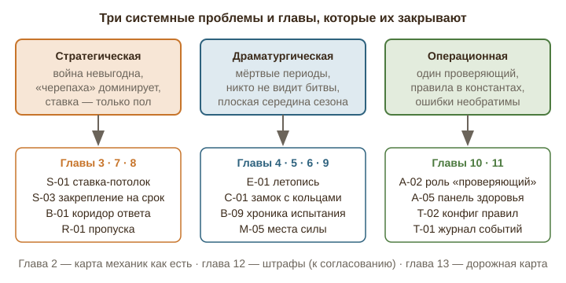

# Глава 1. Резюме для владельца: главные выводы и как читать отчёт

_Описание «как есть» и предложения даны по состоянию на дату отчёта. Решения владельца по каждому пункту — в `decisions.md` рядом; действующие правила — в `docs/LANDS_OF_THE_WORD.md`. В частности: разрешение на проход отозвать нельзя (S-14), штраф аннулирует случайный концевой участок пути, включая ведущий в ещё не взятый город (уточнение 19.09)._

## 1. Что это за документ

Это сводное заключение экспертного совета по игре «Земли Слова» на сентябрь 2026 года. Совет работал по десяти направлениям, каждое направление написало свою главу: механики как есть, стратегия и баланс, вовлечение и драматургия, мини-фишки заданий городов, дела в реальном мире, испытания стихами, дипломатия и роли, карта и мир, администрирование и запуск сезона, техническая реализуемость. К ним добавлены две главы владельца: штрафы за телефон на собрании (глава 12) и дорожная карта (глава 13).

Источники у всех глав одни и те же: главный документ проекта (`docs/LANDS_OF_THE_WORD.md`), стандартный набор дел, задания городов и код правил на сервере. Там, где документ и код расходятся, за «как есть» принят код, а расхождение вынесено в список. Там, где эксперт не был уверен, стоит слово «предположительно». Ни одно утверждение о текущем состоянии игры не выдумано: у каждого есть параграф документа или файл кода.

В отчёте 151 предложение. Это больше, чем просили, и это сделано намеренно: часть предложений пересекается (например, календарь сезона встречается и в главе о вовлечении, и в главе о карте), и владельцу проще выбрать из широкого списка, чем достраивать узкий. Дорожная карта в главе 13 сводит пересечения и предлагает порядок.

## 2. Главный вывод

Игра целостна и работает: карта, дела, города, шифры, конверты, испытания стихами, дипломатия, роли, письма, офлайн-конверты, PWA на телефоне. Это редкий уровень завершённости для проекта такого размера. Основные риски не в том, что чего-то нет, а в трёх системных вещах, которые проявятся к третьей-четвёртой неделе сезона.

**Первая — стратегическая.** Война невыгодна. Претендент рискует стихами и временем, а защитник отвечает на свой, уже выученный отрывок и выигрывает ничью. Ставка ограничена только снизу, и большая команда «стеком участников» выучивает 40 стихов за вечер. Закрепление навсегда позволяет выйти из игры, не проиграв. Итог: доминирующая стратегия «черепаха» (не воевать, копить города, закрепить столицу) и ноль конфликтов к середине сезона. Разбор в главе 3, четырнадцать дыр с примерами; исправления S-01…S-04, S-06, S-11 малые по сложности и должны быть сделаны до старта.

**Вторая — драматургическая.** Между делами и городами нет событий. Рядовой участник не видит своего вклада, капитан видит только свою команду, никто не видит битвы. Сезон имеет сильную завязку, плоскую середину и случайную кульминацию. Проверка дел и видео занимает дни, и это «мёртвое» время. Главы 4, 5, 7, 9 предлагают летопись, календарь сезона, публичную хронику испытаний, «путевой лист» участника, замок и весы вместо форм ввода, места силы на карте.

**Третья — операционная.** Один проверяющий на всё: по расчёту главы 10, 60–90 проверок в неделю на 4 команды по 8 человек. Правила зашиты в код константами, и изменить «14 дней» или «+5 стихов» нельзя без релиза. Ошибку администратора нельзя отменить. Нет сводки для руководства церкви. Главы 10 и 11 предлагают роль «проверяющий», пакетную проверку, конфиг правил, журнал событий, снапшоты.

## 3. Расхождения документа и кода, которые надо решить до старта

Ниже собраны находки из глав 2, 3, 7, 8, 10, 11, которые не требуют дизайнерского решения, а требуют выбора: исправить код или переписать правило. Порядок по важности для игры.

1. **Владелец города виден сразу.** Документ (§2.5, §2.11) обещает, что «занят ли город» команда узнаёт только после заданий. Код показывает владельца при открытии перекрёстка: обводка на карте, подпись «Город команды…». Стратегия «потраченного времени» из документа не работает. Предложение I-02.
2. **Момент T противоречив внутри документа.** §2.8 п. 6 считает T до прикрепления последней ссылки, «Учёт стихов» и код — до отправки капитаном, и T растёт после возвратов. Дедлайн ответа в §5.1 считается от завершения атаки, в §2.8 п. 7 и коде — от одобрения администратором; хранители получают письмо, когда таймер уже идёт. Предложения B-01, B-04.
3. **Минимальное T = 60 секунд.** Код допускает «блиц»: команда, заранее выучившая короткую книгу, объявляет вызов и записывает 10 стихов за минуту; защитники должны ответить за ту же минуту. Предложения S-02, B-01.
4. **Возврат записи после дедлайна = мгновенный проигрыш.** Если администратор отклонил видео защиты, а срок уже вышел, город теряется без права пересдачи. Предложение B-04.
5. **Уступить город можно в фазе вызова** до одобрения записей. Это «бесплатная уступка» и способ обойти ставку. Предложение B-11.
6. **Претенденты видят суммы защиты.** Ответ сервера на просмотр испытания отдаёт атакующим суммарные данные защитников. Утечка, закрывается на сервере.
7. **Короткие книги уходят в суммарный режим и закрепляются навсегда.** Книга в 21 стих (например, Авдий) даёт один отрывок на сторону вместо «каждому свой», а после 10 защит город закрыт до конца сезона. Предложение B-13.
8. **Вызов и ставку объявляет любой участник**, не капитан (§2.15 относит это к капитану). То же с вводом ключа конверта. Предложение I-04.
9. **Дела по книге на выходе из взятого города не выдаются.** Стороны создаются при открытии перекрёстка, до взятия, и после взятия не пересчитываются. Работает только подстановка «[Книга]», причём и для чужих городов. Предложение I-03.
10. **Выбывшая команда не остановлена.** Документ (§2.9, §5.2) делит участников по командам; код не проверяет статус, и выбывшая команда продолжает открывать карту и может занять город ключом. Предложение R-15.
11. **Таблица лидеров отдаёт «города на пути»** во время игры. Это разведданные, которые должны стоить хода разведчика.
12. **Нет уведомления об одобрении дела.** Команда узнаёт о зачёте, только открыв карту. Предложение E-04 и A-13.
13. **Пропуск и сделка (§2.14 А, сущность PassageToken) не реализованы**; разрешение прохода бессрочно и переживает смену владельца. Предложения R-01, S-14.
14. **Нет недельного лимита смены ролей**, хотя документ его подразумевает. Предложение R-08.
15. **Тяжесть дела (`difficulty`) нигде не используется**, и все дела стоят одинаково. Предложение D-03.
16. **Тип подтверждения «CONFIRMATION» равен «REPORT»**: подтверждение адресата ничем не подтверждается. Предложение D-04.
17. **Пустой список книг у дела не означает «любая книга».** Такое дело просто не выдаётся. Предложение D-02.
18. **Чек-лист готовности проверяет пять условий** и все они технические. Предложение A-01.
19. **Числовые ответы малы и перебираемы**, попытки ограничены только у выбора. Предложения C-07, C-14.
20. **Ничья по сроку решается номером команды**, а не «суммой уровней защиты» (§2.9). Предложение S-11.

Каждый пункт стоит от часа до дня работы. Вместе они закрывают большинство «дыр», которые опытная команда найдёт за первые две недели.

## 4. Пятнадцать предложений, если делать только их

Если из 151 предложения выбрать пятнадцать, чтобы сезон стал заметно лучше при разумных затратах, совет предлагает такой список. Порядок — по соотношению влияния и сложности.

| № | Предложение | Что даёт | Сложность |
|---|---|---|---|
| S-01 | Ставка и пол, и потолок | Убирает «стек участников», выравнивает большие и малые команды | S |
| B-01 | Коридор времени ответа и тихие часы | Закрывает блиц и ночные вызовы | S |
| S-03 | Закрепление на срок, не для столицы | «Черепаха» перестаёт быть выигрышной | S |
| S-11 | Дела в счёте и честная ничья | Дела начинают влиять на победу | S |
| E-01 | Воскресная «Летопись» | Общий ритм, каждая команда видит всех | M |
| E-03 | «Путевой лист» участника | Рядовой видит свой след | M |
| B-09 | Публичная хроника испытания | Битвы становятся событием для всех | M |
| C-01 | Замок с кольцами для «расставьте по порядку» | Самый сильный момент города получает форму | M |
| D-01 | Расширить набор до 41 дела | Набора хватает на сезон | S |
| D-04 | Карточки благодарности | Подтверждение без персональных данных | M |
| R-01 | Сделка за проход: пропуска | У дипломатии появляется предмет | M |
| A-02 | Роль «проверяющий» | Снимает узкое место проверки | M |
| A-05 | Панель здоровья команд | Администратор видит «мёртвую» команду за неделю до выбывания | M |
| T-02 | Конфиг правил в JSON | Все константы становятся настройками | M |
| P-02 / P-03 | Штраф: стих бодрствования, дело сверх очереди | Штраф, который приносит пользу | S / M |

## 5. Как читать отчёт

- **Одна страница, одна прокрутка.** Слева оглавление по главам (на телефоне оно вверху). Каждое предложение имеет номер вида «буква-число», где буква — глава: I механики, S стратегия, E вовлечение, C задания городов, D дела, B испытания, R дипломатия и роли, M карта, A администрирование, T техника, P штрафы.
- **Плашки под заголовком предложения**: сложность (малая — до 2 дней, средняя — до недели, большая — больше), влияние от 1 до 5, этап (сейчас — до старта или в первые недели сезона; следующий сезон; v2 — после накопления опыта).
- **Каждая глава** построена одинаково: как есть, дыры, предложения, порядок внедрения. Если времени мало, читайте раздел «Дыры» и последнюю сводку каждой главы.
- **Приложение в конце** — таблица всех предложений с переходом по номеру.
- **Отдельно к решению владельца**: глава 12, штрафы. Там десять вариантов и рекомендация выбрать три; ничего из главы 12 не внедряется без согласования.

## 6. Что не вошло

Совет не оценивал визуальный дизайн интерфейса, тексты писем и перевод на английский: это отдельная экспертиза. Не проверялась производительность под нагрузкой более 100 одновременных пользователей (глава 11 даёт оценку, но не измерение). Не предлагались платные сервисы и любые механики, которые требовали бы хранить файлы пользователей или собирать дополнительные персональные данные: это противоречит правилам проекта, и все предложения о фото и подтверждениях построены без хранения файлов.
