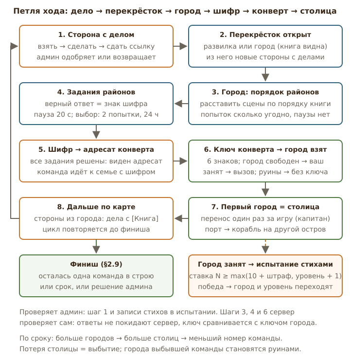
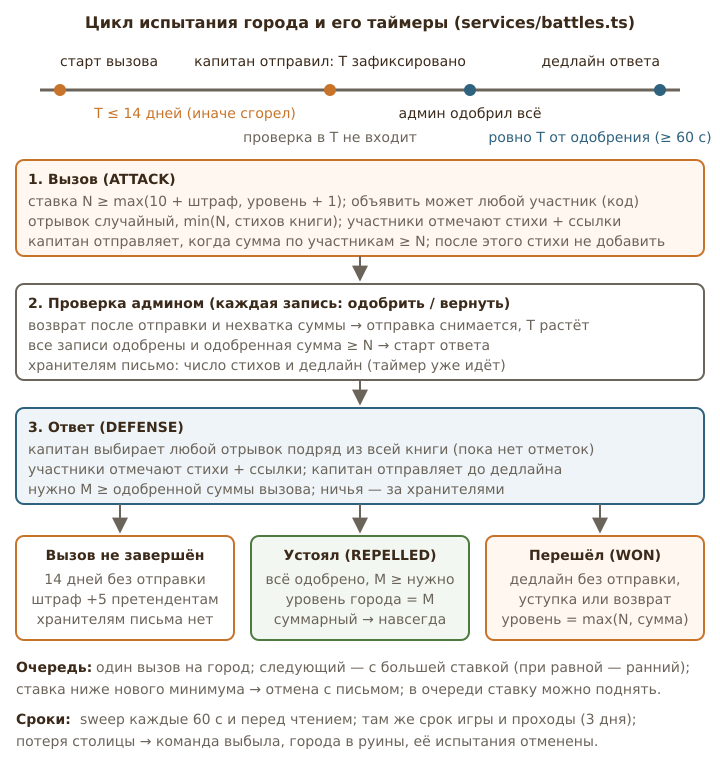
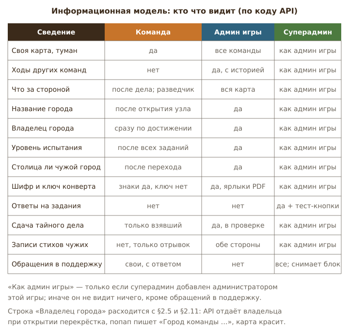
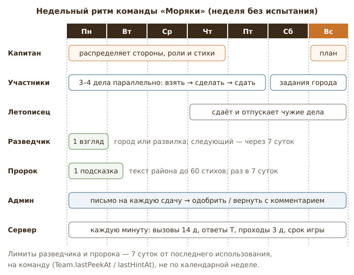
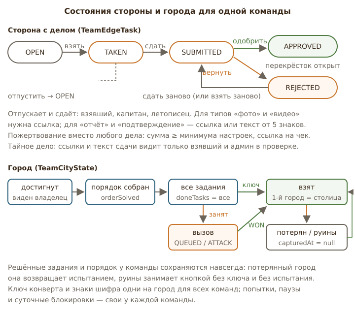

# Глава 2. Полная карта механик как есть

**Префикс предложений:** I- (инвентарь). **Источники:** `docs/LANDS_OF_THE_WORD.md` v0.11 (§1–§5, §13, §15), `content/deeds-default.json`, `content/cities/*.json` (образцы — `rut.json`, `gen.json`), код правил `apps/api/src/routes/{teamMap,cities,battles,diplomacy,teams,games,deeds,recipients,support}.ts` и `apps/api/src/services/{teamMap,cities,battles,recipients,defaultDeeds,game,notify,bible}.ts`, генератор `packages/domain/src/mapgen.ts`.

Задача главы — не предлагать, а точно зафиксировать, как игра устроена сейчас. Правило чтения: если документ и код расходятся, за «как есть» принимается **код** (он и работает на сервере), а расхождение выносится в раздел 5 «Что недосказано или противоречиво». Все числа ниже взяты из констант кода, а не из документа; там, где документ называет иное число, это отмечено.

---

## 1. Как есть

### 1.1 Карта: два острова, порты, туман

**Генерация.** Администратор игры задаёт число перекрёстков `nodeCount` (200–600, по умолчанию 250) и число команд (2–12). Генератор (`mapgen.ts`) строит два поля гексов: Ветхий Завет и Новый Завет, размер пропорционален числу книг (39 : 27), между ними пролив. Гексов ≈ `nodeCount / 2.15` (для 250 — около 116). Городов ровно 66, по одному на книгу; книги раздаются случайно, но внутри своего завета. Между любыми двумя городами не меньше 2 сторон (`minCityGap = 2`). Пятнадцать «морских» книг (`SEA_BOOKS`: Бытие, Исход, 3 Царств, 2 Паралипоменон, Псалтирь, Исаия, Иезекииль, Иона, четыре Евангелия, Деяния, 2 Коринфянам, Откровение) ставятся на береговые перекрёстки в первую очередь; всякий береговой город — порт (`coastal = true`), внутренний город портом не бывает. Точки старта — внутренние перекрёстки Ветхого Завета не дальше 0,85 радиуса от центра; без переключателя «равноудалённые старты» они выбираются случайно с расстоянием ≥ 8 сторон друг от друга, с переключателем — на кольце 0,6 радиуса через равные углы (≥ 6 сторон друг от друга). Ближайший город от старта — не ближе 2 сторон; разница расстояний до первого города между командами ≤ `maxStartDistanceDiff` (0–6, по умолчанию 3). Кнопку «Сгенерировать» можно нажимать сколько угодно, пока игра в черновике; при старте карта фиксируется. Меняются после старта только срок окончания и параметры пожертвования (`PATCH /api/games/:id`).

**Туман и видимость.** Команда «стоит» сразу на всех открытых перекрёстках (`TeamNodeState`); отдельной фишки-позиции нет. Гекс освещён, если хотя бы один из трёх его углов открыт команде; остальные гексы видны силуэтом, с подписью острова. Команда получает: открытые перекрёстки (вид: развилка / город / старт, книга города, порт или нет), стороны, касающиеся открытых перекрёстков, дела на сторонах фронтира, список достигнутых городов с их состоянием и «разведанные» перекрёстки (только вид, без названия). Ходы других команд, их цвета на сторонах и позиции команде не передаются вообще — API `my-map` не содержит ни одного поля о чужих командах, кроме владельца достигнутого города (см. 1.4). Администратор видит всю карту, всех команд, историю ходов с датами (`/progress`: `revealedAt`, `decidedAt`) и ползунок времени; кнопка «глазами команды» показывает ему ровно то, что видит команда, без действий.

**Точка выбора.** Администратор: размер карты, число команд, переключатели «равноудалённые старты», «включать родословия», допуск разницы стартов, сид (можно перегенерировать). У команды на этом этапе выбора нет.

### 1.2 Старт

При старте (`POST /api/games/:id/start`) сервер проверяет готовность: карта есть, стартов столько же, сколько команд, команды созданы и не пусты, список дел не пуст (предупреждение, если дел меньше рекомендованного `max(30, nodeCount/8)`; для 250 перекрёстков это 31). Команда с индексом *i* получает старт *i*; подпись старта — «плен» по номеру команды (Египетский, Вавилонский, Ассирийский, затем иго времён Судей, по кругу). Старт — не город, ничего не даёт; из него, как из любого перекрёстка, три стороны, и на каждую сразу вешается дело. Тогда же каждому городу выдаются ключ конверта (6 знаков, латиница и цифры без 0/O/1/I) и шифр (длина = число заданий города, русские буквы и цифры без похожих знаков); если админ печатал ярлыки раньше, ключи уже есть и не меняются.

### 1.3 Движение и дела на сторонах

**Модель хода.** Сторона от открытого перекрёстка к неоткрытому — «фронтир». Для каждой такой стороны сервер создаёт командное дело (`TeamEdgeTask`) при первом же обращении к карте (`ensureFrontier`, идемпотентно). Ограничений на параллельность нет: все дела фронтира открыты одновременно, любой участник может взять любое. Ходить «назад» нечего: по открытым перекрёсткам движения как такового нет, только новые стороны из них. Из чужого занятого города стороны не создаются, пока владелец не разрешит проход (1.7).

**Подбор дела** (`pickDeed`): сначала, если сторона выходит из города, *взятого этой командой*, — дела, у которых в `bookCodes` есть эта книга; внутри любого пула порядок: (1) дела, которых команда ещё не встречала; (2) допускающие повтор и не встречавшиеся на 30 последних её сторонах; (3) любые допускающие повтор; (4) если и таких нет — любое дело, флаг «можно дублировать» игнорируется. Внутри пула случайный выбор с весами частоты редко : обычно : часто = 1 : 3 : 6. Подстановка `[Книга]` в название и описание берётся по книге перекрёстка, из которого выходит сторона, **независимо от того, взят ли город**; если это не город — «на выбор».

**Статусы и роли.** `OPEN → TAKEN` (взять может любой участник) `→ SUBMITTED` (сдать — взявший, капитан или летописец) `→ APPROVED` (перекрёсток за стороной открывается, у него создаются свои стороны) или `REJECTED` (дело можно сдать заново или взять заново; взявшему уходит письмо с комментарием). Отпустить взятое дело — взявший, капитан, летописец. Для типов «фото» и «видео» обязательна хотя бы одна ссылка (до 10, до 500 знаков); для «отчёт» и «подтверждение» — ссылка или текст от 5 знаков. Файлы не принимаются. **Пожертвование** заменяет любое дело, если в настройках задан минимум: сумма ≥ минимума, ссылка на чек обязательна, админ одобряет как обычную сдачу; задания города пожертвованием заменить нельзя. **Тайное дело** (`secret`): ссылки и текст сдачи видит только взявший и админ в проверке; остальным участникам поля пустые, на карте «глазами команды» у админа тоже скрыто. «Труд в днях» (§2.3: день труда = сторона) в коде отсутствует: типов подтверждения четыре — `REPORT`, `PHOTO_LINK`, `VIDEO_LINK`, `CONFIRMATION`.

**Что видит команда.** Дела на фронтире; дело исчезает с карты, если перекрёсток за ним уже открыт с другой стороны (`visibleTasks`: показываются только одобренные или ведущие в туман). **Что видит админ.** Очередь сдач (до 200, по времени сдачи), кто взял, ссылки, текст, пожертвование; кнопки «одобрить» / «вернуть» с комментарием; письмо на каждую сдачу.

**Точки выбора.** Команда: какие стороны брать и сколько параллельно; кто берёт; заменить ли дело пожертвованием; отпустить дело. Админ: одобрить / вернуть, комментарий; редактировать, добавлять, удалять дела (удалить нельзя, если взято или сдано — 409; свободные стороны получают замену).

### 1.4 Города: районы → задания → шифр → конверт → взятие

**Контент.** 66 файлов `content/cities/<код>.json`, всего 791 район и 871 задание (669 по району, 114 по группе районов, 88 по всей книге; типы: `text` 332, `choice` 236, `number` 160, `order` 143). У Руфи 16 районов и 17 заданий, у Бытия 16 районов и 17 заданий (14 по районам, 2 по группам, 1 по книге). Контент неизменяем для админа игры, читается с диска, ответы на клиент не уходят.

**Шаги** (`routes/cities.ts`):

1. **Достижение.** Город доступен в попапе, как только перекрёсток открыт. Строка статуса сразу сообщает: «Ваш город», «Город команды „Берег“», «Город в руинах» или «Свободный город»; на карте чужой город обведён цветом владельца. Это расходится с §2.5 и таблицей §2.11 (см. раздел 5).
2. **Порядок районов.** Районы приходят перетасованными (детерминированно по секрету игры, команде и городу, поэтому не меняются при перезагрузке), с непрозрачными id. Команда отправляет свой порядок; ответ — число районов не на месте. Попытки не ограничены, паузы нет. При нуле ошибок порядок «застывает», районы окрашиваются, появляются задания.
3. **Задания.** До сборки порядка задания не отдаются вовсе (`tasks: []`). Ответ: число (запятая = точка), текст (регистр, ё/е, пунктуация и пробелы не важны, список допустимых написаний), выбор (варианты перетасованы по секрету игры и команде), порядок (id перетасованы). После любого неверного ответа — пауза 20 с на весь город (`lastWrongAt`), включая неверный ключ конверта. Для `choice` — 2 попытки, затем задание закрыто на 24 ч; после верного ответа счётчик обнуляется. Верный ответ даёт знак шифра по индексу задания — `cityCode[index]`. Вставка из буфера и автозамена в поле ответа отключены на клиенте.
4. **Пророк** (раз в неделю на команду) открывает подсказку к заданию — текст района с тем же индексом, до 60 стихов; для заданий по группе или по книге (индекс ≥ числа районов) сервер отвечает 404 «Район не найден», хотя недельный лимит уже израсходован (`POST /hint` индекс не проверяет).
5. **Адресат.** Когда все задания решены, попап показывает подпись и тип адресата конверта (семья / вдова / старец / другой). Адресаты раздаются городам по кругу, начиная с наименее нагруженного, с детерминированной перетасовкой городов; пары не меняются, пока админ не нажмёт «Перераспределить поровну». При завершении игры список стирается.
6. **Ключ.** Команда вводит ключ из конверта (регистр, пробелы и дефисы игнорируются). Верный ключ при свободном городе → `capturedAt`, первый взятый город команды → столица (`isCapital`, если у команды столицы ещё нет). Если город уже чей-то — 409 «Город уже принадлежит команде …». Взятие удаляет у всех остальных команд свободные (`OPEN`) дела на сторонах из этого города, кроме команд с действующим разрешением прохода.
7. **Руины** берутся кнопкой без ключа при решённых заданиях; уровень испытания у руин сброшен в 0. Решённые задания и порядок сохраняются у команды навсегда, поэтому потерянный или разрушенный город, изученный раньше, забирается сразу.

**Обращение в поддержку.** В задании — кнопка; игрок пишет только текст (5–1000 знаков, не чаще 5 в минуту), сервер подставляет игру, церковь, команду, книгу, номер и текст задания, число попыток и срок блокировки. Уходит письмом на адрес поддержки (настройка суперадмина) и в блок дашборда суперадмина; суперадмин закрывает обращение с ответом и может снять блокировку (снова 2 попытки). Команда получает письмо/push и видит ответ в задании две недели. Администраторы игры не участвуют и обращений не видят.

**Что видит админ игры.** Ключ, шифр, районы, задания **без ответов** (`answersHidden`), варианты выбора в исходном порядке, прогресс каждой команды (порядок собран, попыток порядка, решённые задания, число неверных ответов, взят ли, столица ли). Ответы и тестовые кнопки («Открыть перекрёсток», «Зачесть задания», «Отдать город») — только пользователю, который одновременно администратор игры и администратор платформы.

**Точки выбора.** Команда: в каком порядке решать районы, кто решает, когда тратить подсказку пророка, писать ли в поддержку, идти ли к адресату сейчас. Админ: список адресатов, перераспределение, печать ярлыков (PDF, A4, 4 полосы на страницу).

### 1.5 Столицы, поражение и победа

- Первый взятый город (ключом или в испытании) — столица. Капитан **один раз за игру** переносит столицу на другой свой город, даже во время испытания (`capitalMovedAt`); вторую столицу переносить нельзя (переносится только та, у которой `secondCapital = false`).
- Захваченная столица противника становится второй столицей претендентов (`secondCapital`), а если у них своей ещё не было — первой.
- Потеря столицы → `team.status = defeated`: остальные города команды становятся руинами (`ruined = true`, `defenseLevel = 0`, владелец снят), все её вызовы и ответы отменяются, обеим сторонам письма. Перераспределение участников выбывшей команды по оставшимся (§2.9, §5.2 п. 4а) в коде отсутствует. Выбывшая команда не может объявлять вызовы, но код не запрещает ей брать дела, открывать перекрёстки и занимать свободные города ключом — проверок `status` в `teamMap.ts` и `cities.ts` нет.
- Финиш: (а) в строю осталась одна команда — сразу; (б) наступил срок `endsAt` — побеждает лидер по городам, при равенстве по столицам, затем **по меньшему номеру команды** (документ обещает «по сумме уровней защиты»); (в) админ завершил вручную — победитель лидер или указанная команда. При финише все испытания отменяются, адресаты стираются, письмо всем. Итоги (`/standings`) видят и админы, и участники: города сейчас, столицы, города на пути (все, что брала, включая потерянные), одобренные дела, открытые перекрёстки, испытания взято / отражено / потеряно.

### 1.6 Испытание города стихами

Терминология интерфейса (вызов / ответ / претенденты / хранители) наложена на старые сущности `Battle`, `ATTACK`, `DEFENSE`. Константы в `services/battles.ts`: `MIN_BID = 10`, `ATTACK_LIMIT_MS = 14 дней`, `BURN_PENALTY = 5`, минимальное T = 60 с. Ни одна из них в настройки игры не вынесена.

**Можно ли бросить вызов** (`warOptions`, по порядку проверок): не руины; у города есть владелец; владелец не я; моя команда не выбыла; город не закреплён навсегда; **все задания города решены** (порядок и все `doneTasks`); текст книги загружен; у моей команды нет активного или очередного вызова этому городу. Роль не проверяется: объявить вызов и поднять ставку в очереди может **любой участник**, хотя §2.15 относит объявление к капитану. Минимальная ставка `max(10 + штраф, уровень + 1)`; штраф копится у пары «команда — город» (`attackPenalty`). Ставка от 1 до 100 000; если она ≥ числа стихов книги, город переходит в **суммарный режим** навсегда (`MapNode.sumMode`), и все следующие вызовы ему тоже суммарные.

**Очередь.** На город один активный вызов (`ATTACK`/`DEFENSE`); новые становятся `QUEUED`, и владельцу письмо не уходит (письмо — только при немедленном старте). После итога стартует очередной с наибольшей ставкой (при равной — ранний); если ставка ниже нового минимума, владелец сменился на самого претендента или города больше нет у кого-либо — отмена с письмом. Пока в очереди, ставку можно поднять. Стихи претендентов в очереди не складываются.

**Вызов.** При старте выдаётся случайный последовательный отрывок из `min(N, стихов книги)` стихов; при выключенных родословиях отрывки, задевающие диапазоны родословий, исключаются (если иначе никак — включаются). Дедлайн вызова — 14 дней от старта (а не от объявления, если команда стояла в очереди). Каждый участник отмечает стихи только внутри отрывка, стих у одного участника считается один раз, ссылки 1–20 обязательны. Убрать свою неодобренную запись можно до отправки; чужую — капитан. Админ одобряет или возвращает каждую запись отдельно; на каждую партию отметок и на отправку ему уходит письмо. **Капитан отправляет вызов**, когда сырая сумма по участникам ≥ N: этот момент фиксирует T (`attackDoneAt − startedAt`). После отправки добавлять стихи нельзя. Если админ вернул запись и одобренной суммы не хватает, отправка снимается, команда добирает и отправляет снова — T растёт. Когда все записи одобрены и одобренная сумма ≥ N, начинается ответ: хранителям письмо с числом стихов и дедлайном.

**Ответ.** Дедлайн = момент одобрения + T. Капитан хранителей выбирает любой последовательный отрывок из всей книги (`от глава:стих до глава:стих`), менять можно, пока никто не отметил стихи. Участники отмечают стихи внутри отрывка; капитан отправляет до дедлайна, когда сырая сумма ≥ **одобренной** суммы вызова. Устоял: все записи ответа одобрены, `M ≥ need`, отправка была в срок → `REPELLED`, уровень = M, в суммарном режиме — `lockedForever` (очередь отменяется). Перешёл: дедлайн прошёл без отправки (проверяет `sweep` каждые 60 с и перед чтением), капитан хранителей нажал «Уступить» (доступно и во время вызова, до его одобрения), либо после дедлайна возврат записи опустил сумму ниже нужной → `WON`, уровень = `max(N, одобренная сумма вызова)`. Ничья — за хранителями. Сгоревший вызов (14 дней без отправки) → `EXPIRED`, штраф +5 претендентам; хранителям письмо не уходит. Хранители видят ссылку на отрывок претендентов, но не его текст, и не видят чужих записей; админ видит обе стороны целиком. На карте: у команды волна синяя — она претендент, красная — её город испытывают; у админа — на каждом городе с испытанием.

**Точки выбора.** Участник: сколько стихов взять на себя. Любой участник (по коду): объявить вызов и ставку, поднять ставку в очереди. Капитан: отправить сторону на проверку, выбрать отрывок ответа, уступить город, убрать чужую запись. Админ: одобрить / вернуть каждую запись. Хранители могут одновременно защищаться и брать другие города — ограничений нет.

### 1.7 Дипломатия: проход через чужой город

Чужой занятый город без разрешения — тупик: стороны из него команде не создаются (`blockedCities`), на карте подпись «проход закрыт». Запрос (`POST .../passage`) отправляет **посол**, а без посла — капитан (`canSpeak`); нужно, чтобы город был достигнут, принадлежал другой команде и не было запроса в статусе `PENDING`/`APPROVED`. Сообщение до 500 знаков. У владельца 3 дня (`PASSAGE_TTL_MS`): молчание → `EXPIRED`, письмо просителю «можно запросить снова». Отвечает посол или капитан владельца: разрешить / отказать с текстом. При разрешении стороны из города создаются сразу (дела обычные, не тематические: тематика привязана к городам, взятым самой командой). Отзыв (`revoke`) удаляет только свободные дела из города, взятые и сданные остаются. Разрешение хранится парой «проситель — город» и **не привязано к владельцу**: если город перейдёт другой команде, старое `APPROVED` продолжает открывать проход. «Сделка» с предложением права прохода и «пропуск» (`PassageRequest.offer`, `PassageToken` из §2.14 А и §5.1) в коде отсутствуют: у запроса есть только текст сообщения. Админ видит все запросы в блоке «Дипломатия», вмешаться не может.

### 1.8 Роли внутри команды

| Роль | Кто назначает | Что даёт по коду | Ограничение |
|---|---|---|---|
| Капитан (`role = CAPTAIN`) | администратор игры | отправка вызова/ответа на проверку, отрывок ответа, уступить город, перенос столицы, выбор места высадки, раздача игровых ролей, удаление чужих записей стихов, сдача и отпуск чужих дел | не может иметь игровую роль |
| Разведчик (`SCOUT`) | капитан или админ | «Разведать» перекрёсток за стороной фронтира: вид (город / развилка), без книги | 1 раз в 7 суток **на команду** (`Team.lastPeekAt`) |
| Пророк (`PROPHET`) | капитан или админ | подсказка: текст района задания, до 60 стихов | 1 раз в 7 суток на команду (`Team.lastHintAt`); только после сборки порядка; только для заданий по районам |
| Посол (`AMBASSADOR`) | капитан или админ | единственный, кто отправляет запросы прохода и отвечает на них; без посла — капитан | — |
| Летописец (`CHRONICLER`) | капитан или админ | сдаёт и отпускает чужие дела команды | — |

Каждая роль — один участник (назначение снимает роль с прежнего). Ограничение «менять раз в неделю» (§2.15) в коде не реализовано: `PATCH .../members/:userId` без задержек.

### 1.9 Морские переправы

Как только команда взяла порт, и на другом острове есть хотя бы одна пустая береговая развилка, у порта появляется морское дело (`sea = true`, `toKey = sea:<порт>`), дело подбирается по книге порта. Его берут, сдают и одобряют как обычное, но перекрёсток не открывается: капитан выбирает место высадки из кандидатов — пустые (`EMPTY`) береговые узлы другого острова, ещё не открытые команде; города и старты для высадки не годятся. Узел открывается, из него идут обычные стороны. Из одного порта — один рейс: пока у команды есть морское дело из этого порта (любого статуса), новое не создаётся; если порт потеряли, чужое свободное морское дело удаляется вместе с обычными. Обратно с Нового Завета — из взятого новозаветного порта тем же способом. На карте админа переправа — пунктир цветом команды; в истории ходов отрезок «в море» не рисуется.

### 1.10 Дела по книге, тайные дела, частота, стандартный набор

Стандартный набор — 21 дело, все с флагом «можно дублировать»; частота: редко 5, обычно 11, часто 5; подтверждение: фото 9, подтверждение 6, видео 4, отчёт 2; сложность 1 — 9, 2 — 8, 3 — 4; одно тайное («Сделать доброе дело или сюрприз тайно»); три дела с `[Книга]` и пустым списком книг (проповедь, декламация, стихотворение); направлений семь из восьми — «Финансовое участие» отдельным делом не встречается, только как замена. У каждого дела список тематических книг (`bookCodes`), подобранный по содержанию: например, «Продукты одинокой вдове» — Второзаконие, Руфь, 3–4 Царств, Исаия, Деяния, 1 Тимофею, Иакова.

Тематика «на выходе из взятого города» (§2.7) применяется в `pickDeed` только при **создании** дела на стороне. Стороны из города создаются в момент, когда город открыт (до взятия), поэтому уже существующие дела из только что взятого города не пересчитываются; «пересчёт исходящих рёбер» из §2.7 не выполняется. Тематический подбор реально срабатывает для морского дела (создаётся после взятия порта) и для замен при удалении дела админом. Подстановка `[Книга]` при этом работает всегда — по книге перекрёстка.

Синхронизация набора: при каждом старте сервера и при импорте (`add` / `replace`) — новые дела добавляются в игры, где набор использован, нередактированные обновляются по `sourceHash`, исчезнувшие удаляются, если не выданы; снятые владельцем (`RETIRED_TITLES`) убираются из всех незавершённых игр, если не взяты.

### 1.11 Уведомления

Каналы: письмо на почту учётки (если настроен SMTP) и web push на подписанные устройства, на языке учётки; отдельной ленты уведомлений на сайте нет — «на сайте» означает живое обновление карты и попапов по событиям (`publish`/SSE). Таблица событий по коду:

| Событие | Кому | Канал |
|---|---|---|
| Сдача дела; партия отметок стихов; отправка стороны на проверку | всем админам игры | письмо + push |
| Дело возвращено | взявшему (одному человеку) | письмо + push |
| Корабль готов (морское дело одобрено) | команде | письмо + push |
| Вызов вашему городу (только при немедленном старте, не из очереди) | хранителям | письмо + push |
| Пошло время ответа (вызов одобрен) | хранителям | письмо + push |
| Устоял / перешёл / потерян | обеим сторонам | письмо + push |
| Вызов не завершён (14 дней) | претендентам (хранителям — нет) | письмо + push |
| Вызов из очереди отменён | претендентам | письмо + push |
| Запрос прохода; ответ; отзыв; истечение 3 дней | владельцу / просителю | письмо + push |
| Ответ поддержки | команде | письмо + push |
| Игра завершена | всем командам и админам | письмо + push |

Что **не** уведомляется: одобрение дела (команда узнаёт по обновлению карты), появление новой стороны или города, взятие свободного города соперником, перенос столицы, назначение роли, приближение дедлайна ответа.

---

## 2. Сводная таблица «Точки принятия решений»

| Кто | Когда | Что выбирает | На что влияет |
|---|---|---|---|
| Админ игры | до старта | размер карты, число команд, равноудалённые старты, допуск разницы стартов, родословия, срок, пожертвование; перегенерация карты | форма игры на весь сезон; после старта меняются только срок и пожертвование |
| Админ игры | до старта | состав команд, капитаны, список дел (набор или свой), адресаты конвертов | кто с кем играет; какие дела встретятся; кому нести шифры |
| Админ игры | всегда | одобрить / вернуть сдачу дела, комментарий | открытие перекрёстка; темп команды; T в испытании через возвраты записей |
| Админ игры | в испытании | одобрить / вернуть каждую запись стихов | старт ответа, итог испытания, уровень города |
| Админ игры | всегда | добавить / изменить / удалить дело; перераспределить адресатов; завершить игру | пул дел; ярлыки; победитель |
| Админ платформы | по обращению | ответить, снять блокировку задания; адрес поддержки | доступ команды к заданию `choice` |
| Капитан | всегда | раздача игровых ролей; какие стороны и кому (вне системы) | недельные лимиты разведчика и пророка; параллельность |
| Капитан | после первого города | перенести ли столицу (1 раз) и куда | какой город станет условием поражения |
| Капитан | вызов | момент отправки (фиксирует T); убрать чужую запись | длина ответа противника |
| Капитан | ответ | отрывок ответа (до первой отметки); момент отправки; уступить | итог испытания; при столице — судьба команды |
| Капитан | после морского дела | место высадки на другом острове | вход на второй остров |
| Любой участник (по коду) | у достигнутого чужого города с решёнными заданиями | объявить вызов, ставка N; поднять ставку в очереди | минимум противника, суммарный режим города, риск штрафа +5 |
| Участник | всегда | взять / отпустить дело; пожертвование вместо дела; сдать | открытие перекрёстка; ресурс команды |
| Участник | в испытании | какие стихи выучить, когда прикрепить | сумма стороны; T |
| Команда | в городе | порядок районов (без ограничений), ответы (с паузами и блокировками), когда идти к адресату | знаки шифра, взятие |
| Разведчик | раз в 7 суток | за какую сторону заглянуть | маршрут |
| Пророк | раз в 7 суток | к какому заданию подсказка | скорость изучения книги |
| Посол (или капитан) | у чужого города | запросить проход, текст; разрешить / отказать / отозвать чужой запрос | связность карты для обеих команд |
| Летописец | всегда | сдать / отпустить чужое дело | дисциплина сдач |

---

## 3. Дыры и слабые места

Здесь только то, что видно из инвентаризации; подробный разбор — в тематических главах.

**3.1 Секрет владельца города не работает.** Документ строит на нём стратегию (§2.5: «команда не видит, занят ли город», «минус для команды — потраченное время, и это осознанная часть игры»), а API отдаёт владельца сразу при открытии перекрёстка, и попап пишет «Город команды „Берег“». Пример: «Моряки» открывают Левит, видят, что он у «Берега», и уходят, не потратив ни одного вечера на книгу. Одновременно исчезает и смысл «социальной утечки» (§2.5): скрывать нечего.

**3.2 Дела по книге не появляются там, где обещаны.** Стороны из города создаются при его открытии, тематический подбор — только при создании. В результате «выход из захваченного города — дела по книге» (§2.7) в игре не наступает, кроме морского дела. Команда, взявшая Руфь, увидит на выходах те же дела, что были до взятия; лишь `[Книга]` подставится.

**3.3 Вызов объявляет кто угодно.** Нет проверки капитана в `POST .../war` и `.../bid`. Один участник может от имени команды поставить 40 стихов и запустить 14-дневный таймер со штрафом.

**3.4 Работа, которая исчезает.** Если перекрёсток открыт с другой стороны, взятое или даже сданное дело к нему пропадает с карты команды (`visibleTasks`), хотя в базе живёт и попадёт к админу на проверку. Команда не видит, что сдала; админ одобряет, а эффекта нет.

**3.5 Выбывшая команда не остановлена.** Отсутствуют и перераспределение участников, и запрет брать дела и свободные города. По §2.9 команда «выбыла», по коду она продолжает открывать карту и может занять свободный город ключом; поскольку флаг столицы у неё снят, этот город станет её новой столицей.

**3.6 Правила зашиты в код.** Минимальная ставка, 14 дней, +5, 3 дня, 20 с, 2 попытки, 24 ч, неделя — константы. §2.9 и §6.3 обещают, что админ меняет механику по ходу игры через настройки.

**3.7 Пророк не помогает в заданиях по книге.** Для 202 заданий по группе и по книге подсказка отвечает 404.

**3.8 Разрешение прохода переживает владельца.** Проход, выданный «Берегом», продолжает действовать после того, как город взяли «Моряки».

---

## 4. Предложения

### I-01. Единый реестр параметров правил в настройках игры

**Суть.** Вынести константы (`MIN_BID`, лимит вызова, штраф, срок ответа на проход, пауза 20 с, попытки `choice`, срок блокировки, недельные лимиты ролей, минимальное T) в `Game.settings` с текущими значениями по умолчанию и показать их одной карточкой «Правила» у админа.
**Зачем.** Закрывает 3.6 и делает документ §2.9/§6.3 правдой; администратор «Берега» и «Моряков» видит одни и те же числа, что и игроки на странице «Как играть?».
**Как работает.** `rules` в настройках, чтение через одну функцию `rulesOf(game)`; правки после старта разрешены, но применяются к новым вызовам и запросам, идущие считаются по старым. В интерфейсе: «Минимум ставки 10 · Вызов 14 дней · Штраф +5 · Проход 3 дня · Пауза 20 с · Попытки выбора 2 → 24 ч».
**Риски и ограничения.** Изменение посреди сезона воспринимается как несправедливость — журналировать в «Что нового» игры и письмом командам.
**Сложность:** M · **Влияние:** 3 · **Этап:** сейчас

### I-02. Решить судьбу секрета владельца: скрыть до изучения или переписать §2.5/§2.11

**Суть.** Либо `getTeamMap`/`my-city` отдают `owner` только при `studied` (все задания решены), а до того попап пишет «Город: статус неизвестен», либо документ признаёт, что владелец виден при открытии, и §2.11 исправляется.
**Зачем.** Сейчас документ, инструкция и код говорят разное; команда планирует по одной модели, а играет по другой. Вариант «скрыть» возвращает риск «потраченного времени», заложенный владельцем; вариант «открыть» упрощает дипломатию (запрос прохода без изучения города).
**Как работает (вариант «скрыть»).** Поле `owner` и цветная обводка — после `studied`; кнопка «Запросить проход» тоже после изучения; `blocked` заменяется на нейтральное «дальше не пройти, пока город не изучен». «Моряки», открыв Левит, тратят неделю на 17 заданий и лишь тогда узнают: город у «Берега», уровень 25.
**Риски и ограничения.** Скрытие удлиняет тупики; смягчить разведчиком: его взгляд мог бы показывать «занят / свободен» вместо «город / развилка».
**Сложность:** S · **Влияние:** 4 · **Этап:** сейчас

### I-03. Пересчёт свободных дел на выходах из только что взятого города

**Суть.** В `capture` и `resolveWon` после `onCityOwned` для владельца заново подбирать дела на его `OPEN` сторонах из этого города с `bookCode` города.
**Зачем.** Закрывает 3.2, оживляет §2.7 и делает `bookCodes` набора нужными.
**Как работает.** Для каждой `OPEN` стороны `fromKey = город` у владельца — `pickDeed(gameId, teamId, book)`; взятые и сданные не трогаются; уведомление не нужно, карта обновится по событию. «Берег» взял Руфь — на трёх выходах появляются «Продукты одинокой вдове», «Помощь на поле», «Угостить человека обедом».
**Риски и ограничения.** Команда могла уже договориться о деле, которое не взяла в системе, — предупредить в «Что нового»; пул тематических дел у ряда книг пуст, тогда остаётся общий пул (как сейчас).
**Сложность:** S · **Влияние:** 3 · **Этап:** сейчас

### I-04. Проверка капитана на объявление вызова и ставку

**Суть.** `POST .../war` и `.../bid` — только `role = CAPTAIN` (как `submit`, `surrender`, `defense-passage`).
**Зачем.** Закрывает 3.3; ставка — командное обязательство на 14 дней со штрафом.
**Как работает.** Одна строка проверки, текст ошибки «Вызов бросает капитан»; участникам кнопка показывается неактивной с подписью.
**Риски и ограничения.** Капитан в отъезде — команда ждёт; смягчение: разрешить и послу.
**Сложность:** S · **Влияние:** 2 · **Этап:** сейчас

---

## 5. Что в правилах недосказано или противоречиво

1. **Видимость владельца города** — §2.5 и §2.11 говорят «только после заданий города»; код (`getTeamMap.owner`, `my-city.owner`, обводка цветом на карте) показывает сразу при открытии перекрёстка. Что считать правилом?
2. **Момент фиксации T.** §2.8 п. 6: «до прикрепления последней ссылки»; §2.8 «Учёт стихов» и код: до **отправки капитаном**. Из-за возвратов T может расти уже после первой отправки (§2.8 не описывает).
3. **Отсчёт ответа.** §5.1: `defense_deadline = attack_done_at + T`; §2.8 п. 7 и код: от одобрения админом. Время проверки админом при этом не входит ни в T, ни в ответ — хранители узнают о дедлайне только после одобрения; «второй алерт» приходит, когда таймер уже идёт.
4. **Уровень после перехода.** §2.8 п. 10: `= N`; код: `max(N, одобренная сумма)`. Если претенденты выучили больше ставки, уровень выше.
5. **Кто объявляет вызов.** §2.15 и §4: капитан; код: любой участник (`war`, `bid`). Аналогично: кто вправе занять город ключом — код принимает от любого участника, документ молчит.
6. **Суммарный режим.** §2.8.1 п. 3 и уточнения: «атакующим по-прежнему выдаются случайные отрывки, каждому участнику свой»; код выдаёт один отрывок на сторону длиной `min(N, стихов книги)` — при `N ≥ стихов` это вся книга. Кроме того, §2.8.1 п. 1 говорит «книга исчерпана, когда ставка достигает числа стихов», а код включает `sumMode` в момент объявления такой ставки и делает его необратимым для города.
7. **Дедлайн 14 дней** — §2.8 п. 6а: «с момента объявления войны»; код: с момента **старта** вызова (после очереди). Для очереди §2.8 обещает уведомление и новую ставку; код стартует автоматически со старой ставкой, письма владельцу при постановке в очередь нет.
8. **Штраф +5 и хранители.** §2.8 п. 6а не говорит, узнают ли хранители, что вызов сгорел; код не уведомляет их и не снимает «красную волну» до обновления карты.
9. **Дела по книге на выходе из города** (§2.7, ✅ «программа пересчитывает исходящие рёбра») — не реализовано: пересчёта нет, тематика применяется только при создании стороны. §2.3 «сквозь чужой город тематические дела не даются» — верно в силу того же.
10. **Труд в днях** (§2.3, ✅ «один день труда = одно ребро») — в коде типа дела нет; как засчитывать лагерь — не определено.
11. **Половинная окраска сторон и «чужой цвет на своих векторах»** (§2.4) — команде чужие проходы не передаются вообще; реализована только карта админа.
12. **Рекомендуемый минимум дел.** §2.4 называет и «≈ 60–120», и «не меньше 30, ≈ один вектор из восьми»; код: `max(30, nodeCount/8)` = 31 для 250. Флаг «можно дублировать» при исчерпании пула игнорируется (`weightedPick(deeds)`), у всех 21 дел набора он и так включён.
13. **Дипломатическая сделка и пропуск** (§2.14 А ✅, §5.1 `PassageRequest.offer`, `PassageToken`) — в коде нет; есть только текст. Разрешение не привязано к владельцу и переживает смену хозяина города (§2.14 не оговаривает). Требуется ли изучить город, чтобы просить проход, — документ не говорит; код требует лишь достижения.
14. **Роли «раз в неделю»** (§2.15: менять роли раз в неделю; лимиты разведчика и пророка «раз в неделю») — смена ролей без ограничений; лимиты считаются 7 суток от последнего использования **на команду**, а не на календарную неделю и не на человека. Подсказка пророка недоступна для заданий по группе и по книге (404), а недельный лимит при этом сгорает.
15. **Выбывшая команда.** §2.9: участники делятся поровну между оставшимися; в коде нет ни перераспределения, ни запрета выбывшим брать дела и свободные города; захваченный ими руинный или свободный город снова станет их столицей.
16. **Ничья по сроку.** §2.9: «по числу столиц, затем по сумме уровней защиты»; код: по столицам, затем по номеру команды (созданная первой выигрывает).
17. **Порядок районов** — §2.6 не ограничивает попытки, код тоже: паузы нет, можно перебирать. Задания `order` и `number`/`text` — только пауза 20 с; §2.6 так и говорит, но не объясняет, почему для `choice` строже.
18. **Пауза 20 с и ключ.** Неверный ключ конверта ставит ту же паузу на все задания города и увеличивает `answerAttempts` — в §2.6 не описано.
19. **Уведомления «на сайт»** (§4, §6.1): в коде нет ленты уведомлений, только письмо, push и живое обновление; одобрение дела не уведомляется никак.
20. **Суперадмин и содержимое игр.** §4: «не видит, что происходит внутри игр»; §2.6: ответы видит только администратор платформы; по коду он видит ответы и тестовые кнопки, только будучи также админом игры, а обращения в поддержку (с текстом задания, командой, городом) — всегда.
21. **«Из одного порта — один рейс за взятие»** (§2.3a) — код: один рейс, пока у команды есть морское дело из порта любого статуса; после потери и возврата порта новый рейс появится, только если старое дело было удалено как свободное.
22. **Столица и вызов без города.** Команда без единого города может бросить вызов (нужны лишь решённые задания) и, победив, получить столицей чужой город; §2.9 «первый открытый командой город» этот случай не описывает.
23. **Уступка во время вызова.** Кнопка «Уступить» работает уже в статусе `ATTACK`, до одобрения записей претендентов; уровень тогда равен ставке N без единого выученного стиха. §2.8 п. 10 говорит только об обороне.

Из этого списка для владельца проекта первоочередные пять: 1 (владелец города), 2–3 (момент T и отсчёт ответа), 5 (кто объявляет вызов), 9 (дела по книге), 15 (выбывшая команда).
