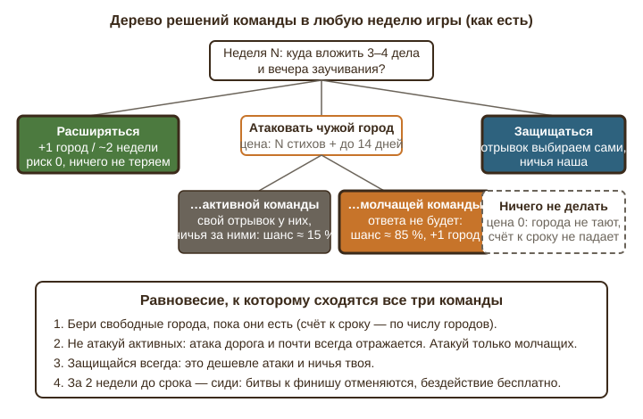
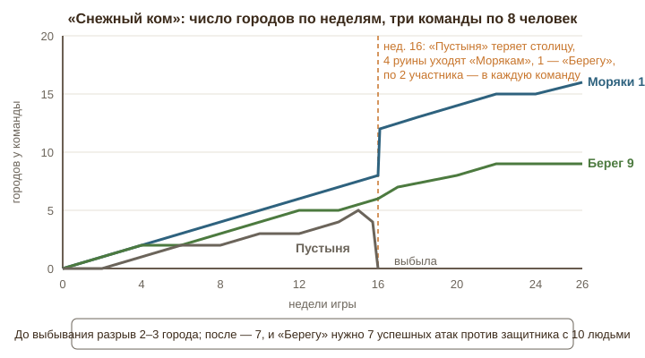
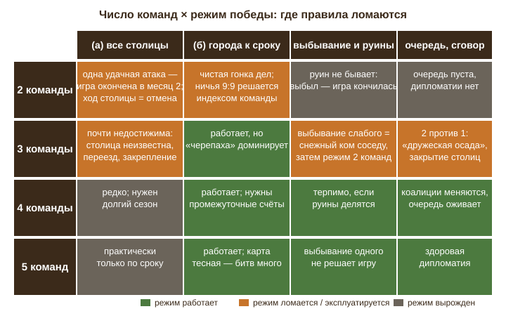
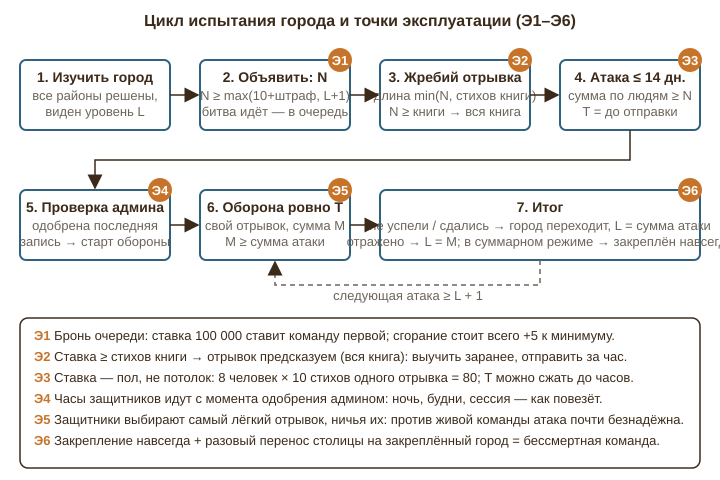

# Глава 3. Дыры в стратегии и балансе

Эта глава смотрит на «Земли Слова» глазами команды, которая хочет выиграть, а не просто «пройти проект». Такая команда обязательно появится: молодёжь быстро находит, где правила дают бесплатное преимущество. Задача главы — найти эти места раньше игроков, показать, во что они выливаются на шести месяцах игры, и предложить закрытие с цифрами. Источники: §2 главного документа (особенно §2.3, §2.6–§2.9, §2.14, §2.15) и код правил в `apps/api/src/services/{battles,teamMap,cities,game}.ts` и `apps/api/src/routes/{battles,cities,teamMap,diplomacy}.ts`. Примеры — на выдуманных командах «Моряки», «Берег» и «Пустыня», по 8 человек, игра 26 недель.

## 1. Как есть

**Экономика хода.** Единица прогресса — дело на стороне гекса; одобренное дело открывает перекрёсток за ней. Команда из 8 человек делает 3–4 дела в неделю (§2.3). Любое дело можно заменить пожертвованием не ниже минимума из настроек (§15.1, `routes/teamMap.ts`, поле `donation`); длительный труд считается по дням, день = сторона (§2.3, по документу). Ограничений на число дел в неделю нет, цены за бездействие нет: механика «поддержания города» отклонена владельцем (§2.7).

**Города.** 66 городов на двух островах, 39 + 27. Свободный город берётся заданиями и ключом из конверта (§2.6); первый взятый город — столица (`routes/cities.ts`, `isCapital: hasCapital === 0`). Изучить чужой город (решить все задания) можно без разрешения владельца, разрешение нужно только для движения дальше через него (`blockedCities` в `services/teamMap.ts`).

**Битвы** (`services/battles.ts`). Константы: `MIN_BID = 10`, `ATTACK_LIMIT_MS = 14 дней`, `BURN_PENALTY = 5`. Минимальная ставка `max(10 + штраф, уровень + 1)`. Атакующим выдаётся случайный последовательный отрывок длиной `min(N, стихов в книге)`; если `N ≥ стихов в книге`, у узла включается `sumMode`. Каждый участник отмечает выученные стихи только внутри выданного отрывка; считается сумма по участникам. Капитан отправляет атаку, когда сумма ≥ N; T = от старта атаки до отправки, но не меньше 60 секунд (`Math.max(60_000, …)`). После одобрения всех записей у защитников ровно T с момента одобрения; капитан защитников выбирает любой последовательный отрывок книги. Важно и не очевидно из §2.8: **защитникам нужно набрать не N, а фактическую одобренную сумму атаки** (`need = sumVerses(entries, "ATTACK", true)`), которая может быть заметно больше N. Ничья за защитниками. Уровень после отражения = M, после захвата = `max(N, сумма атаки)`. Отражение в суммарном режиме ставит `lockedForever`. Сгоревшая атака — `+5` к минимуму этой команды на этот город. Верхняя граница ставки в валидации — 100 000 (`declareBody`).

**Очередь.** Пока идёт битва, новые вызовы становятся в очередь; после завершения стартует вызов с наибольшей ставкой (`orderBy: [{ bid: "desc" }, { declaredAt: "asc" }]`), ставку в очереди можно поднимать; если уровень вырос выше ставки — вызов отменяется с письмом. Уведомления о старте атаки из очереди с просьбой «поставить ставку» (как в §2.8) в коде нет: очередь стартует с уже указанной ставкой.

**Столицы и конец игры** (`routes/diplomacy.ts`, `services/game.ts`). Столицу можно перенести один раз за игру, в том числе во время войны; на закреплённый город переносить не запрещено. Потеря столицы = выбывание: остальные города становятся руинами с уровнем 0, их берёт любая команда, решившая задания (без ключа и битвы); участники делятся поровну между оставшимися (§2.9, по документу). Игра завершается, когда осталась одна команда, или по сроку `settings.endsAt`: побеждает лидер по `cities`, затем `capitals`, затем — **меньший индекс команды** (`standings` в `services/game.ts`). Сумма уровней защиты, упомянутая в §2.9 как третий критерий, в коде не участвует. При завершении все битвы отменяются.

**Дипломатия.** Запрос прохода, 3 дня, молчание = отказ, отзыв в любой момент; в коде запрос содержит только свободный текст `message`/`answer` — формальных «пропусков» (§2.14 А, «сделка») в схеме нет, предположительно они существуют только как договорённость на словах.

## 2. Дыры и слабые места

Ниже каждая дыра разобрана по одной схеме: механизм, сценарий на командах, как часто это произойдёт в реальной игре трёх команд, тяжесть по пятибалльной шкале (5 — ломает игру).

### Д-1. «Черепаха»: не воевать и копить города — доминирующая стратегия

Победа по сроку — по числу городов. Свободный город стоит примерно 2 недели дел и заданий и не несёт риска. Атака на город живой команды стоит N стихов и до 14 дней, а выигрывается редко (см. Д-5). Значит, пока на карте есть достижимые свободные города, атаковать нерационально, а в конце игры — тем более (Д-10). Единственная стоящая атака — на команду, которая не ответит.

*Сценарий.* Неделя 1–12: «Моряки» и «Берег» берут по 5–6 городов, не пересекаясь. Неделя 13: «Берег» дошёл до города «Моряков» (Иона, 48 стихов), изучил его, увидел уровень 0. Капитан считает: ставка 10, восемь человек учат две недели, «Моряки» получат те же две недели, выберут короткие стихи и ответят — вероятность взять город меньше 20 %, а те же две недели вечеров можно вложить в 3 своих свободных города по дороге. Решение: не атаковать. Так рассуждают все трое, и до недели 20 в игре не происходит ни одной битвы.

*Частота:* почти в каждой игре с активными командами. *Тяжесть:* 4 — главная механика (испытание стихами) остаётся невостребованной, игра сводится к гонке дел.

### Д-2. Ставка — пол, а не потолок: «стек участников»

По коду защитники обязаны ответить на одобренную **сумму** атаки, а не на N. Отрывок атаки при N = 10 — это 10 стихов, но отметить их может каждый из 8 участников. Итого атака при ставке 10 может весить 80. Владелец города при объявлении получает письмо «ставка 10 стихов» и узнаёт настоящую цифру только с началом своего таймера.

*Сценарий.* Неделя 14, вторник. «Моряки» объявляют вызов городу «Берега» (Руфь, 85 стихов), ставка 10. Отрывок — Руфь 2:1–10. Все восемь учат одни и те же 10 стихов за вечер, записывают видео, капитан отправляет в 23:00: сумма 80, T = 6 часов. Утром в 9:00 админ одобряет записи. У «Берега» до 15:00 среды: восемь человек на работе и учёбе должны выучить и записать 80 стихов. Город потерян с уровнем 80. Обратная атака требует ставку 81 из 85 — почти вся книга у каждого, и «Моряки» ответят тем же стеком. Город потерян до конца игры.

*Частота:* как только одна команда прочитает правила внимательно — то есть до середины первой игры. *Тяжесть:* 5. Это не «хитрость», это несоответствие уведомления и правила; спор «нам сказали 10, а спросили 80» неизбежен.

### Д-3. Таймер T симметричен по длине, но не по положению

T измеряется от старта атаки до отправки, минимум 60 секунд. Атакующие выбирают и длину, и день недели, и час; защитники получают свой T с момента одобрения админом — ночью, в будни, в неделю экзаменов, на выезде. «Столько же времени» на бумаге не равно «столько же возможностей». Доброжелательный атакующий этого не заметит, расчётливый — использует.

*Сценарий.* «Пустыня» знает, что у «Берега» в конце июня выпускные. Атака объявлена 20 июня, отправлена через 3 дня. Одобрена 24-го — три дня обороны приходятся на 24–27 июня. Формально всё честно.

*Частота:* средняя, растёт с Д-2 (стек делает короткий T осмысленным). *Тяжесть:* 4, для столицы — 5.

### Д-4. Предвыученный блиц на короткие книги

При `N ≥ стихов в книге` отрывок атаки — вся книга, то есть предсказуем заранее. Команда учит Филимона (25 стихов) до объявления, объявляет ставку 25, отправляет через час с суммой 8 × 25 = 200. Защитникам нужно 200 стихов за час. Уровень после захвата — 200, что выше потолка любой команды из 8 человек (8 × 25 = 200, а нужно 201). Город закрыт навсегда без всякого `lockedForever`. То же — для 2 Иоанна (13), 3 Иоанна (15), Иуды (25), Авдия (21) и с натяжкой для книг до ~60 стихов (Аггей, Титу, Наум, Софония, Малахия).

*Сценарий.* Неделя 9: «Моряки» доходят до Авдия у «Пустыни». Две недели вся команда учит 21 стих (это одна глава), объявляют в понедельник в 20:00, отправляют в 21:30, сумма 168, T = 90 минут. Админ одобряет во вторник в 8:00; в 9:30 город переходит. Атака на возврат требует 169 из 21-стиховой книги — по 21 стиху у каждого из 8 человек и ещё 1; невозможно.

*Частота:* высокая — коротких книг 5 на 66, а изучить их проще всего. *Тяжесть:* 5.

### Д-5. Структурное преимущество защитника: свой отрывок, ничья за ним

Атакующим — жребий, защитникам — любой отрывок книги на их выбор, ничья за ними, стек доступен и им. В Псалтири защитник возьмёт Псалом 116 (2 стиха) и соседние короткие; в Паралипоменон — нет, но и там выберет знакомые места. Против команды, которая просто прочитала уведомление и открыла книгу, атака проигрывает. Итог: атаки имеют смысл только против команд, которые не ответят вовсе — «бей молчащего». Эти же команды и так слабейшие: правило усиливает неравенство, а не сглаживает.

*Частота:* всегда. *Тяжесть:* 3 сама по себе, 4 в связке с Д-6.

### Д-6. Снежный ком через выбывание и руины

В обычной фазе положительной обратной связи почти нет: узкое место — люди, а не стороны, у 8 человек 3–4 дела в неделю независимо от числа городов. Ком запускает выбывание: города выбывшей команды становятся руинами с уровнем 0 и достаются тому, кто их **уже изучил** — то есть агрессивному соседу, который дошёл до них и решил задания, готовясь к атаке. Плюс участники выбывшей делятся поровну: команды растут до 10–12 человек, и потолок суммы в битве растёт вместе с ними.

*Сценарий и таймлайн.* Недели 1–15: «Моряки» 8 городов, «Берег» 6, «Пустыня» 5. «Моряки» изучили 4 города «Пустыни», «Берег» — 1. Неделя 15: «Моряки» блицем (Д-2) снимают у «Пустыни» город, который оказывается столицей. Неделя 16: «Пустыня» выбывает; 4 руины уходят «Морякам» без ключа и битвы (`capture` для `ruined` не спрашивает ключ), 1 — «Берегу»; по 2 участника в каждую команду. Счёт 12 : 7. Недели 17–26: «Берегу» нужно 6 успешных атак на команду из 10 человек, где защитник выбирает отрывок. Это невозможно; «Моряки» переходят в «черепаху» (Д-1) и выигрывают по сроку с 16 : 9.

*Частота:* в каждой игре, где кто-то выбыл раньше последнего месяца. *Тяжесть:* 5 — с недели 16 половина сезона проходит без интриги.

### Д-7. Закрепление навсегда как способ выйти из игры

Отражение атаки в суммарном режиме закрепляет город навсегда. Столицу разрешено переносить один раз на любой свой город, включая закреплённый. Отсюда два выхода из «боевой» части игры. Честный: держать столицей город с короткой книгой и ждать, пока кто-то атакует в суммарном режиме и проиграет (ответить 25 стихами на 25 при своём выборе отрывка несложно). Сговорный: попросить дружественную команду атаковать Филимона со ставкой 25 и не стараться — после отражения город закреплён, столица переезжает туда, команду нельзя устранить до конца игры. Дальше — чистая «черепаха».

*Частота:* честный вариант — регулярно; сговор — в играх трёх команд, где две дружат, вероятен. *Тяжесть:* 4. Документ сам признаёт: «закреплённая столица делает вариант (а) недостижимым».

### Д-8. Перенос столицы во время войны обесценивает «блиц на столицу»

Атакующий не знает, столица ли перед ним. Владелец знает и имеет одну «уклонялку» прямо во время осады. Первый удачный удар по столице стоит атакующему только обычный город; вторая столица атакующему неизвестна. С учётом Д-5 победа по столицам в игре трёх активных команд практически недостижима: все игры идут «по сроку». Само по себе это неплохо (владелец так и планировал запасной вариант), плохо, что тогда единственный смысл битвы — украсть города у молчащего (Д-1, Д-6).

*Частота:* всегда. *Тяжесть:* 3.

### Д-9. Эксплуатация очереди: бронь и «дружеская осада»

Очередь стартует с наибольшей ставки; верхний предел 100 000; цена сгорания +5. Команда может встать в очередь со ставкой 5 000, оказаться первой, 14 дней ничего не делать и получить +5 к минимуму. В это время город «в битве» и остальные ждут. Повторять можно бесконечно: +5, +10, +15 к минимуму — для команды, которая и не собиралась учить, это ничего не значит. В игре трёх команд это оружие пары: «Берег» держит столицу «Моряков» под вечной атакой «Пустыни», и «Берег» до неё не доберётся. Очередь также не сообщает команде, что её атака стартовала с заранее указанной ставкой; те, кто ставил «в темноте» (уровень мог вырасти), получают отмену письмом — это работает, но не мешает брони.

*Сценарий.* Недели 10–24: «Пустыня» семь раз подряд объявляет вызов Псалтири «Моряков» со ставкой 1 000 и семь раз сжигает. Штраф 35 — для неё пустой звук. «Берег», стоящий в очереди с честными 40, семь раз получает «битва уже идёт».

*Частота:* при трёх командах — вероятна, при двух — не нужна. *Тяжесть:* 4.

### Д-10. Отсутствие цены за бездействие

Города не тают, дел никто не требует, счёт к сроку не падает. Проигнорировать атаку стоит ровно один город и ничего больше. Битвы, не завершённые к сроку, отменяются: если T обороны переходит за дату конца, защищаться незачем, а атаковать за 14 дней до конца бессмысленно. Значит, последние 2–3 недели — «мёртвая зона», а команда, набравшая отрыв к неделе 20, может честно уйти в отпуск.

*Сценарий.* «Моряки» ведут 14 : 11 : 9 на неделе 22 при сроке на неделе 26. Капитан объявляет команде: «Дела больше не нужны, на вызовы отвечаем только у столицы». Три недели команда-лидер не делает ни одного доброго дела — ровно противоположное цели проекта.

*Частота:* в каждой игре. *Тяжесть:* 4 (для воспитательной цели — 5).

### Д-11. Когда выгодно не защищаться

Есть четыре ситуации, где рациональная команда сдаёт город, и правила это поощряют. (1) Атака стеком (Д-2) на не-столицу: 80 стихов за 6 часов не набрать, лучше не тратить вечер. (2) Дедлайн обороны за датой конца игры: битва всё равно отменится. (3) Лидер с отрывом 5+ городов: вечер обороны дороже, чем один город, — и он сдаёт всё, кроме столицы, продолжая вести. (4) Тонкий случай трёх команд: если атакует слабейшая, ей выгодно уступить город, чтобы она не выбыла и её руины не достались второй команде. Сдача не имеет цены, а отражение не даёт награды, кроме уровня.

*Частота:* (1) и (2) — часто, (3) — у лидера всегда, (4) — редко, но это самый интересный сюжет игры, и он никак не поддержан. *Тяжесть:* 3.

### Д-12. Ничья к сроку решается индексом команды

По коду `leader()` сортирует по городам, столицам, затем по `index` — команда, зарегистрированная первой, выигрывает ничью. Документ обещает сумму уровней защиты. Ни игроки, ни админ не увидят этот критерий до финала. В игре двух команд ничья 9 : 9 при одной столице у каждой — реалистична.

*Частота:* при 2 командах — заметная; при 3 — редкая. *Тяжесть:* 3 (несправедливость финала запоминается больше, чем весь сезон).

### Д-13. Стагнация: свободные города кончаются локально, дела теряют смысл

Всей карты команда не пройдёт (§2.14 Б), но свой «угол» она исчерпает к неделе 12–15: ближайшие 8–10 городов взяты или чужие. Дальше каждое дело открывает пустую развилку на пути к далёкому городу, атаки бессмысленны (Д-1), сезон один и длинный. Мотивация делать дела — а это цель проекта — падает именно на середине, когда «Юность Иисусу» ещё идёт.

*Частота:* в каждой игре, начиная с середины. *Тяжесть:* 4.

### Д-14. Дела слабо связаны с победой; «плата за ход»

Дела не входят ни в счёт, ни в разрешение ничьей. Одобренные дела есть в статистике, но не влияют на результат. Одновременно любое дело заменяется пожертвованием (минимум задаёт админ), а день труда даёт сторону: участник, уехавший на три недели на стройку, приносит 21 сторону — это 5–7 недель работы всей команды. Это не «дыра в честности» (жертва и труд — тоже служение), но это дыра в балансе: две команды с одинаковым усердием получают разные результаты из-за одного члена с отпуском или одной семьи с доходом. В коде ограничений на долю пожертвований нет.

*Частота:* труд — почти в каждой команде летом; пожертвование — по обстоятельствам. *Тяжесть:* 3.

### Д-15. Проход через чужой город и пропуска

Проход без разрешения закрыт, молчание 3 дня = отказ, отзыв мгновенный, взятые дела остаются. Сделки «пропуск за пропуск» в схеме не формализованы — договорённость на словах. Стратегические последствия невелики: у каждого перекрёстка три стороны, обход почти всегда есть. Реальные точки давления — порты: чужой порт закрывает не проход, а корабль. Слабое место — не сила блокады, а отсутствие содержания: запрос «разреши пройти» без цены — это не дипломатия, а формальность, и владелец рационально молчит (отказ бесплатен, разрешение чуть помогает сопернику).

*Частота:* запросы будут редкими, отказы — частыми. *Тяжесть:* 2.

### Д-16. Малое число команд

Целевая конфигурация — 3 команды по 8 (§3). При **2 командах** одна удачная атака на столицу заканчивает игру целиком (`checkLastTeam`), возможно на втором месяце; руин нет; очереди и дипломатии нет; ничья решается индексом. При **3 командах** возникает пара против одного (Д-7, Д-9), а выбывание одного превращает игру в двухкомандную с комом (Д-6). При **4–5** большинство дыр смягчаются: коалиции меняются, выбывание одного не решает игру, очередь оживает. Правила написаны как будто для 4–6 команд, а играть будут втроём.

*Частота:* конфигурация 3 команды — базовая. *Тяжесть:* 4.

### Сводка

| Дыра | Частота | Тяжесть | Закрывают |
|---|---|---|---|
| Д-1 «Черепаха» | всегда | 4 | S-07, S-09, S-11 |
| Д-2 Стек участников | быстро | 5 | S-01, S-15 |
| Д-3 Положение T | средняя | 4–5 | S-02 |
| Д-4 Предвыученный блиц | высокая | 5 | S-01, S-02, S-03 |
| Д-5 Преимущество защитника | всегда | 3–4 | S-05 |
| Д-6 Снежный ком | часто | 5 | S-08, S-10 |
| Д-7 Закрепление = выход | регулярно | 4 | S-03, S-04 |
| Д-8 Перенос во время войны | всегда | 3 | S-04 |
| Д-9 Бронь очереди | при 3 командах | 4 | S-06 |
| Д-10 Цена бездействия | всегда | 4 | S-07, S-09 |
| Д-11 Выгодно не защищаться | часто | 3 | S-01, S-02, S-11 |
| Д-12 Ничья по индексу | при 2 командах | 3 | S-11 |
| Д-13 Стагнация | всегда | 4 | S-09, S-11 |
| Д-14 Дела и победа, плата за ход | часто | 3 | S-11, S-12 |
| Д-15 Проход и пропуска | редко | 2 | S-14 |
| Д-16 2–3 команды | базовая | 4 | S-10, S-13 |

## 3. Предложения

### S-01. Ставка — и пол, и потолок

**Суть.** Засчитываемая сумма стороны ограничена сверху: атака — не более N, оборона — не более N (ничья остаётся за защитниками). Требование к защитникам = N, а не фактическая сумма.
**Зачем.** Закрывает Д-2 и половину Д-4: уведомление «ставка 10» становится правдой; стек участников больше не превращает 10 в 80. Д-11 (1) исчезает: 10 стихов за T ответить можно всегда.
**Как работает.** В `sumVerses` результат обрезается `Math.min(sum, bid)` для атаки; `need` в `submitDefense`/`maybeRepel` = `b.bid`; уровень после захвата = N, после отражения = N (а не M). Лишние отмеченные стихи не вредят, просто не считаются. «Моряки» ставят 10 на Руфь: восемь человек могут учить одни и те же 10 стихов, но защитникам нужно ровно 10. Хотите, чтобы им было нужно 80, — ставьте 80 и учите 80.
**Риски и ограничения.** Уровень после отражения перестаёт расти «сам»; это компенсирует S-05 (защитник может объявить встречную ставку M > N и тогда уровень = M). Суммарный режим не меняется: там N уже больше книги и потолок работает так же.
**Сложность:** S · **Влияние:** 5 · **Этап:** сейчас

### S-02. Окно ответа: не меньше 3 дней и не в ночь

**Суть.** Время защитников `T_def = clamp(T, 72 ч, 10 дней)`, и отсчёт начинается в 09:00 следующего дня по часовому поясу игры после одобрения атаки.
**Зачем.** Закрывает Д-3 и Д-4: блиц «за час» больше не оставляет защитников без шанса; удар «в ночь перед экзаменом» теряет остроту. Оставляет смысл быстрой атаке: T = 1 день даёт защитникам 3 дня, T = 12 дней — 10.
**Как работает.** В `maybeStartDefense` вместо `now + T` считать `startOfNextDay(now, tz) + clamp(T)`. Часовой пояс — настройка игры. «Пустыня» отправила атаку в понедельник в 21:30 (T = 90 минут); админ одобрил во вторник в 8:00; оборона «Берега» идёт со среды 9:00 до субботы 9:00. Дополнительно: атака, отправленная за 14 дней до конца игры, всё равно доиграется, потому что срок обороны известен заранее (см. S-09).
**Риски и ограничения.** Если админ одобряет с задержкой в неделю, защитники ждут; это уже так. Верхняя граница 10 дней режет только атаки, тянувшиеся 11–14 дней, — потери нет.
**Сложность:** S · **Влияние:** 5 · **Этап:** сейчас

### S-03. Закрепление на срок, а не навсегда, и не для столицы

**Суть.** Отражение в суммарном режиме закрепляет город на 8 недель (или до следующего праздника из S-09), после чего уровень остаётся, но вызов снова возможен; столица закрепляться не может.
**Зачем.** Закрывает Д-7: «бессмертие» через короткую книгу и разовый переезд исчезает; победа по столицам остаётся достижимой, как задумано.
**Как работает.** `lockedForever: true` заменяется на `lockedUntil = now + 56 дней`; в `warOptions` проверка `lockedUntil > now`. Для узла с `isCapital` у владельца закрепление не ставится. «Моряки» отразили атаку на Филимона на неделе 9 — до недели 17 город неприкосновенен, потом снова открыт с уровнем 25 в суммарной метрике.
**Риски и ограничения.** В книге из 13 стихов бесконечная эскалация сумм упирается в число людей — это и есть естественный потолок, «навсегда» не нужно. Уже закреплённые города в идущих играх переводить по дате закрепления.
**Сложность:** S · **Влияние:** 4 · **Этап:** сейчас

### S-04. Перенос столицы — заранее, с объявлением

**Суть.** Перенос столицы вступает в силу через 7 дней после решения капитана и невозможен, пока на текущую столицу идёт вызов или оборона; на закреплённый город переносить нельзя.
**Зачем.** Закрывает Д-8 и часть Д-7: «уклонялка» во время осады исчезает, но право переезда (например, из первого попавшегося города вглубь своих земель) остаётся — как осознанное стратегическое решение, а не аварийная кнопка.
**Как работает.** В `make-capital` — проверка активных битв на столице и `lockedUntil` цели; поле `capitalMoveAt`; фактический перенос — в `sweep` при наступлении даты. «Берег» решает на неделе 6 перенести столицу с Авдия на 1 Царств; неделя 7 — перенос состоялся; вызов, объявленный Авдию на неделе 6, бьёт по столице.
**Риски и ограничения.** Команда, которую застали врасплох на первом же городе, может пострадать; смягчение — переезд разрешён без задержки в первые 3 недели игры.
**Сложность:** S · **Влияние:** 3 · **Этап:** сейчас

### S-05. Два жребия атакующим и встречная ставка защитников

**Суть.** Атакующим при объявлении показываются два случайных отрывка, капитан выбирает один в течение суток. Защитники могут объявить встречную ставку M > N: если отвечают M — уровень становится M; если только N — отражено, уровень N.
**Зачем.** Смягчает Д-5: у атакующих появляется выбор, но не свобода; у защитников — способ «закалить» город, вложив больше, а не автоматом. Отражение получает смысл вклада, не только удержания.
**Как работает.** `startAttack` создаёт две пары `passageStart/End`, `POST /battles/:id/choose-passage` фиксирует одну; без выбора за 24 часа берётся первая. Встречная ставка — поле `defenseBid` до первой отметки. «Моряки» получают Руфь 1:1–10 и Руфь 3:6–15, выбирают первую. «Берег» объявляет встречные 20, отвечает 20 — уровень 20; следующая атака ≥ 21.
**Риски и ограничения.** Два жребия чуть увеличивают шанс на «удобный» отрывок; это и цель. Проверяющему админу — те же записи.
**Сложность:** M · **Влияние:** 3 · **Этап:** следующий сезон

### S-06. Очередь без брони

**Суть.** Три правила: ставка в очереди не выше `2 × уровень + 30`; вызов сгорает через 7 дней без единой записи (не 14 без отправки); штраф за сгорание = `max(5, ставка / 4)` и запрет вызова этому городу на 14 дней.
**Зачем.** Закрывает Д-9: «дружеская осада» становится дорогой (ставка 1 000 — штраф 250, то есть команда больше никогда не атакует этот город), а бронь без записей рассыпается за неделю.
**Как работает.** В `declareBody`/`bid` проверка потолка; в `sweep` — второе условие `entries.length === 0 && startedAt < now − 7 дней`; в `teamCityState` — поле `attackCooldownUntil`. «Пустыня» ставит 1 000 на Псалтирь (уровень 40): отказ, максимум 110. Ставит 110, неделю молчит: сгорело, штраф 28, две недели без вызова этому городу. «Берег» из очереди стартует.
**Риски и ограничения.** Честная команда, поставившая много и заболевшая, теряет больше; смягчение — админ может «простить» сгорание кнопкой (уже есть подобные ручные действия).
**Сложность:** M · **Влияние:** 4 · **Этап:** сейчас

### S-07. «Усталость» города: уровень защиты тает без дел

**Суть.** Если из города владельца 28 дней подряд не одобрено ни одного дела на исходящих сторонах, уровень защиты города уменьшается вдвое каждые следующие 14 дней (до 0). Город не теряется — просто становится легче испытать.
**Зачем.** Даёт цену бездействию (Д-10, Д-1), не возвращая отклонённое «поддержание заданиями»: делать ничего не обязательно, но «дом на песке» (Матфея 7:26) со временем слабеет. Лидер, ушедший в отпуск на неделе 20, к неделе 26 держит города с уровнем 0–5 — и их можно взять со ставкой 10.
**Как работает.** В `sweep` для каждого взятого города считать `lastDeedApprovedAt` по `teamEdgeTask` с `fromKey = город`; при `now − last > 28 дней` — `defenseLevel = floor(level / 2)` раз в 14 дней. Столица тает так же. Города, у которых все стороны уже пройдены, считаются «сытыми» (нечего делать — нет и усталости).
**Риски и ограничения.** Не должно наказывать команду, у которой просто нет свободных сторон из города — потому исключение выше. Уровень 0 не означает потерю: чтобы взять, всё равно нужны 10 стихов и оборона в 3 дня (S-02).
**Сложность:** M · **Влияние:** 4 · **Этап:** следующий сезон

### S-08. Милость к меньшему: догоняющая механика

**Суть.** Три правила в пользу команды, у которой городов меньше: (1) минимальная ставка при атаке на команду с меньшим числом городов = `10 + 3 × Δ`, где Δ — разница в городах; (2) окно ответа отстающей команды +2 дня; (3) руины выбывшей команды первые 14 дней доступны только командам не-лидерам.
**Зачем.** Закрывает Д-6 и Д-5 в части «бей слабого»: лидеру дорого добивать отстающего, а выбывание не сваливается целиком в руки сильнейшего. Это библейски уместно: «не обирай дочиста» (Левит 19:9–10) — оставляй край поля.
**Как работает.** `minBidFor(level, penalty, deltaCities)`; в `maybeStartDefense` добавка к окну; в `capture` для `ruined` — проверка, что команда не лидер по городам в первые 14 дней после `ruinedAt`. «Моряки» (12 городов) атакуют «Пустыню» (5): минимум 10 + 21 = 31 стих вместо 10. «Берег» (7) атакует «Пустыню» — минимум 16. Руины «Пустыни» две недели открыты только «Берегу».
**Риски и ограничения.** Δ считать по текущим городам, публично, в попапе города — чтобы не было ощущения «скрытой руки». Лидер не наказан, ему просто нужно быть настолько же сильнее в стихах, насколько он сильнее в городах.
**Сложность:** M · **Влияние:** 4 · **Этап:** следующий сезон

### S-09. Три праздника: сезоны внутри игры

**Суть.** Сезон 26 недель делится тремя счётными днями — праздниками (например, «Пасха», «Пятидесятница», «Кущи», по Второзаконию 16:16). В каждый праздник фиксируется число городов и начисляются очки 3 / 2 / 1 (при 3 командах). Победа по сроку — по сумме очков праздников плюс удвоенные очки финального счёта; при равенстве — финальный счёт городов. Неделя после праздника — «субботняя»: новые вызовы не объявляются, идущие обороны продлеваются на 7 дней.
**Зачем.** Закрывает Д-10, Д-13, ослабляет Д-1: сидеть на отрыве нельзя, потому что каждый праздник счёт снимается заново, и лидерство в начале не решает всё; середина сезона получает три финиша вместо одного; «субботняя» неделя даёт защитникам передышку и предсказуемый ритм (сессии, лагеря можно планировать).
**Как работает.** Настройка игры: даты праздников (по умолчанию недели 8, 16 и 24 от старта). `sweep` в дату праздника вызывает `standings()` и пишет `seasonPoints` в `Team`. Пример: «Моряки» 3 + 3 + 2 + финал 2×2 = 12; «Берег» 2 + 2 + 3 + 2×3 = 13 — «Берег» побеждает, хотя «Моряки» вели две трети игры. Именно этого не хватает: догоняющий имеет реальный шанс.
**Риски и ограничения.** Немного усложняет объяснение правил; смягчение — показывать в боковом меню «до праздника N дней, сейчас вы вторые». Праздничная неделя должна быть видна на карте, чтобы никто не «ждал» в неведении.
**Сложность:** M · **Влияние:** 5 · **Этап:** следующий сезон

### S-10. «Плен» вместо выбывания при 2–3 командах

**Суть.** Потеря столицы при числе команд ≤ 3 — не выбывание, а плен на 14 дней: команда не может объявлять вызовы, её города испытываются со ставкой от 10 независимо от уровня, победитель забирает столицу как вторую и **один** любой город пленной команды по своему выбору. Через 14 дней команда возвращается: столицей становится её город с наибольшим уровнем защиты. Руины и делёж участников — только при 4+ командах или по настройке.
**Зачем.** Закрывает Д-6 и Д-16: игра трёх команд не превращается в двухкомандную на 16-й неделе; поражение болезненно (две недели без атак, открытые города, минус 2 города), но не смертельно — как вавилонский плен, из которого возвращаются (Иеремия 29:10). При 2 командах игра не заканчивается одной удачей в месяц 2.
**Как работает.** `Team.status = "captive"`, `captiveUntil`; в `warOptions` — запрет вызова у пленных и `minBid = 10` для их городов; в `resolveWon` при `wasCapital` — ветка по числу команд. Победа (а) для ≤ 3 команд: команда, взявшая столицы всех остальных **дважды** за игру или удерживающая все столицы на момент праздника (S-09).
**Риски и ограничения.** Меняет утверждённое правило §2.9; предлагается как настройка игры со значением по умолчанию «плен» при ≤ 3 командах и «выбывание» при 4+. Возвращённая команда должна получить письмо с новой столицей.
**Сложность:** L · **Влияние:** 5 · **Этап:** следующий сезон

### S-11. Дела в счёте и честная ничья

**Суть.** Порядок при равенстве городов: столицы → одобренные дела → отражённые атаки → сумма уровней защиты (индекс команды — никогда). Дополнительно «хлеб городу»: каждые 5 одобренных дел команды дают +1 к уровню защиты одного её города по выбору капитана (не больше +10 на город).
**Зачем.** Закрывает Д-12, связывает дела с победой (Д-14, Д-13): дело в середине игры укрепляет город, а не только открывает пустую развилку; ничья решается тем, что команда сделала, а не порядком регистрации.
**Как работает.** В `standings()` добавить `deedsApproved` и `battlesRepelled` в сортировку; сумму уровней взять из `mapNode.defenseLevel` по городам команды. «Хлеб»: счётчик `breadPoints` на команде, кнопка в попапе своего города. «Моряки» и «Берег» финишируют 9 : 9 с одной столицей у каждого; у «Берега» 61 одобренное дело против 48 — «Берег» побеждает, и это видно всем заранее в таблице.
**Риски и ограничения.** Дела не должны становиться самоцелью с накруткой: «хлеб» ограничен +10 на город, и все дела проверяет админ, как и сейчас.
**Сложность:** S · **Влияние:** 4 · **Этап:** сейчас

### S-12. Пределы для пожертвований и дней труда

**Суть.** Пожертвование заменяет не более 1 дела из каждых 4 одобренных у команды за 30 дней; дни труда одного участника дают не больше 5 сторон за месяц и не больше 10 за игру.
**Зачем.** Закрывает Д-14: жертва и труд остаются служением, но не становятся «покупкой карты»; две одинаково усердные команды идут вровень.
**Как работает.** В `submit` при `donation: true` — проверка доли по `teamEdgeTask` за 30 дней (сообщение: «пожертвованием можно заменить каждое четвёртое дело; сейчас доступно через N одобренных дел»). Труд — отдельный тип сдачи с полем «дней», сервер режет по лимитам. Участник «Берега» вернулся с трёхнедельной стройки: 5 сторон сразу, ещё 5 — в следующем месяце, остальное — благодарность в летописи команды.
**Риски и ограничения.** Пожертвования — деликатная тема; лимит формулировать как «дела — основа, жертва — дополнение», без слова «запрет». Лимиты — настройки игры.
**Сложность:** S · **Влияние:** 3 · **Этап:** сейчас

### S-13. Пресеты правил по числу команд

**Суть.** При создании игры настройки подставляются по числу команд: 2 — «плен» (S-10), праздники каждые 6 недель, ничья по делам; 3 — «плен», праздники каждые 8 недель, очередь без брони (S-06), милость к меньшему (S-08); 4–5 — выбывание с руинами, делёж участников, праздники каждые 8 недель; 6+ — как 4–5, срок сезона 30+ недель.
**Зачем.** Закрывает Д-16: правила перестают быть «одними на всех» там, где число команд меняет саму природу игры (см. матрицу). Админ церкви не обязан быть гейм-дизайнером — ему дают проверенную настройку.
**Как работает.** Поле `settings.preset`, таблица значений в `services/game.ts`, экран создания игры показывает «что включено и почему» одной фразой на пункт. Все параметры остаются редактируемыми (§2.9: «параметры правил лежат в настройках, а не в коде»).
**Риски и ограничения.** Нужно поддерживать таблицу при каждом новом правиле; зато исчезает сценарий «двум командам достались правила для шести».
**Сложность:** M · **Влияние:** 4 · **Этап:** следующий сезон

### S-14. Проход с содержанием: пропуск как сущность и срок отзыва

**Суть.** Запрос прохода несёт формальное предложение (ничего / пропуск через конкретный город / через любой мой город / «хлеб» — 5 одобренных дел в уровень вашего города); принятый пропуск хранится как запись и применяется автоматически; отзыв разрешения вступает через 48 часов с уведомлением; молчание 3 дня — по-прежнему отказ, но повторный запрос доступен раз в 7 дней.
**Зачем.** Закрывает Д-15: дипломатия получает цену и предмет торга; отзыв перестаёт быть ловушкой; спам запросов ограничен. Даёт третьей команде рычаг против пары (Д-9): проход можно обменять на неатаку до праздника.
**Как работает.** `PassageRequest.offer` (enum) и `Pass` (владелец, получатель, город или `any`, `usedAt`); `blockedCities` учитывает пропуски; `revoke` ставит `revokeAt = now + 48 ч`. «Пустыня» просит проход через Иону у «Моряков» и предлагает пропуск через любой свой город; «Моряки» соглашаются — через месяц используют его, чтобы выйти к порту.
**Риски и ограничения.** Документ описывает сделку как реализованную; если она есть только на словах, это расхождение стоит закрыть в любом случае. Пакт о ненападении в код не вносить — пусть остаётся честным словом.
**Сложность:** M · **Влияние:** 2 · **Этап:** следующий сезон

### S-15. Прозрачность ставок и летопись битв

**Суть.** В уведомлении о вызове — «ставка N; максимум, что могут засчитать — N» (после S-01) и число участников атакующей команды; в игре — открытая летопись всех завершённых битв (кто, какой город, N, M, итог) для всех команд.
**Зачем.** Закрывает информационную часть Д-2 и Д-9: команды видят, кто кого атакует и как часто сжигает вызовы; «дружеская осада» становится видна всем, а значит, социально дорогой. Летопись — это ещё и материал для итогового вечера.
**Как работает.** Расширить текст `notifyTeam` в `routes/battles.ts`; `GET /api/games/:id/chronicle` из `Battle` со статусами `WON/REPELLED/EXPIRED`, без отрывков и ссылок на видео. Ограничение §2.11 не нарушается: летопись не раскрывает ни карту, ни столицы, только результаты уже завершённых испытаний.
**Риски и ограничения.** Раскрытие «кто чей город атаковал» подсказывает, где чьи города; это приемлемо после завершения битвы (к тому моменту атакующий уже дошёл до города и знает владельца).
**Сложность:** S · **Влияние:** 3 · **Этап:** сейчас

## 4. Что делать в первую очередь

Пять правок уровня S закрывают самые тяжёлые дыры ещё до старта первой игры: **S-01** (ставка как потолок) и **S-02** (окно ответа 3–10 дней с утра) убирают блиц и стек — без них первая же хитрая команда сломает игру на второй месяц; **S-03** и **S-04** убирают «бессмертие»; **S-11** чинит ничью и привязывает дела к результату. Дальше, на следующий сезон, — структурные вещи: **S-09** (праздники) против стагнации и бездействия, **S-10** (плен) против снежного кома при трёх командах, **S-06** против брони очереди, **S-08** как догоняющая механика и **S-13**, чтобы всё это включалось по числу команд без ручной настройки. Оценивать эффект стоит по трём числам за сезон: доля недель, в которые у каждой команды было хотя бы одно одобренное дело (цель — больше 85 %); число завершённых битв на команду (цель — 4–8); разница городов между первым и последним местом к финалу (цель — не больше 4).
