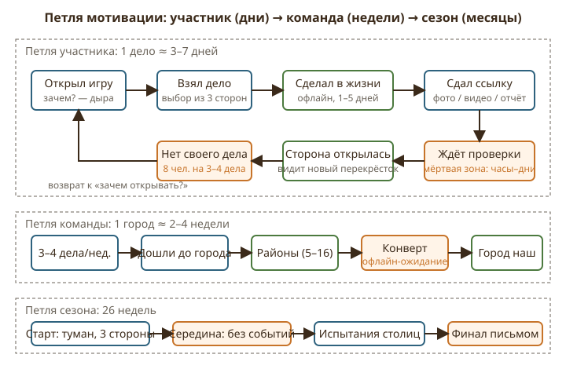
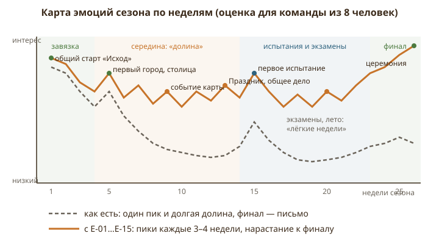
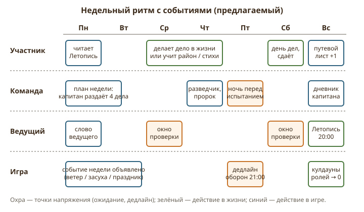
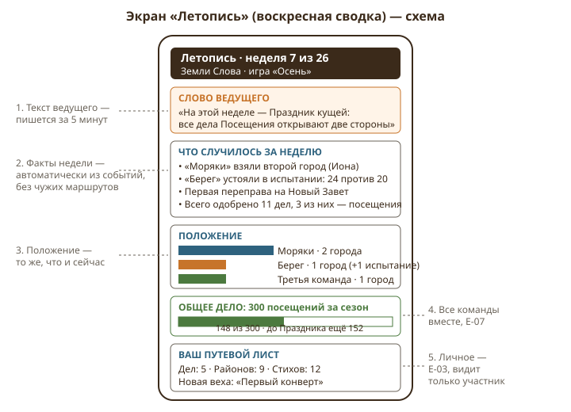

# Глава 4. Вовлечение, драматургия и ритм

Автор главы — дизайнер вовлечения и нарративный дизайнер (сезонные игры, ARG, квесты, школьные и молодёжные программы). Предмет главы — не правила и не контент, а то, **почему участник открывает игру во вторник вечером и почему перестаёт открывать её в ноябре**. Источники: `docs/LANDS_OF_THE_WORD.md` (§1, §2, §3, §13, Приложение Б), `content/deeds-default.json`, `apps/web/src/pages/HowToPlayPage.tsx`, `apps/web/src/content/changelog.ts`, а также код положения команд (`apps/api/src/services/game.ts`, `apps/web/src/pages/TeamPage.tsx`) и уведомлений (`apps/api/src/services/notify.ts`, `apps/api/src/routes/teamMap.ts`). Всё, что ниже названо «как есть», взято оттуда; где я не уверен — стоит «предположительно».

Расчётная модель для всей главы (из §3 и §2.3): 3 команды по 8 человек, сезон ≈ 180 дней ≈ 26 недель, команда делает 3–4 дела в неделю, 66 городов и ≈ 250 перекрёстков, стандартный набор — 21 дело.

---

## 1. Как есть

### 1.1 Петля участника, команды и сезона

**Участник.** Его единственный игровой цикл — дело: открыл карту → увидел 2–3 стороны с делами → «Взять дело» → сделал в жизни (посещение, уборка, пост, помощь на поле) → «Сдать» со ссылкой → ждёт проверки администратора → сторона окрасилась, открылся перекрёсток. Кроме дел участник может решать задания районов города (автопроверка, 2 попытки у выбора, пауза 20 секунд) и учить стихи в испытании (галочки по стихам, ссылка на видео). Уведомления участнику лично приходят только о возврате дела на доработку (`notifyUser` в `teamMap.ts`); **об одобрении обычного дела уведомления нет** — участник узнаёт об этом, открыв карту (исключение — морское дело). Команде целиком приходят: вызов на её город, старт ответа с дедлайном, итог испытания, запрос и ответ по проходу, потеря столицы, письмо о завершении игры. Есть веб-push (переключатель в меню команды).

**Команда.** Цикл в 2–4 недели: 3–4 дела в неделю → перекрёсток за перекрёстком → город → порядок районов → задания районов (у Руфи 16, у больших книг больше) → шифр → адресат конверта (офлайн) → ключ → город наш. Первый город — столица, автоматически. Затем либо новые дела по книге города (тематические), либо испытание чужого города: ставка ≥ 10 стихов, 14 дней на вызов, у хранителей ровно T на ответ, ничья за хранителями.

**Сезон.** Одна дата — срок окончания (`endsAt`), показывается фразой «Игра идёт до …» в меню команды. Между стартом и финалом никаких промежуточных вех, глав, недель, событий в игре нет. Единственный недельный ритм — кулдауны ролей: разведчик и пророк раз в неделю, смена ролей раз в неделю. Кулдаун отсчитывается от момента использования, а не от общего для всех дня недели (предположительно, судя по описанию «раз в неделю»).

**Финал.** Игра завершается сама (последняя столица или срок), либо вручную администратором. Всем уходит одно письмо; в меню команды появляется победитель и «Положение команд» со статистикой: города сейчас и столицы, города на пути (включая потерянные), одобренные дела, открытые перекрёстки, испытания выиграно/устояли/потеряли.

### 1.2 Что рядовой участник видит о себе и о других

О себе — ничего отдельного. Все числа в «Положении команд» командные: `deedsApproved`, `nodesRevealed`, `battlesWon` считаются по команде (`standings()` в `game.ts`). Личной страницы, личного счётчика, истории «мои дела» как раздела нет; свои дела участник видит в списке «наши дела» вперемешку с делами товарищей.

О других командах — **больше, чем задумано документом.** Экран «Положение команд» доступен участникам и в идущей игре: для каждой команды видны число городов, дел, перекрёстков, итоги испытаний и — что важно — **список названий городов на пути** (`citiesOnPath` уходит на клиент без фильтра по статусу игры, `TeamPage.tsx` выводит «Города: Руфь, Иона (потерян)»). Это расходится с §2.5 («команда не видит, занят ли город другой командой; выясняется только после работы над городом») и с таблицей §2.11. Для вовлечения это парадокс: игра раскрывает **стратегическую** информацию (какие города у кого), но не даёт **эмоциональной** — кто, когда, как; никакой ленты «на этой неделе „Берег“ устоял в испытании». Карту, позиции и туман других команд участник по-прежнему не видит.

### 1.3 Ритуалы и ведущий

Ритуалов в игре нет. Есть страница «Как играть?» (инструкция со скриншотами) и раздел «Что нового» — это журнал изменений разработчика, датированный по дням деплоя, а не игровой календарь. Общего старта как события нет: администратор нажимает «Стартовать», команды получают приглашения и карту. Еженедельных итогов нет.

Администратор по документу — контролёр: проверяет сдачи и видео, следит за положением команд, назначает города при необходимости, завершает игру. У него есть два инструмента «режиссёра», недоступные командам: ползунок времени по ходам (реплей всей игры) и «Чьими глазами». Инструмента *голоса* — объявления, обращения ко всем командам, запланированного события — у администратора нет; всё живое общение вынесено за пределы игры (чат молодёжи, собрание).

### 1.4 Что уже работает на драматургию

Честно отметим сильное. Туман и неизвестность («город или пустая развилка») — это правильная механика любопытства: каждое одобренное дело — маленькое открытие. Неизвестность занятости города — риск, который команда осознанно берёт. Потеря столицы = выбывание, руины, закрепление навсегда в суммарном режиме — это настоящие драматические ставки, редкие в церковных программах. Два острова и переправа — готовая «вторая глава» сезона. Испытание с ровным T и ничьёй за хранителями — хороший источник напряжения. Тайные дела и сюрпризы — готовый материал для тёплых историй. Всё это есть, но **не рассказано**: события происходят, а игра о них молчит.

---

## 2. Дыры и слабые места

### 2.1 Мёртвые периоды: три вида ожидания

**Ожидание проверки.** Каждая сдача дела, каждое видео испытания требует ручного одобрения администратором. Администратор получает письмо на каждую сдачу, но сроков проверки нет. Пример: участник «Моряков» в субботу помог на поле, вечером сдал фото; администратор проверяет в понедельник вечером. Двое суток участник открывает карту и видит то же самое: сторона серая, значок «на проверке». Три таких эпизода подряд — и он перестаёт открывать карту, ждёт, пока «скажут в чате». Уведомления об одобрении нет, значит, награда (новый перекрёсток) приходит без сигнала — самый дорогой момент петли пропадает.

**Ожидание в испытании.** Претенденты имеют до 14 дней на вызов; хранители — ровно T. При T = 9 дней команда «Берег» две недели живёт в режиме «мы учим стихи», а остальные семь человек «Моряков», не участвующие в видео, две недели не имеют игровых событий вообще. Хуже: в ожидании ответа претенденты ничего не могут сделать с этим городом, а результат приходит одним письмом.

**Отсутствие событий.** Если команда не у города и не в испытании, единственное, что происходит, — чьё-то дело одобрено. При 3–4 делах в неделю на 8 человек **каждый участник лично получает событие раз в 2–3 недели**. Между ними игра для него статична. Это главная дыра: 26 недель сезона, из них ощутимых «своих» моментов у рядового участника — 10–13.

### 2.2 Почему открывает и почему перестаёт

Открывает: (а) взял дело и хочет сдать; (б) капитан сказал в чате; (в) пришло письмо о вызове. Перестаёт: (а) его дело одобрили без сигнала, и «ничего не изменилось»; (б) три недели подряд дела берут другие — чувство «я тут лишний»; (в) команда отстала, «Положение команд» показывает 1 город против 4; (г) экзамены или лагерь — вернулся через месяц, а в игре не понять, что произошло, «Что нового» рассказывает про парусники, а не про то, что «Берег» потерял столицу.

Оценка кривой удержания для 24 человек без изменений: неделя 1–2 — открывают 20+ (новизна, туман, первые дела); неделя 4–5 — первый город, всплеск до 18; неделя 6–12 — 8–12 (в основном капитаны, летописцы и «делатели»); после первой потери столицы (если случится) — команда из 8 выбывает и делится по другим, 3–4 из них реально доходят; финал по сроку — открывают 6–10. Итог: **половина молодёжи выпадает из игры к середине**, хотя продолжает участвовать в проекте «Юность Иисусу».

### 2.3 Драматургия сезона: сильная завязка, плоская середина, случайная кульминация

Завязка есть: «неуютное место» (Египетский плен, Вавилонский плен), туман, три стороны. Но её никто не разыгрывает — команды получают ссылку и карту.

Середина плоская по конструкции: механик, которые «случаются» с командой извне, нет. Погода, сезон, праздник, общая беда — ничего. Даже переправа на Новый Завет — событие, но оно приходит без объявления и его видит только сама команда.

Кульминация не гарантирована: потеря столицы может случиться на 6-й неделе (и тогда 20 недель две команды) или никогда (и тогда финал — подсчёт городов по таймеру). В обоих случаях драматургия сезона зависит от случая, а не от дизайна. Финал — письмо и таблица. Для полугодового труда 24 подростков это ощущается как выключенный свет.

### 2.4 Ощущение прогресса у рядового участника

Капитан видит стратегию: маршрут, города, испытания. Пророк и разведчик раз в неделю нажимают «свою» кнопку. Летописец сдаёт. Остальные четыре человека из восьми — это «руки»: сделал дело, сдал, забыл. У них нет счётчика «моих» дел, нет истории «я был у вдовы в сентябре и у больного в октябре», нет вех, нет ничего, что они могли бы показать родителям или пастору в конце сезона. Между тем именно у этих четырёх — самая ценная для церкви часть игры: реальные дела. Игра фиксирует их только как «+1 к `deedsApproved` команды».

### 2.5 Эмоции победы и поражения

Победа в испытании — уведомление «Ответ одобрен: 24 стихов против 20». Никакого следа на карте, никакого «памятника». Потеря столицы — «команда выбывает из игры»: восемь подростков, которые полгода делали добрые дела, за один дедлайн получают статус «выбыла» и предписание «разделиться поровну между оставшимися». Механически это чисто, драматургически — жёстко: выбывшая команда не имеет **ни ритуала прощания, ни новой роли, ни памяти**. Победитель по сроку узнаёт об этом из письма — победа без сцены.

### 2.6 Слабые команды

При трёх командах разрыв возникает быстро: одна команда пришла к городу на 3-й неделе, другая — к 6-й (разница в 2–3 стороны по генератору плюс разная активность). К 10-й неделе счёт 3 : 1 : 1 виден всем в «Положении команд». Догоняющей механики нет; сильная команда естественно выбирает для испытания самую слабую столицу (уровень защиты меньше). Для слабой команды единственный сценарий — сдаться в ожидании вызова. У неё нет ни «манны», ни задачи, в которой она могла бы быть лучшей.

### 2.7 Публичность и реакции

Команды не видят друг друга и не могут друг другу ничего сказать внутри игры. Единственное взаимодействие — запрос прохода (текст сообщения) и испытание. Радость «Берега» за то, что «Моряки» переправились, не имеет канала. При этом текущий экран положения команд, как показано в 1.2, раскрывает список чужих городов — то есть игра одновременно и слишком закрыта (нет тёплой публичности), и слишком открыта (утечка стратегической информации).

### 2.8 Ведущий без микрофона

Полугодовую игру для подростков нельзя вести без ведущего. Сейчас всё «ведение» — вне игры. Это значит: правила и настроение сезона живут в чате и в голове администратора, новичок (или вернувшийся после лагеря) не может их восстановить, а сам администратор воспринимает себя как проверяющего, а не как рассказчика. Между тем у него уже есть всё для роли ведущего: полная карта, реплей, «чьими глазами». Не хватает трёх вещей: **голоса** (объявление всем), **календаря** (запланированное событие) и **сводки** (что было за неделю, собранное автоматически).

---

## 3. Предложения

Порядок — по приоритету для владельца: сначала то, что закрывает недельный ритм и личный прогресс (дёшево и сразу), затем события и коллективные цели, затем финал и v2.

### E-01. Воскресная «Летопись»

**Суть.** Раз в неделю, в воскресенье в фиксированный час, игра сама собирает сводку за неделю и показывает её всем участникам всех команд одним экраном; администратор добавляет к ней 2–3 строки «слова ведущего».
**Зачем.** Закрывает главную дыру — отсутствие событий и общего ритма (2.1, 2.3, 2.7). Даёт участнику причину открыть игру каждое воскресенье, даже если его дело не одобрено, и даёт вернувшемуся после лагеря способ понять, что случилось.
**Как работает.** Сводка строится из уже существующих данных: одобренные дела за неделю по командам и по направлениям (без описаний тайных дел), взятые города (только факт и книга — без раскрытия маршрута), переправы, испытания (вызов брошен / устояли / город перешёл), новые вехи участников (E-03), прогресс общего дела (E-07). Всё, что и так уходит уведомлениями команде, становится общим; **чужие маршруты, список чужих городов и уровни защиты в Летопись не попадают** — наоборот, из «Положения команд» в идущей игре надо убрать `citiesOnPath` (это чинит утечку из 1.2). Летопись хранится по неделям: «Неделя 7 из 26», листается назад. Уведомление одно на всех: «Летопись недели 7 готова». Администратор до 20:00 воскресенья заполняет поле «Слово ведущего» (до 300 знаков) и, при желании, отмечает «Событие недели» (E-06). Если он ничего не написал — Летопись выходит без слова, но выходит.
Сценарий: неделя 7. «Моряки» за неделю сдали 4 дела (два посещения, уборка, пост), взяли Иону; «Берег» устояли в испытании 24 стиха против 20. В 20:00 всем 24 участникам приходит «Летопись недели 7»: три строки фактов, «Положение» без названий городов, слово ведущего: «На этой неделе — Праздник кущей, дела Посещения открывают две стороны». Участник «Берега», который не учил стихи, впервые за две недели видит, что его команда — не «отстающая», а «устоявшая».
**Риски и ограничения.** Летопись может стать ещё одним экраном, который не читают: спасает единый час выхода и уведомление. Опасность утечки: строгий белый список полей. Администратор забывает писать — сводка выходит автоматически.
**Сложность:** M · **Влияние:** 5 · **Этап:** сейчас

### E-02. Календарь сезона и общие таймеры

**Суть.** Сезон делится на пронумерованные недели с общим днём начала (понедельник) и видимым обратным счётом; все дедлайны игры привязаны к календарю и показаны одним экраном.
**Зачем.** Сейчас у команды одна дата — конец игры. Недели ролей отсчитываются от случайного момента. Ощущение времени («мы в середине», «осталось три недели») отсутствует, а без него нет ни планирования, ни напряжения к финалу (2.3).
**Как работает.** При старте администратор задаёт день и час недельной смены (по умолчанию воскресенье 20:00 — момент выхода Летописи). От него считаются: номер недели (1…26), кулдауны ролей (разведчик, пророк, смена ролей сбрасываются одновременно у всех в этот час, а не «через 7 дней после нажатия»), недельное событие (E-06). Экран «Календарь» в меню команды показывает: текущая неделя и сколько осталось; таймеры своих испытаний (вызов — до какого дня, ответ — до какого часа); дедлайны запросов прохода (3 дня); срок окончания игры; ближайшая Летопись. На карте — небольшая полоска «Неделя 7 · до Летописи 2 дня».
Сценарий: «Моряки» бросили вызов в среду 4-й недели; в календаре у них появляется «Вызов на Иону: до среды 6-й недели», у «Берега» после одобрения — «Ответ: до пятницы 21:00». Капитан «Берега» в воскресенье видит, что кулдаун пророка сброшен, и в понедельник открывает подсказку к самому трудному району.
**Риски и ограничения.** Синхронный сброс кулдаунов даёт по одному «бесплатному» использованию в первую неделю — незначительно. Часовой пояс — один на игру, задаёт администратор.
**Сложность:** S · **Влияние:** 4 · **Этап:** сейчас

### E-03. «Путевой лист» участника

**Суть.** Личная страница участника: его дела, районы, стихи, переправы — с вехами и историей по неделям. Видит только он сам и администратор.
**Зачем.** Закрывает 2.4: рядовой участник получает свой прогресс, независимый от капитана и от счёта команды. Это то, что он покажет в конце сезона родителям, и то, за чем он открывает игру, когда ничего командного не происходит.
**Как работает.** Счётчики: дел одобрено (по направлениям Приложения Б), районов решено, стихов рассказано (сумма по испытаниям), дней труда, переправ, в которых он делал морское дело. История: лента «неделя 3 — Продукты одинокой вдове; неделя 5 — район „Вооз на гумне“…» (тайные дела показываются как «тайное дело» без деталей). Вехи (без баллов и валюты, только памятные знаки): «Первое дело», «Первый конверт» (участник ходил к адресату), «Пять посещений», «Десять стихов», «Первая переправа», «Все семь направлений» (сделал хотя бы одно дело каждого направления), «Устоял» (участвовал в успешном ответе). Всего 12–15 вех на сезон, чтобы средний участник получал новую каждые 2–3 недели. Веха недели попадает в Летопись строкой «3 участника получили „Пять посещений“» — без никнеймов, если участник не разрешил.
Сценарий: участник «Моряков» за 7 недель сделал 5 дел (3 посещения, помощь на поле, уборка), решил 9 районов Руфи и Ионы, рассказал 12 стихов. В воскресенье получает веху «Первый конверт» — именно он ходил к адресату с шифром. В понедельник открывает игру просто посмотреть свой лист. К концу сезона у него 13 дел, 28 районов, 40 стихов и 9 вех — это его личный итог проекта «Юность Иисусу».
**Риски и ограничения.** Соревнование внутри команды «у кого больше дел» — смягчаем тем, что лист приватен, а в Летописи только агрегаты. Не вводить общий рейтинг участников.
**Сложность:** M · **Влияние:** 5 · **Этап:** сейчас

### E-04. Лента «Что случилось» и уведомление об одобрении

**Суть.** В меню команды — лента событий своей команды по времени; участнику приходит уведомление, когда его дело одобрено; уведомление о взятом городе — всей команде.
**Зачем.** Закрывает «награду без сигнала» (2.1): самый ценный момент петли — открытие перекрёстка — сейчас происходит молча. Лента даёт вернувшемуся участнику контекст без чтения чата.
**Как работает.** События уже публикуются через SSE (`services/events.ts`) для обновления карты; их же можно писать в таблицу событий команды: дело взято / сдано / одобрено / возвращено (с никнеймом), перекрёсток открыт (город или развилка), район решён, город взят, столица назначена или перенесена, вызов / ответ / итог, переправа, проход запрошен / разрешён. Лента — последние 50 событий, группировка по дням. Уведомления добавить два: «Ваше дело „…“ одобрено — открылся перекрёсток» (лично, тот же канал, что и возврат) и «Город … наш» (команде).
Сценарий: участник «Берега» сдал в субботу фото с уборки дома молитвы. В понедельник в 19:40 — push «Дело одобрено: открылся перекрёсток». Он открывает карту в ту же минуту и видит новую развилку и три новые стороны. В ленте команды: «Пн 19:40 — участник открыл перекрёсток за „Уборкой в доме молитвы“».
**Риски и ограничения.** Шум: лента только своей команды, уведомления только о личных и городских событиях. Тайные дела в ленте — «тайное дело сдано / одобрено», без адресата.
**Сложность:** M · **Влияние:** 4 · **Этап:** сейчас

### E-05. Ритуал общего старта: «Исход» — первые 72 часа

**Суть.** Старт игры оформляется как общее событие с единым моментом открытия карты и стартовой задачей на трое суток для всех команд.
**Зачем.** Завязка сейчас есть на карте, но не в жизни (2.3). Общий старт задаёт норму «мы играем вместе» и гарантирует, что каждый участник сделает первое действие в первые дни, а не «когда-нибудь».
**Как работает.** Администратор назначает час старта (обычно после молодёжного собрания). До этого часа команды видят только свою стартовую точку с названием плена и текстом-легендой (2–3 предложения на каждый плен: «Вы — в Вавилоне. Семьдесят лет прошло…»), стороны закрыты. В назначенный час карта открывается у всех одновременно (уведомление всем). Стартовая задача «Исход»: за 72 часа каждый участник команды берёт хотя бы одно дело (не обязательно сдать). Команда, у которой все 8 взяли дела, получает в Летописи 1-й недели строку «Вышли полным составом» и памятное место на старте (E-13). Никаких игровых преимуществ — только запись и ощущение «все вышли». Администратор в это же собрание проводит «слово ведущего» вживую: показывает карту на экране в общем виде (без тумана других команд не бывает — показывает свой обзор без подписей команд).
Сценарий: старт — воскресенье 19:00. У «Моряков» к среде дела взяли все 8, у «Берега» — 6 из 8: капитан в четверг лично звонит двоим. В Летописи 1-й недели: «„Моряки“ вышли полным составом; в игре взято 19 дел, сдано 7».
**Риски и ограничения.** Кто-то физически не может в первые 3 дня — засчитывается взятие, а не сдача. Не превращать в штраф для не успевших.
**Сложность:** S · **Влияние:** 4 · **Этап:** сейчас

### E-06. События карты: ветер, засуха, праздник

**Суть.** Раз в 3–4 недели администратор объявляет недельное событие из фиксированного набора; событие на одну неделю меняет одно правило для всех команд одинаково.
**Зачем.** Единственный способ сделать середину сезона живой без нового контента: правила «дышат», команды строят план недели вокруг события (2.3, 2.1).
**Как работает.** Набор из 6 событий, все — общие для всех команд, ни одно не отнимает и не наказывает:
1. **Попутный ветер** — морские дела и корабли: переправа в эту неделю открывает не один, а два береговых узла на выбор капитана.
2. **Праздник кущей** — дела направления «Посещение» в эту неделю открывают сторону и дают команде одну дополнительную попытку в задании с выбором (снимается одна суточная блокировка).
3. **Засуха** — не наказание, а вызов: в эту неделю дела сложности 3 (стройка, посещение тружеников в других городах, приведённый друг) считаются за две стороны — вторую капитан выбирает из уже видимых.
4. **Юбилейный год** — одна неделя, когда команда может один раз попросить проход через чужой город без сделки: владелец всё равно отвечает, но молчание считается согласием, а не отказом.
5. **Сбор урожая** — дела «Помощь на поле» и «Помочь на стройке» доступны всем участникам параллельно на одной стороне (сторона открывается по первой сдаче, остальные сдачи идут в путевой лист и в общее дело).
6. **Субботний покой** — неделя без новых вызовов: испытания нельзя объявлять, идущие продолжаются. Ставится перед экзаменами или лагерем.
Администратор выбирает событие в воскресенье до Летописи; правило действует с понедельника по воскресенье 20:00 и снимается само. Рекомендуемый календарь: недели 3, 7, 11, 15, 19, 23; «Субботний покой» — под экзамены.
Сценарий (неделя 7, Праздник кущей): «Моряки» переносят два посещения с 9-й недели на 7-ю и снимают блокировку с района, где дважды ошиблись; «Берег», у которых нет активного города, делают три посещения и открывают три перекрёстка — лучшая их неделя за сезон.
**Риски и ограничения.** Каждое событие — параметр правил; §2.9 уже допускает изменение параметров по ходу. Чтобы не плодить исключений в коде битв, события 1–3 и 5 касаются только дел и городов, 6 — только объявления вызова. Не более одного события в неделю.
**Сложность:** L · **Влияние:** 4 · **Этап:** следующий сезон

### E-07. Общее дело всех команд

**Суть.** На весь сезон объявляется одна коллективная цель для всех команд вместе (например, 300 посещений), с общим прогрессом в Летописи; достижение отмечается общим праздником, а не наградой одной команде.
**Зачем.** Соревнование трёх команд неизбежно рождает разрыв (2.6); общая цель даёт слабой команде вклад, который считается наравне, и напоминает, ради чего игра существует (§1: дела, а не «прохождение проекта»).
**Как работает.** Администратор при старте выбирает цель из шаблонов или задаёт свою: N дел направления (по умолчанию — Посещение, 300 за сезон при 3 командах по 8: это ≈ 12 посещений на человека, или одно в две недели), либо N дней труда, либо N стихов, рассказанных в испытаниях всеми командами. Прогресс общий, без разбивки по командам в публичной части (вклад команды видит только сама команда и администратор — иначе снова рейтинг). Промежуточные отметки: 25 %, 50 %, 75 % — каждая отмечается в Летописи и на карте (E-13). Достижение цели — общее событие: администратор объявляет «Праздник» (E-06, п. 2) на ближайшую неделю для всех и вживую отмечает на собрании.
Сценарий: неделя 7, 148 из 300. «Берег» отстают по городам (1 против 2), но по посещениям сделали 61 из 148 — в своей команде они видят «мы принесли 41 % общего дела». На 19-й неделе цель закрыта; Летопись выходит с общим списком направлений, где участники были, и администратор объявляет Праздник кущей на 20-ю неделю.
**Риски и ограничения.** Цель должна быть достижима на 70–80 % активности, иначе демотивирует: лучше 240 и перевыполнение, чем 400 и провал. Нельзя заменять пожертвованием (уже правило для районов — распространить на общее дело).
**Сложность:** M · **Влияние:** 5 · **Этап:** следующий сезон

### E-08. «Ночь перед испытанием»

**Суть.** Дедлайн ответа хранителей округляется до ближайшей пятницы 21:00 (не раньше расчётного T), а последние 24 часа перед ним оформляются как событие для обеих команд.
**Зачем.** Испытание — самая напряжённая механика игры, но сейчас оно растворено в календаре: дедлайн случайный, семь человек из восьми не вовлечены (2.1, 2.5). Общий час превращает оборону в событие, к которому готовятся, и о котором знают все.
**Как работает.** Правило T не меняется: срок ответа = момент одобрения вызова + T, затем сдвиг вперёд до ближайшей пятницы 21:00 (хранители никогда не получают меньше T; в среднем получают на 2–3 дня больше — это осознанная цена ритуала). За 24 часа до срока обеим командам приходит «Ночь перед испытанием: до ответа сутки». В эти сутки: у хранителей экран испытания показывает набранную сумму крупно («18 из 20»); участники команды, не учащие стихи, могут отправить «слово ободрения» (E-09) своим; претенденты видят только «хранители отвечают», без чисел. В 21:00 итог приходит одновременно всем участникам обеих команд и попадает в Летопись в воскресенье. Администратор проверяет видео в субботу — окно проверки в календаре (E-02).
Сценарий: «Моряки» бросили вызов Ионе «Берега» на 20 стихов, T = 6 дней, срок — четверг 15:10, сдвигается на пятницу 21:00. В четверг вечером у «Берега» 14 из 20; двое, кто не учил, записывают по 3 стиха в пятницу днём. 20:30 — 24 из 20 отправлено. 21:00 — все 16 человек получают «Хранители устояли: 24 против 20».
**Риски и ограничения.** Сдвиг дедлайна вперёд слегка выгоден хранителям — допустимо, ничья и так за ними. Пятница может быть неудобна для конкретной церкви — день и час задаёт администратор.
**Сложность:** M · **Влияние:** 4 · **Этап:** следующий сезон

### E-09. Реакции команд друг на друга: «благословения»

**Суть.** Единственный канал общения между командами — набор готовых доброжелательных реплик и стихов, без свободного текста; отправляется команде по событию.
**Зачем.** Радость за других и поддержка соперника — то, чему игра для церковной молодёжи должна учить; сейчас канала нет (2.7). Свободный чат между командами — риск подколов и утечек маршрутов; фиксированный набор решает обе проблемы.
**Как работает.** Когда в Летописи или ленте появляется чужое событие (город взят, устояли, переправа, вехи), любой участник может нажать «Благословить» и выбрать одну из 8–10 реплик: «Радуемся с вами», «Крепко стояли!», «Доброго пути на Новый Завет», стих (Синодальный, из фиксированного списка: например, «Радуйтесь с радующимися» — Рим. 12:15; «Носите бремена друг друга» — Гал. 6:2). Получатель видит: «„Берег“ благословили вас: 5 участников — „Радуемся с вами“». Никаких ответов, никакого свободного текста, никаких реакций на потерю города, кроме одной реплики — «Мы с вами» (вторая половина Рим. 12:15: «плачьте с плачущими»). Счётчик отправленных благословений — веха в путевом листе («Доброжелатель»: 10 благословений за сезон).
Сценарий: неделя 9, «Моряки» переправились на Новый Завет. В понедельник 6 участников «Берега» нажимают «Доброго пути». В ленте «Моряков»: «„Берег“ пожелали вам доброго пути (6)». В 14-й неделе «Берег» теряют город — из «Моряков» четверо отправляют «Мы с вами».
**Риски и ограничения.** Формальность («нажали и забыли») — допустимо, это всё равно лучше молчания. Список реплик утверждает служитель-советник.
**Сложность:** S · **Влияние:** 3 · **Этап:** следующий сезон

### E-10. Финальная церемония и «Книга сезона»

**Суть.** Завершение игры — двухчастное: «последняя неделя» с обратным счётом и объявленной программой, затем итоговая страница «Книга сезона» для показа на общем собрании.
**Зачем.** Сейчас финал — письмо и таблица (2.3, 2.5). Полугодовой сезон заслуживает сцены, и она же — лучшая реклама следующего сезона.
**Как работает.** За 7 дней до срока игра переключается в «последнюю неделю»: новые вызовы не объявляются (как «Субботний покой»), идущие завершаются по своим срокам, дела принимаются до последнего дня; всем приходит «Последняя неделя: закрываем пути». В день окончания игра, как и сейчас, определяет победителя, но вместо одного письма формирует «Книгу сезона» — страницу для проектора: итог по командам (города, столицы, испытания); общее дело (E-07) целиком; **сводка дел по направлениям на всю игру** («вместе: 212 посещений, 48 дней труда, 31 приведённый друг, 1 340 стихов наизусть») — это главная цифра для церкви; реплей карты (ползунок из панели администратора) в режиме «вся карта без тумана» — впервые команды видят чужие маршруты; памятные места (E-13); список вех участников без никнеймов, если не разрешили. Администратор ведёт церемонию по этой странице; участники после неё получают доступ к своему путевому листу «навсегда» (экспорт в PDF).
Сценарий: срок — воскресенье 26-й недели. В понедельник 25-й недели всем: «Последняя неделя». «Моряки» лидируют 9 : 7 : 5 городов; «Берег» тратят неделю на два района и берут восьмой город в субботу. На собрании ведущий открывает реплей: 26 недель за 3 минуты, зал видит, как три цвета расползаются по островам и где пересеклись. Затем — сводка дел, и последним — победитель.
**Риски и ограничения.** Реплей без тумана после финала — это раскрытие всего; допустимо, потому что следующая игра генерируется заново. Церемонию не подменять экраном: экран — материал для ведущего.
**Сложность:** M · **Влияние:** 5 · **Этап:** сейчас

### E-11. «Манна» для отстающих

**Суть.** Догоняющая механика без подарков: команде, отстающей от лидера на 3 и более города в течение двух Летописей подряд, игра открывает дополнительную возможность, которую надо отработать делами.
**Зачем.** Слабая команда без перспективы перестаёт играть, и игра для трёх команд превращается в игру для двух (2.6). Догонять надо делами, а не скидками — иначе несправедливо к лидеру.
**Как работает.** Условие проверяется в воскресенье при сборке Летописи. Если выполнено, команде на следующую неделю даётся один из вариантов (капитан выбирает): (а) **«Манна»** — один раз в неделю дело сложности 1 открывает две стороны из перекрёстка (вторую — капитан выбирает); (б) **«Столп облачный»** — разведчик может заглянуть за три стороны вместо одной; (в) **«Тень крыла»** — в течение недели её столицу нельзя испытывать (защита слабейшей столицы от «добивания»). Механика действует, пока отставание ≥ 3; снимается сама. Публично не объявляется (в Летописи нет), чтобы не клеймить; команда видит у себя «Неделя манны». Максимум 6 недель за сезон на команду.
Сценарий: неделя 10, счёт 4 : 3 : 1. «Берег» получают «Манну»: в понедельник капитан раздаёт три дела сложности 1 (молитвенный час, посетить больного, разложить сборники) — открываются 4 стороны за неделю вместо 2; к 12-й неделе они у второго города, отставание 2 — манна снята.
**Риски и ограничения.** Стратегическое «отставание нарочно» — не выгодно: 3 города отставания стоят дороже двух лишних сторон в неделю. Прозрачность правила — описать в «Как играть?». Вариант (в) применять только к столице, не ко всем городам.
**Сложность:** L · **Влияние:** 4 · **Этап:** следующий сезон

### E-12. Дневник капитана

**Суть.** Раз в неделю капитану приходит три вопроса; ответы — короткая запись в дневнике команды, которую видит команда (и администратор), а строка «план на неделю» попадает в ленту.
**Зачем.** Капитан — единственный носитель стратегии; команда часто не знает, «куда мы идём и зачем это дело». Дневник делает план видимым и даёт капитану ритуал лидерства, а администратору — ранний сигнал, что команда затухает (2.4, 2.8).
**Как работает.** В воскресенье после Летописи капитан получает форму из трёх полей (каждое до 200 знаков): «Куда идём на этой неделе» (выбор перекрёстка/города на карте + текст), «Кому что поручаю» (список участников — галочки; те, кто не отмечен три недели подряд, подсвечиваются капитану как «давно без дела»), «За что благодарим» (свободный текст: пример «за бабушку, которая накормила нас, когда мы принесли ей продукты»). Первое поле уходит в ленту команды как «План недели». Если капитан не заполнил дневник две недели подряд, администратор видит это в обзоре как признак «команда без руля» и связывается с ним вживую.
Сценарий: неделя 5. Капитан «Моряков» пишет: «Идём к городу на северо-востоке, два дела на путь и все — на районы Ионы; поручаю посещение двоим, кто ещё не делал; благодарим за первый конверт». В понедельник восемь человек видят план и знают, зачем именно это дело.
**Риски и ограничения.** Нагрузка на капитана — 5 минут в неделю; поля необязательны. Не публиковать дневник другим командам.
**Сложность:** S · **Влияние:** 3 · **Этап:** следующий сезон

### E-13. Памятные места на карте

**Суть.** Значимые события команды оставляют на её карте постоянные метки — «жертвенники», как Авраам и Иаков ставили памятники на месте встречи с Богом (Быт. 12:7; 28:18).
**Зачем.** Победы и переломы сейчас не оставляют следа (2.5). Метки делают карту историей команды, а не только сеткой, и дают повод открыть игру «просто посмотреть».
**Как работает.** Метки ставит игра автоматически: «Исход» на старте (если вышли полным составом, E-05), «Первый город», «Столица» (и «Перенос столицы»), «Устояли» на городе после отражённого испытания (с числом стихов), «Переправа» на месте высадки, «Отметка общего дела» — 25/50/75/100 % (появляется у всех команд на их стартах), «Здесь пересеклись» — на стороне, окрашенной двумя цветами (команда её и так видит). Нажатие на метку открывает короткий текст: дата, неделя, кто участвовал (никнеймы своих), стих-надпись (капитан выбирает из 5 предложенных к событию, например для «Устояли» — «Господь — твердыня моя и прибежище мое», Пс. 17:3). Метки видны только своей команде; после финала — всем в «Книге сезона» (E-10). Никаких игровых эффектов.
Сценарий: у «Берега» к 12-й неделе на карте пять меток: Исход, Первый город (Руфь), Столица, Устояли (24 против 20), Переправа. Участник, вернувшийся из лагеря, за минуту читает историю команды по меткам.
**Риски и ограничения.** Захламление карты при 15+ метках — группировать при отдалении. Для потерянного города метка «Устояли» остаётся в истории, но с карты снимается.
**Сложность:** M · **Влияние:** 3 · **Этап:** v2

### E-14. «Остаток»: второе дыхание после потери столицы

**Суть.** Выбывшая команда не распускается механически, а на две недели становится «Остатком» с собственной задачей, после чего участники входят в другие команды с сохранённым путевым листом и записью в Летописи.
**Зачем.** Правило «поделиться поровну» — верное, но восемь подростков заслуживают прощания и роли (2.5). Правильно оформленное поражение удерживает их в игре; необработанное — теряет половину.
**Как работает.** Правила §2.9 не меняются: столица потеряна, города — руины, команда выбыла. Добавляется двухнедельная фаза «Остаток»: команда сохраняет доступ к карте (только просмотр), ей открывается одна коллективная задача — «Плач и восстановление»: за 14 дней сделать вместе N дел (по умолчанию 8 — по одному на человека) любого направления; дела идут в общее дело (E-07) и в путевые листы, стороны не открывают. Если задача выполнена — в Летописи строка «„Берег“ прошли путь Остатка: 8 дел за 14 дней» и памятная метка на их старте (видна всем в Книге сезона). Затем распределение по командам, как в правилах, но с двумя добавлениями: участник берёт с собой путевой лист (счётчики и вехи не обнуляются), а принимающая команда видит в ленте «К нам присоединились двое из „Берега“». Администратор в момент потери столицы получает подсказку-чеклист: «поговорить с капитаном сегодня; объявить Остаток; на собрании — слово о команде».
Сценарий: неделя 14, «Берег» не успели ответить на 30 стихов, столица потеряна. В тот же вечер капитан получает письмо не «команда выбывает», а «Столица потеряна. У вас 14 дней Остатка». Команда делает 9 дел; в Летописи 16-й недели — их строка и стих, выбранный капитаном (Плач 3:22–23). С 17-й недели по четверо входят в «Моряки» и в третью команду с вехами и счётчиками.
**Риски и ограничения.** Продлевает присутствие «мёртвой» команды на 2 недели — но она не влияет на карту. Не давать ей преимуществ при вступлении в новые команды.
**Сложность:** L · **Влияние:** 4 · **Этап:** v2

### E-15. Администратор как ведущий: «Слово ведущего» и недельный чеклист

**Суть.** Администратору даётся голос (объявление всем командам), календарь событий и недельный чеклист ведущего в обзоре игры.
**Зачем.** Все остальные предложения главы держатся на человеке, который ведёт сезон; сейчас у него нет ни инструмента, ни рамки (2.8). Это самое дешёвое из предложений и условие для E-01, E-05, E-06, E-10.
**Как работает.** В «Обзоре» появляется карточка «Ведущий»: (1) «Объявление» — текст до 500 знаков, уходит всем участникам уведомлением и в ленту каждой команды, хранится в Летописи; не чаще одного в день; (2) «Слово ведущего» для ближайшей Летописи (E-01); (3) «Событие недели» — выбор из набора E-06 с превью правила; (4) чеклист недели с флажками: «Проверка сдач — среда и суббота» (в обзоре: сколько сдач ждут и сколько часов самой старой; цель — не дольше 48 часов), «Слово ведущего написано», «Событие выбрано», «Дневники капитанов прочитаны» (E-12), «Команда без дел 7+ дней» (подсветка команды, где за неделю ни одной сдачи, — повод позвонить капитану). Чеклист сбрасывается в воскресенье вместе с Летописью. Отдельно — «Речь на старте» и «Речь на финале» как черновики с автоподстановкой цифр из игры.
Сценарий: среда 7-й недели. Администратор открывает обзор: 6 сдач ждут, самая старая — 31 час; проверяет за 20 минут. Пишет объявление: «В субботу — общая уборка дома молитвы, дело „Уборка“ засчитывается всем, кто придёт» (по правилу события «Сбор урожая», E-06). В воскресенье вечером — три строки слова ведущего, событие «Праздник кущей» на следующую неделю, флажки закрыты.
**Риски и ограничения.** Объявления не должны подменять правила: они — голос, а не механика; изменения правил только через события и настройки. Второй и третий администраторы получают тот же инструмент — согласовывать «слово» между ними вне игры.
**Сложность:** S · **Влияние:** 4 · **Этап:** сейчас

---

## 4. Сводка и порядок внедрения

| ID | Название | Сложность | Влияние | Этап |
|---|---|---|---|---|
| E-01 | Воскресная «Летопись» | M | 5 | сейчас |
| E-02 | Календарь сезона и общие таймеры | S | 4 | сейчас |
| E-03 | «Путевой лист» участника | M | 5 | сейчас |
| E-04 | Лента «Что случилось» и уведомление об одобрении | M | 4 | сейчас |
| E-05 | Ритуал общего старта «Исход» | S | 4 | сейчас |
| E-06 | События карты: ветер, засуха, праздник | L | 4 | следующий сезон |
| E-07 | Общее дело всех команд | M | 5 | следующий сезон |
| E-08 | «Ночь перед испытанием» | M | 4 | следующий сезон |
| E-09 | Реакции команд: «благословения» | S | 3 | следующий сезон |
| E-10 | Финальная церемония и «Книга сезона» | M | 5 | сейчас |
| E-11 | «Манна» для отстающих | L | 4 | следующий сезон |
| E-12 | Дневник капитана | S | 3 | следующий сезон |
| E-13 | Памятные места на карте | M | 3 | v2 |
| E-14 | «Остаток» после потери столицы | L | 4 | v2 |
| E-15 | Администратор как ведущий | S | 4 | сейчас |

Минимальный пакет на текущий сезон — E-15 → E-02 → E-04 → E-01 → E-03 → E-05 → E-10: он не трогает правила битв и городов, строится на уже существующих данных (события SSE, `standings`, уведомления) и превращает 26 недель «тихой» игры в 26 воскресений с общим событием. Ожидаемый эффект по модели из 2.2: удержание к середине сезона с 8–12 активных до 16–18 из 24, и у каждого участника — личный итог, который он унесёт из игры. Одновременно закрывается утечка списка чужих городов из «Положения команд» в идущей игре (1.2) — это правка в одну строку фильтра `citiesOnPath` по статусу игры.

Что не предлагается сознательно: очки, валюта, ежедневные «стрики», рейтинги участников, свободный чат между командами, любые наказания за неактивность. Всё это работает в коммерческих играх и всё это противоречит цели §1 — чтобы молодёжь делала настоящие дела с интересом, а не «фармила» игру.
