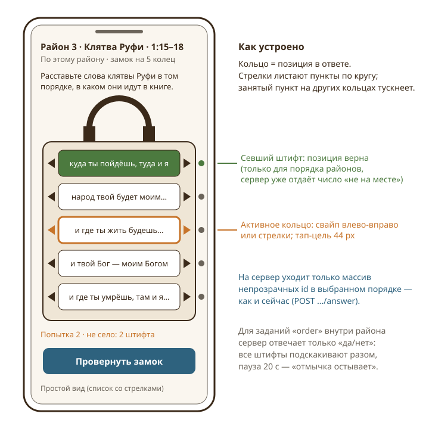
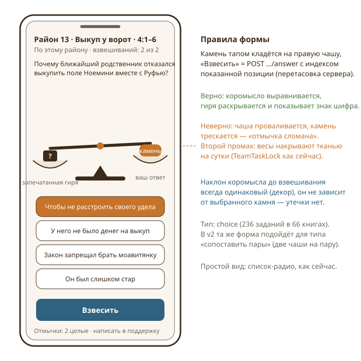
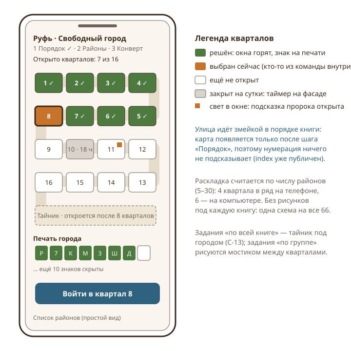
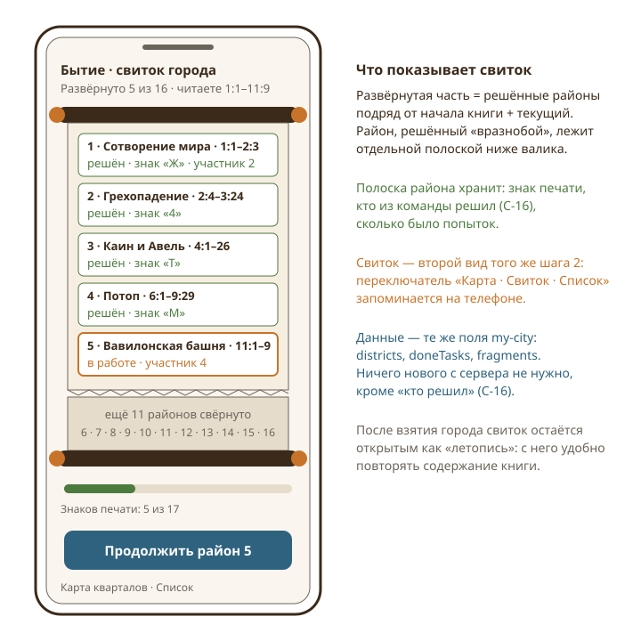
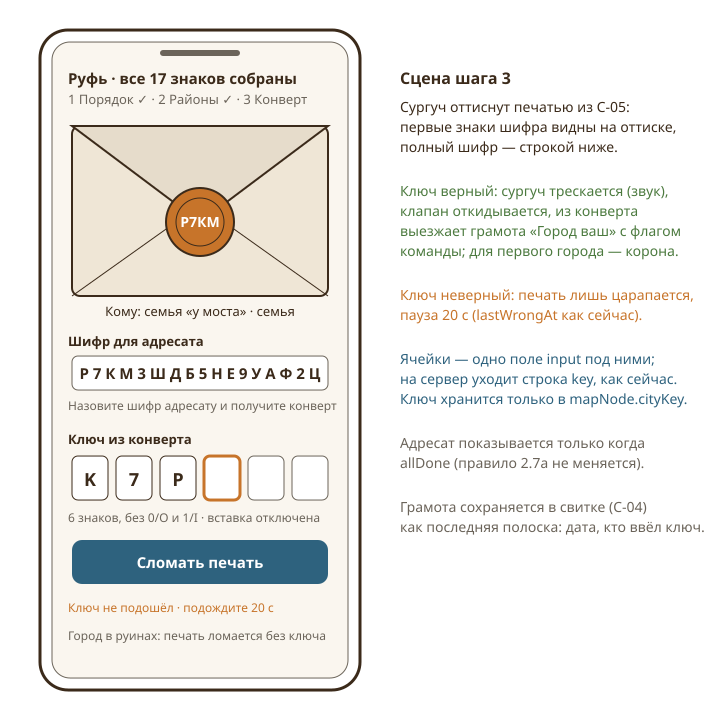

# Глава 5. Мини-фишки для заданий городов

Автор главы — дизайнер головоломок и интерактивных механик (escape-rooms, квесты, обучающие игры). Предмет — **форма подачи** заданий в попапе города: как те же 871 задание в 66 книгах могут ощущаться как взлом замка, взвешивание, сборка печати, а не как анкета. Содержание заданий, типы ответов и серверная проверка не меняются: все предложения — слой представления поверх существующего API, плюс несколько маленьких серверных дополнений, каждое из которых отдельно оговорено.

## 1. Как есть

**Контент.** 66 файлов `content/cities/<книга>.json`, суммарно 871 задание. По типам: `text` — 332, `choice` — 236, `order` — 143, `number` — 160. По охвату: `district` — 669, `group` — 114, `book` — 88. Районов у книги 5–30 (у Руфи, Бытия и Псалтири — по 16), заданий на книгу 6–19. Ответы (`answers`, `answer`, `correct`, порядок `items`) лежат только в файле; сервер читает файл с диска и кэширует (`apps/api/src/services/cities.ts`).

**Что уходит на клиент.** `GET /api/games/:id/my-city/:nodeKey` отдаёт районы, задания без ответов и состояние команды. Защита от чтения ответа из ответа сервера устроена так:

- id районов и пунктов `order` — HMAC от секрета игры, ключа команды-города и индекса (`opaqueId`), первые 10 символов base64url; по id восстановить позицию нельзя;
- порядок районов и пунктов перетасован детерминированно (`seededShuffle`) — стабилен при перезагрузке, но у каждой команды свой;
- варианты `choice` перетасованы по `choicePermutation(secret, scopeKey, index)`, на сервер уходит **показанная** позиция, сервер сам переводит её в исходную;
- задания вообще не отдаются, пока не собран порядок районов (`tasks: solved ? … : []`);
- знаки шифра (`fragments`) приходят только за решённые задания; шифр (`cityCode`) и ключ конверта (`cityKey`) хранятся в `MapNode` и генерируются на игру.

**Проверка.** `POST …/order` возвращает `wrong` — число районов не на месте (это единственное «градуированное» сообщение об ошибке в системе). `POST …/tasks/:index/answer` возвращает только `correct: true/false`, знак шифра при верном ответе, `retryAt` при неверном. `number` сравнивается как число, `text` — через `normalizeAnswer` (регистр, ё/е, пунктуация не важны), `choice` — через перестановку, `order` — по совпадению массива id.

**Ограничения попыток.** После любого неверного ответа команда ждёт 20 секунд (`WRONG_COOLDOWN_MS`, поле `lastWrongAt` общее на город, а не на задание). Для `choice` — две попытки (`CHOICE_ATTEMPTS`), после второй задание закрывается на сутки (`TeamTaskLock.lockedUntil`). Снять блокировку может только суперадмин по обращению в поддержку; обращение хранит снимок состояния без ответов (`SupportRequest.context`).

**Подсказка пророка.** `POST …/hint` — раз в неделю на команду (`team.lastHintAt`), только после сборки порядка; открывает текст стихов района (не более 60 стихов, `HINT_MAX`), и только для заданий, у которых есть район с диапазоном.

**Экран.** `CityPopup.tsx`: шапка с иллюстрацией города, индикатор «1 Порядок · 2 Районы · 3 Конверт», тело шага. Шаг 1 — `SortableList` (ручка для перетаскивания + стрелки), кнопка «Проверить порядок», строка «Не на месте: N · попытка K». Шаг 2 — список районов с номером, названием, стихами, пересказом и галочкой; ниже отдельный список «Задания по всей книге»; блок «Шифр города» — ряд ячеек, заполненных по мере решения. Задание — отдельный экран `TaskView`: заголовок «Район 3 · Клятва Руфи · 1:15–18», охват, текст (без выделения и копирования), счётчик «Попытка 1 из 2» для `choice`, поле ответа (число / текст / радио-список / `SortableList`), кнопка «Ответить», «Написать в поддержку», «Подсказка пророка · раз в неделю». Шаг 3 — адресат, поле «Ключ из конверта» (до 12 знаков, верхний регистр), «Взять город»; для руин — «Занять руины» без ключа. Уведомления — тосты («Верно. Знак шифра: Р», «Неверно. Перечитайте это место в книге»).

**Дизайн-канон** (`docs/design/DESIGN.md`): без эмодзи и глифов, только компонент `Icon`; тап-цель не меньше 44 px; словарь: задание/район, шифр → ключ, адресат, «взять город»; один интерфейс на телефон и компьютер.

## 2. Дыры и слабые места

**2.1. Три типа ответа выглядят одинаково — как форма.** Число, слово и выбор — это одно и то же поле с одной и той же кнопкой «Ответить». Единственная «игровая» механика на экране — `SortableList`, но она визуально такая же, как список районов. Пример: команда «Моряки» за вечер решает семь районов Руфи, и все семь ощущаются как тест. Мотивация читать книгу «вдоль и поперёк» (§2.6) держится на содержании, а форма её не поддерживает. Для подростков это критично: escape-room с теми же загадками, но без замков и ящиков, — это викторина.

**2.2. Обратная связь плоская.** На верный ответ — тост с буквой, на неверный — тост «перечитайте». Знак шифра — главный трофей задания — показывается в уведомлении на 3 секунды и в ряду ячеек внизу. Нет ни момента «щёлк», ни ощущения, что город поддаётся. При этом сервер уже отдаёт всё нужное для сцены: `fragment`, `attemptsLeft`, `lockedUntil`, `retryAt`, `wrong`.

**2.3. Штрафы читаются как наказание, а не как правило мира.** «Задание закрыто на сутки после двух неверных ответов» — честно, но сухо; подросток видит стену. Та же механика, поданная как «две отмычки, вторая сломалась, замок заклинило до утра — можно позвать мастера (поддержку)», принимается спокойнее и объясняет, зачем это.

**2.4. Числовые ответы малы и перебираемы.** Из 160 заданий `number` большинство ответов — единицы и десятки (у Руфи: 1 ефа, 6 мер). Пауза 20 секунд означает, что числа 1–12 перебираются за четыре минуты без книги. Любая «подсказка по числу» (тепло/холодно) в такой ситуации только ускорит перебор, поэтому её нельзя вводить без изменения ритма попыток. Это дыра существующей механики, и она задаёт границу для C-07.

**2.5. Задания «по всей книге» подаются как второй список.** Поиск стиха по цитате (`book`, 88 штук) стоит отдельной строкой под районами. Он доступен сразу после сборки порядка, а именно его проще всего решить поиском по интернету, не открывая книгу. Между тем это самый «квестовый» контент: его естественно спрятать.

**2.6. Порядок районов — самый сильный момент города — не отпразднован.** Документ обещает: «районы окрашиваются, застывают». В коде — уведомление и смена шага. Момент, когда шестнадцать серых карточек встают по порядку, — готовая сцена открытия ворот.

**2.7. Работа команды не видна команде.** Пять человек могут открыть один город; каждый видит только галочки. Кто над чем сидит, кто решил третий район, — неизвестно; два участника легко тратят по две попытки на одно и то же `choice` и вместе получают блокировку на сутки (лок — на команду, `TeamTaskLock` без `userId`). События `publish(id, {type: "cities"})` уже есть, экран их использует только для перезагрузки.

**2.8. Подсказка пророка спрятана в задании.** Право «раз в неделю» — редкий ресурс, а его нет ни на карте, ни на списке районов; о нём вспоминают, когда уже заклинило.

**2.9. Ни звука, ни вибрации, ни движения.** Для телефона это заметно: escape-механика без «щелчка» — половина механики.

**2.10. Два разных «порядка» отвечают по-разному.** Порядок районов (`POST …/order`) возвращает число «не на месте», а задание `order` внутри района (`POST …/answer`) — только «да/нет». Для игрока это одна и та же механика «расставь», и разница в отклике выглядит как ошибка. При этом сделать наоборот нельзя: у районного `order` 4–10 пунктов, и число совпадений позволило бы собрать порядок перестановками за 5–8 попыток, а у порядка районов 16 пунктов и штраф — только время. Формы обязаны показывать эту разницу честно: у ворот города штифты «садятся» по одному, у замка района — подскакивают все разом.

## 3. Принципы системы «форм»

Все предложения ниже подчиняются четырём правилам.

1. **Форма — свойство клиента.** Форма выбирается по паре (`type`, `scope`) и, при необходимости, по необязательному полю контента `form` (`"lock" | "scales" | "scroll" | "map" | "witnesses" | …`). Поле — метаданные, не содержание; валидатор проверяет, что форма совместима с типом. Сервер поле игнорирует при проверке.
2. **Провод не меняется.** Каждая форма в итоге вызывает тот же `POST …/answer` с тем же телом (`number | string | string[]`) или `POST …/order`. Ничего нового о правильном ответе в `my-city` не появляется. Там, где форма требует новых данных с сервера (C-13, C-16), это отдельно выписано и обосновано, что данные не приближают к ответу.
3. **Ошибочный отклик не градуирован сильнее, чем сейчас.** Единственное число «не на месте» остаётся у порядка районов; для заданий `order` внутри района — по-прежнему только «да/нет». Формы это уважают: замок «подскакивает всеми штифтами», а не показывает, какой сел.
4. **Простой вид всегда рядом.** Каждая форма имеет переключатель на нынешний список/поле (C-18): для читалок экрана, слабых телефонов и тех, кому анимация мешает.

## 4. Предложения

### C-01. Замок с кольцами для «расставьте по порядку»

**Суть.** Задание `order` и шаг «Порядок районов» подаются как замок: столько колец, сколько позиций; кольцо листается стрелками или свайпом, пока на нём не окажется нужный пункт; кнопка «Провернуть замок» отправляет порядок.
**Зачем.** Закрывает 2.1 и 2.6: 143 задания `order` и 66 «ворот города» получают физическую метафору, а само действие «крутить, пока не сложится» — это и есть чтение отрывка с телефоном в руке.
**Как работает.** Кольцо *k* показывает выбранный пункт крупно, соседние — полупрозрачно сверху и снизу (как барабан кодового замка). Пункт, уже стоящий на другом кольце, на остальных кольцах тускнеет, но выбрать его можно — тогда он снимается с прежнего кольца (кольца не могут повторять пункт, иначе `checkAnswer` вернёт «нет» из-за длины/дубля). Для порядка районов (до 30 колец) кольца сгруппированы по 8 с прокруткой, и рядом с каждым — «штифт»: после `POST …/order` сервер отвечает `wrong`, форма показывает «не село: N штифтов» **без указания, какие** (сервер этого и не отдаёт). Для `order` внутри района сервер отвечает `correct: false` — все штифты подскакивают разом, начинается 20-секундная пауза «отмычка остывает». При верном ответе дужка открывается, из корпуса выпадает знак шифра (C-05). Сценарий: «Берег» в районе «Совет Ноемини» (Руфь 3:1–5) крутит шесть колец, спорит про «умойся» и «помажься», читает стих 3 и с первой попытки слышит щелчок.
**Риски и ограничения.** На 10 кольцах (родословие Руфь 4:18–22) кольцевая навигация медленнее списка с перетаскиванием — оставить «Простой вид» и запомнить выбор. Не показывать «севшие штифты» для районных `order`: это сделало бы задачу решаемой перестановками за несколько минут.
**Сложность:** M · **Влияние:** 5 · **Этап:** сейчас

### C-02. Весы для выбора ответа

**Суть.** Задание `choice` подаётся как весы: слева запечатанная гиря «вопрос», справа чаша; варианты — камни; тап кладёт камень, «Взвесить» отправляет ответ.
**Зачем.** 236 заданий с выбором — самые «тестовые» и единственные с блокировкой; весы делают две попытки понятными («два взвешивания») и дают сцену успеха.
**Как работает.** До взвешивания коромысло всегда наклонено одинаково (декор, не зависит от выбранного камня — иначе была бы утечка). После `POST …/answer` с индексом показанной позиции: верно — коромысло выравнивается, гиря раскрывается, внутри знак шифра; неверно — чаша проваливается, камень трескается, счётчик «отмычек» уменьшается (C-14). После второго промаха весы накрываются тканью с таймером (`lockedUntil`). Камень с текстом длиннее 60 знаков разворачивается по тапу-удержанию. Порядок камней — тот, что пришёл с сервера (уже перетасован на команду).
**Риски и ограничения.** Не анимировать «дрожание» коромысла при выборе камня — любая реакция до отправки читается как подсказка. В v2 те же весы годятся для типа «сопоставить пары» из таблицы §13.2 (сопоставление двух мест книги), которого пока нет среди типов: две чаши на пару, проверка пар на сервере.
**Сложность:** M · **Влияние:** 4 · **Этап:** сейчас

### C-03. Карта города-книги: районы как кварталы

**Суть.** Шаг «Районы» вместо списка — схематичная карта города: кварталы вдоль улицы-змейки в порядке книги; решённый квартал зажигает окна, закрытый показывает таймер на фасаде, выбранный подсвечен.
**Зачем.** Закрывает 2.1 и 2.6: город наконец выглядит городом, прогресс виден целиком, а «книга как город» — центральная метафора игры — впервые появляется в интерфейсе, а не только в названии.
**Как работает.** Раскладка вычисляется по числу районов: 4 квартала в ряд на телефоне, 6 на компьютере, улица змейкой; для 30 районов — 8 рядов с прокруткой. Никаких рисунков под каждую книгу: одна схема на все 66, цвет и иллюстрация — из типа города (`cityType`), как в шапке. Карта появляется только после сборки порядка (индексы районов до этого не публичны — `index: null`), поэтому нумерация ничего не выдаёт. Задания `group` рисуются мостиком между вовлечёнными кварталами (`groupDistricts` уже уходят на клиент); задания `book` — тайник под городом (C-13). Тап по кварталу открывает `TaskView`; удержание — пересказ района. Сценарий: у «Моряков» в Бытии горят кварталы 1–7, на 10-м «заклинило до 9:40», на 11-м свет в окне (подсказка пророка) — капитан с одного взгляда решает, кого куда посадить.
**Риски и ограничения.** На телефоне 320 px квартал 56×40 — на грани; названия районов внутри не помещаются, поэтому номер плюс название — в подписи под картой при выборе. Сохранить список как «Простой вид».
**Сложность:** L · **Влияние:** 5 · **Этап:** сейчас

### C-04. Свиток, который разворачивается

**Суть.** Второй вид шага «Районы»: книга как свиток; развёрнутая часть — решённые районы подряд от начала, свёрнутая — остальные; каждая полоска хранит знак, попытки и кто решил.
**Зачем.** Даёт линейное чувство «прочитано столько-то», подходит книгам без сюжета (Псалтирь, Притчи) лучше, чем город, и после взятия остаётся летописью для повторения содержания.
**Как работает.** Развёрнуто = длиннейший префикс решённых районов плюс текущий; районы, решённые вразнобой, лежат под валиком отдельными полосками. Полоса внизу «Знаков печати: 5 из 17» — те же `fragments`. Переключатель «Карта · Свиток · Список» запоминается в `localStorage` (это удобство, а не состояние). После взятия города свиток дополняется грамотой (C-06) и остаётся доступен из попапа — «Летопись города».
**Риски и ограничения.** Свиток — чисто CSS-композиция, но при 30 районах требует виртуализации или сворачивания решённых в одну полоску «1–12». Не дублировать карту: свиток — вид, а не отдельный шаг.
**Сложность:** S · **Влияние:** 3 · **Этап:** сейчас

### C-05. Печать из фрагментов шифра

**Суть.** Ряд ячеек «Шифр города» становится круглой печатью: секторов столько, сколько заданий; каждый верный ответ вырезает на печати свой знак с анимацией «удар резца».
**Зачем.** Фрагмент шифра — трофей, а не строка внизу; печать физически объясняет, почему шифр нужен целиком (§13.2, «сборка»).
**Как работает.** Печать рисуется в шапке шага 2 и на каждом экране задания в углу (маленькая). При ответе `correct: true` знак `fragment` «выбивается» в сектор `index`; звук резца (C-17). Знаки по кругу читаются по часовой стрелке в порядке заданий — так же, как `codeRule`. Когда секторов не осталось, печать «остывает» и переносится на сургуч конверта (C-06). Порядок и число секторов известны с самого начала (`tasks.length`), это уже публично.
**Риски и ограничения.** Знаки шифра сервер отдаёт по одному за решённое задание — ничего нового. При 19 секторах (Псалтирь) буквы мелкие: показывать печать в два кольца (районные внутри, «по книге» снаружи).
**Сложность:** S · **Влияние:** 3 · **Этап:** сейчас

### C-06. Конверт с сургучом

**Суть.** Шаг «Конверт» — сцена: конверт с сургучной печатью (оттиск из C-05), шифр для адресата, шесть ячеек ключа, кнопка «Сломать печать»; верный ключ трескает сургуч и вынимает грамоту «Город ваш».
**Зачем.** Взятие первого города — главное событие команды за недели, и сейчас это тост. Финальная сцена запоминается и подталкивает к следующему городу.
**Как работает.** Ячейки — оформление одного поля `key` (вставка отключена, как сейчас); `POST …/capture` без изменений. Успех: сургуч трескается, клапан откидывается, выезжает грамота с флагом команды, для первого города — корона «Столица», для второй столицы — две короны. Неверный ключ: печать царапается, 20-секундная пауза (`lastWrongAt`). Руины: печать «сухая», ломается кнопкой без ключа. Грамота (дата, кто ввёл ключ) сохраняется в свитке (C-04). Адресат по-прежнему виден только при `allDone`.
**Риски и ограничения.** Не показывать анимацию раньше ответа сервера (город может оказаться занят — 409). Сцену «город занят другой командой» тоже сделать: печать «уже сломана», грамота с чужим флагом — это честное объяснение §2.5.
**Сложность:** S · **Влияние:** 4 · **Этап:** сейчас

### C-07. Тепло/холодно для числовых ответов — только с растущей паузой

**Суть.** Для `number` после неверного ответа сервер может вернуть грубую подсказку «холодно / прохладно / тепло», но лишь для больших ответов и только вместе с растущей паузой между попытками.
**Зачем.** Даёт числовым заданиям обратную связь, не превращая их в перебор; заодно закрывает дыру 2.4 (перебор малых чисел).
**Как работает.** Правило на сервере, в `checkAnswer`-обёртке: если `task.answer < 20` — никакой градации (ответ «нет»); иначе относительная ошибка: > 100 % — «холодно», 25–100 % — «прохладно», < 25 % — «тепло». Пауза для `number` растёт: 20, 60, 180, 600 секунд (сброс при верном ответе). Форма — компас: стрелка дрожит и «мёрзнет» инеем или «греется» охрой. Перебор ответа 120 (например, лет) при таком режиме занимает больше часа, а с книгой — минуту. Порог 20 и уровни — константы сервера, клиент их не знает.
**Риски и ограничения.** Подсказка всё же сужает интервал; поэтому не выдавать её на первой попытке (первая — просто «нет»). Растущая пауза без подсказки — самостоятельное улучшение, его стоит ввести даже если тепло/холодно отклонят. Пауза на город общая (`lastWrongAt`), при переходе на растущую нужно поле на задание.
**Сложность:** S · **Влияние:** 2 · **Этап:** следующий сезон

### C-08. Испорченный текст: восстановить стих

**Суть.** Задание `text` с пропуском («…» в `prompt`) рендерится как стих на обгоревшем свитке: пропуск — дыра, в которую вписывают слово; задание `order` с цитатой — разорванные полоски, которые складывают в замок C-01.
**Зачем.** 332 задания `text` — половина из них «какое слово пропущено». Сейчас это поле «Ответ» под абзацем; форма с дырой в тексте прямо показывает, что нужно восстановить.
**Как работает.** Клиент находит в `prompt` цитату в «…» и многоточие; цитата выводится шрифтом «рукопись» на подложке, на месте многоточия — инлайновое поле шириной, не зависящей от длины ответа (фиксированная, 8 символов; это важно — иначе длина слова утечёт). Ввод «проявляет чернила». Проверка — тот же `POST …/answer` со строкой. Если многоточия нет (вопрос «Каким именем просила называть себя Ноеминь?»), форма не применяется, остаётся простой вид.
**Риски и ограничения.** Эвристика по «…» может ошибиться — тогда просто простое поле. Инлайновое поле на iOS сдвигает страницу при появлении клавиатуры; тестировать на реальных телефонах. Автозамену и подсказки клавиатуры оставить выключенными.
**Сложность:** S · **Влияние:** 3 · **Этап:** сейчас

### C-09. Кроссворд по книге — только после взятия города

**Суть.** Кроссворд из ответов `text` этой книги, доступный команде после взятия города как закрепление, без шифра и без влияния на игру.
**Зачем.** Владелец хочет, чтобы подростки помнили содержание книг; кроссворд — классическая форма повторения. Но до взятия города он несовместим с секретностью.
**Как работает.** Почему не раньше: сетка кроссворда выдаёт длину каждого слова и пересечения — для «мара / милость / крылами» это сильная утечка, снижающая перебор до десятков вариантов. После взятия города ответы команде уже известны (она их ввела), и `my-city` может отдать канонические слова для решённых `text`-заданий. Клиент строит сетку из 6–10 слов (алгоритм укладки — простой жадный), клетки заполняются по памяти, проверка локальная. Заполненный кроссворд — рамка в летописи (C-04). Игровой ценности не даёт намеренно.
**Риски и ограничения.** Требует канонической формы ответа в контенте (первый элемент `answers` уже играет эту роль — у Руфи «мара», «крылами»). Не давать за кроссворд ничего, что влияет на карту, иначе появится стимул делить решённые слова между командами.
**Сложность:** M · **Влияние:** 2 · **Этап:** v2

### C-10. Лента времени книги и мостики групп

**Суть.** Под картой кварталов — горизонтальная лента районов с диапазонами стихов; задания `group` показаны дугами между районами, задания `book` — скобкой над всей лентой.
**Зачем.** 114 заданий `group` и 88 `book` сейчас не видны как «связи»: подросток не понимает, почему в задании 17 нужно держать в голове районы 6 и 10. Лента объясняет структуру книги.
**Как работает.** Данные уже есть: `districts[].verses`, `groupDistricts`, `index`. Лента прокручивается горизонтально, текущий район центрируется; тап по дуге открывает задание группы с подсветкой обоих районов на карте. Для Псалтири лента — «полки» псалмов по пяти книгам Псалтири (границы 40, 71, 88, 105 — константа клиента). Сценарий: «Берег» в Бытии видит дугу 6 ↔ 10 «Дважды Господь говорит: пойди» и читает оба района подряд.
**Риски и ограничения.** Дуги на 30 районах перегружают ленту — показывать дуги только текущего района. Не показывать длину диапазонов как «вес» задания.
**Сложность:** S · **Влияние:** 3 · **Этап:** сейчас

### C-11. Свидетели у ворот: кто сказал

**Суть.** Форма для `choice`-заданий вида «кто сказал / чьи слова»: варианты — фигуры свидетелей у городских ворот (как десять старейшин в Руфь 4:2); тап «вызывает» свидетеля, он «произносит» цитату из вопроса.
**Зачем.** Часть заданий с выбором — про говорящего; фигуры делают вопрос сценой и подходят детям, читающим медленнее.
**Как работает.** Включается полем контента `form: "witnesses"` (метаданные, не ответ), иначе по эвристике «Кто сказал» / «Чьи слова» / «Кто произнёс» в `prompt`. Фигуры — четыре одинаковых силуэта без атрибутики (никаких портретов, чтобы не подсказывать), подписаны текстом варианта. Проверка — обычная `choice` с двумя попытками: вызванный свидетель «отворачивается» при ошибке. Порядок фигур — серверная перетасовка.
**Риски и ограничения.** Без силуэтов-подсказок форма — по сути весы C-02 в другой декорации; делать после C-02 и только если контент-помощник готов расставить `form`. Не изображать библейских лиц узнаваемо.
**Сложность:** S · **Влияние:** 2 · **Этап:** следующий сезон

### C-12. Поиск по карте Палестины

**Суть.** Для `text`-заданий, где ответ — географическое название, вместо поля ввода — карта библейских земель с 60–80 подписанными точками; тап по точке отправляет её название как текст.
**Зачем.** «Маршрут» из таблицы §13.2 (из какой земли и в какой город вернулась Ноеминь) — задания, которые на карте учат географии, а в поле ввода — орфографии.
**Как работает.** Одна векторная карта на всю платформу (Дан — Вирсавия, Моав, Едом, Египет, Месопотамия крупными областями; города Синодального написания). Список точек — заведомо избыточный: ответом может быть любая из 60–80, поэтому карта не сужает поиск сильнее, чем тип «слово». Включается полем `form: "map"`; клиент отправляет строку названия точки в `POST …/answer`, сервер сравнивает через `normalizeAnswer` с `answers`. Значит, в `answers` должно быть написание, совпадающее с подписью на карте — это правило для валидатора. Масштаб: пинч, стартовый охват — Ханаан. Сценарий: «Моряки» в Руфи ищут «поля Моавитские» — на карте Моав к востоку от Мёртвого моря.
**Риски и ограничения.** Нужна карта в стиле §12.3 и сверка названий с Синодальным текстом (Вифлеем, а не Бейт-Лехем). Если ответ — область, а не точка, точка ставится на область. Годится, оценочно, для 30–50 заданий из 332; остальным остаётся поле.
**Сложность:** L · **Влияние:** 3 · **Этап:** следующий сезон

### C-13. Тайники: задания «по всей книге» открываются после половины кварталов

**Суть.** Задания `book` (и `group`, если они после районов) подаются как тайники под городом; тайник открывается, когда решена половина районов (округление вверх). Требует одной серверной проверки.
**Зачем.** Закрывает 2.5: поиск стиха по цитате — самое «гуглимое» задание — перестаёт быть первым, что делает команда, и становится наградой за чтение; на карте тайник — интрига.
**Как работает.** Сервер: в `POST …/tasks/:index/answer` для `task.scope !== "district"` — проверка `doneTasks.filter(i < districts.length).length >= ceil(districts.length / 2)`, иначе 409 «Тайник ещё не найден». В `my-city` — поле `stashOpenAt: number` (сколько районов нужно), текст задания тайника не отдаётся до открытия (`prompt` заменяется на пустую строку) — это единственное содержательное изменение выдачи, и оно только скрывает. Клиент: сундук под картой с надписью «откроется после 8 кварталов», при открытии — анимация и звук. У Руфи: тайник 17 «найдите стих клятвы» открывается после 8 районов.
**Риски и ограничения.** Команда, идущая по книге «сначала лёгкие», дойдёт до тайника позже — это и цель. Для книг с 5–6 районами порог 3. Правило описать на странице «Как играть».
**Сложность:** S · **Влияние:** 4 · **Этап:** сейчас

### C-14. Сломанные отмычки: попытки и блокировки как правило мира

**Суть.** Две попытки `choice` — две отмычки; неверный ответ ломает одну; вторая сломанная — «замок заклинило до …»; 20-секундная пауза — «отмычка остывает»; поддержка — «позвать мастера».
**Зачем.** Закрывает 2.3: тот же лимит, но объяснённый образом, а не запретом. Снижает число обращений «почему закрыто».
**Как работает.** Только тексты, иконки и анимации поверх существующих полей `attemptsLeft`, `lockedUntil`, `retryAt`, `support`. В шапке задания — две отмычки (целая/сломанная), у таймера — наковальня и «мастер ответит уведомлением». После ответа поддержки с `unlocked: true` отмычки «перекованы» — обе целые (сервер уже сбрасывает `wrong: 0`). На карте (C-03) заклинивший квартал показывает таймер на фасаде. Формулировки обязательно мягкие: «заклинило», а не «вы провалили».
**Риски и ограничения.** Метафора не должна прятать точное время: «до 9:40 завтра» остаётся рядом. Для `number/text/order`, где блокировки нет, отмычки не показывать, только «остывает».
**Сложность:** S · **Влияние:** 3 · **Этап:** сейчас

### C-15. Свет в окне: подсказка пророка на карте

**Суть.** Право пророка — свеча в шапке города («горит» = доступна, «огарок» = недельный таймер); открытая подсказка — светящееся окно в квартале; текст подсказки подаётся как письмо от пророка.
**Зачем.** Закрывает 2.8: ресурс виден заранее, командa планирует, где его потратить, а не вспоминает после блокировки.
**Как работает.** Данные есть: `hintTasks`, роль `PROPHET`, ошибка 429 с датой. Добавить в `my-city` поле `hintAvailableAt` (из `team.lastHintAt + WEEK_MS`) — оно не про ответы. Пророк тапает свечу, затем квартал — «Осветить этот район?» с подтверждением (право одно в неделю). Окно загорается у всех участников команды (событие `cities` уже рассылается). Подсказка — те же стихи района (`HINT_MAX` 60) в виде письма с подписью «пророк команды».
**Риски и ограничения.** Не давать подсветку «где ответ» внутри стихов — это утечка; письмо содержит только текст района, как сейчас. Для заданий `book` без района подсказки нет — свеча гаснет над тайником с пояснением.
**Сложность:** S · **Влияние:** 3 · **Этап:** сейчас

### C-16. Вся команда решает вместе: каждый район — свой участник

**Суть.** Участник «занимает» квартал («Беру этот район»), его метка появляется на карте у всей команды; решённый район хранит, кто решил; заклинивший — кто сломал отмычки.
**Зачем.** Закрывает 2.7: команда видит распределение, не садится вдвоём на одно `choice`, а капитан раздаёт районы как дела.
**Как работает.** Сервер: таблица `TeamTaskClaim (teamId, nodeKey, taskIndex, userId, claimedAt)`, `POST …/tasks/:index/claim` и `DELETE`; при верном ответе в `TeamCityState` — `solvedBy: Json` (индекс → userId). Правило мягкое: занятый район может решать любой, метка — договорённость, а не запрет (жёсткий запрет порождает споры, когда участник ушёл спать). Второй участник, открывающий занятый район, видит «здесь участник 3 · 12 мин» и кнопку «Помогать» (совместный просмотр без второй метки). Всё это — состояние команды, не ответы. Отдельный вид «Летопись города»: «район 5 — участник 2, 1 попытка». Сценарий: у «Моряков» пятеро: капитан раздаёт 1–4, 5–8, 9–12, 13–16 и тайник; через час карта показывает три зелёных полосы и одну «заклинило» — капитан пересаживает людей.
**Риски и ограничения.** Блокировка `choice` остаётся на команду: предупреждать в занятом районе «у команды одна отмычка на этот замок». Не показывать личные счётчики попыток публично — только «решил», чтобы не стыдить. Летописец (§2.15) видит летопись полностью.
**Сложность:** M · **Влияние:** 4 · **Этап:** сейчас

### C-17. Звук, вибрация и движение

**Суть.** Набор из 8–10 коротких звуков (щелчок кольца, штифт, треск камня, удар резца, треск сургуча, шелест свитка, фанфара города) и вибрация на телефоне (`navigator.vibrate`), с настройкой в аккаунте и уважением `prefers-reduced-motion`.
**Зачем.** Закрывает 2.9: escape-механика без «щелчка» — половина механики; звук — самый дешёвый способ сделать верный ответ событием.
**Как работает.** Звуки — короткие (до 600 мс) ogg/mp3 в бандле, до 200 КБ суммарно; воспроизведение только после жеста (ограничение браузеров). Три положения настройки: «звук и вибрация / только вибрация / выключено», по умолчанию — вибрация, звук выключен (собрания, автобусы). Вибрация: верно — 30 мс, неверно — 2×60 мс, город взят — 3 короткие. Анимации — CSS, все под `prefers-reduced-motion: reduce` заменяются мгновенным состоянием.
**Риски и ограничения.** iOS не поддерживает `vibrate` — молча пропускать. Звуки не должны выдавать ответ до отклика сервера (никаких «предварительных» звуков при выборе варианта).
**Сложность:** S · **Влияние:** 3 · **Этап:** сейчас

### C-18. Простой вид и доступность как обязательная часть каждой формы

**Суть.** У каждой формы — переключатель «Простой вид» (нынешние список, радио, поле), доступный с любого экрана и запоминаемый; все формы проходят проверку читалкой экрана и клавиатурой.
**Зачем.** Формы — надстройка; без гарантированного отката они станут барьером для части подростков (слабое зрение, старые телефоны, моторика) и источником обращений в поддержку.
**Как работает.** Каждая форма реализует один интерфейс `TaskForm { value, onChange, canSend }` и отдаёт то же значение, что и простой вид; проверка `filled` и отправка общие. Переключатель — в шапке задания, значение в `localStorage` (удобство, не состояние). Тап-цели 44 px, контраст по DESIGN.md, `aria-live` для «не село: N». Критерий приёмки: задание любого типа решается без мыши и без зрения.
**Риски и ограничения.** Переключатель добавляет строку в и без того плотный экран — вынести в меню-«три точки» задания. Формы не должны различаться данными, только рендерингом; это проверяется одним тестом на каждый тип.
**Сложность:** S · **Влияние:** 3 · **Этап:** сейчас

## 5. Порядок внедрения и сводка

Рекомендуемая очередь по соотношению влияния и объёма: **C-17 + C-14 + C-05** (день-два, сразу меняют ощущение), затем **C-01** и **C-02** (две главные формы, покрывают 379 заданий), затем **C-03** с **C-13** и **C-15** (карта города с тайником и светом в окне — одна композиция), **C-06** (финальная сцена), **C-16** (командная работа, единственное заметное серверное дополнение), **C-04, C-08, C-10, C-18** параллельно. На следующий сезон — C-07, C-11, C-12; в v2 — C-09.

Проверка на утечки для каждой формы — один и тот же чек-лист: 1) на клиент не приходит ничего сверх нынешнего `my-city`, кроме полей, перечисленных в C-13, C-15, C-16, и ни одно из них не зависит от ответа; 2) ни одна анимация не запускается до ответа сервера; 3) ошибочный отклик не градуирован сильнее нынешнего `wrong`; 4) длина и форма поля ввода не зависят от ответа; 5) простой вид даёт тот же результат.

| ID | Название | Типы | Сложность | Влияние | Этап |
|---|---|---|---|---|---|
| C-01 | Замок с кольцами | order, порядок районов | M | 5 | сейчас |
| C-02 | Весы | choice | M | 4 | сейчас |
| C-03 | Карта города-книги | все (навигация) | L | 5 | сейчас |
| C-04 | Свиток прогресса | все (навигация) | S | 3 | сейчас |
| C-05 | Печать из фрагментов | все | S | 3 | сейчас |
| C-06 | Конверт с сургучом | конверт | S | 4 | сейчас |
| C-07 | Тепло/холодно + растущая пауза | number | S | 2 | следующий сезон |
| C-08 | Испорченный текст | text, order | S | 3 | сейчас |
| C-09 | Кроссворд после взятия | text | M | 2 | v2 |
| C-10 | Лента времени и мостики | group, book | S | 3 | сейчас |
| C-11 | Свидетели у ворот | choice | S | 2 | следующий сезон |
| C-12 | Карта Палестины | text (география) | L | 3 | следующий сезон |
| C-13 | Тайники | book, group | S | 4 | сейчас |
| C-14 | Сломанные отмычки | choice (+пауза) | S | 3 | сейчас |
| C-15 | Свет в окне | подсказка пророка | S | 3 | сейчас |
| C-16 | Команда решает вместе | все | M | 4 | сейчас |
| C-17 | Звук, вибрация, движение | все | S | 3 | сейчас |
| C-18 | Простой вид и доступность | все | S | 3 | сейчас |

## 6. Что нужно от контента и от сервера

Большинство форм — только клиент. Ниже — полный список того, что выходит за его пределы, чтобы владелец мог оценить объём и решить по каждому пункту отдельно.

**Контент (`content/cities/*.json`, валидатор `scripts/validate-city.py`).**

- Необязательное поле задания `form` со значениями `lock`, `scales`, `gap`, `witnesses`, `map`. Отсутствие поля означает форму по умолчанию для типа (`order` → замок, `choice` → весы, `text` с «…» → испорченный текст, иначе простой вид). Валидатор проверяет совместимость: `map` только для `text`, `witnesses` только для `choice`.
- Для `form: "map"` — первый элемент `answers` должен совпадать с подписью точки на карте Палестины (список точек — файл `content/places.json`, один на платформу).
- Для кроссворда (C-09, v2) — первый элемент `answers` считается канонической формой; сегодня это уже так у Руфи и Бытия, но правило стоит записать в §13.2.

**Сервер (`apps/api`).**

- C-07: пауза на задание вместо паузы на город — поле `lastWrongAt` в `TeamTaskLock` (таблица уже есть) и лестница 20/60/180/600 с; отклик «холодно/прохладно/тепло» — три строки в обработчике `number`, порог 20 — константа.
- C-13: одна проверка в `POST …/tasks/:index/answer` для `scope !== "district"` и скрытие `prompt` в `my-city` до порога; поле `stashOpenAt`.
- C-15: поле `hintAvailableAt` в `my-city` (вычисляется из `team.lastHintAt`).
- C-16: таблица `TeamTaskClaim`, два маршрута (занять/освободить район), поле `solvedBy` в `TeamCityState`, рассылка через существующий `publish(id, {type: "cities"})`.
- C-06: без изменений; сцена «город уже занят» использует существующий 409 с названием команды.

Ни одно из этих дополнений не добавляет в выдачу данных, зависящих от правильного ответа; C-13 выдачу только сокращает. Общая оценка: клиентские формы этапа «сейчас» — 4–6 недель одного разработчика интерфейса при готовых иконках; серверные дополнения — 3–4 дня; звуки и анимации — неделя вместе с настройкой в аккаунте. Самый дорогой пункт — карта города (C-03), но она же и самый заметный: без неё C-13, C-15 и C-16 теряют «место», где их видно, поэтому делать её раньше свитка и ленты.
