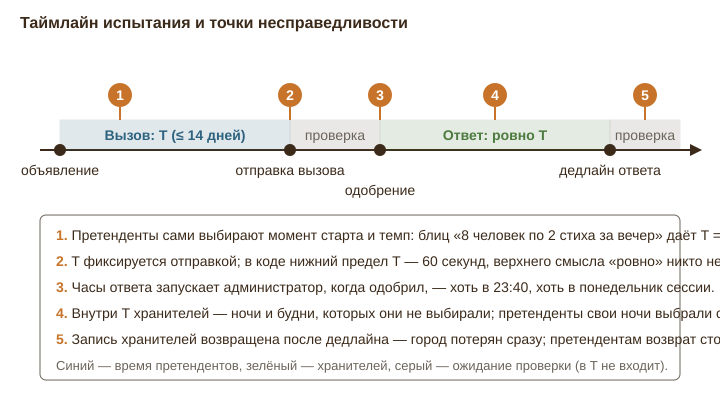
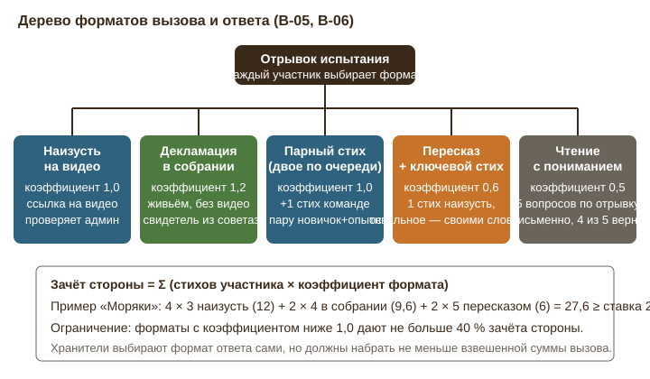
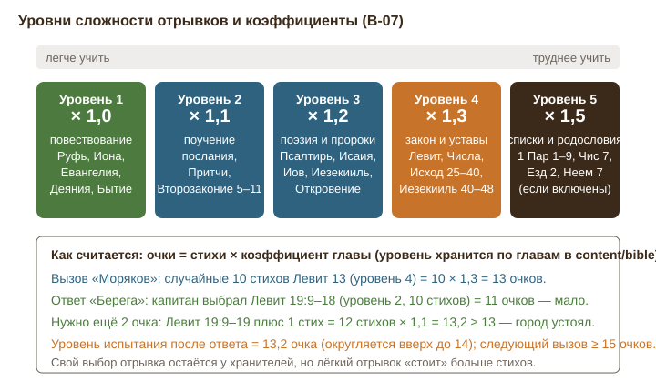
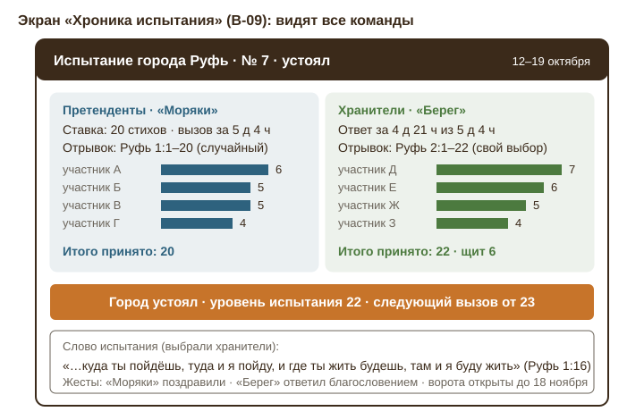

# Глава 7. Испытания города стихами

Экспертное заключение по механике «испытание города» (в документе и коде — битва, `Battle`). Источники: `docs/LANDS_OF_THE_WORD.md` §2.8, §2.8.1, §2.9, §13.3; `apps/api/src/services/battles.ts`; `apps/api/src/routes/battles.ts`; `apps/web/src/pages/BattlePanel.tsx`; данные книг `content/bible/*.json`. Термины интерфейса: **испытание**, **претенденты** (атакующие), **хранители** (защитники), **вызов** (атака), **ответ** (оборона), **уровень испытания** (уровень защиты).

## 1. Как есть

**Кто и когда может бросить вызов.** Команда, решившая все задания районов чужого города и дошедшая до него, вводит одно число — ставку N. Минимум: `max(10 + штраф, уровень + 1)` (`minBidFor`). Штраф копится по паре «команда — город» по +5 за каждый сгоревший вызов. Претенденты видят уровень испытания и число стихов в книге до объявления. На один город одновременно идёт одно испытание; остальные вызовы становятся в очередь. Очередь после завершения запускается по убыванию ставки, при равенстве — кто раньше; пока вызов в очереди, ставку можно поднять; если за время ожидания уровень вырос выше ставки, вызов отменяется письмом. Из кода: первый объявивший начинает сразу, а «побеждает большая ставка» относится только к очереди за ним.

**Вызов.** Игра выдаёт претендентам **один случайный последовательный отрывок** длиной `min(N, стихов в книге)` (`randomPassage`), с обходом родословий, если это выключено в настройках игры. Каждый участник видит текст отрывка, отмечает выученные стихи и прикрепляет ссылку на внешнее видео (файлы игра не хранит). Считается **сумма стихов по участникам**: один и тот же стих могут выучить восемь человек, и это восемь стихов; внутри одного участника стих считается один раз. Когда сумма ≥ N, капитан отправляет вызов на проверку; этот момент фиксирует T = отправка − старт. Лимит 14 дней; сгоревший вызов даёт +5 к штрафу. Администратор принимает или возвращает **каждую запись** отдельно с комментарием; при возврате после отправки, если суммы не хватает, отправка снимается, команда добирает, T растёт. Критериев проверки в интерфейсе нет; в документе есть одна фраза: «стих наизусть, глаза закрыты».

**Ответ.** Когда все записи вызова приняты, у хранителей ровно T (в коде — `max(60 секунд, T)`) от момента одобрения. Капитан хранителей открывает **всю книгу** и выбирает любой последовательный отрывок; после первой отметки участника отрывок менять нельзя. Нужна сумма M ≥ одобренной суммы вызова, отправка до дедлайна. Ничья — за хранителями. Если запись хранителей возвращена **после** дедлайна и суммы не хватает — город переходит сразу (`afterReject` → `resolveWon`). Капитан хранителей может уступить город в любой момент, включая фазу вызова, когда претенденты ещё ничего не выучили; уровень тогда = ставке.

**Результат.** Устояли — уровень испытания = M; следующий вызов ≥ M + 1. Перешёл — уровень = `max(N, принятая сумма)`, владелец меняется, для бывшего владельца это была столица → команда выбывает, остальные её города становятся руинами (уровень 0, берутся заданиями без испытания), все её испытания отменяются, а взятая столица становится второй столицей претендентов. Проигравшие могут вернуть город по тем же правилам. Ставка ≥ числа стихов в книге включает **суммарный режим** для города навсегда; устоявший в суммарном режиме город **закрепляется навсегда** и вызовам больше не подлежит.

**Что видит игрок** (`BattlePanel.tsx`). В попапе города: уровень испытания, число стихов в книге, поле ставки с минимумом, свёрнутая справка «Как проходит испытание», карточки идущих испытаний и три последних строки прошлых (дата, кто на кого, ставка, статус). В карточке: ставка, «осталось …», прогресс «выучено a из b · принято c», чек-лист стихов с текстом, форма ссылок, список **своих** записей со статусами. Хранители во время вызова видят ставку, 14-дневный отсчёт претендентов и фразу «Претенденты учат отрывок» — но не ход (сколько уже выучено). Третьи команды, дошедшие до города, видят только число вызовов в очереди. Предположительно недосмотр: ответ `view` отдаёт суммы обеих сторон обеим командам, хотя интерфейс чужую сумму не показывает. Статистика команды в финале: взято / отражено / потеряно.

**Что видит администратор.** Блок «Испытания»: все битвы, обе стороны, кнопки «Принять» / «Вернуть» с комментарием, суммы «выучено · принято · нужно». Аналитика суперадмина считает среднюю ставку и среднее время вызова.

**Распределение книг.** Книги раздаются городам полностью случайно внутри своего острова (Ветхий Завет — 39, Новый — 27); все старты на ветхозаветном острове. Первый открытый командой город — её столица, перенос один раз. Значит, какая книга станет чьей столицей и какие книги команда будет хранить — вопрос географии и жребия, а не выбора.

## 2. Дыры и слабые места

### 2.1 «Ровно T» несправедливо по построению

T — это время претендентов между стартом и отправкой. Оно измеряет не сложность задачи, а их **занятость и тактику**. Претенденты выбирают момент старта (пятница вечером перед свободными выходными), темп (по два стиха на восьмерых за один вечер) и даже пользуются тем, что случайный отрывок из знакомой книги уже наполовину известен. Хранители получают то же число часов, но **начинающихся в момент, когда администратор нажал «Принять»**: это может быть 23:40 воскресенья или утро понедельника сессии. Внутри их T — ночи и будни, которых они не выбирали.

Сценарий. «Моряки» (8 человек) в субботу в 10:00 бросают вызов городу Иона (48 стихов) со ставкой 16. Отрывок — Иона 2:1–3:6. Капитан раздаёт по два стиха, к 14:00 все восемь ссылок приложены, вызов отправлен: T = 4 часа. Администратор смотрит видео вечером и одобряет в 22:30. У «Берега» — до 02:30 ночи. Даже если капитан «Берега» не спит и выбирает отрывок, шесть человек из восьми узнают о вызове утром, когда всё уже потеряно. В коде нижняя граница T — 60 секунд; в документе её нет вовсе. Столица «Берега» может быть потеряна за одну ночь, и команда выбывает из игры.

Обратная несправедливость тоже есть: «Моряки» тянут 13 дней (экзамены), T = 13 дней, и «Берег» получает две недели на 16 стихов — вызов, который стоил претендентам двух недель, отбивается за один вечер. «Ровно T» одновременно и слишком коротко, и слишком длинно; симметрия здесь мнимая.

### 2.2 Асимметрия отрывков: случайный против своего

Претенденты получают отрывок жребием: с равной вероятностью Руфь 1:16 или Левит 13:47–59 (закон о проказе на одежде). Хранители выбирают из всей книги — и, что важнее, **могут выучить свой отрывок заранее**, ещё до всякого вызова, потому что книга известна с момента взятия города. Плюс ничья в их пользу. Плюс уровень после ответа = M, который хранители могут сознательно завысить: на вызов 10 ответить 40 (8 × 5), и следующий вызов будет стоить 41. Это «стена»: три-четыре удачных ответа — и город практически недоступен, потому что 60–80 стихов за 14 дней командой из восьми человек (по 8–10 на каждого) — уже серьёзный барьер, особенно если половина команды «просела».

С педагогической стороны это ещё и обедняет: хранители выучат Псалом 22 или 1 Коринфянам 13 — самое известное — и будут отвечать им каждый раз. Код не запрещает **один и тот же отрывок ответа во всех испытаниях** и не проверяет **повторное использование ссылок на видео**: ответ, записанный в октябре, можно приложить в декабре.

### 2.3 Проверка видео: один человек, без критериев

Администратор — одновременно разработчик и организатор. Испытание со ставкой 30 против ответа 32 — это 16 записей, каждая с одной-несколькими ссылками, 1–3 минуты видео на запись, то есть 30–45 минут только просмотра, не считая сверки со словами Синодального текста. Три команды, у каждой по два-три испытания в разных фазах, — и проверка становится узким местом. Ожидание проверки не входит в T претендентов, но **для хранителей задержка смертельна**: подали за 3 часа до дедлайна, администратор посмотрел через 5 часов, вернул одну запись из-за пропущенного полустиха — город потерян без права переснять.

Критериев нет. Что считать ошибкой: перестановку слов, «Господь» вместо «Бог», пропуск «и», подсказку из-за кадра, взгляд в телефон, склейку видео? «Глаза закрыты» есть в документе, но не в интерфейсе, и игроки его не видят. При ничьей в пользу хранителей исход часто решает **одна возвращённая запись**, а её судьбу решает настроение одного проверяющего в 23:00. Это плохо и для администратора: любое решение можно оспорить, и оспорят.

### 2.4 Мотивация слабых

Сумма по участникам — правильный ход: численность и включённость становятся силой. Но интерфейс и правила не делают ничего, чтобы **новичок захотел** выучить хотя бы два стиха. Видео «наизусть с закрытыми глазами» во внешнем сервисе — барьер для стеснительных, для тех, кто не хочет выкладывать своё лицо в интернет, для тех, у кого слабая память. Капитан рационально раздаст стихи трём сильным, и пять человек останутся зрителями — а зрелища как раз и нет (см. 2.6). Ни один стих не остаётся «за человеком»: нет личного свитка, нет повторения, нет признания. Выучил, записал, забыл.

### 2.5 Суммарный режим на коротких книгах

Пять книг короче 26 стихов: 2 Иоанна (13), 3 Иоанна (15), Авдий (21), Иуды (25), Филимону (25); ещё четыре — до 50. Минимальная ставка 10, но во 2 Иоанна первая же ставка 13 ≥ 13 включает суммарный режим **с первого вызова**. Первый ответ хранителей — и город закреплён навсегда. Восемь хранителей, каждый рассказывает 13 стихов, сумма 104 против 13 — задача на два вечера. То есть для коротких книг механика испытаний вырождается в одноразовое событие, а если такая книга — столица, победа «все столицы у одной команды» становится недостижимой уже в первый месяц. Хуже: команда, чья ближайшая к старту книга оказалась Авдием, получает несокрушимую столицу даром, а команда с Бытием (1533 стиха) — никогда. И заметьте: код выдаёт претендентам один отрывок на всех, а не «каждому свой случайный», как написано в §2.8.1 — расхождение документа и кода.

### 2.6 Никто не видит битвы

Испытание — самый драматичный момент игры, и он полностью невидим. Третьи команды не знают, что оно идёт. Хранители во время вызова видят ставку и строку «Претенденты учат отрывок» — но не ход: сколько уже выучено, близко ли отправка. После завершения — одна строка: дата, ставка, статус. Ни отрывков, ни имён, ни «кто сколько», ни слова из книги. Нет повода собраться, нет истории, которую расскажут в молодёжи через год. Соревнования по памяти Писания живут именно публичностью: зал, который слушает Псалом 118 целиком, — вот что запоминают.

### 2.7 Нет «ничьей с честью» и нет жестов

Претенденты, выучившие 20 стихов, против ответа 20 — проиграли, и уровень вырос. Единственный след их труда — строка «город устоял». В церковной молодёжи проигрыш должен быть плодотворным: «Моряки» выучили Руфь 1 — это уже победа. Механика этого не признаёт. Нет ни поздравления, ни благословения, ни какого-либо канала между командами по итогам испытания, кроме дипломатии проходов.

### 2.8 Блокировка, спам, бесплатная уступка

Одно испытание на город и штраф только +5 порождают дешёвые злоупотребления. **Блокирующий вызов:** «Моряки» объявляют вызов городу «Берега», ничего не учат, и на 14 дней город недоступен третьей команде (она в очереди). Цена — +5 к минимуму «Моряков» на этот город, для остальных городов ничего. **Спам по фронтам:** три вызова трём городам «Берега» одновременно по минимальной ставке; «Берег» обязан ответить на всех фронтах, администратор — проверить всё. **Бесплатная уступка:** капитан хранителей может уступить город в фазе вызова, до единой выученной строчки; город переходит с уровнем = ставке. Две дружественные команды могут так «передавать» города без стихов.

### 2.9 Что происходит с выученным

Ничего. Стихи записаны в `BattleEntry` и больше нигде не всплывают: нет личной истории, нет повторения, нет учёта «сколько стихов книги команда уже знает». Через месяц все двадцать стихов Ионы забыты, а игра, вся суть которой — «дом на камне», не сделала ни одного шага к тому, чтобы Слово осталось.

### 2.10 Книги между командами

Полностью случайное распределение книг по островам плюс географическая близость означают: одна команда хранит Псалтирь (2526 стихов, уровень может расти бесконечно), другая — Иуды и Аггея. Первая никогда не закрепится, вторая закрепится после первого ответа. Случайный отрывок из Иеремии и случайный отрывок из Евангелия от Марка — разные по трудности задачи при одинаковом счёте стихов. Никаких коэффициентов, никаких поправок: стих есть стих.

Ниже — предложения. Они не отменяют принятый регламент (сумма по участникам, случайный отрывок претендентам, свой у хранителей, ничья за хранителями), а достраивают его.

## 3. Предложения

### B-01. Коридор времени ответа и тихие часы

**Суть.** Время ответа = `clamp(T, 72 ч, 14 дней)`, дедлайн не может попадать на ночь, а старт часов — не раньше 09:00 по часовому поясу игры.
**Зачем.** Закрывает блиц (2.1): нельзя выбить столицу за ночь; и закрывает обратный перекос: 13-дневный вызов не даёт хранителям больше двух недель.
**Как работает.** В настройках игры три числа: `defenseMinHours` (72), `defenseMaxDays` (14), `quietHours` (22:00–09:00). Часы ответа стартуют при одобрении, но если одобрение попало в тихие часы — с 09:00. Дедлайн, попавший в тихие часы, сдвигается на 09:00 следующего утра; дедлайн, попавший на воскресенье до 14:00, — на 14:00 (собрание). Уведомление хранителям приходит сразу, но с честной строкой «часы пойдут с 09:00». Сценарий: «Моряки» отправили вызов Ионе за 4 часа; администратор одобрил в 22:30; «Берег» получает письмо вечером, часы идут с 09:00 понедельника до 09:00 четверга — 72 часа на 16 стихов на восьмерых. Если бы «Моряки» учили 10 дней, «Берег» получил бы ровно 10 дней.
**Риски и ограничения.** Претенденты теряют тактику блица — и это цель. Минимум 72 часа делает «ровно T» реальным только в диапазоне 3–14 дней; это честно, потому что ниже 3 дней T измеряет не труд, а расписание. Тихие часы должны учитывать часовой пояс игры (одно поле в настройках).
**Сложность:** S · **Влияние:** 5 · **Этап:** сейчас

### B-02. Медианное T вместо «ровно T»

**Суть.** Время ответа = `max(T, медиана T всех одобренных вызовов текущей игры)`, в пределах коридора B-01.
**Зачем.** «Ровно T» предполагает, что T — мера задачи. Медиана по игре — мера того, сколько на самом деле уходит у этих людей на такие объёмы. Хранители перестают зависеть от расписания конкретных претендентов.
**Как работает.** До третьего завершённого вызова медиана берётся из настройки `defaultAnswerDays` (5 суток). Далее пересчитывается после каждого одобренного вызова, нормируясь на объём: медиана хранится как «часов на стих на участника» и умножается на `need / активных хранителей` (участников, приложивших хоть одну ссылку в игре за последние 30 дней). Пример: в игре завершено пять вызовов, медиана — 9 часов на стих на человека. «Моряки» одобрены на 24 стиха за 2 суток. У «Берега» 6 активных участников: норма = 9 × 24 / 6 = 36 часов; T = 48 часов больше нормы, но меньше пола 72 часа, итог — 72 часа. Если бы у «Берега» было 3 активных участника, норма = 72 часа — совпало бы с полом. В карточке испытания показывать формулу словами: «Время ответа: 3 дня (не меньше вашего труда по норме игры)».
**Риски и ограничения.** Понятие «активный участник» можно накрутить (все приложили по стиху) — но это ровно то, чего мы хотим. Формула сложнее для объяснения; в справке «Как проходит испытание» нужен один абзац. Если владелец не хочет двух правил, B-01 достаточно; B-02 — уточнение для следующего сезона.
**Сложность:** M · **Влияние:** 3 · **Этап:** следующий сезон

### B-03. Регламент проверки и код испытания

**Суть.** Опубликованные критерии приёма записи, чек-лист в интерфейсе администратора и произносимый вслух «код испытания» против повторного использования видео.
**Зачем.** Закрывает 2.3: одинаковые правила для обеих сторон, меньше споров, меньше времени на проверку; закрывает переиспользование ссылок из 2.2.
**Как работает.** Регламент (страница «Как играть», раздел «Испытания»): (1) текст — Синодальный, наизусть, без листа и экрана; глаза закрыты или взгляд в камеру; (2) допускается до 1 оговорки на 5 стихов с самоисправлением; подсказка со стороны, пропуск полустиха, замена слова без исправления — возврат; (3) ссылка на стих произносится перед стихом; (4) одно видео без склеек, не длиннее 6 минут; лицо и голос участника в кадре; (5) в начале видео участник называет **код испытания** — четыре буквы, которые игра показывает в карточке (`battle.code`, например «РУФЬ-К7»); видео без кода не принимается. Администратор видит чек-лист из пяти пунктов и отмечает, какой не выполнен, — комментарий возврата формируется сам. Целевое время решения — 24 часа (SLA показывается администратору как счётчик). Вторая линия: роль «проверяющий испытаний» для служителя-советника или члена совета, не входящего ни в одну команду; он может принимать и возвращать записи, администратор видит, кто решил. Сценарий: участник «Берега» приложил ссылку на октябрьское видео Псалма 22; кода нового испытания в нём нет — возврат за 30 секунд, без просмотра.
**Риски и ограничения.** Проверяющий из совета должен быть вне команд, иначе конфликт интересов; ролью назначает создатель игры. Слишком строгий регламент отпугнёт новичков — поэтому «1 оговорка на 5 стихов», а не «ноль ошибок».
**Сложность:** M · **Влияние:** 5 · **Этап:** сейчас

### B-04. Стоп-часы для хранителей

**Суть.** Возврат записи хранителям после дедлайна не означает мгновенной потери города: даётся один сеанс исправления длиной 24 часа, если ответ был подан не позже чем за 24 часа до дедлайна.
**Зачем.** Убирает точку 5 таймлайна: сейчас задержка проверки играет только против хранителей.
**Как работает.** `defenseDoneAt ≤ defenseDeadline − 24 ч` → флаг «подано с запасом». При возврате после дедлайна и нехватке суммы: `defenseDeadline := decidedAt + 24 ч`, `defenseDoneAt := null`, одно исправление на испытание (`graceUsed`). Подано без запаса — правило прежнее. В карточке хранителей это видно заранее: «Подайте до 14 октября 21:00, чтобы иметь право на исправление». Сценарий: «Берег» подал за 30 часов до дедлайна; администратор вернул одну запись из шести через 40 часов (участник пропустил полустих). «Берег» получает 24 часа, участник переснимает два стиха, город устоял. Если бы «Берег» подал за 3 часа до дедлайна — город перешёл бы, как сейчас.
**Риски и ограничения.** Претенденты ждут дольше на 24 часа; это компенсируется тем, что при подаче с запасом они и так ждут проверки. Не более одного исправления, иначе появится «подача вслепую».
**Сложность:** S · **Влияние:** 4 · **Этап:** сейчас

### B-05. Дерево форматов вызова с коэффициентами

**Суть.** Помимо «наизусть на видео», участник может сдать стихи в четырёх других форматах с коэффициентом зачёта; зачёт стороны = сумма стихов × коэффициент.
**Зачем.** Даёт вход слабым и стеснительным (2.4), возвращает в игру собрание (2.6), делает разбор отрывка частью соревнования, не размывая ядро — заучивание.
**Как работает.** Форматы записи (`entry.format`): **наизусть на видео** (×1,0, как сейчас); **декламация в собрании** (×1,2) — живьём на молодёжном или общем собрании, без видео, подтверждает свидетель из совета отметкой в игре, до 2 раз в месяц на команду; **парный стих** (×1,0) — двое читают по очереди на одном видео, каждый получает свои стихи, если один из пары в этой игре сдаёт впервые — +1 стих команде; **пересказ с ключевым стихом** (×0,6) — участник рассказывает отрывок своими словами и один стих наизусть; **чтение с пониманием** (×0,5) — пять вопросов по отрывку (готовит администратор или проверяющий, шаблон в `content/cities/*.json`), письменный ответ, зачёт при 4 из 5. Форматы ниже 1,0 дают не больше 40 % зачёта стороны. Сценарий: «Моряки», ставка 25, отрывок Руфь 1:1–25. Четверо сдают по 3 стиха наизусть (12), двое читают по 4 в собрании (9,6), двое новичков пересказывают по 5 стихов с ключевым (6): 27,6 ≥ 25, при этом «лёгкие» форматы дали 6 из 27,6 — меньше 40 %. Все восемь участвовали.
**Риски и ограничения.** Больше типов проверки — больше нагрузки на администратора; поэтому вопросы для «чтения с пониманием» готовятся один раз на книгу, а декламацию подтверждает не он. Коэффициенты — в настройках игры, чтобы владелец мог выставить «только наизусть» (все прочие = 0).
**Сложность:** L · **Влияние:** 5 · **Этап:** следующий сезон

### B-06. Ответ на вызов с выбором формата хранителями

**Суть.** Хранители, отвечая, видят взвешенный зачёт вызова и сами решают, каким сочетанием форматов и какого отрывка его перекрыть; претенденты видят только итог.
**Зачем.** Сохраняет право хранителей на свой отрывок, но превращает «стену» из численного давления в тактику: чем сложнее и «дороже» их ответ, тем выше уровень, но тем больше труда.
**Как работает.** В карточке ответа: «Нужно перекрыть 27,6 очков». Капитан задаёт отрывок и «план»: кто в каком формате; план необязателен, но при заполненном плане участники видят свою долю. Уровень испытания после ответа = взвешенный зачёт ответа, округлённый вверх. Сценарий: «Берег» отвечает на 27,6 очков: 5 человек по 4 стиха наизусть (20) + декламация в собрании 7 стихов (8,4) = 28,4 — устояли; уровень становится 29, не 40, потому что завышать ответ теперь дорого: каждый лишний стих в собрании — это реальные люди в реальный вечер.
**Риски и ограничения.** Зависит от B-05. Дробные очки нужно показывать с одним знаком после запятой и объяснять в справке.
**Сложность:** M · **Влияние:** 3 · **Этап:** следующий сезон

### B-07. Уровни сложности отрывков с коэффициентами

**Суть.** Каждая глава каждой книги получает уровень сложности 1–5 с коэффициентом 1,0 / 1,1 / 1,2 / 1,3 / 1,5; стихи вызова и ответа считаются в очках = стихи × коэффициент.
**Зачем.** Закрывает асимметрию 2.2 и разброс 2.10: случайный Левит 13 перестаёт стоить столько же, сколько выбранный Псалом 22; хранители сохраняют выбор, но «лёгкий» отрывок требует больше стихов.
**Как работает.** В `content/bible/<книга>.json` появляется массив `difficulty` по главам (заполняется один раз владельцем с помощью советника, разметка: повествование 1, поучение 2, поэзия и пророчество 3, закон и уставы 4, списки и родословия 5). Очки стороны = Σ по записям стихи × коэффициент главы (стих на стыке глав — по своей главе). Минимальная ставка и уровень испытания — в очках, отображение «очков (≈ стихов)». Сценарий: «Моряки» бросают вызов Левиту, ставка 13 очков; жребий даёт Левит 13:47–56 — 10 стихов × 1,3 = 13. «Берег» выбирает Левит 19:9–18 (уровень 2): 10 × 1,1 = 11 — мало; берёт 19:9–20, 12 × 1,1 = 13,2 — устояли, уровень 14. Пусть выбрали бы Левит 26 (уровень 3, но не легче) — 11 стихов хватило бы. Уровень 5 действует только при включённых родословиях.
**Риски и ограничения.** Разметка субъективна — но грубая пятибалльная шкала по главам лучше, чем её отсутствие; спор о «поэзия или поучение» стоит 0,1. Претендентам стоит показывать распределение уровней книги до ставки: «В Левите 27 глав: 4 повествовательных, 20 уставных…».
**Сложность:** M · **Влияние:** 4 · **Этап:** следующий сезон

### B-08. Щит города из уже выученных стихов

**Суть.** Хранители могут в любое время, вне испытаний, сдавать стихи книги своего города в «щит»; при ответе щит покрывает до 50 % нужной суммы, остальное учится в T.
**Зачем.** Награждает учение заранее (сейчас его никто не видит), снимает панику блица, делает владение городом осмысленным: город — это книга, которую команда знает. Закрывает часть 2.9.
**Как работает.** В попапе своего города — раздел «Щит»: участник отмечает стихи книги (любые, не обязательно подряд) и прикладывает видео по регламенту B-03; принятые стихи ложатся в щит с датой. Щит города = сумма принятых стихов по участникам, которые ещё в команде; стих старше 60 дней «тускнеет» и в щите не считается, пока не повторён (см. B-14). При ответе: `need_fresh = max(need − min(shield, need/2), 0)`; отрывок ответа по-прежнему один последовательный, а стихи щита, попавшие в него, считаются автоматически. Щит виден претендентам как число до ставки: «Уровень 22 · щит 12». Сценарий: «Берег» держит Руфь и за месяц собрал щит 18 (шестеро по три стиха из Руфи 1–2). «Моряки» одобрены на 24. Щит покрывает 12, «Берегу» нужно 12 новых стихов за T — по два на шестерых. При отрывке Руфь 2:1–22 девять стихов щита лежат внутри него — они зачтены сразу.
**Риски и ограничения.** Щит усиливает хранителей ещё больше — потому ограничен половиной и 60 днями и виден претендентам заранее, чтобы ставка была осознанной. Администратору прибавляется проверок вне испытаний — но они не срочные и без дедлайна, их может брать проверяющий из B-03.
**Сложность:** M · **Влияние:** 4 · **Этап:** следующий сезон

### B-09. Публичная хроника испытания

**Суть.** Каждое испытание получает страницу-хронику, видимую всем командам: ход в живую (без текста отрывков), а после завершения — полная картина с «Словом испытания».
**Зачем.** Закрывает 2.6: зрелищность, история, повод для разговора и для честности (публичное — честнее).
**Как работает.** Живой режим: у всех команд в боковом меню «Идут испытания: Руфь — Моряки против Берега, вызов 14 из 20, 3 д 2 ч». Ставка, суммы, фазы и таймеры открыты; отрывки и ссылки — только своей стороне и администратору (иначе хранители подсмотрят, легко ли претендентам). После завершения: обе колонки (ставка, отрывки ссылкой, T, кто сколько стихов — по никнеймам без ссылок на видео), итог, новый уровень, жесты (B-10). Победившая сторона выбирает **Слово испытания** — один стих из своего отрывка, он выводится на карте у города на 7 дней и в ленте «Что нового». Хроники собираются в «Летопись игры» — страницу, которую можно показать на итоговом вечере. Сценарий: «Моряки» проиграли Руфь 20 против 22; в летописи видно, что новичок «Моряков» сдал 4 стиха — и капитан «Берега» написал ему поздравление (B-10).
**Риски и ограничения.** Публичные числа могут смущать слабых — поэтому в живом режиме показываются только суммы сторон, поимённо — после завершения, и участник может скрыть свой никнейм в хронике (настройка аккаунта). Никаких видео в хронике никогда.
**Сложность:** M · **Влияние:** 5 · **Этап:** сейчас

### B-10. Ничья с честью и взаимные жесты

**Суть.** Претенденты, чья принятая сумма не ниже 90 % ответа хранителей, получают «ничью с честью»: город остаётся, но уровень не растёт и ворота открыты; по итогам любого испытания капитаны обмениваются жестами.
**Зачем.** Закрывает 2.7: проигрыш перестаёт быть пустым, а «стена» перестаёт расти после каждого близкого боя.
**Как работает.** После отражения: если `attackApproved ≥ 0.9 × M`, уровень испытания = `max(старый уровень, N)`, а не M; претенденты получают постоянное разрешение прохода через этот город на 30 дней (механика 2.14 без запроса); в хронике — знак «с честью». Жесты: в течение 48 часов после итога капитан проигравшей стороны может отправить «поздравление» (один стих из своей книги), капитан победившей — «благословение» (стих из отрывка). Оба жеста видны в хронике и на карте; команда, сделавшая жест во всех своих испытаниях сезона, получает звание «Мирный народ» — оно используется как последний критерий при равенстве в финале (после городов, столиц и суммы уровней). Сценарий: «Моряки» 20, «Берег» 22 — 20 ≥ 19,8, ничья с честью: Руфь остаётся у «Берега» на уровне 20, «Моряки» ходят через Руфь месяц, следующий вызов им обойдётся в 21, а не 23. Капитан «Моряков» посылает Руфь 2:12, капитан «Берега» отвечает Руфь 1:16.
**Риски и ограничения.** Порог 90 % подстроить нельзя: M претендентам в интерфейсе не показывается до итога (утечку суммы через API из раздела 1 при этом нужно закрыть). Жесты не должны быть обязательными и не должны иметь «стоимости»; звание — символическое, без городов.
**Сложность:** S · **Влияние:** 4 · **Этап:** сейчас

### B-11. Лимиты одновременных испытаний, защита от блокировки и «бесплатной» уступки

**Суть.** Команда ведёт не больше двух вызовов одновременно; вызов без единой записи за 72 часа отменяется досрочно; уступить город можно только после того, как вызов отправлен на проверку.
**Зачем.** Закрывает 2.8 целиком: блокирующие вызовы, спам по фронтам, передача городов без стихов; попутно снижает пиковую нагрузку на проверку.
**Как работает.** `maxActiveAttacks = 2` (настройка) — третий вызов не принимается с понятным сообщением. «Пустой вызов»: если через 72 часа после старта у претендентов нет ни одной записи, вызов отменяется как «не начат» со штрафом +2 (не +5), очередь двигается. Уступка: кнопка «Уступить город» активна только при `attackDoneAt != null`; при уступке уровень = принятая сумма претендентов (не ставка). Сценарий: «Моряки» объявили три вызова «Берегу» по 10 стихов, чтобы задавить. Третий не принят. По первому за трое суток никто ничего не приложил — отмена, +2, а третья команда из очереди начинает свой вызов. Второй вызов реальный — «Берег» отвечает на один фронт, а не на три.
**Риски и ограничения.** Лимит два — для трёх команд по восемь человек; в игре с 6–8 командами можно поднять до трёх. Досрочная отмена не должна срабатывать, если команда получила отрывок в тихие часы или воскресенье — 72 часа считать от первого рабочего утра по B-01.
**Сложность:** S · **Влияние:** 4 · **Этап:** сейчас

### B-12. Перемирие

**Суть.** Команда может объявить перемирие на 7–14 дней (экзамены, лагерь, стройка): её города нельзя испытывать, она не может бросать вызов; идущие испытания замораживаются.
**Зачем.** Сейчас «просевшая» команда теряет столицу в самое неудобное время, и это не соревнование, а календарь. Перемирие делает паузу честной и заявленной.
**Как работает.** Капитан объявляет перемирие за 3 дня до начала; не больше двух за игру, суммарно не больше 21 дня; все команды видят его в ленте. Во время перемирия таймеры испытаний с участием этой команды стоят (`pausedAt`, при возобновлении дедлайны сдвигаются на длительность паузы); новые вызовы к её городам ставятся в очередь и стартуют по окончании; сама она вызовов не бросает. Администратор может объявить общее перемирие на праздники для всех. Сценарий: у «Берега» сессия с 10 по 24 января; капитан объявляет перемирие 7 января. «Моряки», начавшие вызов Руфи 5 января, видят: «Испытание приостановлено до 24 января, осталось у вас 9 д 3 ч». 24 января часы идут дальше.
**Риски и ограничения.** Перемирие можно использовать тактически (объявить, когда чувствуешь угрозу) — отсюда 3 дня предупреждения и лимит на игру. Пауза продлевает и 14-дневный лимит претендентов — это правильно, иначе перемирие хранителей сжигало бы чужие вызовы.
**Сложность:** M · **Влияние:** 3 · **Этап:** следующий сезон

### B-13. Короткие книги: порог закрепления и незакрепляемая столица

**Суть.** В суммарном режиме город закрепляется навсегда только если ответ хранителей ≥ 75 % от «полного знания» (число участников × стихов в книге); столица не закрепляется никогда; для книг короче 30 стихов первая ставка = вся книга.
**Зачем.** Закрывает 2.5: одноразовые испытания на коротких книгах, несокрушимая столица-Авдий, недостижимая победа «все столицы».
**Как работает.** `fullKnowledge = members × total` (участники команды на момент ответа, минимум 4). Закрепление при `M ≥ 0.75 × fullKnowledge`; иначе уровень = M, суммарный режим продолжается. Столица (`isCapital` или `secondCapital`) закрепляться не может: устоявшая столица в суммарном режиме получает уровень M и остаётся открытой. Для книг ≤ 30 стихов минимальная первая ставка — `total` (претенденты учат всю книгу, суммарный режим сразу и честно). Сценарий: «Берег» хранит Иуды (25 стихов), 8 человек, полное знание 200, порог 150. «Моряки» ставят 25 — вся книга. «Берег» отвечает 5 × 25 = 125 — устояли, уровень 125, но не закрепились; следующий вызов от 126: «Морякам» нужно, чтобы шестеро знали Иуды наизусть целиком — и это лучший исход для обеих команд. Ответ 6 × 25 = 150 закрепил бы город: шестеро из восьми знают послание.
**Риски и ограничения.** Расхождение документа и кода про «каждому свой случайный отрывок» надо решить явно: предлагаю оставить как в коде (один отрывок = вся книга), и это записать в §2.8.1. Число участников команды меняется — брать на момент начала ответа.
**Сложность:** S · **Влияние:** 4 · **Этап:** сейчас

### B-14. Свиток участника, повторение и «стих недели»

**Суть.** Все принятые стихи ложатся в личный «свиток» участника; через 30 и 90 дней игра просит повторить их; повторённые стихи дают бонус команде и питают щит; раз в неделю всем командам выдаётся общий «стих недели».
**Зачем.** Закрывает 2.9 и часть 2.4: выученное перестаёт исчезать, у слабых появляется личный видимый рост, а у всех команд — общий текст, о котором можно говорить в собрании.
**Как работает.** Свиток — страница участника: стихи, даты, статус «свежий / потускневший / повторённый». Повторение: короткое видео с кодом (B-03), принимается администратором или проверяющим без спешки; повторённый стих через 30 дней даёт команде +0,5 к щиту книги (если она хранит этот город) и помечается в свитке; через 90 дней — «укоренённый», считается в щите полностью и не тускнеет полгода. Итог игры: «Хранители Слова» — команда с наибольшим числом укоренённых стихов на участника; показывается в финальной статистике рядом с городами. «Стих недели»: администратор (или очередь из книг, за которые идут испытания) назначает один стих; каждый участник любой команды может сдать его до воскресенья; команда, где сдали ≥ 75 % участников, получает +1 стих щита любого своего города по выбору капитана. Сценарий: новичок «Моряков» сдал 4 стиха Руфи в октябре, повторил в ноябре и феврале — в свитке четыре укоренённых стиха, а «Моряки», взявшие Руфь в декабре, получили от него 4 в щит. Стих недели «Руфь 1:16» сдали 7 из 8 «Моряков» — +1 к щиту.
**Риски и ограничения.** Повторения увеличивают поток проверок — но это несрочные проверки, их можно принимать пакетом раз в неделю и отдать проверяющему. Напоминания не должны быть навязчивыми: одно письмо в 30 дней.
**Сложность:** L · **Влияние:** 4 · **Этап:** v2

### B-15. Финальный турнир столиц

**Суть.** В последнюю неделю игры проводится общее испытание всех команд по одному отрывку, живьём на собрании; его результат — старший критерий при равенстве и отдельное звание.
**Зачем.** Даёт игре кульминацию, которую видят все (2.6), и уравнивает команды, которым не повезло с книгами (2.10): один текст, одни условия.
**Как работает.** За 14 дней до `endsAt` администратор публикует отрывок 20–40 стихов (например, Псалом 118:1–24 или Матфея 5:1–16). На финальном вечере команды по очереди читают его наизусть «по кругу»: каждый участник — подряд столько стихов, сколько взял; судят три человека из совета по регламенту B-03 (без видео). Очки команды = принятые стихи × коэффициент (B-07) с бонусом +10 % при участии всех членов. Результат турнира — критерий после «число городов» и «число столиц», но до «сумма уровней»; команда-победитель турнира получает звание «Голос собрания». Если игра завершается досрочно (все столицы у одной команды), турнир всё равно проводится как праздник. Сценарий: по городам «Моряки» и «Берег» равны — 9 и 9, столиц по одной. В турнире «Берег» читает 24 стиха всеми восемью (24 × 1,2 × 1,1 = 31,7), «Моряки» — 24 стиха шестью (28,8). Победа «Берега» решается в зале, а не в таблице.
**Риски и ограничения.** Живой вечер требует организации; но это единственная механика главы, для которой нужен не код, а зал. В коде — только поле результата и его место в критериях.
**Сложность:** S · **Влияние:** 3 · **Этап:** следующий сезон

## 4. Что внедрять первым

Если делать только четыре вещи в этом сезоне: **B-01** (пол 72 часа и тихие часы — одна функция и три настройки), **B-03** (регламент и код испытания — страница текста и одно поле), **B-11** (лимиты и запрет пустой уступки — три проверки в маршрутах) и **B-09** (хроника — новая страница на уже существующих данных). Они не меняют утверждённый регламент, но убирают самые болезненные точки: ночной блиц, споры о проверке, блокирующие вызовы и невидимость. **B-10** и **B-13** — по одному условию в `maybeRepel` каждое, стоит сделать вместе с ними. Форматы (B-05/B-06), сложность (B-07), щит (B-08) и повторение (B-14) — это следующий сезон: они требуют разметки контента и новых типов проверок, и их лучше вводить после того, как первый сезон покажет реальные T, реальную частоту возвратов и реальную нагрузку на проверяющего.
