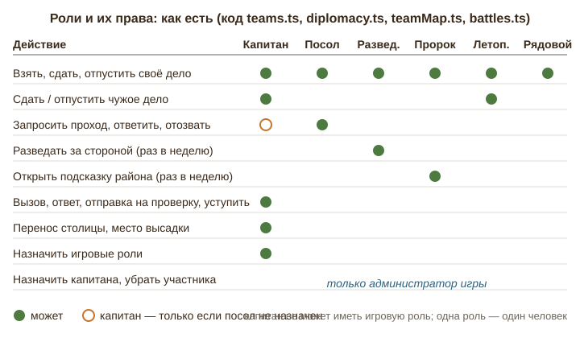
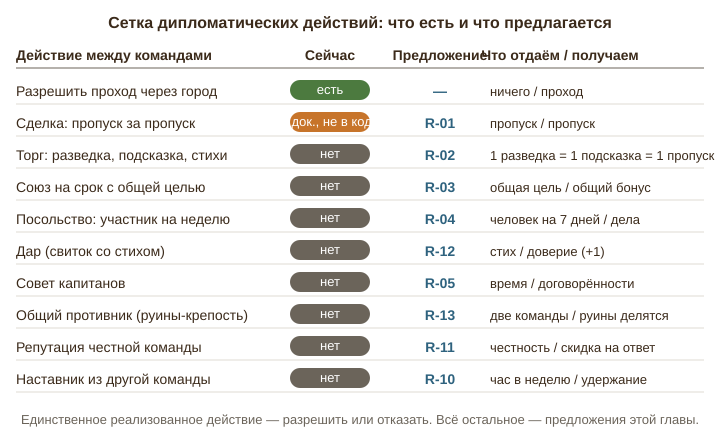
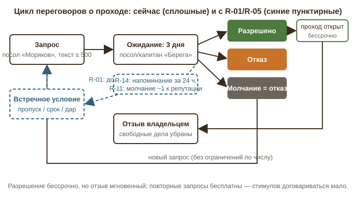
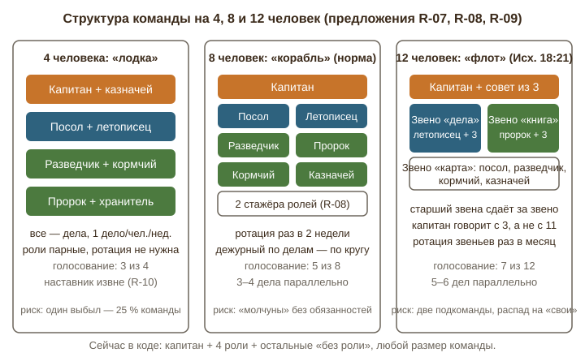

# Глава 8. Дипломатия, роли и командная динамика

_Описание «как есть» и предложения даны по состоянию на дату отчёта. Решения владельца по каждому пункту — в `decisions.md` рядом; действующие правила — в `docs/LANDS_OF_THE_WORD.md`. В частности: разрешение на проход отозвать нельзя (S-14), штраф аннулирует случайный концевой участок пути, включая ведущий в ещё не взятый город (уточнение 19.09)._

*Аудит «Земель Слова», сентябрь 2026. Префикс предложений — R-. Источники: `docs/LANDS_OF_THE_WORD.md` (§2.3, §2.9, §2.11, §2.14, §2.15, §3, §4, §5.1), `apps/api/src/routes/diplomacy.ts`, `apps/api/src/routes/teams.ts`, `apps/api/src/routes/teamMap.ts`, `apps/api/src/routes/battles.ts`, `apps/api/src/services/battles.ts`, `apps/api/prisma/schema.prisma`, `apps/web/src/pages/Diplomacy.tsx`, `apps/web/src/pages/TeamPage.tsx`.*

Игра задумана как командная стратегия для трёх команд примерно по восемь человек на полгода. В такой игре половина удовольствия — не в карте и не в шифрах, а в том, что происходит между людьми: кто с кем договорился, кто кого подвёл, кто оказался надёжным. Эта глава смотрит на игру именно с этой стороны: как сейчас устроены отношения между командами и внутри команды, где эти отношения не работают, и что можно добавить, чтобы полгода люди не просто «сдавали дела», а жили жизнью своего «государства».

---

## 1. Как есть

### 1.1 Дипломатия между командами

Единственное реализованное дипломатическое действие — **запрос прохода через чужой город** (§2.14 А, `diplomacy.ts`). Механика такая:

- Команда, дошедшая до чужого захваченного города, отправляет запрос из попапа города. Запрос может содержать текст до 500 символов. Отправляет посол; если посла нет — капитан (функция `canSpeak`). Рядовой участник видит только подсказку «Запрос отправляет посол команды, а если посла нет — капитан».
- Владельцу города уходит письмо и запрос появляется в боковом меню «Проходы». Ответить может тоже только посол или капитан: «Разрешить» / «Отказать», с необязательным ответом до 500 символов.
- Срок ответа — **3 дня** (`PASSAGE_TTL_MS`), молчание = отказ (`expirePassages`, статус `EXPIRED`), запросившей команде уходит письмо «Владелец три дня не отвечал».
- Разрешение **бессрочно**, но владелец может **в любой момент отозвать** его (`revoke`): свободные дела за городом убираются, взятые остаются, команду назад не откатывает.
- Повторные запросы после отказа не ограничены ни числом, ни паузой: единственная проверка — «нет ли уже висящего или одобренного запроса на этот город».
- Администратор видит все запросы игры в блоке «Проходы» (только чтение).

**Важное расхождение документа и кода.** В §2.14 стоит ✅ у «условий за проход»: запрос якобы содержит предложение (`ничего` / `право прохода через город X` / `право прохода через любой мой город`), а принятое право хранится как «пропуск». В §5.1 описаны сущности `PassageRequest` с полем «предложение взамен» и `PassageToken`. **В коде этого нет:** модель `PassageRequest` в `schema.prisma` содержит только `message`, `answer`, `status` и сроки; модели `PassageToken` не существует; в `diplomacy.ts` и `Diplomacy.tsx` нет ни поля предложения, ни списка пропусков. То есть реальная дипломатия сегодня — это «попросить словами, получить да или нет». Всё, что могло бы быть торгом, живёт в свободном текстовом поле и в личных договорённостях вне игры, которые игра не фиксирует и не исполняет.

Посольство (§2.14 Б) — парные задания между книгами — владельцем **отменено**. В §4.1 сводка метрик всё ещё упоминает «посольств», в §5.1 осталась сущность `Embassy`; в коде её нет. Это просто хвосты в документе.

Никакого другого канала между командами в игре нет: ни сообщений, ни общей доски, ни «совета капитанов». Команды не видят друг друга на карте (§2.11), не знают, сколько у кого городов (сводная таблица — только у администратора и в финале), не могут ничего передать друг другу. Единственное «окно» — 500 символов в запросе прохода и 500 символов в ответе.

### 1.2 Роли внутри команды

Реализованы (§2.15, `teams.ts`, `Membership.gameRole`): **капитан** (роль доступа `CAPTAIN`, назначает только администратор игры) и четыре игровые роли — **разведчик**, **пророк**, **посол**, **летописец**. Правила из кода:

- Одна игровая роль — один человек (при назначении роль снимается с предыдущего носителя). Капитан игровую роль иметь не может (409 «У капитана уже есть роль»).
- Роли раздаёт капитан или администратор. В документе написано «менять можно раз в неделю», **в коде такого ограничения нет**: поля вроде `roleChangedAt` в схеме отсутствуют, `PATCH members/:userId` принимает любое число смен.
- **Разведчик**: раз в неделю «заглянуть» за одну сторону с делом (`peek`): узнаёт вид узла (город или развилка). Кулдаун хранится на команде (`Team.lastPeekAt`), а не на человеке.
- **Пророк**: раз в неделю открыть подсказку к заданию района — до 60 стихов текста района (`hint`). Кулдаун тоже на команде (`Team.lastHintAt`). Работает только после того, как районы расставлены по порядку.
- **Посол**: единственный говорит с другими командами (запрос, ответ, отзыв прохода). Никакого другого содержания у роли нет.
- **Летописец**: может сдать и отпустить чужое дело команды (`teamMap.ts`, `release`, `submit`). Это же может капитан.
- **Капитан**: бросает вызов, выбирает отрывок ответа, отправляет на проверку, убирает чужую запись стиха, уступает город (`battles.ts`), переносит столицу, выбирает место высадки с корабля (`land`), назначает роли. Доска «Состав» (`Roster` в `TeamPage.tsx`) — единственное место управления командой: список людей, выпадающий список ролей у капитана, подсказка «что даёт роль» по нажатию.
- **Рядовой участник**: берёт свободное дело, сдаёт своё, отпускает своё, отмечает выученные стихи в битве. Никаких обязанностей, никаких напоминаний, никакой нормы.

Кулдауны разведчика и пророка привязаны к команде, поэтому смена носителя не «обнуляет» неделю — это правильно.

### 1.3 Команды и организация

По §3 — три команды примерно по восемь человек; участников распределяют организаторы «по силам». Игра допускает от 2 до 12 команд (`teamCount`), размер команды не ограничен ничем. Приглашение в команду выдаёт администратор (ссылка, ≤ 100 использований, ≤ 60 дней). Выйти из команды участник сам не может — нет такого маршрута; убрать может только администратор игры. При поражении команды (`services/battles.ts`) она получает статус `defeated`, её города становятся руинами, битвы отменяются, но **участники никуда не переносятся**: §2.9 обещает «делятся поровну между оставшимися», §5.1 — «админ подтверждает распределение», в коде этого нет. Предположительно администратор делает это вручную через приглашения.

Конфликты внутри команды игра не различает: кто взял дело и не сделал — видно только по статусу «в работе» и имени взявшего в списке дел; никакого срока, никакого автоматического возврата дела, никакого сигнала капитану.

---

## 2. Дыры и слабые места

### 2.1 Дипломатия сводится к «да/нет», потому что предмета торга нет

У «Берега» город на перешейке, «Морякам» через него — три стороны, в обход — восемь. Посол «Моряков» пишет: «Пустите, пожалуйста, мы вам тоже когда-нибудь пустим». Капитан «Берега» смотрит на запрос и думает: а зачем? Если пустить — «Моряки» дойдут до свободных городов быстрее нас. Если отказать — ничего не теряем. Рациональный ответ — отказ, а самый частый — молчание (три дня, и вопрос закрылся сам).

Это не проблема воспитания, это проблема дизайна: у отвечающей стороны нет ни выгоды от «да», ни цены за «нет», а обещание «мы тоже пустим» игра не фиксирует. Даже описанный в §2.14 обмен пропусками — единственная реальная валюта — не реализован. При таком устройстве за полгода дипломатия сведётся к двум-трём просьбам в первые недели и молчанию потом.

### 2.2 Разрешение бессрочно, отзыв мгновенен — доверять нечему

Владелец может отозвать проход в любой момент без причины и без последствий. «Берег» пустил «Моряков», те начали строить маршрут через город, а через неделю «Берег» передумал: свободные дела за городом пропали. Формально это по правилам, но для «Моряков» это ощущается как обман, и следующие полгода они не будут ни просить, ни давать. Игра не предлагает ни срока разрешения (например, «две недели гарантированно»), ни репутационной отметки, ни хотя бы обязательного объяснения.

### 2.3 Команды не общаются вообще

Нет ни одного канала «команда — команда», кроме 500 символов при запросе прохода. Союз, предупреждение («не трогайте наш город, мы вас не тронем»), просьба о помощи, поздравление — всё это возможно только в мессенджере вне игры. Это значит, что игра **не видит** договорённостей и не может ни исполнить их, ни защитить от их нарушения. Для подростковой группы это плохо вдвойне: договорённости в чатах забываются, толкуются по-разному и порождают обиды, которые организаторы разбирают уже «вживую».

### 2.4 Капитан — узкое горлышко

Из `battles.ts`, `diplomacy.ts`, `teamMap.ts`: только капитан выбирает отрывок обороны, отправляет атаку и оборону на проверку, уступает город, переносит столицу, выбирает высадку, назначает роли; без посла — ещё и вся дипломатия. Оборона по времени T (§2.8): если атакующие уложились в четыре дня, у защитников ровно четыре дня, и первый из них — пока капитан выберет отрывок. Капитан уехал на сессию на неделю — команда не может ответить на вызов, не может назначить посла вместо себя (только капитан и админ), не может даже «отпустить» дело человека, который пропал, если нет летописца. Одно выбытие — и команда парализована в самом важном.

При этом капитана назначает только администратор. Внутри команды нет ни «заместителя», ни временной передачи полномочий.

### 2.5 «Пустые» и «бумажные» роли

**Посол** — это одна кнопка «Запросить проход», нажимаемая, по оценке, 2–4 раза за игру. Название обещает дипломатическую жизнь, реальность — почти ничего. Роль без содержания хуже, чем отсутствие роли: человек её получил, ждёт значимости и не получает.

**Летописец** — «сдаёт чужие дела». Это техническая подстраховка, а не роль: летопись он не ведёт, история команды нигде не пишется, участники не видят, что команда прошла за месяц.

**Разведчик** и **пророк** — по одному нажатию в неделю. Это неплохо как ритуал (раз в неделю у двух человек есть свой ход), но ритуал ничем не подкреплён: игра не напоминает, что ход доступен, а капитан не видит, использован ли он.

### 2.6 Нет ротации и нет входа для новичков

Роль выдана в сентябре — и, скорее всего, останется до марта. Игра не подталкивает менять роли, а обещанная документом недельная пауза между сменами в коде отсутствует: порядка нет ни в ту, ни в другую сторону. Новичок, пришедший в ноябре, получает «без роли» и не понимает, что ему делать: список дел и всё.

### 2.7 У рядовых нет обязанностей

Взять дело может любой, но никто не обязан. В команде из восьми человек трое делают всё, пятеро «в игре» формально. Игра этого не видит: нет нормы «одно дело в две недели», нет статуса «давно не заходил», нет дежурства. Капитан узнаёт, что человек выпал, только когда его дело провисело «в работе» месяц.

### 2.8 Нет коллективных решений

Вызов на 40 стихов — решение капитана, а учить будут все восемь. Уступить столицу — капитан один. В подростковой группе это верный путь к «он всё решил, а мы виноваты». Притчи 15:22: «Без совета предприятия расстроятся, а при множестве советников они состоятся». Игра могла бы дать капитану простой инструмент — спросить команду — и защитить его этим от обвинений.

### 2.9 Нет репутации

Команда, ответившая на все запросы в срок, и команда, которая всегда молчит, для игры одинаковы. Нет ни счётчика, ни отметки, ни выгоды от честности. А ведь именно репутация — тот механизм, который в настольной дипломатии делает обещания ценными.

### 2.10 Размер команды: 4 и 12

Правила сбалансированы под восемь. При **четырёх** (весенний «просад» до половины, который §3 прямо допускает) капитан плюс три роли из четырёх — и всё, один человек «лишний», а дел по-прежнему 3–4 параллельно; каждый выбывший — четверть команды. При **двенадцати** (если весной действительно будет прибавление) капитан общается с одиннадцатью, роли есть у четырёх, у семи — ничего; параллельно берётся 5–6 дел, и без «звеньев» капитан теряет картину. Игра одинаково молчит в обоих случаях.

### 2.11 Конфликты «взял и не сделал»

Дело «в работе» без срока. Отпустить его может взявший, капитан или летописец — то есть капитан должен лично пойти и «отобрать» дело у человека, что социально неприятно. Нет нейтрального механизма: «дело возвращается в общий список само через N дней, если не сдано», который снимал бы с капитана роль надзирателя.

### 2.12 Выбывание и поражение

Участник ушёл — только администратор может его убрать; сам он выйти не может, капитан тоже. Команда проиграла — участники по документу «делятся поровну», по коду остаются в мёртвой команде. Для молодёжи выбытие команды в декабре с оставшимися тремя месяцами игры — это выбытие людей из общения, если их не подхватить сразу.

---

## 3. Предложения

### R-01. Сделка за проход: пропуска

**Суть.** Реализовать то, что §2.14 уже описывает как сделанное: запрос прохода содержит предложение, принятое предложение становится «пропуском» у получателя; плюс встречное условие от владельца.
**Зачем.** Даёт владельцу выгоду от «да» и превращает единственное дипломатическое действие из просьбы в обмен.
**Как работает.** В запросе — выбор из четырёх предложений: `ничего`, `пропуск через наш город X` (из списка своих городов), `пропуск через любой наш город`, `дар` (см. R-12). Владелец видит предложение и может: принять; отказать; **выдвинуть встречное условие** (один раз; запросивший принимает или отказывается; на каждый шаг — 3 дня, всего не больше двух раундов, чтобы переговоры не длились месяц). Принятая сделка создаёт запись `PassageToken` (кто выдал, кому, город или «любой», срок, использован/нет). Пропуск используется одним нажатием в попапе города и открывает проход **без запроса** — это его ценность. Пропуск «через любой город» действует на любой город выдавшей команды на момент использования (как в документе). Срок пропуска — до конца игры. Разрешение, полученное за пропуск, **нельзя отозвать первые 21 день** (см. R-11). Сценарий: «Моряки» просят проход через «Руфь» у «Берега» и предлагают «пропуск через любой наш город». «Берег» выдвигает встречное: «пропуск через ваш порт „Иона“» (там корабль). «Моряки» соглашаются: обе стороны получили конкретное, игра это помнит и исполнит.
**Риски и ограничения.** Команда с одним городом не может предложить ничего, кроме «любой город в будущем» — это нормально, будущее обещание тоже валюта. Нужно ограничить число висящих сделок: не более трёх исходящих запросов на команду одновременно.
**Сложность:** M · **Влияние:** 5 · **Этап:** сейчас

### R-02. Торг ресурсами: разведка, подсказка, стих

**Суть.** Расширить предмет сделки: кроме пропусков — недельные ходы разведчика и пророка и «стихи-дары».
**Зачем.** У команды появляется три вида «монет», и дипломатия перестаёт зависеть от того, есть ли у тебя города.
**Как работает.** Курс фиксированный, без рынка: **1 разведка = 1 подсказка = 1 пропуск через один город**. Команда может передать другой команде свой неиспользованный недельный ход (разведка или подсказка) — у получателя он становится разовым «жетоном», действующим 14 дней, применяет его носитель соответствующей роли. За игру у команды таких ходов ~26 каждого вида; передать можно не больше одного в неделю, чтобы сильная команда не «скупала» слабую. Третья монета — стих-дар (R-12), который засчитывается в ближайшей битве получателя как один выученный стих сверх суммы (не более 3 даров на битву, чтобы битва оставалась битвой). Сценарий: «Берег» застрял в «Иезекииле» на третьем районе. «Моряки», у которых свой город уже открыт, отдают «Берегу» подсказку этой недели в обмен на пропуск через «Иезекииль», когда тот будет взят. Обе команды идут быстрее, и обе помнят, кто помог.
**Риски и ограничения.** Слабая команда может раздать всё и остаться ни с чем — лимит «один ход в неделю» и предупреждение в интерфейсе. Дары стихов не должны решать битвы — потолок 3 на битву.
**Сложность:** L · **Влияние:** 4 · **Этап:** следующий сезон

### R-03. Союз на срок с общей целью

**Суть.** Две команды объявляют союз на 2–4 недели с одной общей целью, заданной игрой; выполнение даёт бонус обеим.
**Зачем.** Даёт командам повод общаться не только «у чужого города», и учит держать слово на коротком горизонте.
**Как работает.** Посол предлагает союз (3 дня на ответ). Условия союза стандартные, чтобы не спорить: (1) взаимный бессрочный проход через все города друг друга на время союза; (2) запрет вызова друг другу; (3) общая цель на выбор из трёх, которые предлагает игра: «вместе 20 одобренных дел за 14 дней», «обе команды берут по новому городу за 21 день», «совместное морское дело: по одному участнику от каждой команды на одном деле». Выполнили — обе получают один пропуск «через любой город» любой третьей команды (администратор выдаёт как одобрение) или один дополнительный ход пророка. Союз заканчивается сам; продлить можно один раз. Досрочный разрыв — только по обоюдному согласию либо автоматически, если одна сторона бросила вызов другой (тогда нарушитель получает −2 к репутации, R-11). В игре на три команды союз двоих против третьей — очевидная угроза, поэтому: **у команды не более одного союза одновременно, и после союза 14 дней «холостых»**, чтобы за полгода пары успели поменяться. Сценарий: «Моряки» и «Берег» в ноябре берут цель «обе по новому городу за 21 день»; посол «Берега» пишет разведчику «Моряков» (через канал R-05): «у вас за „Даниилом“ развилка, мы там были». Цель выполнена, обе команды получают пропуск и, главное, три недели нормального разговора.
**Риски и ограничения.** Сговор двух против третьей: лимит один союз, пауза 14 дней, и администратор видит союзы. Цель «20 дел» может стимулировать формальные дела — цели формулируются в «одобренных» делах, проверку делает админ как обычно.
**Сложность:** L · **Влияние:** 4 · **Этап:** следующий сезон

### R-04. Посольство: участник на неделю

**Суть.** Команды обмениваются одним участником на 7 дней: он берёт и сдаёт дела в чужой команде, а его дела там засчитываются его родной команде как одно «посольское дело».
**Зачем.** Даёт роли посла живое содержание; знакомит людей между командами; закрывает то, что владелец справедливо отверг в форме «парных заданий» (контентно дорого), но оставляет саму идею — узнать другую сторону.
**Как работает.** Это не «посольство» §2.14 Б: никакого парного контента не нужно. Посол «Моряков» предлагает «Берегу» обмен на неделю; «Берег» соглашается и называет своего человека. На 7 дней у каждого из двоих в интерфейсе появляется вторая команда (доступ «гость»: видит дела и карту принимающей команды, не видит её переписку по проходам и не участвует в битвах). Гость берёт одно дело у принимающих; когда оно одобрено, принимающая команда получает свою сторону, а родная команда гостя — **одно «посольское дело»** (открытие любой одной свободной стороны без дела, по выбору капитана). Не более одного обмена в месяц на команду; гость не может быть капитаном. Секретность (§2.11) не ломается: гость видит только фрагмент карты вокруг доступных дел, а через неделю доступ закрывается автоматически. Сценарий: участница «Моряков» неделю помогает «Берегу» с делом «продукты одинокой вдове» — вместе с их летописцем; «Берег» открыл сторону, «Моряки» получили посольское дело, а между двумя командами появились двое людей, которые знают друг друга по имени.
**Риски и ограничения.** Утечка информации о маршруте — ограничить видимость гостя тремя сторонами вокруг его дела и не показывать общую карту. Организаторам стоит одобрять обмен (одна кнопка у админа), чтобы не отправлять человека туда, где ему не рады.
**Сложность:** M · **Влияние:** 3 · **Этап:** следующий сезон

### R-05. Совет капитанов и доска переговоров

**Суть.** Раз в две недели — короткая встреча капитанов (вживую или созвон) плюс в игре простой канал «команда — команда»: лента коротких сообщений между послами/капитанами с фиксацией договорённостей.
**Зачем.** Закрывает «команды не общаются» и переводит договорённости из мессенджеров туда, где игра их видит.
**Как работает.** В игре: у каждой пары команд — лента сообщений (≤ 500 символов, только посол и капитан с каждой стороны, администратор читает всё). К сообщению можно прикрепить **«договорённость»** — структурированную запись из R-01/R-03 (пропуск, союз, дар), которую вторая сторона подтверждает одной кнопкой; неподтверждённые записи через 3 дня исчезают. Совет капитанов — организационное правило, не код: раз в две недели 20 минут, ведёт организатор, повестка из трёх пунктов: висящие запросы, союзы, «кому нужна помощь». Игра помогает: за сутки до совета капитанам приходит письмо со списком открытых запросов и сделок. Сценарий: на совете капитан «Берега» говорит, что молчал на запрос «Моряков», потому что не заметил; договариваются, что «Берег» пустит, если «Моряки» не будут вызывать «Руфь» до Рождества. Посол «Берега» оформляет это как договорённость в ленте, посол «Моряков» подтверждает — игра её видит.
**Риски и ограничения.** Лента может стать местом ссор — только двое с каждой стороны, администратор читает, при обращении в поддержку переписка прикладывается. Совет не должен раскрывать карты: обсуждаются только запросы и сделки, а не маршруты.
**Сложность:** M · **Влияние:** 4 · **Этап:** сейчас

### R-06. Голосование команды по вызову и уступке

**Суть.** Вызов (объявление испытания), ответ на вызов (выбор отрывка), уступка города и перенос столицы требуют подтверждения команды простым большинством.
**Зачем.** Снимает с капитана единоличную ответственность за решения, которые исполняют все; учит команду решать вместе.
**Как работает.** Капитан формирует решение как сейчас (например, «вызов на „Есфирь“, 24 стиха»), но вместо немедленного действия оно уходит в команду как голосование: у каждого в приложении и в письме — «за / против / воздержался», срок **48 часов**, порог — **больше половины активных участников** (активный = заходил за последние 14 дней; так молчуны не блокируют). Капитан голосует как все, при равенстве его голос решающий. Уступка города и вызов в сумме — то же; для **ответа на вызов** (там дедлайн T) срок голосования — 24 часа или половина T, что меньше, а при истечении без кворума решение капитана проходит автоматически (обороне нельзя дать сорваться из-за процедуры). Для команды из 4 порог — 3, из 8 — 5, из 12 — 7. Сценарий: капитан «Моряков» предлагает вызов «Берегу» на 40 стихов; голосование 3 «за», 4 «против» — команда честно говорит, что декабрь с экзаменами не потянет; капитан предлагает 25 — проходит 6:1. Вызов объявлен, и через две недели никто не скажет «нас не спросили».
**Риски и ограничения.** Голосование замедляет: при быстрой тактике 48 часов — много; капитан может включить «срочно» (24 часа) не чаще раза в неделю. Администратор игры может отключить голосование в настройках для маленьких или очень доверяющих команд.
**Сложность:** M · **Влияние:** 4 · **Этап:** сейчас

### R-07. Новые роли: кормчий, казначей, хранитель летописи

**Суть.** Добавить три роли с реальным содержанием, привязанные к уже существующим механикам: морские переходы, пожертвования, история команды.
**Зачем.** В команде из 8 роли есть у 5; из 12 — у 5. Новые роли дают дело ещё троим и разгружают капитана.
**Как работает.** **Кормчий** — берёт морские дела (корабль в порту), выбирает место высадки (сейчас `land` — только капитан; кормчий получает это право), раз в две недели может «посмотреть на берег»: увидеть, есть ли на другом острове береговые узлы в радиусе трёх сторон от одной точки (видит только «берег / не берег», не города). **Казначей** — единственный, кто оформляет замену дела пожертвованием (§2.4) и видит сводку «сколько команда пожертвовала за игру»; получает от игры ежемесячное напоминание «можно закрыть одну сторону пожертвованием». Это не азартная механика: сумма минимальная, задаётся администратором, а роль лишь делает финансовое участие прозрачным и осмысленным (2 Коринфянам 9:7 — «доброхотно дающего любит Бог»). **Хранитель летописи** (переименованный и наполненный летописец): помимо сдачи чужих дел, ведёт **летопись команды** — автоматическую ленту событий (дело одобрено, город взят, испытание выдержано) с возможностью дописать одну строку от себя к каждому событию; летопись видна всей команде и попадает в итоговую страницу игры. Раз в неделю хранитель получает подсказку: «на этой неделе команда открыла 3 стороны и взяла 1 город — напишите строку». Для команды из 4 роли парные (см. рисунок). Сценарий: кормчий «Моряков» после взятия порта «Иона» выбирает высадку у берега Нового Завета, казначей «Берега» закрывает трудную сторону пожертвованием в декабре, а хранитель летописи «Моряков» пишет: «9 ноября: устояли в испытании „Руфи“, 27 стихов на пятерых».
**Риски и ограничения.** Больше ролей — сложнее объяснить новичку: страница «Как играть?» должна показывать роли одной таблицей. Казначей не должен превращаться в «сборщика денег» — интерфейс говорит только о собственном пожертвовании участника, никакого сбора с других.
**Сложность:** M · **Влияние:** 3 · **Этап:** следующий сезон

### R-08. Ротация ролей раз в две недели и «стажёр роли»

**Суть.** Роли меняются по расписанию: каждые 14 дней игра предлагает капитану передать одну–две роли; у каждой роли может быть стажёр, который видит всё, что видит носитель, но не действует.
**Зачем.** Полгода одной роли — скучно носителю и закрыто для остальных; ротация даёт каждому попробовать 2–3 роли за сезон и готовит замену на случай выбытия.
**Как работает.** Ввести в коде обещанную документом паузу: смена одной роли не чаще раза в 7 дней (поле `roleChangedAt` у `Membership`), **кроме** случая, когда носитель не заходил 10 дней — тогда без паузы. Каждые 14 дней капитану приходит подсказка: «Пора ротации: разведчик и пророк на месте 4 недели; предложить смену?» с одной кнопкой «назначить стажёров носителями». Стажёр — второе поле `understudyRole`; у разведчика-стажёра видна та же кнопка «Разведать», но неактивная, с подписью «через 2 недели — ваш ход». В команде из 4 ротация выключена (ролей на всех), из 12 — обязательна (иначе семь человек без роли весь сезон). Сценарий: в «Береге» пророк за месяц открыл две подсказки и устал; стажёр — новичок, пришедший в октябре, — становится пророком в ноябре, бывший пророк идёт стажёром к послу. За полгода в «Береге» каждый побывал минимум в двух ролях.
**Риски и ограничения.** Ротация посреди сделки — пропуска и союзы принадлежат команде, а не носителю роли, поэтому ничего не теряется. Капитан может проигнорировать подсказку — это его право, игра только напоминает.
**Сложность:** S · **Влияние:** 3 · **Этап:** сейчас

### R-09. Обязанности рядовых: норма и дежурный по делам

**Суть.** У каждого участника — мягкая норма «одно дело в 14 дней» и очередь дежурства: дежурный по делам на неделе отвечает за то, чтобы все взятые дела были сданы или отпущены.
**Зачем.** Закрывает «трое тянут, пятеро смотрят»; даёт рядовым место в команде, как у Неемии, где каждый строил свой участок стены (Неемия 3).
**Как работает.** Норма не карательная: в профиле участника — «дел за 14 дней: 0/1» и тёплая строка «команда ждёт вашей стороны». Капитан видит доску: кто сколько за две недели. Игра **не наказывает** за 0, но команда, где **все активные** сделали по делу за 14 дней, получает «полный экипаж»: одну дополнительную разведку на следующей неделе. Дежурный по делам — очередь по составу (кроме капитана), неделя каждый; у дежурного на неделе: письмо в понедельник со списком дел «в работе» дольше 7 дней, право написать взявшему напоминание одной кнопкой (шаблон, без свободного текста — чтобы напоминание было нейтральным, а не личным) и право отпустить дело, висящее больше 10 дней. Так «отобрать дело» делает не капитан, а дежурный по правилу. Сценарий: в «Моряках» участник взял «спеть песню в парке вчетвером» и три недели молчит. Дежурная недели нажимает «напомнить» (участнику приходит: «Дело „…“ у вас 21 день; сдайте или отпустите до пятницы»), в пятницу отпускает — дело снова в общем списке, никто ни с кем не ругался.
**Риски и ограничения.** Норма может давить на тех, у кого трудный период — формулировки мягкие, а капитан может отметить человека «в отпуске» (R-15), и он выпадает из нормы и очереди. Бонус «полный экипаж» невелик специально: мотивация — быть вместе, а не разведка.
**Сложность:** M · **Влияние:** 4 · **Этап:** сейчас

### R-10. Наставник из другой команды

**Суть.** Каждому новичку, пришедшему после старта, на 4 недели назначается наставник — опытный участник **другой** команды.
**Зачем.** Удерживает новичков (главный риск весеннего прибавления) и строит связи между командами не через конкуренцию.
**Как работает.** Администратор при принятии новичка выбирает наставника из списка «готовы наставлять» (участники отмечают это сами в профиле). Наставник видит только страницу «Как играть?» глазами новичка и список его дел (не карту чужой команды). Обязанность — час в неделю: помочь взять первое дело, объяснить роли, посмотреть первую сдачу до отправки. Через 4 недели связь закрывается; если новичок сдал ≥ 2 дел за это время, **обе** команды получают +1 к репутации (R-11) — так наставничество выгодно всем. Сценарий: в «Берег» в феврале пришли двое; наставники — из «Моряков»; через месяц у новичков по три дела, «Моряки» получили +1, а на совете капитанов «Берег» сказал «спасибо».
**Риски и ограничения.** Наставник может «переманивать» — состав меняет только администратор, а информация о карте наставнику недоступна. Если наставник сам пропал — администратор переназначает.
**Сложность:** M · **Влияние:** 3 · **Этап:** следующий сезон

### R-11. Репутация честной команды

**Суть.** У каждой команды — открытый всем командам «индекс доверия» от 0 до 10, который растёт за ответы в срок, исполненные сделки и дары и падает за молчание, отзыв прохода и разрыв союза.
**Зачем.** Делает обещания ценными и даёт «мягкое» наказание за молчание вместо запретов. Матфея 5:37: «да будет слово ваше: „да, да“; „нет, нет“».
**Как работает.** Старт — 5. **+1**: ответ на запрос прохода в течение 3 дней (любой ответ, включая отказ — честный отказ лучше молчания); исполненная сделка (пропуск использован получателем); выполненная цель союза; дар; успешное наставничество. **−1**: молчание на запрос (`EXPIRED`); отзыв прохода раньше 21 дня; **−2**: вызов союзнику во время союза. Диапазон 0–10, значения видны всем командам рядом с названием (единственное, что команды видят друг о друге, кроме названия и цвета — §2.11 не нарушается). Практическое следствие: команде с индексом ≥ 7 срок ответа на её запросы — 3 дня, как всем, но напоминание владельцу приходит дважды; команде с индексом ≤ 3 её собственные запросы ограничены одним в неделю. Никаких «унижающих» ярлыков: только число и подпись «доверие». Сценарий: «Берег» трижды промолчал — индекс 2, «Моряки» видят это и предлагают сделку не «Берегу», а третьей команде; «Берег» на совете капитанов понимает, почему с ним не хотят иметь дела, и за месяц ответов в срок возвращает 5.
**Риски и ограничения.** Подростки могут воспринимать число болезненно — шкала узкая (0–10), старт в середине, нет «позора», только «доверие», и восстановить легко. Администратор может обнулить изменение по обращению в поддержку (если молчание — из-за болезни).
**Сложность:** M · **Влияние:** 3 · **Этап:** следующий сезон

### R-12. Дары между командами: свиток со стихом

**Суть.** Любая команда может послать другой «свиток» — один стих Синодального текста с короткой подписью (≤ 140 символов). Получатель видит свиток, может ответить свитком.
**Зачем.** Самый дешёвый способ дать командам говорить по-доброму, без торга; создаёт традицию (Рождество, дни рождения команд).
**Как работает.** Кнопка «Послать свиток» у посла и капитана; выбор книги, главы, стиха из встроенного текста (`content/bible`), подпись. Не чаще одного свитка в неделю на пару команд. Свиток даёт +1 к репутации отправителю (не больше +2 в месяц за свитки, чтобы не спамить) и может быть приложен к запросу прохода как предложение «дар» (R-01) — тогда владелец, приняв, получает стих-дар для ближайшей битвы (R-02). Все свитки хранятся в летописи обеих команд. Сценарий: «Берег» потерял город в испытании; «Моряки», которые его взяли, посылают свиток — Римлянам 12:10 «в почтительности друг друга предупреждайте» — с подписью «спасибо за честный ответ, 31 стих на четверых — сильно». «Берег» отвечает Притчами 27:17. Это и есть азарт в хорошем смысле.
**Риски и ограничения.** Свиток с колкостью — администратор видит все свитки, а подпись ограничена и проходит фильтр слов; за жалобу — отключение свитков команде на месяц.
**Сложность:** S · **Влияние:** 2 · **Этап:** сейчас

### R-13. Общий противник: руины-крепость

**Суть.** Часть руин (города выбывшей команды) и, отдельно, 2–3 заранее назначенных «крепости» на карте нельзя взять в одиночку: нужны две команды.
**Зачем.** Создаёт причину для союза, которая не направлена против третьей команды; даёт игре «общего врага» вместо только взаимной борьбы.
**Как работает.** Администратор при генерации отмечает 2–3 города как крепости (например, «Иерихон» — условно, книга остаётся книгой). Чтобы взять крепость, две команды в союзе (R-03) вместе решают её районы: районы делятся между командами поровну (нечётный — тому, кто первым пришёл), каждая сдаёт свои. После взятия крепость принадлежит **обеим**: проход свободен обеим, тематические дела на выходе получают обе, а в зачёт городов идёт по 0,5 каждой (при равенстве в финале — округление в пользу той, что сдала больше районов). Испытать крепость может только команда, не входившая в союз; защищаются обе, сумма стихов защиты складывается. Руины выбывшей команды (§2.9) — обычные, но если в игре осталось две команды, одни руины по выбору администратора становятся крепостью, чтобы у двух оставшихся был повод сотрудничать, а не только воевать до финала. Сценарий: «Моряки» и «Берег» в союзе берут крепость «Псалтирь»: 8 районов пополам, за две недели готово; третья команда видит крепость с уровнем защиты, равным сумме двух команд, и понимает, что выгоднее договариваться.
**Риски и ограничения.** Совместное владение усложняет подсчёт победы — правило 0,5 явное и показывается в сводке. Крепости не могут быть столицами.
**Сложность:** L · **Влияние:** 4 · **Этап:** v2

### R-14. Советы капитану от игры

**Суть.** Раз в неделю капитан получает «сводку кормчего»: что произошло, что висит, что игра советует сделать.
**Зачем.** Капитан-подросток не обязан быть менеджером; игра может видеть то, что он пропускает: просроченные дела, неиспользованные ходы, молчащих участников, висящие запросы.
**Как работает.** Письмо и панель в понедельник: (1) дела «в работе» дольше 7 дней — с именами; (2) участники без входа 10+ дней; (3) неиспользованные ходы разведчика/пророка на этой неделе; (4) входящие запросы прохода с оставшимся сроком (плюс напоминание за 24 часа до истечения — прямо в R-03/R-11 это снижает «молчание по забывчивости»); (5) ротация ролей (R-08); (6) одна подсказка по правилам, которых команда ещё не использовала («вы ещё ни разу не предлагали пропуск — вот как»). Всё это данные, которые уже есть в базе; никаких новых механик. Сценарий: капитан «Моряков» в понедельник видит: два дела висят 12 дней, посол не ответил «Берегу» — осталось 20 часов, разведчик не использовал ход. За пять минут он пишет дежурному, посол отвечает, разведчик разведывает. Без сводки всё это всплыло бы в конце месяца.
**Риски и ограничения.** Письмо превратится в шум — не больше шести пунктов, пустые пропускаются, если нечего сказать — не отправляется.
**Сложность:** M · **Влияние:** 4 · **Этап:** сейчас

### R-15. Выбывание, отпуск и переход участников

**Суть.** Ввести статусы «в отпуске» и «выбыл», автоматический возврат дел, право участника выйти из команды и реализацию распределения участников проигравшей команды.
**Зачем.** Закрывает три пробела кода: нет выхода, нет переноса при поражении, нет реакции на пропавшего. Полгода — долго, люди будут уходить и возвращаться.
**Как работает.** **Отпуск**: капитан или сам участник ставит «в отпуске до даты» (≤ 30 дней); его взятые дела возвращаются в список, он исключается из нормы (R-09), кворума (R-06) и очереди дежурств; роль переходит стажёру (R-08) или снимается. **Выбыл**: участник нажимает «выйти из команды» (подтверждение, письмо администратору и капитану); его дела возвращаются; вернуться можно только по новому приглашению. **Автовозврат**: дело «в работе» 21 день без сдачи возвращается в список автоматически с письмом участнику — нейтральное правило, не решение капитана. **Поражение**: реализовать §2.9 — при `defeated` администратор видит экран «распределить участников»: список людей и оставшиеся команды, кнопка «поровну» (по алфавиту никнеймов, чтобы без обид), можно поправить вручную; участники получают письма «вы теперь в команде „…“», сохраняя историю дел в статистике игры. Их бывший капитан приходит рядовым — с записью в летописи новой команды. Сценарий: «Берег» в январе потерял столицу; трое его участников переходят к «Морякам», трое — к третьей команде; через неделю бывший посол «Берега» уже стажёр посла у «Моряков» (R-08) и приносит опыт неудачной дипломатии.
**Риски и ограничения.** Переход людей в команду-победительницу усиливает лидера — распределение поровну и по алфавиту, а не по выбору. Автовозврат 21 день — не меньше, чтобы не забирать дела у тех, кто делает «дело в днях» (лагерь, стройка).
**Сложность:** M · **Влияние:** 4 · **Этап:** сейчас

---

## 4. Порядок внедрения и как это складывается вместе

Если делать всё, дипломатия перегрузит игру. Разумная последовательность на три шага.

**Сейчас (до старта или в первый месяц):** R-01 (сделка — это долг перед документом), R-05 (доска переговоров и совет капитанов — организационно почти бесплатно), R-06 (голосование — защита капитана), R-08 (ротация и пауза смены роли, которую документ обещает), R-09 (норма и дежурный), R-12 (свитки — дёшево и по-доброму), R-14 (сводка капитану — только чтение уже имеющихся данных), R-15 (отпуск, выход, автовозврат, распределение при поражении — три реальных пробела кода). Это восемь пунктов, но пять из них — S/M и работают с существующими таблицами.

**Следующий сезон:** R-02 (торг ходами), R-03 (союзы), R-04 (обмен участниками), R-07 (три роли), R-10 (наставники), R-11 (репутация). Репутацию стоит включать только вместе со сделками и союзами: без предмета торга ей нечего измерять.

**v2:** R-13 (крепости) — требует изменений в подсчёте победы и в контенте.

Общая картина после внедрения: у команды из восьми **у семи есть роль или стажёрство**, у восьмого — дежурство; капитан решает вызовы вместе с командой и получает в понедельник сводку; посол ведёт три-четыре сделки и один союз за сезон; между командами за полгода проходит 10–15 запросов прохода (вместо 2–4), 4–6 союзов, десятки свитков. Ни одна механика не даёт случайной выгоды, не унижает и не поощряет сговор — она поощряет держать слово, помогать и говорить друг с другом. Екклесиаст 4:9: «Двоим лучше, нежели одному; потому что у них есть доброе вознаграждение в труде их».

### Сводная таблица

| ID | Название | Сложность | Влияние | Этап |
|---|---|---|---|---|
| R-01 | Сделка за проход: пропуска | M | 5 | сейчас |
| R-02 | Торг ресурсами: разведка, подсказка, стих | L | 4 | следующий сезон |
| R-03 | Союз на срок с общей целью | L | 4 | следующий сезон |
| R-04 | Посольство: участник на неделю | M | 3 | следующий сезон |
| R-05 | Совет капитанов и доска переговоров | M | 4 | сейчас |
| R-06 | Голосование команды по вызову и уступке | M | 4 | сейчас |
| R-07 | Новые роли: кормчий, казначей, хранитель летописи | M | 3 | следующий сезон |
| R-08 | Ротация ролей и стажёр роли | S | 3 | сейчас |
| R-09 | Обязанности рядовых: норма и дежурный | M | 4 | сейчас |
| R-10 | Наставник из другой команды | M | 3 | следующий сезон |
| R-11 | Репутация честной команды | M | 3 | следующий сезон |
| R-12 | Дары между командами: свиток со стихом | S | 2 | сейчас |
| R-13 | Общий противник: руины-крепость | L | 4 | v2 |
| R-14 | Советы капитану от игры | M | 4 | сейчас |
| R-15 | Выбывание, отпуск и переход участников | M | 4 | сейчас |

### Что поправить в документе независимо от предложений

1. §2.14 А: снять ✅ с «условий за проход» и пропусков — в коде не реализовано (или реализовать по R-01).
2. §2.15: «менять можно раз в неделю» — в коде нет; либо реализовать (R-08), либо убрать.
3. §2.9 и §5.1 п. 4а: «участники делятся поровну» — в коде нет (R-15).
4. §4.1, §5.1: убрать «посольств» из метрик и сущность `Embassy` — идея отменена.
