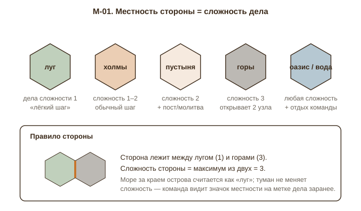
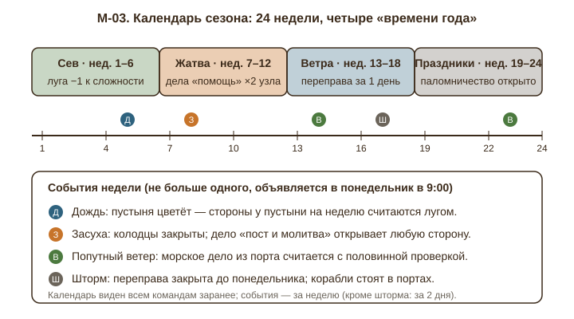
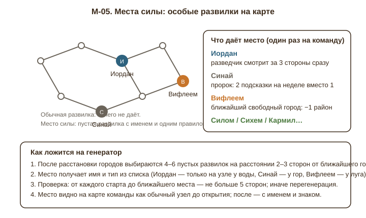
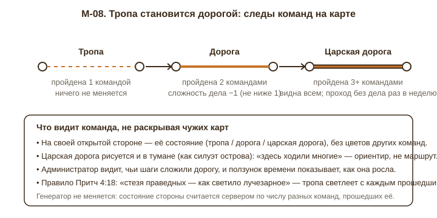
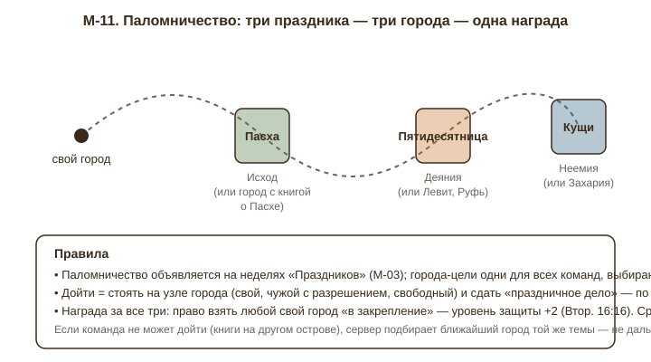
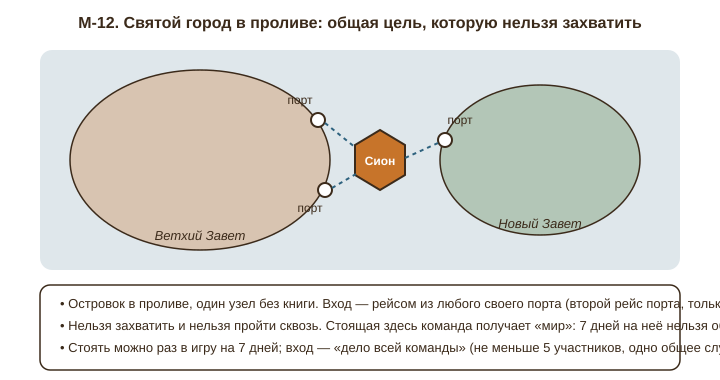

# Глава 9. Карта, мир и атмосфера

Префикс предложений: **M-**. Источники: `docs/LANDS_OF_THE_WORD.md` (§2.1–§2.3a, §2.12, §5.3, §12), `docs/proposals/water.md`, код `packages/domain/src/mapgen.ts`, `apps/api/src/services/teamMap.ts`, `apps/web/src/pages/{TeamMap,AdminMap,MapLayers,Fauna,Islets,Lakes,SeaGL}.tsx`.

## 1. Как есть

**Поле.** Два острова гексов — Ветхий Завет (39 городов, все старты команд) и Новый Завет (27 городов), между ними пролив шириной 3 гекса; Новый Завет ставится справа от Ветхого со случайным сдвигом по вертикали от −2 до +2 гексов (`mapgen.ts`, `STRAIT`, `ntCenter`). Ходят по сторонам гексов, узлы — перекрёстки; всего около 250 перекрёстков на ~115 гексов (в коде `hexCount = nodeCount / 2.15`). Города — ровно 66, между любыми двумя не меньше одной пустой развилки. Старты — внутренние перекрёстки Ветхого Завета, не ближе 8 сторон друг от друга (в режиме «равноудалённые» — по кольцу 0,6 радиуса), разница расстояний до первого города не больше 3 сторон.

**Местность.** Шесть типов: пустыня, холмы, луг, горы, оазис и вода. Тип выбирается по расстоянию от центра острова: в середине (до 0,35 радиуса) луг 60 % / холмы 25 % / оазис 15 %; в среднем поясе луг, холмы, пустыня, горы; у края пустыня 50 % / холмы 30 % / горы 15 % / оазис 5 %. Пять процентов любых гексов независимо от места становятся водой (озёра). Текстура каждого гекса повёрнута случайно. В коде это прямо названо декорацией: «Гекс — только местность (декорация и туман)» (`MapHexTile`). Местность **ни на что не влияет**: ни на дела, ни на видимость, ни на движение; `pickDeed` в `teamMap.ts` выбирает дело для стороны по свежести, флагу повтора и книге города, из которого выходит сторона, а поле `difficulty` (1–3) у дел есть, но при раздаче на стороны не используется.

**Порты и корабли.** Береговой узел — тот, у которого хотя бы один из трёх гексов вокруг отсутствует (море). Все береговые города — порты (картинка `port`), «морские» книги (Бытие, Исход, Иона, Евангелия, Деяния и т. д. — 15 книг) ставятся на берег в первую очередь. Взятый порт даёт одно морское дело; после одобрения капитан выбирает высадку на любом пустом береговом узле другого острова, ещё не открытом команде. Один рейс на порт за взятие. Внутри острова по морю не плавают. Остальные типы городов (селение, крепость, город с храмом, стан, город на холме, руины) назначаются внутренним городам случайно и тоже ничего не значат: «руины» как картинка и «руины» как состояние города после поражения команды — разные вещи.

**Туман.** Команда видит силуэт обоих островов и пролив сразу; гекс «освещён», если открыт хотя бы один из его углов-перекрёстков (`lit` в `teamMap.ts`). Неосвещённый гекс приходит клиенту без типа местности — команда действительно не знает, что под туманом. Туман рисуется облаками из шума с дрейфом. Разведка — только роль разведчика: раз в неделю «заглянуть» за одну сторону (город или пустота), на карте значок замка или подзорной трубы. Островки не имеют узлов.

**Атмосфера.** Здесь сделано много и качественно: море на WebGL с цветом по глубине, единое направление ветра, живые озёра, песчаный берег с отмелью, девять декоративных островков, живность — два кита, две косатки, две стаи дельфинов, пять чаек, клин птиц, пять парусников трёх видов с кильватерным следом и физикой разворота. Всё это — клиентская анимация, не связанная с состоянием игры: киты плывут одинаково в первую и последнюю неделю, парусники не знают, что в порту стоит корабль команды. Стартовые точки подписаны как плен (8 названий) с шестью картинками по индексу команды; предположительно при 7–8 командах название и картинка расходятся.

**Что видит администратор.** Всю карту, движение всех команд, стороны цветами команд (половинками, если прошли двое), ползунок времени с шагом в один ход, переключатель «глазами команды». У команды пройденная сторона красится только её цветом (`TeamMap.tsx`); чужого цвета на своей карте команда в коде не получает.

**Что задумано, но не сделано.** §12.2 (LOD) обещает на близком масштабе «декор (колодцы, деревья, следы)» — не реализовано. §2.12 держит колодец и кузницу в v2. `water.md` предлагает четыре именованных моря с ролями (ветер, рыба, соль, переход) — не реализовано, при этом «Великое море» по факту уже стало проливом с портами, так что часть предложения (порт) сделана иначе.

## 2. Дыры и слабые места

**2.1. Карта красива, но стратегически плоская.** Всё, что команда решает на карте, — «в какую из трёх сторон пойти». Сторона отличается от стороны только делом, а дело подбирается случайно. Значит, любой маршрут равноценен любому, и «стратегия маршрута», заявленная в §2.1, сводится к угадыванию, где города. Пример: «Моряки» стоят на развилке между горами и лугом; выбирают луг, потому что картинка приятнее. Ничего не происходит. «Колонизаторы», на которые ссылается документ, держатся ровно на том, что гекс что-то даёт; здесь гекс не даёт ничего.

**2.2. Туман — это «пустота», а не «неизвестность».** В хорошей стратегии туман обещает: там может быть что-то полезное или опасное. Здесь за туманом — либо город, либо развилка, и узнаётся это только за дело. Единственный промежуточный сигнал — разведка на одну сторону в неделю: «Берег» за месяц заглянет за четыре стороны из пятисот. Ощущение «мы исследуем мир» не возникает; возникает «мы кликаем в серое».

**2.3. Статичность.** Карта фиксируется на старте, и за полгода на ней не меняется ничего, кроме цветов сторон и владельцев городов. Нет недели, которая отличалась бы от другой. Именно поэтому через месяц-полтора команда открывает карту только чтобы взять следующее дело: смотреть там не на что. В проекте на 180 дней это главный риск удержания. Даже фоновая живность, при всей её проработке, не реагирует на игру, и через две недели её перестают замечать.

**2.4. Нет событий и погоды.** Единственное «событие» — война. Погода, сезоны, засуха, ветер — всё это в Библии постоянные действующие лица (голод в дни судей открывает Руфь; ветер разделяет море; буря в Деяниях 27), а на карте небо всегда одно и то же. Единый ветер в шейдере моря уже есть (`WIND_X, WIND_Y` в `Fauna.tsx`, ветер в `SeaGL`), но он константа — самая дешёвая возможность сделать мир изменчивым не используется.

**2.5. Реки, горы, пустыни не играют.** Горы не задерживают, пустыня не требует воды, оазис не даёт отдыха. Реки отсутствуют как класс, хотя Иордан — самая «картографическая» библейская линия: его переходят (Нав. 3), у него крестят (Мф. 3), он делит уделы. `water.md` честно оговаривает, что река «не вписывается в гексы»; на самом деле вписывается — как речная сторона (см. M-07).

**2.6. Нет «мест силы».** Между 66 городами — 180 безымянных развилок. Ни одна из них не «Вефиль», не «Синай», не «Иордан». Библейская география — это не только книги, но и места; сейчас карта рассказывает о Библии ровно 66 словами (названиями книг) плюс два названия островов и восемь названий стартов.

**2.7. Нет следов истории.** Команда «Моряки» выиграла тяжёлую битву за Псалтирь — через неделю на карте об этом ничего не напоминает. Взятые и потерянные города видны только в статистике. Пройденные стороны красятся, но «прошли» и «прошли трижды, здесь наша главная дорога» выглядят одинаково. Админский ползунок времени — хороший инструмент, но он для админа; команде свою историю никто не показывает.

**2.8. Генератор случайный, а не «мирообразующий».** Местность разбросана по гексам независимо; рядом с горой может стоять оазис, посреди пустыни — луг. Нет гор как хребта, пустыни как полосы, и любые правила по местности слабее: если горы всюду вперемешку, их всегда легко обойти. Каждое новое ограничение увеличивает число перегенераций, поэтому у предложений ниже отдельно сказано, как они ложатся на генератор.

**2.9. Второй остров — «второе поле», а не «другой мир».** Новый Завет отличается от Ветхого только набором книг: `terrainFor` раздаёт местность по одному закону для обоих островов. Переправа — единственное событие, и оно происходит один раз на порт.

## 3. Предложения

### M-01. Местность стороны определяет сложность дела

**Суть.** Сторона наследует местность двух соседних гексов; по ней генератор выдаёт дело нужной сложности (поле `difficulty` уже есть у дел). Горы — тяжёлые дела, которые открывают больше; луг — лёгкие.
**Зачем.** Закрывает 2.1: маршрут становится выбором с ценой. Использует уже существующие данные (местность гекса, сложность дела) — новых сущностей нет.
**Как работает.** Сложность стороны = максимум сложностей двух её гексов: луг 1, холмы 1–2 (случайно при генерации), пустыня 2, горы 3, оазис и озеро — «любая» (сложность не ограничивается). Море за краем острова считается лугом. `pickDeed` получает третий параметр — требуемую сложность — и фильтрует пул по ней (при нехватке дел этой сложности — ближайшая). Награда за горы: одобренная горная сторона открывает не только свой конец, но и **одну случайную соседнюю развилку** от него (не город). Пустынная сторона добавляет к делу обязательный пункт «пост или час молитвы» (направление «Молитва» из Приложения Б) — это не усложнение, а тематическая приправа. Оазис и озеро: дело любой сложности, а команда, стоящая на перекрёстке у оазиса, может раз в неделю **сменить одно взятое дело** на другое из пула (Исх. 15:27 — Елим, «двенадцать источников воды»). Значок местности показывается на метке дела заранее.
*Сценарий.* «Моряки» видят две стороны: горная («Полдня работы на стройке», сложность 3, откроет два узла) и луговая («Прийти на молитвенный час», сложность 1). У них четверо свободных на выходных — берут горы. У «Берега» сессия — идёт лугом и тратит две недели там, где «Моряки» прошли за одну.
**Риски и ограничения.** Пул дел должен иметь дела всех трёх сложностей в достаточном числе: при настройке игры показывать не одно рекомендуемое число, а три (по сложностям). Команде со стартом в горах тяжелее — генератор уравнивает старты дополнительно по «стоимости пути» до первого города (сумма сложностей вместо числа сторон), проверка та же, что для расстояний. Пустынный пост не должен быть обязательным для здоровья — формулировать как «пост или час молитвы».
**Сложность:** M · **Влияние:** 5 · **Этап:** сейчас

### M-02. Биомы вместо россыпи: генератор рисует области с именами

**Суть.** Местность генерируется не по-гексово, а областями по 4–9 гексов (хребет гор, полоса пустыни, долина лугов), и каждая область получает библейское имя: «Пустыня Син», «Галилея», «Горы Ефремовы», «Долина Изреельская».
**Зачем.** Без этого M-01 слаб (горы легко обойти). Имена областей — первый слой «карта рассказывает историю», не требующий никакой механики.
**Как работает.** В `terrainFor` вместо независимого броска — «семена» биомов: генератор ставит на остров 5–7 центров (по одному на тип, горы — ближе к краю, луга — к центру, как сейчас), каждый гекс получает тип ближайшего центра с шумом на границах. Озёра — 2–3 группы по 1–3 гекса, именованные (Галилейское, Мёртвое, как в `water.md`), а не 5 % случайных. Каждая область получает имя из списка по типу: горы — Ефремовы, Галаад, Кармил, Синай, Хорив; пустыни — Син, Фаран, Иудейская, Негев; луга — Сарон, Изреель, Галилея; холмы — Иудея, Вениамин. Имя показывается при среднем масштабе поверх области (как подписи островов, но мельче) и только над освещёнными гексами: открыв два гекса из семи, команда видит «…Ефремовы» частично — это само тянет открыть остальное. На Новом Завете список свой: Галилея, Самария, Декаполис, Асия, Македония, Ахаия — остров становится другим миром без правки картинок.
*Сценарий.* «Берег» открыл гекс, подпись «Пустыня Фаран». Капитан говорит: «Значит, справа ещё три-четыре пустынных гекса — идём вдоль, к лугу». Это первое стратегическое решение по карте, сделанное по имени, а не по делу.
**Риски и ограничения.** Проверка стартов (M-01) становится обязательной: старт внутри горной области — 3–4 тяжёлых дела подряд. Правило: старт не ставится в область типа «горы» и «пустыня». Число перегенераций вырастет; ограничить попытки 60 → 120, время генерации всё равно доли секунды.
**Сложность:** M · **Влияние:** 3 · **Этап:** сейчас

### M-03. Календарь сезона: четыре времени и погода недели

**Суть.** Игра на 24 недели делится на четыре времени по 6 недель (Сев, Жатва, Ветра, Праздники), у каждого — своё постоянное правило; сверху раз в неделю — не больше одного погодного события, известного заранее.
**Зачем.** Закрывает 2.3 и 2.4: каждая неделя отличается от предыдущей, есть повод открыть карту в понедельник.
**Как работает.** Календарь строится сервером от даты старта до `endsAt` (если срок не задан — 24 недели) и виден всем командам в боковом меню и на карте (полоска над картой: «Неделя 9 · Жатва · Дождь»). Времена: **Сев** — стороны у луга получают −1 к сложности (не ниже 1); **Жатва** — дела направления «Помощь миссионерам и большим семьям» открывают два узла (Руфь 2 — время, когда собирают колосья); **Ветра** — морское дело переправы одобряется по упрощённой проверке (летописец подтверждает без администратора, если у дела есть фотоотчёт), а корабли на карте идут заметно быстрее; **Праздники** — открыто паломничество (M-11) и памятные камни (M-09) дают двойной срок. Погода недели (случайно, с вероятностью 50 % «ясно»): **Дождь** — пустыня на неделю считается лугом (Ис. 35:1); **Засуха** — колодцы (M-06) закрыты, зато дело «пост и молитва» открывает любую сторону независимо от сложности (3 Цар. 17); **Попутный ветер** — переправа за один рейс открывает не один, а два береговых узла на выбор; **Шторм** — см. M-04. Погода объявляется в понедельник 9:00, шторм — за 2 дня. Последовательность считается от `seed` игры: администратор видит весь календарь заранее и может поправить вручную.
*Сценарий.* Неделя 8, Жатва, объявлен Дождь. «Моряки» сидят у края пустыни и планировали обходить её три недели. В понедельник видят: пустыня цветёт — берут две пустынные стороны сразу, обе с делами «помощь семье» (двойное открытие по Жатве). За неделю проходят то, что стоило бы четырёх.
**Риски и ограничения.** Календарь не должен наказывать: все события — либо бонус, либо «закрыто на неделю» с альтернативой. Засуха вместе со штормом в одну неделю запрещены (не больше одного события). Для игр короче 12 недель времена сжимаются пропорционально. Настройка «без погоды» в правилах игры — для консервативных администраторов.
**Сложность:** M · **Влияние:** 4 · **Этап:** следующий сезон

### M-04. Шторм закрывает переправу, ветер её ускоряет

**Суть.** Погодные события M-03, касающиеся моря: шторм на неделю останавливает рейсы, попутный ветер даёт выбор из двух высадок. Парусники и волны на карте показывают погоду.
**Зачем.** Переправа сейчас — одноразовое событие; погода делает пролив живым и создаёт «окна», которые нужно ловить.
**Как работает.** Шторм (не чаще 2 раз за игру, объявляется за 2 дня): кнопка высадки неактивна, морское дело можно брать и сдавать, но одобрение откладывается до понедельника; на карте шейдер моря усиливает зыбь (`SeaGL` уже параметризован амплитудой), парусники уходят в порты (в `Fauna.tsx` — новый режим маршрута «к ближайшему порту и стоять»), чайки не летают. Попутный ветер: одобренный рейс показывает два узла-кандидата, капитан выбирает один, второй остаётся «открытым, но не высаженным» — виден как развилка (город или пустота), туда можно высадиться следующим рейсом без дела. Направление ветра в шейдере и у птиц поворачивается на неделю: ветер «с Ветхого на Новый» — быстрее туда, обратный — быстрее обратно (обратный рейс с Нового Завета получает те же два кандидата).
*Сценарий.* Неделя 14, объявлен шторм с четверга. У «Берега» морское дело на проверке — летописец в среду вечером дожимает администратора, успевают высадиться. «Моряки» опоздали на день и ждут до понедельника, но за это время берут ещё один город на своём острове — шторм не отнял, а перераспределил.
**Риски и ограничения.** Шторм не должен попадать на последнюю неделю игры. Не вводить «смытые дела» (отклонённый вариант 6 из `water.md`) — только задержка одобрения. Визуальный шторм — не тяжелее текущего шейдера: меняются коэффициенты, не число проходов.
**Сложность:** S · **Влияние:** 3 · **Этап:** следующий сезон

### M-05. Места силы: именованные развилки с одним правилом

**Суть.** 4–6 пустых развилок на каждом острове получают библейские имена и по одному правилу, действующему один раз на команду при первом прибытии.
**Зачем.** Закрывает 2.6: карта начинает говорить о местах, а не только о книгах; между городами появляется зачем идти.
**Как работает.** Список мест Ветхого Завета: **Иордан** (только узел у озера или у берега) — разведчик на этой неделе смотрит за три стороны вместо одной; **Синай** (у гор) — пророк получает две подсказки на неделе вместо одной; **Вифлеем** (у луга) — ближайший свободный город для команды «на один район короче» (сервер помечает один район решённым при входе); **Силом** — команда может один раз перенести срок ответа на запрос прохода с 3 дней на 1 (Нав. 18:1 — там делили землю); **Кармил** — при следующей обороне защитники получают +1 день к сроку T (3 Цар. 18); **Вефиль** — открывает все три стороны вокруг узла как «пустота/город» (Быт. 28: «истинно Господь присутствует на месте сем»). На Новом Завете: **Галилейское озеро**, **Гефсимания**, **Дамасская дорога**, **Патмос** (островок с узлом — единственный островок, у которого появляется перекрёсток и куда можно высадиться). Место видно как обычная развилка до открытия; после открытия — с именем, значком и текстом стиха. Правило срабатывает при первом одобрении дела, ведущего в это место. Никаких повторных бонусов, никакого владения: место общее.
*Сценарий.* «Берег» открывает развилку — это Вифлеем; ближайший свободный город — Руфь, один из 10 районов зачтён, экономия 3–4 дня. «Моряки» открыли Синай перед Левитом и получили две подсказки пророка — там, где книга тяжелее всего.
**Генератор.** После расстановки городов выбираются кандидаты: пустые развилки на расстоянии 2–3 сторон от ближайшего города и не ближе 4 сторон от стартов; тип места фильтрует по местности соседних гексов (для этого удобно иметь M-02). Проверка: от каждого старта до ближайшего места ≤ 5 сторон, иначе перегенерация. Одно место на 12–15 развилок.
**Риски и ограничения.** Бонусы намеренно мелкие (одна разведка, один район, один день): место силы — приправа, не оружие. Не делать мест, дающих стихи для битвы или ключ города. Название и стих — в `content/places.json`, чтобы церкви могли править.
**Сложность:** M · **Влияние:** 4 · **Этап:** сейчас

### M-06. Колодцы (из §2.12), с цифрами

**Суть.** Реализация отложенной идеи: колодец — находка на пустой развилке, снимает один район в городе; чужая команда может засыпать, любая — выкопать заново добрым делом.
**Зачем.** Единственная «вещь» на карте, которую можно найти, потерять и восстановить; даёт карте ресурсную глубину без новой валюты.
**Как работает.** Генератор ставит 1 колодец на 20 развилок (около 8–9 на карту), только на гексах пустыни и холмов, не ближе 2 сторон к городу. Колодец не виден в тумане; открывшая узел команда видит его и получает жетон «вода» (не больше 2 на команду одновременно). Жетон тратится в задании города: один район засчитывается (кроме последнего района и кроме городов с битвой). После взятия жетона колодец «вычерпан» на 14 дней для всех. **Засыпать** (Быт. 26:15): команда, стоящая на узле колодца, может засыпать его — тогда 30 дней никто не берёт воду; действие видно администратору и записывается в летопись узла (M-09). **Выкопать** (Быт. 26:18): любая команда на узле сдаёт дело направления «Посещение» или «Помощь», и колодец снова работает; выкопавшая получает жетон сразу. Засуха (M-03) закрывает все колодцы на неделю.
*Сценарий.* «Моряки» нашли колодец у пустыни Син, взяли воду, ушли к городу Числа — один район из девяти зачтён. «Берег» приходит через неделю: колодец вычерпан, ждать 8 дней; капитан засыпает его, чтобы «Моряки» не вернулись. Через две недели третья команда выкапывает колодец, сдав дело «продукты вдове», и получает воду первой.
**Риски и ограничения.** Засыпание — единственное недоброе действие в игре; ограничить: не больше одного засыпанного колодца на команду одновременно, и выкапывание всегда возможно. Жетон не работает на столицах и на городах, где идёт битва — иначе это обход защиты. Отдельная сущность «жетон команды» нужна и для `water.md` (рыба), делать одной моделью `TeamToken { kind, count }`.
**Сложность:** M · **Влияние:** 3 · **Этап:** следующий сезон

### M-07. Реки как речные стороны и броды

**Суть.** Одна река на каждом острове — цепочка сторон гексов от озера или гор к морю; речную сторону нельзя пройти, кроме бродов, где дело двойное.
**Зачем.** Закрывает 2.5: реки делят карту на «уделы», создают узкие места и точки, за которые стоит бороться, — и это Иордан, самая понятная библейская география.
**Как работает.** Генератор строит реку как путь по рёбрам графа: от истока (озеро или горный гекс) к ближайшему берегу, длиной 6–12 сторон, без самопересечений и без прохода через города. Все рёбра реки помечаются `river: true` и **исключаются из движения** (дел на них нет), кроме 2–3 **бродов** через каждые 3–4 стороны: брод — обычная сторона, но дело на нём открывает узел только при сложности ≥ 2, и оно всегда тематическое (Нав. 3, Быт. 32:22 — Иавок). На карте река — синяя лента по стороне (граница гекса в `HexTiles`, шире и цветом воды), видна в тумане как силуэт: команда с самого начала знает, где искать брод. Разведчик на броде видит оба берега на 2 стороны. Города у реки получают картинку `walled_city` — река всегда была защитой.
*Сценарий.* «Берег» стартует на западе, все ближние города — за рекой. Из старта три выхода; два упираются в реку без брода. Команда сразу видит это в силуэте и идёт третьим, зная, что «Моряки» с востока в эту долину попадут только через дальний брод. Долина на месяц её.
**Генератор.** Проверка после реки: каждый старт по-прежнему достигает всех городов своего острова (граф связен без речных рёбер) и разница расстояний до первого города ≤ 3 с учётом бродов; иначе перегенерация. При `nodeCount` < 150 река не строится.
**Риски и ограничения.** Самая дорогая правка: модель ребра, генератор, клиент. Река не должна отрезать порт от остальной суши. Не делать реку через пролив — это уже море. Сначала одна река на Ветхом Завете (Иордан), Новый Завет — после первой игры.
**Сложность:** L · **Влияние:** 3 · **Этап:** v2

### M-08. Тропа становится дорогой

**Суть.** Сторона, пройденная двумя командами, становится дорогой (дело на ней легче), тремя и более — «царской дорогой», видной всем командам даже в тумане и проходимой без дела раз в неделю.
**Зачем.** Закрывает 2.7 и 2.3: карта помнит, кто по ней ходил, и меняется от действий команд, а не только от времени. Опоздавшие команды получают честное подспорье — они идут по протоптанному.
**Как работает.** Сервер считает для каждой стороны число разных команд, прошедших её (это уже есть в `traversed` у администратора). Состояния: **тропа** (1 команда) — только рисунок; **дорога** (2) — сложность дела −1 (не ниже 1), дело всё равно нужно; **царская дорога** (3+; Чис. 20:17) — рисуется на карте всех команд, в том числе сквозь туман (как тонкая линия без узлов и без цветов), и каждая команда раз в неделю может пройти одну сторону царской дороги без дела. Цветов чужих команд команда не видит по-прежнему — только состояние стороны. Визуально: тропа — пунктир цвета команды (как сейчас), дорога — сплошная охра, царская дорога — тёмная кайма с охрой (как римская дорога на старых картах). Притч. 4:18: «стезя праведных — как светило лучезарное» — тропа светлеет с каждым прошедшим.
*Сценарий.* Три команды за месяц прошли одну и ту же сторону между Судьями и Руфью. «Берег» отстал на две недели; в понедельник видит в тумане линию царской дороги из своей долины к центру и проходит по ней одну сторону в неделю бесплатно. Через три недели он догоняет по открытым узлам, но не по городам — дорога даёт путь, не города.
**Риски и ограничения.** Царская дорога в тумане слегка раскрывает, где толпа, — это намеренно: «где были многие» подсказывает, что там что-то есть, но не что именно. При двух командах дорога третьей ступени не появится — порог ступеней задаётся от числа команд (при 2 командах: 1 / 2 / 2 с двухкратным проходом). Генератор не меняется.
**Сложность:** M · **Влияние:** 4 · **Этап:** сейчас

### M-09. Памятные камни и летопись узла

**Суть.** На месте важного события (взятие города, отражённая атака, переправа, первая столица) на карте ставится памятный камень с надписью и датой; у каждого узла есть «летопись» — список событий, видимых тем, кто на нём стоял.
**Зачем.** Закрывает 2.7: карта хранит следы истории. К концу сезона она становится картой похода команды, которую хочется показать.
**Как работает.** Камень (Нав. 4:6 — «что значат у вас сии камни?») ставится автоматически при: взятии города (у города), победе в обороне (у города, с числом стихов), переправе (у порта и у места высадки), переносе столицы. Команда ставит камень и вручную — «Авен-Езер», 1 Цар. 7:12 — раз в месяц на любом своём узле с подписью до 60 знаков (модерация администратором как у дел). Камень виден своей команде всегда; другим — когда они открыли узел, без названия команды (секретность §2.11 не нарушается). Летопись узла — попап с событиями: «14.10 взят город», «02.11 отражена атака (37 стихов)», «21.11 засыпан колодец»; администратор видит всё с именами команд. На близком масштабе камень — маленькая картинка у узла (§12.2 обещает «декор» именно здесь). По итогам игры сервер собирает «карту похода» команды — PNG с её камнями и дорогами (M-08) — в блок «Игра завершена».
*Сценарий.* «Моряки» отбили атаку на Псалтирь, сдав 42 стиха. У города встаёт камень «Отражена атака · 42 стиха · 2 ноября». Через месяц «Берег» доходит до Псалтири, открывает узел и видит камень: «здесь отбили атаку, 42 стиха». Капитан «Берега» понимает, что защита сильная, и передумывает нападать — камень сработал как история и как информация.
**Риски и ограничения.** Текст камней — воспитательный, не насмешливый: шаблоны фиксированы, ручные подписи модерируются. Не показывать на камне чужой команды число стихов? Наоборот: это часть открытой информации об уровне защиты (§2.11 — уровень защиты чужого города виден после изучения). Хранение: таблица `NodeEvent`, для 250 узлов и полугода — сотни строк.
**Сложность:** S · **Влияние:** 3 · **Этап:** сейчас

### M-10. Руины с сокровищем

**Суть.** Города побеждённой команды (состояние «руины») и часть картинок-руин при генерации получают «сокровище»: первой команде, изучившей руины, — находка (фрагмент шифра соседнего города или жетон воды).
**Зачем.** Сейчас руины — это просто город без стихов; стимул идти к ним слабый, а к концу игры их может быть много. Сокровище делает поражение одной команды событием для всех.
**Как работает.** Два источника руин. **Древние руины**: 2–3 города на карту с картинкой `ruins` (сейчас она случайна) генератор помечает `ancient: true`; правила те же, но при взятии команда получает «находку» — один знак шифра любого города в пределах 3 сторон или жетон воды (M-06). **Свежие руины** (после поражения команды, §2.9): первая взявшая их команда получает летопись узла (M-09) и число стихов последней обороны. На карте руины дымятся (частицы из `cloudTile`). Через 30 дней после разрушения свежие руины «зарастают» — сокровище исчезает; это окно, когда к руинам стоит бежать.
*Сценарий.* «Берег» теряет столицу; пять его городов уходят в руины. У «Моряков» два из них в трёх сторонах. Они бросают текущий маршрут: руины берутся без стихов, а первый пришедший получает знак шифра города Иезекииль, который они изучают третью неделю. Гонка за руинами — самые живые две недели сезона.
**Риски и ограничения.** Находка не должна давать целый ключ — только один знак (в `rut.json` — «каждое задание даёт один знак шифра», значит одна находка = одно задание). Дым на руинах виден только тем, кто узел открыл. Участники проигравшей команды распределяются по другим (§2.9) — не давать им находку в «своих» бывших руинах, это выглядит как сговор: находку получает команда, а не человек, и правило простое.
**Сложность:** M · **Влияние:** 3 · **Этап:** следующий сезон

### M-11. Паломничество: три праздника — три города

**Суть.** Во время «Праздников» (M-03) объявляется маршрут из трёх городов-праздников (Пасха, Пятидесятница, Кущи); команда, побывавшая во всех трёх и сдавшая в каждом праздничное дело, получает +2 к защите одного своего города.
**Зачем.** Общая цель на карте, которая заставляет команды выходить из своих углов и пересекаться; поднимает середину и конец сезона, когда свободных городов мало.
**Как работает.** Втор. 16:16: «три раза в году весь мужеский пол должен являться пред лице Господа». Сервер выбирает три города по книгам, привязанным к праздникам: Пасха — Исход (запасные: Левит, Числа, От Матфея); Пятидесятница — Деяния (Левит 23, Руфь); Кущи — Неемия (Захария 14, Левит). Выбираются города, уже открытые хотя бы одной командой; если книга на другом острове, а у команды нет порта — сервер подставляет ближайший город той же темы не дальше 8 сторон от любого её узла. «Дойти» = стоять на узле города: своего, свободного (достаточно открыть узел) или чужого с разрешением прохода. В каждом городе — одно **праздничное дело** (`content/feasts.json`: общая трапеза с одинокими — Пасха; рассказать о вере пришедшему впервые — Пятидесятница; поход с младшими — Кущи), все с фотоотчётом. Срок — 6 недель времени Праздников. Награда: +2 к уровню защиты одного своего города (не столицы — иначе игра затянется) до конца игры. Владельцы городов-праздников обязаны давать проход на эти 6 недель — паломник неприкосновенен.
*Сценарий.* «Моряки» на Новом Завете, у них Деяния — Пятидесятница дома. Исход — на Ветхом, у «Берега». Они запрашивают проход, «Берег» не может отказать. Пока «Моряки» плывут обратно, «Берег» делает свой круг по Ветхому и добирается до Неемии первым. К концу шести недель обе команды закрепили по городу, а на карте стоят шесть камней с датами.
**Риски и ограничения.** Обязательный проход — единственное ограничение дипломатии; оно на 6 недель и на 3 узла, объявляется заранее. Не давать паломничество с самого старта: города должны быть открыты. Если команд больше 4, третий город выбирать так, чтобы сумма расстояний от всех столиц была примерно равной (разброс ≤ 4 сторон).
**Сложность:** M · **Влияние:** 4 · **Этап:** следующий сезон

### M-12. Святой город в проливе

**Суть.** В проливе появляется островок с одним узлом — «Сион», без книги. Его нельзя захватить и пройти сквозь; попасть можно вторым рейсом из своего порта, ценой «дела всей команды»; стоящая там команда получает 7 дней мира.
**Зачем.** Закрывает 2.9 и даёт карте центр — общую цель, на которую смотрят с обоих островов; пролив перестаёт быть пустым промежутком.
**Как работает.** Генератор ставит один островок из существующего набора (`islets.ts`) на середину пролива и даёт ему один узел (`kind: "holy"`) без сторон. У каждого взятого порта появляется второй тип рейса — «в Сион» (Пс. 121:1: «возрадовался я, когда сказали мне: пойдём в дом Господень»). Условие: дело всей команды — одно общее служение не менее чем с пятью участниками (уборка дома молитвы, вечер для пожилых, молитвенная ночь), одобряет администратор. После одобрения команда «стоит в Сионе» 7 дней: на неё нельзя объявить войну, её текущие атаки замораживаются, а её карта показывает береговые узлы обоих островов как «пусто/город» (как разведка). Один раз за игру на команду. Сион виден всем с первого дня как островок с башней; кто в нём стоит — не видно.
*Сценарий.* На «Берег» готовится атака — это видно по запросам прохода. Капитан собирает семерых на субботник в доме молитвы, сдаёт дело всей команды, и в понедельник команда стоит в Сионе. «Моряки» открывают попап Псалтири — «объявить войну» неактивна: «владелец в Сионе, мир до 20 ноября». За неделю «Берег» выбирает, куда плыть дальше.
**Риски и ограничения.** Не давать мира дольше 7 дней и не позволять входить в последние 14 дней игры (иначе укрытие от финала). «Дело всей команды» — вещь дорогая для маленьких команд: порог «не меньше половины команды, минимум 3». Узел без сторон — новая ветка в `teamMap.ts`, но тип «морское дело с заглушкой `sea:`» уже есть, рейс в Сион — его вариант с фиксированной целью.
**Сложность:** L · **Влияние:** 4 · **Этап:** v2

### M-13. Живность как подсказка

**Суть.** Часть анимации привязывается к состоянию карты команды: чайки кружат над её взятыми портами, клин птиц раз в день летит от старта команды в сторону ближайшего неоткрытого города, дельфины сопровождают её корабль, киты уходят из пролива в шторм.
**Зачем.** Живность сейчас — самая дорогая часть клиента и самая быстро «невидимая». Привязка к игре делает её полезной, а мир — реагирующим (2.3).
**Как работает.** Всё считается на клиенте по карте команды (`MyMapDto`), сервер меняется в одном месте. **Птицы к жилью** (Быт. 8:11 — голубь с масличным листом): раз в сутки клин стартует от последнего открытого узла команды и летит по прямой в сторону ближайшего неоткрытого города с шумом ±25°; сервер добавляет в `MyMapDto` одно поле `hint: { angle }`, а не координаты. Угол слабее еженедельной разведки, но виден каждый день. **Чайки** кружат над портами команды, а не по всему берегу — сразу видно, где свои корабли. **Дельфины** идут рядом с кораблём команды, пока рейс «в море» (морское дело взято, высадки нет). **Киты** покидают пролив на неделю шторма (M-04) и возвращаются с ветром — погода читается по морю без текста. **Парусники** в «Ветра» ходят на 30 % быстрее, а в шторм стоят у берега.
*Сценарий.* Каждое утро капитан «Берега» смотрит, куда полетел клин: три дня подряд — на северо-восток. Вечером он берёт две стороны в ту сторону; через неделю там город. Никто не сказал ему, где город, — птицы «показали направление», как в Библии показывали Ною.
**Риски и ограничения.** Подсказка птиц — информация; чтобы не ломать §2.11, она даёт только направление до ближайшего города с погрешностью, и её нельзя отключить ни для одной команды выборочно (одинаково для всех). При «уменьшить движение» слоя нет — подсказка дублируется значком компаса у старта, чтобы не было неравенства. Птиц не показывать первые 3 дня игры.
**Сложность:** S · **Влияние:** 2 · **Этап:** сейчас

### M-14. Ночь, звёзды и созвездия достижений

**Суть.** Карта живёт в суточном цикле (день/вечер/ночь по локальному времени зрителя); ночью над морем появляется небо, где звёзды — достижения команды, складывающиеся в созвездия.
**Зачем.** Быт. 15:5: «посмотри на небо и сосчитай звёзды». Даёт команде место, где её путь виден целиком и красиво, и повод открыть карту вечером; закрывает «статичность» с самой атмосферной стороны.
**Как работает.** Ночь — не темнота: остров чуть холоднее, море темнее (в `SeaGL` — коэффициент яркости от времени), окна городов светятся тёплыми точками при масштабе > 1,2, туман синеет. Переход по локальному времени зрителя: 21:00–06:00 ночь, 18:00–21:00 вечер; настройка «всегда день». **Звёзды**: в поясе моря за островами ночью проступает поле звёзд; часть из них — звёзды команды, зажигающиеся за события: первый город, каждая переправа, отбитая оборона, паломничество (M-11), 10 / 30 / 60 одобренных дел, каждый участник с 5 делами. Они складываются в созвездие по общему шаблону из 12 позиций («двенадцать звёзд», Откр. 12:1). Клик по звезде — событие и дата. Чужие созвездия не видны; администратор видит все рядом — это «табло» игры, только красивое.
*Сценарий.* Вечер вторника, участник «Моряков» открывает карту в телефоне: море тёмное, у Иезекииля светятся окна, над проливом семь звёзд созвездия. Восьмая позиция — «5 дел одного участника», у него четыре. Утром берёт пятое.
**Риски и ограничения.** Не привязывать к звёздам никакой игровой выгоды — только память и мотивация, иначе созвездие превращается в очки, и появится соблазн «фармить» мелкие дела. Ночной режим — на слабых телефонах не дороже дневного: те же слои, другие константы. Звёзды рисовать на канвасе тумана (он уже есть и обновляется редко).
**Сложность:** M · **Влияние:** 3 · **Этап:** следующий сезон

## 4. Порядок внедрения и что менять в генераторе

Первый шаг — то, что не требует новых сущностей и ложится на существующие данные: **M-01** (местность → сложность, у дел уже есть `difficulty`), **M-08** (дороги считаются по `traversed`), **M-09** (летопись узла — одна таблица), **M-05** (места — список в контенте плюс 4–6 узлов от генератора), **M-13** (клиент). Это даёт карте стратегию, память и реакцию за один цикл. Второй шаг — **M-02** и **M-03**: биомы и календарь превращают набор правил в мир, и на них опираются M-04, M-06, M-10, M-11. Третий — **M-07** и **M-12**, единственные, что трогают модель ребра и узла.

Генератор остаётся случайным и «перенажимаемым», но получает четыре новые проверки — уравнивание стартов по стоимости пути (M-01), запрет старта в горах и пустыне (M-02), близость места силы (M-05) и связность без речных рёбер (M-07). Все они — та же схема «попробовать до 60 раз, иначе ошибка», что уже стоит на расстояниях до первого города; лимит попыток стоит поднять, а в превью показывать администратору, какие проверки прошли (сейчас `stats` возвращает только расстояния и промежутки). Всё «сюжетное» (имена областей и мест, праздники, руины) берётся из списков в `content/`, положение — из генератора; вручную расставленных карт не требуется.

Принцип тот же, что в `water.md`: преимущество видно на карте до того, как команда пошла; ни одна механика не обходит задания города и не ослабляет защиту; у каждого места и события — библейская причина. Карта уже красива; эти четырнадцать пунктов нужны, чтобы она стала ещё и миром — с ценой пути, погодой, именами и памятью о том, кто здесь был.
