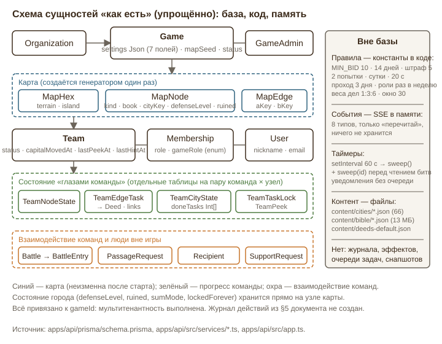
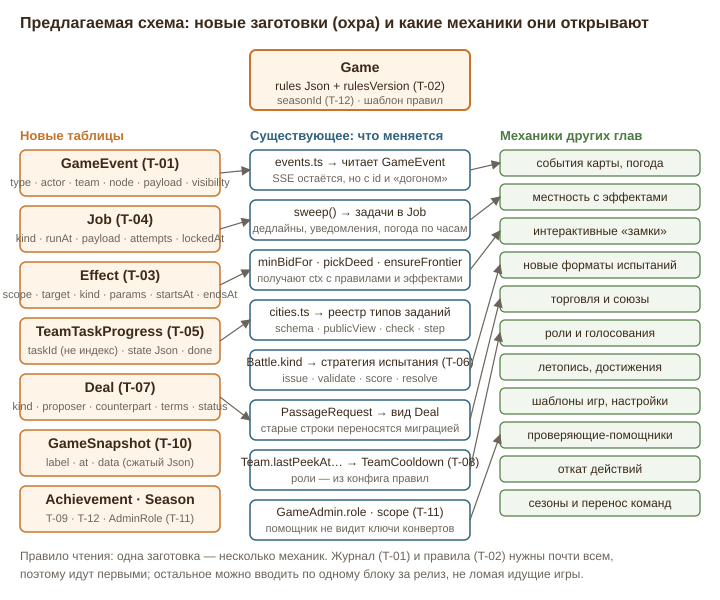
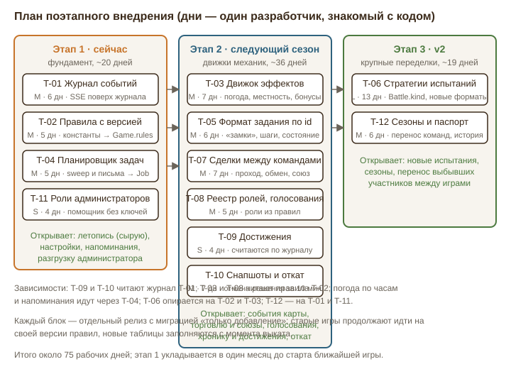

# Глава 11. Техническая реализуемость и архитектурный запас

Глава отвечает на один вопрос: выдержит ли нынешняя архитектура «Земель Слова» механики, которые предлагают остальные главы, и что заложить сейчас, чтобы каждая следующая механика стоила дни, а не недели. Трудоёмкость — в рабочих днях одного разработчика, знающего код: **S** — 1–3 дня, **M** — 4–10, **L** — 11–25. Источники: `apps/api/prisma/schema.prisma`, `apps/api/src/services/*.ts`, `apps/api/src/routes/*.ts`, `apps/api/src/app.ts`, `packages/domain/src/mapgen.ts`, крупные страницы `apps/web/src/pages/*.tsx`, §5, §6 и §12 главного документа. Всё, что названо «есть», взято из кода.

## 1. Как есть

### 1.1 Слои, процесс, деплой

Монорепозиторий из трёх частей. `packages/domain` — чистые функции без базы: генерация карты (`mapgen.ts`, 252 строки), граф гексов, берег, острова, справочник книг; есть юнит-тесты. `apps/api` — Fastify 5 + Prisma 6 + PostgreSQL 16: 13 файлов маршрутов, 16 сервисов, 11 файлов тестов (около 1 800 строк, vitest на реальном Postgres в CI). `apps/web` — React 19, Vite 7, PWA; карта рисуется своими слоями (PixiJS из §12.1 не используется — выбран SVG + canvas + WebGL).

Продакшен — один контейнер `app` (API раздаёт и веб-клиент), `db`, `caddy` на одном VPS. Деплой: push в ветку → GitHub Actions (миграции, typecheck, тесты, сборка) → образ в GHCR → SSH → `deploy/deploy.sh`. Схема прошла 26 миграций за неполный месяц: темп высокий, и новые механики не должны требовать переписывания старых таблиц.

Два свойства определяют архитектурный запас:

- **Живые события — в памяти одного процесса.** `services/events.ts` держит `Map<gameId, Set<reply>>` и по каждой мутации шлёт SSE-событие одного из восьми типов (`game | map | teams | deeds | tasks | submissions | cities | battles`) с необязательным `teamId`. Событие означает только «перечитай»; содержимого нет, история не хранится, после переподключения клиент перезагружает всё (`useGameEvents.ts`).
- **Таймеры — `setInterval` раз в 60 с** в `app.ts`: `sweep()` по всем активным играм проверяет срок игры, просроченные запросы прохода, сгоревшие атаки и просроченные обороны; тот же `sweep(id)` вызывается перед чтением в шести маршрутах битв. Письма и push уходят как `void (async () => …)()` — без очереди, повторов и записи о доставке (`notify.ts`).

### 1.2 Схема данных

Схема разложена по владельцам данных. Карта (`MapHex`, `MapNode`, `MapEdge`) создаётся генератором и после старта не меняется. Всё, что видит и делает команда, лежит в таблицах «команда × узел»: `TeamNodeState` (узел открыт), `TeamEdgeTask` (дело на стороне: статус, ссылки, решение, морской рейс, пожертвование), `TeamCityState` (порядок районов, `doneTasks Int[]`, взят ли город, столица, штраф к ставке, подсказки), `TeamTaskLock` (две попытки и суточная блокировка для заданий с выбором), `TeamPeek`. Взаимодействие команд — `Battle` + `BattleEntry` (полный автомат состояний испытания, диапазоны стихов по участникам) и `PassageRequest` (проход, три дня на ответ). Люди вне игры — `Recipient` (подпись и тип, стирается при завершении). Всё привязано к `gameId`: мультитенантность из §6.3 выполнена.

Три особенности, важные для расширения:

1. **Состояние города хранится на узле карты.** `MapNode` несёт не только `kind`, `bookCode`, `cityType`, `coastal`, но и `cityKey`, `cityCode`, `defenseLevel`, `sumMode`, `lockedForever`, `ruined`, `recipientId` — четыре булевых «особых случая» и уровень, каждый со своей миграцией и своей веткой `if` в `warOptions`, `startNextFromQueue`, `resolveWon`, `capture`.
2. **Прогресс по заданиям — по индексам.** `doneTasks` — номера заданий в `content/cities/<книга>.json`; знак шифра `cityCode[i]` и `TeamTaskLock` тоже привязаны к индексу.
3. **Настройки игры — `Game.settings Json` из семи полей** (`nodeCount`, `equidistantStarts`, `maxStartDistanceDiff`, `includeGenealogies`, `endsAt`, `donationMin`, `donationCurrency`) без версии и схемы в базе; после старта меняются только срок и пожертвование.

Из §5 документа не реализованы `AuditLog`, `Notification`, `AnalyticsEvent`, `PassageToken`, `Embassy`, `rules_config` и перенос участников выбывшей команды (5.2, п. 4а).

### 1.3 Где живут правила

Принцип §6.3 «правила — в конфиге игры, не в коде» не выполнен. Константы: `MIN_BID = 10`, `ATTACK_LIMIT_MS = 14 дней`, `BURN_PENALTY = 5`, минимум обороны 60 с (`battles.ts`); `WRONG_COOLDOWN_MS = 20 с`, `CHOICE_ATTEMPTS = 2`, `LOCK_MS = 24 ч` (`cities.ts`); `PASSAGE_TTL_MS = 3 дня`, неделя для разведчика и пророка, `HINT_MAX = 60` (`diplomacy.ts`); `NO_REPEAT_WINDOW = 30`, веса дел `1 : 3 : 6` (`teamMap.ts`); порядок первенства в `standings()`. Логика испытания (`sumVerses`, `minBidFor`, `maybeStartDefense`, `resolveWon`) написана чистыми функциями с тестами, но лежит в `apps/api/src/services`, а не в `packages/domain`.

### 1.4 Задания городов и безопасность ответов

Контент — 66 файлов `content/cities/*.json`, zod-схема, кэш в памяти. Четыре типа (`number`, `text`, `choice`, `order`); проверка только на сервере (`checkAnswer`); ответы клиенту не уходят; варианты и районы перетасованы по HMAC от `SESSION_SECRET` и команды; администратор игры видит задания без ответов (`stripAnswers`). Основа добротная, но новый тип задания трогает пять мест: zod-схему, `publicTask`, `checkAnswer`, `stripAnswers` и `TaskView` в `CityPopup.tsx` (плюс показ ответа в `CitySheet`). Защита от перебора неравномерна: у `choice` — две попытки и сутки блокировки; у `number` и `text` — только пауза 20 с, попытки не ограничены.

### 1.5 Карта в браузере

Восемь слоёв: море (WebGL-шейдер на каждый пиксель, ~30 кадров в секунду при разрешении 0,7), берег и острова (canvas), гексы (canvas-растр с обновлением после «успокоения» вида), озёра (WebGL), мир (SVG размером с экран), туман (canvas, 24 кадра), живность (canvas, `Fauna.tsx` — 1 240 строк), подписи и значки (второй SVG). Детализация — порогами масштаба (`showMarkers` при k ≥ 0,9, `fullLabels` при k ≥ 1,6). Замеры с устройств (`UiMetric`: fps, доля длинных кадров, LCP, класс устройства) уже собираются — есть чем мерить последствия любой механики на телефоне. Ответ `GET /my-map` содержит все гексы, открытые узлы, стороны, дела и сводку по городам; любая механика «на карте» расширяет этот ответ и overlay-SVG.

### 1.6 Роли, администраторы, персональные данные

Игровые роли — `enum GameRole` из четырёх значений; проверки разбросаны по `teams.ts`, `diplomacy.ts` (`canSpeak`, разведка, подсказка) и `teamMap.ts` (летописец); недельные ограничения — колонки `Team.lastPeekAt`, `Team.lastHintAt`. `GameAdmin` — единственный уровень доступа: любой администратор игры видит ключи конвертов всех городов и решает по всем сдачам. `Recipient` стирается при завершении; почта администраторов маскируется; `SupportRequest.context` хранит снимок с никнеймом; ссылки на видео (`BattleEntry.links`, `TeamEdgeTask.links`) хранятся бессрочно.

## 2. Дыры и слабые места

### 2.1 Правила зашиты в код

Администратор запускает трёхнедельную игру для лагеря и хочет лимит атаки 5 дней вместо 14. Сегодня это правка `ATTACK_LIMIT_MS` и деплой — лимит меняется у **всех** идущих игр, включая ту, где «Моряки» третий день учат отрывок в расчёте на 14. Обратный случай: владелец поднимает штраф с 5 до 8 — история `attackPenalty` старых игр становится несопоставимой, а в `BattlePanel` «на 5 стихов» зашито строкой. Без версии правил нельзя ни менять их по ходу игры (документ это требует), ни объяснить команде, по каким правилам считалось решение месяц назад.

### 2.2 Нет журнала: споры, летопись и аналитика собираются из обломков

«История ходов» (`Timeline.tsx`) восстанавливает ход игры из `revealedAt`, `decidedAt`, `capturedAt` — и теряет всё, что не оставило отметки: потерянные города (после проигрыша `capturedAt = null`), отменённые вызовы, отзыв прохода, тестовые действия. Спор: «Берег» утверждает, что взял дело из города «Моряков» до отзыва прохода; `closePassage` делает `deleteMany` по открытым делам — строки нет, времени нет, разбирать нечего. Тот же изъян бьёт по летописи, достижениям, аналитике и откату: все четыре — чтение ленты, которой не существует.

### 2.3 Прогресс по индексам

Добавить в `rut.json` задание между районами — и `doneTasks` у команд, уже решавших Руфь, сдвинутся, а знаки шифра перепутаются: команда получит букву не того задания, тогда как конверт у адресата напечатан со старым шифром. Интерактивные «замки» (многошаговые задания с состоянием) в модель не укладываются вовсе: у `TeamCityState` нет места для промежуточного состояния.

### 2.4 Таймеры и уведомления не переживают сбоев

Нет способа назначить действие на будущее: «в понедельник в 08:00 сменить погоду», «за сутки до дедлайна обороны напомнить капитану», «через 30 дней после финиша стереть ссылки». Уведомление — одна попытка: сбой SMTP в момент вызова — и «Берег» не знает, что его столице бросили вызов, пока кто-то не откроет карту. `sweep()` по всем играм раз в минуту делает по 4–6 запросов на игру: при десятках игр «по всему братству» цикл станет заметным. Второй экземпляр приложения удвоит все таймерные действия.

### 2.5 Нет модели эффектов

Каждый модификатор — колонка и ветка `if`; уже четыре: `ruined`, `lockedForever`, `sumMode`, блокировка прохода. Погода, местность, бонусы союзов, временное ослабление города — ещё восемь–десять колонок и по ветке в `minBidFor`, `pickDeed`, `ensureFrontier`, `startAttack`; конфликты эффектов никто не тестировал.

### 2.6 Роли и ограничения — в enum и колонках

Пятая роль — миграция enum, две колонки на `Team`, правки в трёх маршрутах и в клиенте. Голосование внутри команды не имеет ни модели, ни места: `make-capital` требует только `role === CAPTAIN`.

### 2.7 Разрушающие операции без следа и без отката

`onCityOwned` и `closePassage` удаляют открытые дела, `removeDeed` переназначает, `finishGame` стирает адресатов, тестовые действия (`assign`, `study`, `reveal`) необратимы. Единственный откат — `deploy/restore.sh` из ночного бэкапа: всех игр сразу и на сутки назад. Ошибочное «Отдать город» чинится руками в базе.

### 2.8 Нагрузка на администратора растёт с каждой механикой

Каждая сдача дела и каждая запись в испытании (по одной на диапазон стихов на участника — у команды из десяти человек это десять и более записей за вызов) требует нажатия. `notifyAdmins` пишет всем сразу, распределения нет. Помощника подключить нельзя: любой `GameAdmin` видит `cityKey` всех городов — ключ к захвату без конверта. Новые форматы заданий, испытаний, сделок добавят очереди на проверку, и администратор станет узким местом раньше сервера.

### 2.9 Безопасность ответов при усложнении заданий

Интерактивные «замки» соблазняют перенести логику в браузер (анимация, проверка «на лету») — тогда ответ окажется в бандле. У `number` и `text` нет лимита попыток, а числовые ответы часто малы («сколько сыновей») — пауза 20 с даёт 180 попыток в час.

### 2.10 Персональные данные при сезонах

Сезоны и перенос команд создают сквозной профиль человека между играми — сегодня его нет, и это правильно. Ссылки на видео с лицами живут бессрочно, хотя нужны до решения администратора и ещё пару недель для споров. Летопись и достижения обязаны наследовать правило `Recipient`: минимум и стирание по сроку.

### 2.11 Карта на телефоне и один экземпляр

Восемь слоёв, два из них WebGL на каждый пиксель: новая полноэкранная «погода» съест кадры, которых уже нет на средних телефонах; `my-map` перечитывается целиком по каждому событию `map`. SSE в памяти и `setInterval` в процессе означают один экземпляр приложения — для одного VPS правильно, но «всё братство» с сотней игр и обновлением без простоя потребует журнала и очереди в базе.

## 3. Готовность по областям

| Область | Что уже есть | Чего не хватает | Оценка | Главный риск |
|---|---|---|---|---|
| События карты и погода | `MapHex.terrain`, SSE, `sweep`, `UiMetric` | события с датой, планировщик, эффекты, слой без нового canvas | M при T-01/03/04, иначе L | кадры на телефоне |
| Местность с эффектами | `terrain`, `coastal`, `island` | атрибуты сторон, точки применения в `pickDeed`/`minBidFor`/`ensureFrontier` | M | конфликт эффектов |
| Интерактивные «замки» | 4 типа, серверная проверка, HMAC-id | задания по id, состояние шага, реестр типов, лимит попыток | M–L | утечка логики в клиент |
| Новые форматы испытаний | автомат `Battle`, записи по стихам | `Battle.kind`, стратегия выдачи/проверки/итога | L | нагрузка на проверяющего |
| Торговля и союзы | `PassageRequest`, посол | общая «сделка», союз как состояние | M–L | давление между командами |
| Роли и голосования | `GameRole`, недельные ограничения | реестр ролей в правилах, `Vote` | M | сложность интерфейса |
| Летопись/хроника | `Timeline` из дат, `standings` | лента событий с видимостью | S после T-01 | личные данные в ленте |
| Достижения | ничего | определения, таблица, пересчёт по журналу | S–M после T-01 | геймификация вместо служения |
| Шаблоны игр и правила | `Game.settings` (7 полей) | схема с версией, шаблоны, история | M | смена правил в идущей игре |
| Проверяющие-помощники | `GameAdmin`, `decidedById` | роль/область, взятие на проверку, сокрытие ключей | S–M | утечка ключа конверта |
| Откат действий | тестовые действия, бэкап базы | снапшоты, компенсирующие операции | M после T-01, иначе L | частичный откат ломает связность |
| Сезоны и перенос команд | `Organization`, `Game.status` | `Season`, перенос, паспорт участника | M | сквозной профиль |

Девять областей из двенадцати упираются в четыре недостающих блока — журнал, конфиг правил, планировщик, эффекты. С ними остальное превращается в работу «S–M на механику».

## 4. Предложения

### T-01. Журнал событий игры — единая лента с типами

**Суть.** Таблица `GameEvent` (`gameId`, `seq` — монотонный номер внутри игры, `type`, `actorUserId?`, `teamId?`, `nodeKey?`, `payload Json`, `visibility: PUBLIC | TEAM | ADMIN`, `at`), куда пишется каждая значимая мутация в той же транзакции, что и изменение данных. SSE начинает слать `seq` и `type`, а клиент после переподключения запрашивает «всё после seq N» вместо полной перезагрузки.
**Зачем.** Закрывает 2.2, 2.7, 2.11 и даёт сырьё летописи, достижениям, аналитике, откату, разбору споров и напоминаниям. Это `AuditLog`, обещанный в §5 и §6.3.
**Как работает.** Типы — одно перечисление в `packages/domain` (около 30 на старте: `node.revealed`, `deed.submitted`, `deed.decided`, `city.captured`, `city.lost`, `battle.declared`, `battle.entry`, `battle.resolved`, `passage.requested/decided/revoked`, `capital.moved`, `role.assigned`, `admin.override`, `rules.changed`…). Хелпер `logEvent(tx, …)` принимает транзакцию Prisma, поэтому `deleteMany` в `onCityOwned` и `closePassage` предваряется событием с перечнем убранных сторон. Сценарий: «Моряки» оспаривают отзыв прохода; администратор открывает ленту города и видит `passage.revoked` в 21:14 и `deed.taken` «Берегом» в 21:02 — спор решён за минуту. Команде лента фильтруется по `visibility` и `teamId`: чужие ходы в тумане невидимы.
**Риски и ограничения.** Около 40 событий на команду в неделю: 8 команд за 3 месяца — до 5 000 строк на игру, индекс `(gameId, seq)`. В `payload` нельзя класть ответы, ключи конвертов и ссылки на видео — только идентификаторы. Старые игры получают ленту с момента выката.
**Сложность:** M (5–7 дней) · **Влияние:** 5 · **Этап:** сейчас

### T-02. Конфиг правил игры в JSON с версией

**Суть.** `Game.rules Json` и `Game.rulesVersion Int`; zod-схема `RULES_V1` в `packages/domain` со значениями по умолчанию, равными сегодняшним константам; все числа из 1.3 читаются через `rulesOf(game)`; изменение в идущей игре пишет `rules.changed` (T-01) и разрешено только полям с пометкой `liveEditable`.
**Зачем.** Выполняет §6.3, закрывает 2.1, даёт основу шаблонам («лагерь на 3 недели», «только Новый Завет») и переключателям других глав без деплоя.
**Как работает.** Разделы: `battle` (`minBid 10`, `attackLimitDays 14`, `burnPenalty 5`, `minDefenseSeconds 60`), `city` (`choiceAttempts 2`, `lockHours 24`, `wrongCooldownSeconds 20`, новое `textAttempts 6`), `diplomacy` (`passageDays 3`), `roles` (`peekCooldownDays 7`, `hintCooldownDays 7`, `hintMaxVerses 60`), `deeds` (`noRepeatWindow 30`, `frequencyWeights [1,3,6]`), `map` (семь нынешних полей `settings`). Шаблон — тот же JSON с названием в `RulesTemplate`. При старте игры версия и снимок правил фиксируются; правка константы в коде меняет только `defaults` для новых игр. Сценарий: администратор лагерной игры «Берег против Моряков» ставит `attackLimitDays: 5`; текст в `BattlePanel` берёт число из `rules`, а не из строки.
**Риски и ограничения.** Миграция заполняет `rules` у существующих игр значениями по умолчанию. Интерфейс показывает 8–10 полей, остальное — «расширенные». Тесты правил получают `rules` параметром — это заодно вытолкнет логику `battles.ts` в `packages/domain`.
**Сложность:** M (4–6 дней) · **Влияние:** 5 · **Этап:** сейчас

### T-03. Движок эффектов узла, стороны и команды

**Суть.** Таблица `Effect` (`gameId`, `scope: GAME | TEAM | NODE | EDGE | HEX`, `targetKey`, `kind`, `params Json`, `startsAt`, `endsAt?`, `sourceEventId?`) и чистая функция `applyEffects(ctx, base)` в `packages/domain`, вызываемая в четырёх точках: минимальная ставка, выбор и вес дела, проходимость стороны, длительности таймеров. Постоянные `ruined`, `lockedForever`, `sumMode` остаются; новые модификаторы делаются только эффектами.
**Зачем.** Погода, местность, бонусы союза, временное ослабление города, «неделя милосердия» (дела по посещению весят втрое) — один механизм вместо колонок и веток (2.5).
**Как работает.** `kind` — ограниченный список: `bid_delta {value}`, `deed_weight {direction|difficulty, factor}`, `edge_blocked {reason}`, `timer_factor {which, factor}`, `reveal_radius {value}`. Эффекты читаются одним запросом на игру и кэшируются 30 с. Сценарий: «Буря на море» (T-04 ставит её на субботу) создаёт `Effect{scope: EDGE, targetKey: 'sea:*', kind: edge_blocked, endsAt: +48h}` — `ensureFrontier` двое суток не создаёт морских рейсов, «Моряки» видят значок бури у порта. Горная сторона: `Effect{scope: HEX, kind: deed_weight, params: {difficulty: 3, factor: 2}}` — тяжёлые дела чаще выпадают в горах.
**Риски и ограничения.** Порядок применения детерминирован: дельты, множители, запреты. Каждый `kind` — тесты на конфликт с постоянными флагами. Эффекты не меняют начатое испытание задним числом: `startAttack` фиксирует применённые значения в `Battle`.
**Сложность:** M (6–8 дней) · **Влияние:** 5 · **Этап:** следующий сезон

### T-04. Планировщик фоновых задач по расписанию

**Суть.** Таблица `Job` (`kind`, `runAt`, `payload Json`, `attempts`, `lockedAt?`, `doneAt?`, уникальный `idempotencyKey`) и цикл раз в 30 с с `SELECT … FOR UPDATE SKIP LOCKED`. `sweep()` разбивается на задачи с точным временем: дедлайн атаки ставится в `startAttack`, обороны — в `maybeStartDefense`, срок прохода — при запросе, срок игры — при старте. Уведомления становятся задачами с тремя попытками.
**Зачем.** Закрывает 2.4 и 2.11: будущие события (погода, напоминания, стирание ссылок по сроку), надёжная доставка писем, возможность второго экземпляра.
**Как работает.** `sweep(id)` перед чтением остаётся страховкой. Новые задачи: `remind.defense {battleId}` за 24 ч до дедлайна, `weather.roll {gameId}` по расписанию из правил, `retention.links {gameId}` через 30 дней после финиша — заменяет `links` на `[]` у решённых сдач, оставляя решение и комментарий. Сценарий: у «Берега» оборона до среды 19:00; во вторник в 19:00 капитан получает push «остались сутки, принято 14 из 22» — сегодня обороны сгорают молча.
**Риски и ограничения.** Двойное исполнение при сбое между выполнением и `doneAt` — задачи идемпотентны (проверяют состояние перед действием, как уже делает `resolveWon`).
**Сложность:** M (4–5 дней) · **Влияние:** 4 · **Этап:** сейчас

### T-05. Универсальный формат интерактивного задания

**Суть.** У задания в `content/cities/*.json` появляется устойчивый `id` (например `rut-d3`) и `version`; прогресс переезжает из `doneTasks Int[]` в `TeamTaskProgress` (`teamId`, `nodeKey`, `taskId`, `state Json`, `done`, `attempts`, `lockedUntil`), поглощающую `TeamTaskLock`. На сервере — реестр `TaskPlugin { schema, publicView, check, initialState?, step? }`; клиент рендерит по `type` через таблицу компонентов.
**Зачем.** Закрывает 2.3 и 2.9: «замки» с шагами и состоянием, новые типы без правки пяти файлов, единый лимит попыток.
**Как работает.** `step(state, input) → { state', done?, reveal? }` выполняется только на сервере; клиент получает `publicView(state)` — например, какие засовы открыты — и никогда условие проверки. Знак шифра привязан к `taskId`: `cityCode` становится картой `{taskId: знак}`, новые задания получают знаки при первом обращении, конверты не пересчитываются. Миграция переводит индексы в `id` по текущему содержимому файлов — соответствие однозначно, пока файлы не менялись, поэтому её нужно выкатить **до** первой правки контента. Сценарий: «замок» в городе Есфирь — три вопроса подряд; «Моряки» ошибаются на втором, состояние сохраняется, через сутки продолжают со второго.
**Риски и ограничения.** Самый рискованный шаг — миграция прогресса: сухой прогон и сверка числа решённых заданий по каждой команде. Плагин обязан объявлять `maxAttempts` — по умолчанию из правил.
**Сложность:** M (5–7 дней) · **Влияние:** 4 · **Этап:** сейчас (миграция) / следующий сезон (новые типы)

### T-06. Стратегии испытаний вместо одного автомата

**Суть.** `Battle.kind` (по умолчанию `verses_sum`) и интерфейс `ChallengeStrategy { issue, validateEntry, score, resolve }`. Нынешняя логика — первая стратегия; правила перечисляют разрешённые виды.
**Зачем.** Другие главы предлагают иные форматы испытаний (пересказ, вопросы по книге, совместное чтение); сегодня каждый — переписывание `battles.ts` и `BattlePanel.tsx` (по 285 строк).
**Как работает.** Общее остаётся в автомате: очередь, дедлайны, симметрия T, штрафы, столица, руины. Стратегия отвечает за «что выдать», «что считать записью», «как посчитать» и «кто победил». `BattleEntry` получает `payload Json` для записей не по стихам. Сценарий: вызов `questions_20` — обеим сторонам по 20 вопросов из контента города (T-05 даёт формат), счёт — верные ответы, ничья — за хранителями.
**Риски и ограничения.** Крупная переделка самого сложного модуля; только после T-02 и T-03, с прогоном `battles.test.ts` на стратегии `verses_sum`. Ответы по вопросам проверяются автоматически — это разгружает администратора, а не нагружает.
**Сложность:** L (11–15 дней) · **Влияние:** 4 · **Этап:** v2

### T-07. Универсальная сделка между командами

**Суть.** Таблица `Deal` (`gameId`, `kind`, `proposerTeamId`, `counterpartTeamId`, `terms Json`, `status: PENDING | ACCEPTED | DECLINED | EXPIRED | REVOKED`, `expiresAt`) с исполнителем по `kind`. `PassageRequest` переносится миграцией как `kind = passage`; `canSpeak` — общая проверка для всех сделок.
**Зачем.** Торговля, союзы, обмен проходами, посольство (§2.14 Б) — сегодня каждая потребовала бы своей таблицы и трёх маршрутов.
**Как работает.** `terms` — zod-схема на вид: `passage {nodeKey}`, `swap_passage {myNode, theirNode}`, `alliance {days}`, `gift_hint {taskId}`. Принятие создаёт эффекты (T-03) и события (T-01): союз на 14 дней — `Effect{scope: TEAM, kind: no_attack_between, endsAt}` для обеих команд, и `warOptions` отказывает в вызове с понятной причиной. Сценарий: «Моряки» предлагают «Берегу» обмен проходами через два порта; посол «Берега» принимает; обе стороны получают дела из чужих городов, всё видно в ленте.
**Риски и ограничения.** Сделки — место для давления между командами: каждая видна администратору, в правилах — предел активных сделок на команду (например, 3). Срок ответа и «молчание = отказ» наследуются от прохода.
**Сложность:** M (6–8 дней) · **Влияние:** 4 · **Этап:** следующий сезон

### T-08. Реестр ролей и голосования в команде

**Суть.** Роли описываются в правилах (T-02): `{ key, capabilities, cooldowns }`; `Membership.gameRole` — строка с проверкой по реестру; ограничения переезжают из колонок `Team` в `TeamCooldown (teamId, key, until)`. Таблицы `Vote` (`teamId`, `subject`, `payload`, `closesAt`, `threshold`) и `VoteBallot`.
**Зачем.** Закрывает 2.6: новые роли без миграций; голосование как общий механизм для необратимых решений.
**Как работает.** `m.gameRole === "SCOUT"` заменяется на `can(membership, "peek")`. Голосование: капитан открывает вопрос, участники голосуют в попапе, при пороге (например 2/3) выполняется тот же код, что и при решении капитана. Сценарий: капитан «Берега» хочет уступить столицу под вызовом; правила требуют голосования; за сутки 6 из 9 «за» — город уступается, `vote.passed` в ленте.
**Риски и ограничения.** Голосования замедляют игру — только для необратимых решений и с коротким сроком (24 ч). Инвариант «одна роль — один участник» сохраняется.
**Сложность:** M (4–6 дней) · **Влияние:** 3 · **Этап:** следующий сезон

### T-09. Система достижений

**Суть.** Определения в `content/achievements.json` (`id`, название, условие как тип + параметры, кому — команде или участнику), таблица `AchievementAward (gameId, teamId?, userId?, achievementId, at, eventSeq)`; вычислитель — задача T-04 по новым событиям T-01.
**Зачем.** Награды за путь, а не только за победу; с журналом это фильтр по ленте.
**Как работает.** Условия ограничены набором: `count(type, n)` («10 дел одобрено»), `first(type)` («первый город на другом острове»), `streak(type, days)` («сдачи 4 недели подряд»), `combo`. Вычислитель идемпотентен: `eventSeq` хранит, до какого события посчитано. Достижения участника видны ему и его команде, не публично. Сценарий: «Моряки» первыми высадились на Новый Завет — достижение «Апостольский путь», значок у названия команды.
**Риски и ограничения.** Достижения не дают игровых преимуществ (только значок), условия поощряют посещение, молитву, помощь, а не число ссылок. Список утверждает владелец.
**Сложность:** S–M (3–5 дней после T-01/T-04) · **Влияние:** 3 · **Этап:** следующий сезон

### T-10. Снапшоты состояния и «отменить» для администратора

**Суть.** Таблица `GameSnapshot (gameId, at, label, byUserId, data Bytea)` — сжатый JSON таблиц «глазами команды» плюс `Battle`, `Deal`, `Effect` (карта не входит). Снимок делается автоматически перед разрушающими действиями (тестовые действия, `finishGame`, замена набора дел) и по кнопке. Плюс компенсирующие операции для десятка типов событий T-01 (`deed.decided` → вернуть в `SUBMITTED` и закрыть узел, если из него ничего не сделано; `passage.revoked` → вернуть; `city.assigned` → снять) с кнопкой «Отменить» в течение 10 минут.
**Зачем.** Закрывает 2.7: ошибка администратора перестаёт требовать правки базы или отката всего сервера.
**Как работает.** Снимок игры с 8 командами — 3–5 тысяч строк, сжатый JSON 200–400 КБ; хранить последние 20 на игру. Восстановление — транзакция «удалить состояние, вставить из снимка» с `admin.restore` в ленте и уведомлением командам. Компенсация — основной путь, снимок — крайний. Сценарий: администратор нечаянно вернул одобренное дело «Берега», узел закрылся; «Отменить» в тосте — статус и узел возвращаются, в ленте два события.
**Риски и ограничения.** Компенсация возможна, пока от действия ничего не зависело (проверка по ленте после `eventSeq`); иначе — снимок. Снимок откатывает и честные действия других команд — обязательное предупреждение и уведомление.
**Сложность:** M (5–8 дней после T-01) · **Влияние:** 4 · **Этап:** следующий сезон

### T-11. Роли администраторов и очередь проверки

**Суть.** `GameAdmin.role: OWNER | REVIEWER | OBSERVER` и `scope: ['deeds', 'battles', 'passages']`; `REVIEWER` не видит `cityKey`, `cityCode` и ответы, а видит очередь своей области; «взять на проверку» (`claimedById`, `claimedAt`) на `TeamEdgeTask` и `BattleEntry`; уведомления о сдачах — только по области и сводкой не чаще раза в 15 минут.
**Зачем.** Закрывает 2.8: помощники без риска для ключей конвертов, распределение работы, видимость «висящих» сдач.
**Как работает.** `submissions`, `battles`, `decide` проверяют область; `CitySheet` для `REVIEWER` отдаёт узел без ключей (как `stripAnswers` для ответов). Показатели очереди — среднее время до решения и число сдач старше 48 ч. Сценарий: 8 команд, 3 помощника — один на дела, двое на испытания; «Моряки» сдали вызов десятью записями — их видят только проверяющие испытаний, один берёт весь вызов одним нажатием.
**Риски и ограничения.** `OWNER` — единственный, кто печатает ярлыки и видит ключи; ограничение пронести через `labelsPdf` и `recipients`. Срочное (вызов столице) по-прежнему уходит сразу.
**Сложность:** S–M (3–4 дня) · **Влияние:** 4 · **Этап:** сейчас

### T-12. Сезоны и перенос команд

**Суть.** `Season (orgId, name, startsAt, endsAt)` и `Game.seasonId?`; при завершении игры — `ParticipantRecord (seasonId, userId, gameId, teamName, cities, deedsApproved, battlesWon, achievements)` только из агрегатов; перенос участников выбывшей команды (5.2, п. 4а) — мастер администратора: распределить поровну, подтвердить, записать `member.transferred`, роли снять.
**Зачем.** Сезон как рамка нескольких игр организации, таблица сезона, история участника — без сквозного профиля, которого нет и который без согласия не нужен.
**Как работает.** Перенос — единственная операция, меняющая `Membership` в идущей игре; пишет событие и уведомляет обе команды. Запись сезона создаётся в `finishGame` рядом с `purgeRecipients`. В аккаунте — переключатель «показывать мою историю команде», по умолчанию выключен. Сценарий: «Берег» потерял столицу; администратор видит 7 участников и 3 команды в строю, нажимает «распределить», правит двоих, подтверждает — участники получают письмо с новой командой.
**Риски и ограничения.** История участника — персональные данные: срок хранения (два сезона) и удаление вместе с аккаунтом. Перенос посреди испытания: `BattleEntry` остаются у старой команды, новые записи — за новую.
**Сложность:** M (5–7 дней) · **Влияние:** 3 · **Этап:** v2

## 5. Сквозные требования к любой механике

**Карта на телефоне.** Механика рисуется значком в overlay-SVG (`MapSymbols`) или подкраской существующего слоя (погода — оттенок и плотность в `FogLayer`, огонь — анимированный `<use>` у города), а не новым полноэкранным canvas; её данные приходят отдельным запросом по своему типу события, а не расширением `my-map`. Порог принятия — по `UiMetric`: медиана fps на телефонах не падает больше чем на 10 % относительно недели до выката.

**Нагрузка на администратора.** У каждой механики считается «число нажатий администратора на команду в неделю»; всё, что проверяется автоматически (ответы по контенту, сроки, голосования), проверяется автоматически, остальное идёт в очередь T-11 с областью.

**Безопасность ответов.** Проверка — только сервер; клиент получает представление, а не условие; состояние задания живёт в `TeamTaskProgress`, лимит попыток — для всех типов из правил.

**Персональные данные.** Правило `Recipient` как эталон: минимум, привязка к игре, стирание по сроку задачей T-04; в журнале, достижениях и записях сезона — только идентификаторы и числа.

## 6. План внедрения

**Этап 1 — сейчас, до ближайшей игры (около 20 дней):** T-01 журнал, T-02 правила с версией, T-04 планировщик, T-11 роли администраторов, плюс миграция прогресса заданий на `id` из T-05 (один день) — её нужно сделать до первой правки контента городов. Все четыре блока — миграции «только добавление»: старые маршруты работают без изменений, выкатывать можно по одному в неделю поверх идущих игр.

**Этап 2 — следующий сезон (около 36 дней):** T-03 эффекты, остальная часть T-05, T-07 сделки, T-08 роли и голосования, T-09 достижения, T-10 снапшоты. Каждый опирается на журнал и правила и открывает две–три механики других глав; порядок внутри этапа — по приоритетам владельца.

**Этап 3 — v2 (около 19 дней):** T-06 стратегии испытаний и T-12 сезоны — крупные переделки, которые разумно делать после того, как правила и эффекты прожили сезон и накопили ленту для проверки.

Что не предлагается: менять стек, переезжать на PixiJS, дробить приложение на сервисы, вводить внешнюю очередь. При одном VPS и десятках игр таблица `Job` в Postgres и один цикл в процессе закрывают потребность, а второй экземпляр становится возможным после T-01 и T-04 без новых зависимостей. Итого около 75 рабочих дней на двенадцать заготовок; первые 20 дней дают наибольший эффект: настраиваемые правила, память обо всём, что произошло, надёжные напоминания и разгрузку администратора.
