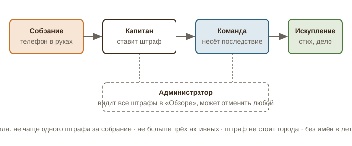

# Глава 12. Штрафы команды: телефон на собрании

Владелец поставил задачу прямо: если на молодёжном собрании член команды сидит в телефоне, у капитана должен быть инструмент штрафа для всей команды. Ниже — десять вариантов, из которых владелец выберет и согласует. Все они построены на трёх принципах: штраф ставит капитан своей команде (не администратор, не чужая команда), штраф бьёт по игре, а не по человеку, и у каждого штрафа есть выход, который сам по себе полезен.

## 1. Как есть

Сейчас в игре нет ни одного инструмента дисциплины. Капитан назначает роли и дела, может уступить город и перенести столицу, но не может ничего «списать» с команды. Администратор может вернуть сдачу на доработку или отклонить её, но это про качество дела, а не про поведение. Поведение на собрании игра не видит вовсе: собрание происходит офлайн, а телефон в руках — это как раз то, что должно происходить не во время собрания.

Важно, что игра поощряет открывать телефон: уведомления, проверка сдач, счётчики. Значит, штраф за телефон на собрании — это ещё и защита от собственной игры: правило «во время собрания игра закрыта» должно быть частью правил игры, а не просьбой ведущего.

## 2. Что должен и чего не должен делать штраф

- **Штраф ставит капитан.** Он видит собрание, он отвечает за команду, он же несёт последствия. Администратор видит все штрафы в «Обзоре» и может отменить любой (защита от сведения счётов).
- **Штраф бьёт по команде, а не по одному человеку.** Иначе это унижение перед сверстниками, а не командная ответственность. Личная часть штрафа допустима только как «выход» из командного: участник может снять штраф с команды своим делом.
- **Штраф ограничен по времени и величине.** Никакой штраф не должен стоить команде города или столицы. Максимум — один-два хода отставания.
- **У штрафа есть искупление.** Лучший штраф — тот, который превращается в служение: выученный стих, лишнее доброе дело, служение в доме молитвы.
- **Штраф записывается, но не позорится.** В летописи команды видно, что штраф был, но не пишется, кто именно сидел в телефоне. Капитан знает, команда знает, игра не разглашает.
- **Не чаще одного штрафа за собрание** на команду, и не больше трёх активных штрафов одновременно: иначе команда просто выключится.

## 3. Десять вариантов штрафа

Каждый вариант описан в одном формате. Цифры — предложение, их легко поменять в настройках игры.

### P-01. Тихий день

**Суть.** Команда на 24 часа не может брать новые дела и сдавать сдачи. Всё, что уже взято, продолжается.
**Зачем.** Самый простой и понятный штраф: «вечер в телефоне стоит команде дня в игре». Ничего не отнимает навсегда.
**Как работает.** Капитан в разделе команды нажимает «Штраф» → «Тихий день», указывает повод (одно из готовых: «телефон на собрании») и участника (виден только капитану и администратору). На карте команды у всех сторон появляется значок замка и таймер «до завтра 20:00». Сдачи, отправленные до штрафа, проверяются как обычно. Пример: «Моряки» получили тихий день в среду вечером, в четверг вечером снова могут брать дела; за это время «Берег» открыл один перекрёсток. Отставание — примерно один ход.
**Риски и ограничения.** Если у команды идёт оборона города, таймер обороны не останавливается; штраф не должен закрывать отправку обороны (иначе капитан сам себе проиграет город). Оборона и испытания из-под штрафа исключаются.
**Сложность:** S · **Влияние:** 4 · **Этап:** сейчас

### P-02. Стих бодрствования

**Суть.** Команда получает «долг»: один участник (по решению капитана, обычно тот, кто сидел в телефоне) должен выучить и рассказать на следующем собрании стих о бодрствовании. Пока долг не закрыт, одна сторона команды по выбору капитана закрыта.
**Зачем.** Штраф превращается в то, ради чего игра существует: выученный стих. И на следующем собрании участник, наоборот, в центре внимания с пользой.
**Как работает.** Игра предлагает набор стихов на выбор: Мк. 13:37 «А что вам говорю, говорю всем: бодрствуйте», 1 Пет. 5:8, Еф. 5:15–16 «дорожа временем», Пс. 118:37 «Отврати очи мои, чтобы не видеть суеты», Еккл. 3:1. Капитан отмечает «стих рассказан» после собрания, сторона открывается. Если стих не рассказан за две недели, сторона открывается сама, но штраф записывается в летопись как «не искуплён».
**Риски и ограничения.** Нужно, чтобы ведущий собрания дал минуту на стих. Для стеснительных — рассказать капитану лично, капитан подтверждает.
**Сложность:** S · **Влияние:** 5 · **Этап:** сейчас

### P-03. Дело сверх очереди

**Суть.** Команде добавляется внеочередное дело из стандартного набора (капитан выбирает из трёх, которые предлагает игра) со сроком 7 дней. Пока оно не сдано и не одобрено, команда не может открывать новые перекрёстки.
**Зачем.** Штраф увеличивает объём служения команды, а не отнимает прогресс. Команда получает дополнительное хорошее дело.
**Как работает.** Игра предлагает три дела с типом сдачи «подтверждение» или «фото» и сложностью 1–2, тематически связанных с книгой последнего взятого города (как обычные тематические дела). Штрафное дело не открывает сторону, оно только снимает блок. Пример: «Берег» получил штраф в понедельник, выбрал «Разложить сборники и книги в доме молитвы по полкам», сделал в четверг, администратор одобрил в пятницу, блок снят. Потеря — около четырёх дней.
**Риски и ограничения.** Нагрузка на проверку администратора растёт на одно дело; штрафные дела можно помечать и одобрять в первую очередь. Дело не должно быть «тайным» (тайные дела для штрафа не подходят).
**Сложность:** M · **Влияние:** 5 · **Этап:** сейчас

### P-04. Тяжёлая ставка

**Суть.** При следующем испытании города, которое объявит команда, к минимальной ставке добавляется +3 стиха. Штраф сгорает после одного испытания или через 21 день.
**Зачем.** Бьёт по амбициям команды, а не по её текущему положению. Команда, которая не собирается воевать, почти не заметит, и это нормально: штраф нужен как напоминание, а не как удар.
**Как работает.** В карточке города при объявлении вызова показывается: «Минимум 13 стихов (10 + 3 штраф)». Отдельная строка в летописи битвы: «претенденты шли с отягощением».
**Риски и ограничения.** Слабо чувствуется командами, которые не воюют; сочетать с другими штрафами. Не применять к обороне: защитники не должны получать штраф к ответу.
**Сложность:** S · **Влияние:** 2 · **Этап:** сейчас

### P-05. Тень на городе

**Суть.** Уровень защиты одного города команды (капитан выбирает какой, кроме столицы) снижается на 5 стихов на 14 дней.
**Зачем.** Штраф, который заметят соперники: город становится доступнее для вызова. Побуждает команду не расслабляться и после штрафа «подтянуть» защиту.
**Как работает.** На карте у города появляется значок тени, видимый всем командам, которые изучили этот город. Уровень 25 → 20 на две недели; если в это время город атакуют, претендентам достаточно ставки 21. По истечении срока уровень восстанавливается.
**Риски и ограничения.** При двух командах и малом числе городов удар может оказаться слишком сильным; порог «не ниже 10» обязателен. Нельзя применять к столице.
**Сложность:** M · **Влияние:** 3 · **Этап:** следующий сезон

### P-06. Пост телефона

**Суть.** Участник, из-за которого штраф, сдаёт особое дело «Сутки без телефона»: подтверждение с честным словом и подписью капитана. Пока дело не сдано, команда не может открыть следующий перекрёсток.
**Зачем.** Штраф отвечает точно на проступок и превращается в упражнение: сутки без соцсетей и игр.
**Как работает.** Дело создаётся автоматически при штрафе, тип сдачи «подтверждение». Капитан отмечает выполнено, администратор видит и может проверить разговором. Есть «пост-лайт» для тех, кому телефон нужен по работе или учёбе: сутки без соцсетей.
**Риски и ограничения.** Проверить нельзя, всё держится на честности; это осознанно, честность — часть воспитания. Не рекомендуется применять к одному участнику чаще раза в месяц.
**Сложность:** S · **Влияние:** 4 · **Этап:** сейчас

### P-07. Служение вне очереди

**Суть.** Команда назначается на ближайшее служение в доме молитвы (уборка, подготовка кабинета к молодёжному богослужению, помощь на кухне) вместо команды, чья очередь была. Штраф снимается, когда служение подтверждено администратором.
**Зачем.** Штраф видимый и полезный для всей церкви; команда «отрабатывает» проступок делом, а очередная команда получает свободный вечер (и добрые чувства).
**Как работает.** Администратор заранее заводит в игре график служений (даты и что делать). Капитан при штрафе выбирает «Служение вне очереди», игра ставит команду на ближайшую свободную дату. До подтверждения администратором у команды закрыты новые перекрёстки.
**Риски и ограничения.** Требует, чтобы график служений велся в игре; если его нет, штраф превращается в «дело сверх очереди» (P-03).
**Сложность:** M · **Влияние:** 4 · **Этап:** следующий сезон

### P-08. Медленная проверка

**Суть.** Сдачи команды в течение трёх дней после штрафа встают в очередь проверки последними: администратор видит их с пометкой «штраф» и проверяет после остальных.
**Зачем.** Мягкий, но ощутимый штраф: команда чувствует, что её время ушло на телефон, а не на игру, потому что теперь она ждёт дольше.
**Как работает.** В очереди проверки у сдач команды появляется пометка и они сортируются вниз. Уведомление команде: «сдачи проверяются в последнюю очередь до пятницы».
**Риски и ограничения.** Зависит от нагрузки администратора: если сдач мало, штраф не чувствуется. Хорош как дополнение к другим.
**Сложность:** S · **Влияние:** 2 · **Этап:** сейчас

### P-09. Запись в летописи

**Суть.** В летописи команды (и в воскресном итоге, если он будет) появляется строка: «На собрании команда была не вся вниманием. Капитан назначил штраф». Без имён. Три такие записи за сезон дают «Тихий день» автоматически.
**Зачем.** Репутационный штраф: команды видят друг друга, и вечер в телефоне становится историей, которую не хочется повторять. Накопление даёт лестницу: первый раз — запись, третий — реальный штраф.
**Как работает.** Капитан ставит штраф, выбирает «Запись в летописи». Игра считает записи; на третьей включает P-01 на сутки и пишет об этом. Записи видны всем командам в общей летописи сезона.
**Риски и ограничения.** Публичность должна быть мягкой: без имён, без указания, кто именно. Формулировки записей задаются игрой, капитан не пишет свой текст.
**Сложность:** S · **Влияние:** 3 · **Этап:** сейчас

### P-10. Телефон в конверт

**Суть.** Участник на следующем собрании сдаёт телефон в конверт ведущему на всё собрание. Капитан отмечает в игре «телефон сдан», штраф снят. До этого участник не может брать дела (личный, а не командный блок).
**Зачем.** Прямой ответ на проступок с ясным ритуалом. Команда видит, что человек исправился, и не платит вся.
**Как работает.** При штрафе капитан выбирает «Телефон в конверт» и участника. У участника в игре появляется плашка «до следующего собрания: телефон в конверт». После собрания капитан нажимает «сдал», плашка исчезает. Если участник не пришёл на собрание, срок переносится на следующее.
**Риски и ограничения.** Это единственный штраф с личным элементом; применять только там, где команда и участник это принимают нормально, и никогда как способ унижения. Администратор может отменить одним нажатием.
**Сложность:** S · **Влияние:** 4 · **Этап:** сейчас

## 4. Сравнение и рекомендация

| № | Штраф | На кого действует | Длится | Что нужно от администратора | Искупление |
|---|---|---|---|---|---|
| P-01 | Тихий день | команда | 24 ч | ничего | ждать |
| P-02 | Стих бодрствования | команда, выход через участника | до стиха, макс. 14 дней | ничего | стих на собрании |
| P-03 | Дело сверх очереди | команда | до одобрения, срок 7 дней | проверить одно дело | дело |
| P-04 | Тяжёлая ставка | команда | одно испытание / 21 день | ничего | выучить больше |
| P-05 | Тень на городе | команда, видно соперникам | 14 дней | ничего | защитить город |
| P-06 | Пост телефона | команда, выход через участника | до сдачи | заглянуть | сутки без телефона |
| P-07 | Служение вне очереди | команда, видно церкви | до служения | вести график | служение |
| P-08 | Медленная проверка | команда | 3 дня | сортировать очередь | ждать |
| P-09 | Запись в летописи | команда, репутация | сезон | ничего | не повторять |
| P-10 | Телефон в конверт | участник | до собрания | ничего | ритуал на собрании |

Рекомендация экспертного совета: ввести сразу **три** штрафа с разной силой, чтобы у капитана был выбор по тяжести, и не больше, иначе выбор превратится в торг: **P-09 Запись в летописи** (лёгкий, накопительный), **P-02 Стих бодрствования** (средний, воспитательный), **P-03 Дело сверх очереди** (тяжёлый, полезный). Остальные держать в запасе на следующий сезон. Во всех случаях администратор видит штрафы в «Обзоре» и может отменить любой.

Отдельно предлагаем правило без штрафа: **«игра закрыта на время собрания»**. В настройках игры администратор указывает день и часы собрания; в это время сайт показывает заставку «Собрание идёт. Игра откроется в 21:00» и не принимает действий. Это снимает соблазн у всех сразу и делает штраф редким исключением.

**Сложность внедрения основы (штрафы как сущность, три вида, экран капитана, отмена администратором, запись в летопись):** M, 3–4 дня разработки. Каждый следующий вид штрафа — от полудня до дня.
